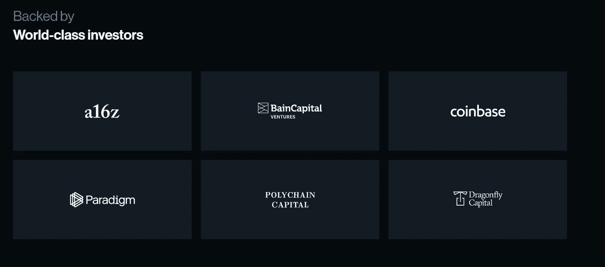
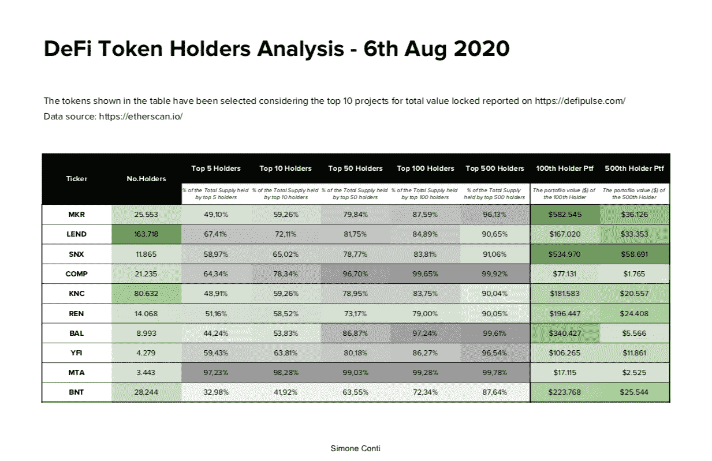

# DeFi——专为“鲸鱼”打造的生态系统？！

> 原文：<https://medium.com/coinmonks/defi-an-ecosystem-made-for-whales-93fbeaba38ad?source=collection_archive---------0----------------------->

这些天，分散化金融主导了区块链的新闻。大量资本正在流入这些系统。我们谈论的是数十亿美元。

> DeFi 承诺:高利率、不断上升的 DeFi 代币估值和新形式的生态系统治理创造了一个新的包容性免许可金融生态系统。

“Whales” in blockchain ecosystems are holders of large amounts of tokens / capital. Photo by [vivek kumar](https://unsplash.com/@vikceo?utm_source=unsplash&utm_medium=referral&utm_content=creditCopyText) on [Unsplash](https://unsplash.com/s/photos/whale?utm_source=unsplash&utm_medium=referral&utm_content=creditCopyText)

是时候问一些重要的问题了，比如:

*   DeFi 是否如其所期望的那样具有革命性、分散性和民主性？
*   谁从这一发展中获益最大？
*   对于区块链生态系统的未来及其治理，我们能从这一现象中学到什么？

但是，让我们一步一步来，看看自 2020 年 1 月以来实际发生了什么:

# DeFi 成功因素简史

## 阶段 1:标记本地令牌

Photo by [Markus Spiske](https://www.pexels.com/@markusspiske?utm_content=attributionCopyText&utm_medium=referral&utm_source=pexels) from [Pexels](https://www.pexels.com/photo/game-chips-play-poker-105470/?utm_content=attributionCopyText&utm_medium=referral&utm_source=pexels)

首先，像 [**0x 项目**](https://0x.org/) [这样的“传统”DeFi 项目推出了他们的赌注门户](https://blog.0xproject.com/introducing-zrx-portal-b529aec1a0a9)，以推动代币持有者采取更多行动，并为他们的本地代币创造更多“效用”。承诺:如果您使用 ZRX 令牌(0x 项目背后的本地令牌)并定期参与项目的治理投票，您将有机会获得一些奖励。著名的 DeFi 项目如 [MakerDAO](https://makerdao.com/) 之前就这样做了，其他的如 [Kyber 跟随 suite](https://blog.kyber.network/kyberdao-staking-and-voting-overview-70be71ee58f0) 。它大致是这样工作的:

1.  在一定的时间范围内(通常称为*时期*)下注您的代币。
2.  参与治理——要么自己定期投票，要么将你的投票权委托给一个委托团体。
3.  申领你的奖励。

所有这一切都发生在链条上。一般来说，你把你的代币“交给”一个智能合约，它是该平台的赌注生态系统的一部分。您可以通过简单的“解散”来重新获得对令牌的控制，通常会有一些时间延迟。

> 备注:当今年晚些时候引入以太坊 v2 的利益证明系统(信标链)时，这一切都类似于以太坊 v2。因此，我们对以太坊的未来有了初步的感觉。

## 阶段 2:生成农业治理令牌

Photo by [Johannes Plenio](https://www.pexels.com/@jplenio?utm_content=attributionCopyText&utm_medium=referral&utm_source=pexels) from [Pexels](https://www.pexels.com/photo/agriculture-brown-country-countryside-1146717/?utm_content=attributionCopyText&utm_medium=referral&utm_source=pexels)

6 月下旬，像 [Compound](https://compound.finance/) 、 [Aave](https://aave.com/) 、 [Synthetix](https://www.synthetix.io/) 、 [Curve](https://www.curve.fi/) 或 [Balancer](https://balancer.finance/) 这样的项目开始使用像 [yield farming](https://cryptobriefing.com/yield-farming-defi-beginners-guide-earning-interest-crypto/) 这样的先进机制来吸引大量的加密资产到他们的平台上。通过将你的资产存放并“锁定”到他们平台的流动性池中(而不是仅仅下注或[持有)。这些平台在其系统中积极使用您的代币，并产生更高的回报。你不仅拿回了可观的利息。此外，您现在还会收到本机平台令牌，这些令牌旨在使社区能够管理这些平台的未来。目前为止，当你在曲线](https://www.investopedia.com/terms/h/hodl.asp)上为 Synthetix’[sBTC 池提供包装比特币时，你可以在](https://www.curve.fi/sbtc)[这个 sBTC 示例](https://blog.synthetix.io/btc-yield-farming-pool/)中的 4 个不同维度上获得代币。像这样的发行目前将这些项目的估值推到了 80 亿美元。锁定在这些系统中的巨大代币价值每隔几周就会翻一番！ [DEFI Pulse](https://defipulse.com/) 很好地概述了最受欢迎的项目——它们中的大多数都紧密地结合在一起。

> 治理令牌发行—类似于 ico，但有所不同

如果你愿意，发行治理令牌将颠覆 2017 年的 ICO(初始硬币发行)浪潮:虽然 ICO 在开发早期就提供项目令牌供销售(大多数只是基于粗略的想法和白皮书中写下的项目路线图)，但这些项目现在一旦其平台已经开始工作并证明了一些产品符合市场，就会发行令牌。我们可以将这些 gti 命名为治理令牌发行。gti 解决了 ico 的许多问题，因为

> a)令牌从一开始就具有效用(即治理), b)它们推动去中心化的所有权——至少初看起来是这样。

参与该平台的每个人都有权获得一些代币。在很多情况下，推出平台[的公司迅速成立 DAOs](https://decrypt.co/37338/is-decentralization-the-answer-to-defis-sec-problem) (去中心化自治组织)，将平台的治理和最终控制权交给代币持有者。

所以，**这是肯定的进步**——特别是对监管者**的要求**像美国证券交易委员会(SEC)将这些方面[作为他们对几家代币发行者的判断](https://www.crowdfundinsider.com/2020/06/163133-sec-final-judgement-received-in-alleged-fraudulent-initial-coin-offering-by-eran-eyal/)的核心。SEC 认为许多 ico 非常关键，并拒绝在美国推出，因为一些项目从未兑现其白皮书中的承诺，即创建一个利用令牌和/或保持对平台控制的功能平台。

> 通过在运行平台上发行内置实用程序的令牌，这些新的 DeFi 项目解决了两个关键问题——非常聪明！

> 所以，一切都很好，不是吗？

恐怕:不是。

# DeFi 中的风险

Photo by [Pixabay](https://www.pexels.com/@pixabay?utm_content=attributionCopyText&utm_medium=referral&utm_source=pexels) from [Pexels](https://www.pexels.com/photo/nature-water-eyes-pond-45863/?utm_content=attributionCopyText&utm_medium=referral&utm_source=pexels)

正如你可能想象的那样，这种趋势有很大的风险，因为我们都知道没有免费的午餐。

其中一些风险是显而易见的**技术风险**，比如管理价值数亿美元资产的新鲜的、大多未经证实的智能合同——你可以想象欺诈者和黑客攻击这些系统的动机有多大。

但是也有市场风险，比如这些系统中某些加密货币的波动性。如果你的抵押品跌破临界阈值，一项资产价格的突然下跌可能会导致连锁反应，并迫使你平仓。你看，资产价格在这些系统中至关重要——同样，市场价格也被纳入这些系统:甲骨文问题。甲骨文是区块链智能合约和外部数据之间的接口，比如集中交易的价格。如果这些先知有一个缺陷，通过来自外部世界的虚假数据被黑客攻击或操纵，那么混乱可能会随之而来。

通常，这是技术和市场风险的结合，可能与某些资产的低流动性相结合，这给欺诈者带来了机会，就像 [bZx 黑客](/@peckshield/bzx-hack-full-disclosure-with-detailed-profit-analysis-e6b1fa9b18fc)一样。

> 此外还有**其他更微妙的风险**以及小额代币持有者**面临的问题**，这些问题在更广泛的范围内引发了有趣的问题。我将在本文的其余部分深入探讨这些问题。

# 微妙的问题…

让我们再次从打桩开始。如果平台的用户使用白皮书中描述的令牌来管理平台，是不是很酷？理论上:是的。这听起来非常分散和民主，不是吗？实际上有一些缺点，比如:

> **你需要相当数量的代币来使下注对你来说经济上合理。**

总是有这样的承诺，DeFi 应该为没有银行账户的人提供银行服务，并帮助发展中国家建立开放的金融体系。那么，难道“口袋小”的代币持有者不应该也能从这些平台及其激励机制中获得部分利润吗？或者更好的是:这些系统不应该首先为这些用户设计吗？

## DeFi 打桩——为鲸鱼制造？！

好吧，让我们首先假设这不会发生——让我们以美国中产阶级中的一个人为例:乔。假设乔有 50.000 美元的存款。尽管所有的警告说最多用他储蓄的 1-2%来加密，Joe 是一个爱好者，并且相信 DeFi。他也一样疯狂，将 20%的积蓄投资于加密——也就是 10.000 美元。但乔并不傻，他知道大多数估值都深深依赖于比特币和以太坊。因此，他投资组合的 90%进入了 BTC 和瑞士联邦理工学院等主要资产。剩下 1000 美元用于 DeFi 实验。

Joe 是 0x 项目的忠实粉丝。然而，他知道投资组合的多样化很重要。因此，他将 DeFi 投资组合的 1/10 投入 0x 项目，即 100 美元。其余的投入到其他很酷的东西中。现在他想赌一把。他瞥了一眼 [0x 的赌注池](https://0x.org/zrx/staking)。他可以从 11 个中选择一个。)下注池，查看他们的历史数据，以及过去分享的奖励金额。然而，当 Joe 想要将他的 ZRX 余额贡献给其中一个池时，他看到按照以太坊上交易的当前汽油成本，交易成本大约为 2 美元——记住:satking 发生在链上。2 美元——这是一笔不小的数目——他持有的 ZRX 股票的 2%。但是 Joe 是这个项目的超级粉丝，他想成为其中的一员——实现 DeFi 的愿望。问题是:在相当长的一段时间内，产生的收益不足以支付他的初始交易成本。

> 理论上，Joe 可以转换授权池，将他的投票权交给其他人。实际上，他不会这样做，因为对于一个中小型令牌持有者来说，这样做实在是太贵了。

数学是这样的(2020 年 8 月 8 日的数据):

像[尘埃池](https://0x.org/zrx/staking/pool/12)这样著名的 0x 赌注池在过去的 6 个月里赢得了 197 ETH。它将其中的 30.5 ETH(15%)分给了其股东。也就是~11.895 美元(ETH=390 美元)。有 3，700，000 个 ZRX 在那个池子里。这意味着**如果在该池中下注，每个下注的 ZRX 代币在 6 个月的时间内**大约能赚 0.0032 美元。

ZRX 目前的估值为 0.42 美元。因此，如果 Joe 投资 100 美元，他就有大约 238 个 ZRX 代币可以下注。如果他押了代币，他将在 6 个月内赢得约 0.76 美元！下注、取消下注、或者在下注池之间切换的成本很容易就高出 10 倍！

我的结论是:如果你没有至少 1000 美元的 ZRX 投资，从经济角度来看，下注对你没有任何意义。但是大多数项目对这一重要方面并不开放。

> 因为它在 DeFi 中的“德”后面打了一个大大的问号！

DeFi 的最新发展让我假设 DeFi staking 主要是为进入市场的鲸鱼或风险资本家而做的。这对大额资金非常有吸引力。对于小股东来说，即使是授权也相当无趣。

因此，如果我们在那里看到类似的模式，让我们来看看高产农业。

## 产量养殖——为鲸鱼而生？！

如果说赌注的情景让我产生了一些怀疑的话，那么高产农业甚至更糟糕。请记住:您将获得与您投入平台的抵押品数量相关的平台治理令牌激励。这不是已经敲响警钟了吗？

还有更好的:像 Compound 这样的一些项目主要是风险投资。记住:他们没有做 ICO。建立这样一个平台的资本首先必须来自某个地方。化合物公司的网站非常公开他们与知名企业的紧密联系:

所以，让我们问一个问题:谁会从[突然冒出来的市值 5 亿美元的新发行的 DeFi token 中获利最多？你猜对了。该项目仍然持有他们 40%的代币(价值 2 亿美元)。所以治理可以用来指明方向。而](https://www.coingecko.com/en/coins/compound)[的大玩家已经领先票数](https://compound.finance/governance/leaderboard)。Token Daily 的时事通讯#43 也指出了这一方向——创造了术语“ReFi”，即“重新集中的金融”。

围绕这些项目的令牌分发的讨论才刚刚开始——就像 Cointelegraph 上的[这个。它指的是 Simone Conti 的一条有趣的推文，他最近对 DeFi 项目和社区中令牌的分布做了一个令人大开眼界的分析(记住区块链的数据在像 etherscan 这样的平台上是公开的)。](https://cointelegraph.com/news/analysis-most-defi-tokens-are-concentrated-in-hands-of-top-500-holders)

Source: [Simone Conti/Twitter](https://twitter.com/simoneconti_/status/1291396627165569026)

但还是要谨慎。如果你仔细看看 Twitter 上的[评论，你会发现:当授权池正在运行且许多令牌持有者授权他们的令牌时，分析令牌分布并不那么容易。我当然没有资格确认或质疑这些数字。但我相信我们会看到这方面的热烈讨论！](https://twitter.com/simoneconti_/status/1291396627165569026)

# 摘要

我不想猜测 DeFi 的这些发展将如何决定区块链生态系统的未来道路。但我确信我们现在正处于其整体发展的一个有趣的点上。大公司和机构投资者被吸引了。更大的资金将会进入加密网络——并且会影响重要的决策——不管是好是坏。

简单地将治理推向区块链并期望最好的结果显然是不够的。“象征性的一票”是行不通的。历史会重演，权力会集中。我们当然需要新的大众管理体制的方式。必须尝试像二次投票这样的新方法来平衡权力。

但是现在，即使是**的小步骤也有助于改善系统**:

1.  DeFi 项目应该更加公开风险资本家或其他大型利益相关者的象征性分配和影响力。
2.  DeFi 项目应该明确地给出一个声明，说明在多长时间内你至少要下注多少代币来弥补你的下注成本。
3.  DeFi 项目应该创造更多关于他们的授权池的透明度——不仅仅是他们分享了多少利润，还有他们在过去是如何影响投票的。

> **DeFi 项目的创始人承担了很多责任。**他们将决定有多少“De”将处于赤字状态——也许还有这些区块链生态系统下的价值体系将如何进一步发展！

## 另外，阅读

*   最好的[密码交易机器人](/coinmonks/crypto-trading-bot-c2ffce8acb2a)
*   [加密复制交易平台](/coinmonks/top-10-crypto-copy-trading-platforms-for-beginners-d0c37c7d698c)
*   最好的[加密税务软件](/coinmonks/best-crypto-tax-tool-for-my-money-72d4b430816b)
*   [最佳加密交易平台](/coinmonks/the-best-crypto-trading-platforms-in-2020-the-definitive-guide-updated-c72f8b874555)
*   最佳[加密贷款平台](/coinmonks/top-5-crypto-lending-platforms-in-2020-that-you-need-to-know-a1b675cec3fa)
*   [最佳区块链分析工具](https://bitquery.io/blog/best-blockchain-analysis-tools-and-software)
*   [加密套利](/coinmonks/crypto-arbitrage-guide-how-to-make-money-as-a-beginner-62bfe5c868f6)指南:新手如何赚钱
*   最佳加密制图工具
*   [莱杰 vs 特雷佐](/coinmonks/ledger-vs-trezor-best-hardware-wallet-to-secure-cryptocurrency-22c7a3fd391e)
*   了解比特币的[最佳书籍有哪些？](/coinmonks/what-are-the-best-books-to-learn-bitcoin-409aeb9aff4b)
*   [3 商业评论](/coinmonks/3commas-review-an-excellent-crypto-trading-bot-2020-1313a58bec92)
*   [AAX 交易所评论](/coinmonks/aax-exchange-review-2021-67c5ea09330c) |推荐代码、交易费用、利弊
*   [德里比特评论](/coinmonks/deribit-review-options-fees-apis-and-testnet-2ca16c4bbdb2) |选项、费用、API 和 Testnet
*   [FTX 密码交易所评论](/coinmonks/ftx-crypto-exchange-review-53664ac1198f)
*   [n 零审核](/coinmonks/ngrave-zero-review-c465cf8307fc)
*   [Bybit 交换审查](/coinmonks/bybit-exchange-review-dbd570019b71)
*   [3Commas vs Cryptohopper](/coinmonks/cryptohopper-vs-3commas-vs-shrimpy-a2c16095b8fe)
*   最好的比特币[硬件钱包](/coinmonks/the-best-cryptocurrency-hardware-wallets-of-2020-e28b1c124069?source=friends_link&sk=324dd9ff8556ab578d71e7ad7658ad7c)
*   最佳 [monero 钱包](https://blog.coincodecap.com/best-monero-wallets)
*   [莱杰 nano s vs x](https://blog.coincodecap.com/ledger-nano-s-vs-x)
*   [bits gap vs 3 commas vs quad ency](https://blog.coincodecap.com/bitsgap-3commas-quadency)
*   [莱杰纳米 S vs 特雷佐 one vs 特雷佐 T vs 莱杰纳米 X](https://blog.coincodecap.com/ledger-nano-s-vs-trezor-one-ledger-nano-x-trezor-t)
*   [block fi vs Celsius](/coinmonks/blockfi-vs-celsius-vs-hodlnaut-8a1cc8c26630)vs Hodlnaut
*   Bitsgap 评论——一个轻松赚钱的加密交易机器人
*   为专业人士设计的加密交易机器人
*   [PrimeXBT 审查](/coinmonks/primexbt-review-88e0815be858) |杠杆交易、费用和交易
*   [埃利帕尔泰坦评论](/coinmonks/ellipal-titan-review-85e9071dd029)
*   [SecuX Stone 评论](https://blog.coincodecap.com/secux-stone-hardware-wallet-review)
*   [BlockFi 评论](/coinmonks/blockfi-review-53096053c097) |从您的密码中赚取高达 8.6%的利息