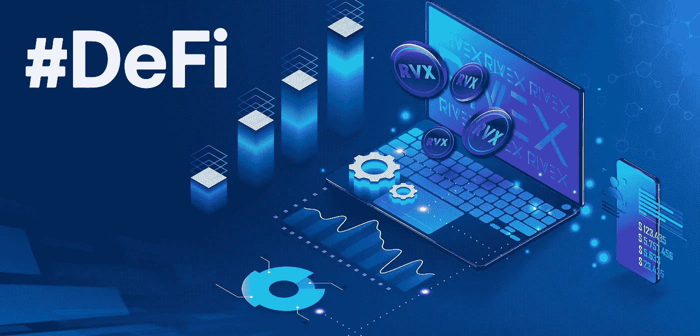

# 定义和话语

> 原文：<https://medium.com/coinmonks/defi-and-discourse-b37af3a6e6f6?source=collection_archive---------5----------------------->

[https://medium.com/rivex-foundation/decentralized-finance-c2a8ea319b1c](/rivex-foundation/decentralized-finance-c2a8ea319b1c)

DeFi 和它所支持的成千上万的农民已经在我们的网络中产生了显著的活动。事实上，DeFi 是以太坊每天超过 100 万笔交易的中心驱动因素之一！

**由于 DeFi 已经成为以太坊上最受欢迎的用例之一，我们希望支持 DeFi 生态系统，以促进******社会治理，从而让更多的用户在这一全新金融系统的建设中拥有代理权。****

**现在，**大多数 DeFi 项目，如 earn、Aave 和 Compound，都选择使用 Discourse** 作为他们的社区交流平台。**

****话语的最大问题之一是混乱，根本不是为了促进社会治理。**看看[向往的话语](https://gov.yearn.finance/)就知道了。虽然我们很欣赏 Andre 所做的一切，以及他们的社区成员选择为渴望创建一个对话页面，但他们的对话页面并没有有效地解决社区的社会治理需求。几乎没有任何思想组织，没有结构化辩论的地方，也没有有效的方式让社区在实际的链上投票之前就他们想要的进行深入的辩论。**

**现在，这种情况不是向往社区的错。渴望社区正在利用他们所拥有的一切！他们需要一个辩论平台，抓住一切可能的机会。他们做出了正确的决定，因为最好有一个社区可以聚集起来讨论主要协议变更的地方，而不是什么都没有。**

**然而，任何参加过这些论坛的人一定会对自己说，“一定有更好的解决方案！一个更适合我们社区的社会治理的地方，一个我们可以更有效地讨论 yip 并在实际投票前表明我们偏好的地方。”**

**他们是对的！**以太网的构建是为了支持项目的社会治理需求，如 earn、Compound、Aave 以及任何构建在以太坊之上的协议。**正如以太坊被构建为支持所有 dapps 的技术基础设施一样，以太将支持所有基于以太坊的项目的社会治理需求。**

**随着越来越多的项目通过分发治理令牌来合理地分散治理，迫切需要一个辩论平台来支持这些项目，以促进它们的社会治理过程。以太将支持从 Compound 到 Aave 的社区渴望任何其他 DeFi 协议，允许这些社区更有效地讨论和辩论各自协议面临的中心问题。**

****现在加入** [**以太**](http://www.theether.io) **！****

> **[直接在您的收件箱中获得最佳软件交易](https://coincodecap.com?utm_source=coinmonks)**

****