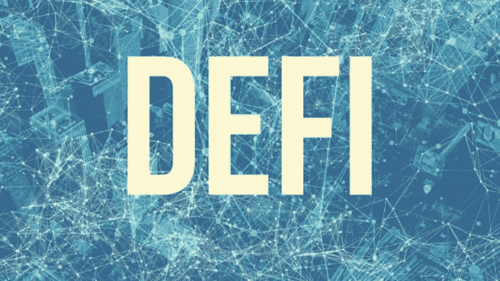
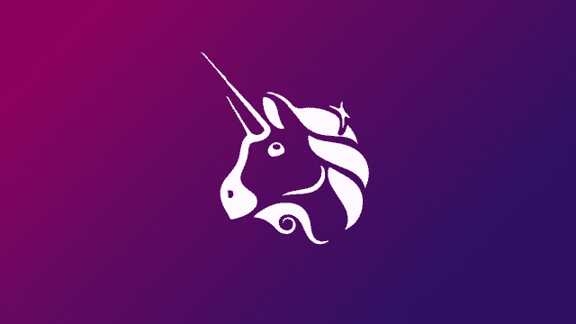

# 深入了解 DeFI、Dapps 和 Collecticles

> 原文：<https://medium.com/coinmonks/defi-c61490904c?source=collection_archive---------4----------------------->

分散融资也称为 Defi。但是你对 Defi 了解多少？

Defi 则完全不同，因为它从各种交易中剔除了第三方。世界第二大加密货币以太坊(ETH)是大多数 Defi 应用程序的宿主。也就是说，大多数 Defi 应用程序都是基于它构建的。这是因为 ETH 在满足某些标准时会自动执行交易，我认为这也是因为以太坊的智能合约。

但是，DeFi 不仅存在于 ETH 链上，还存在于其他链上，如币安智能链(BSC ),这推动了用于 Defi 智能合约的所有可交易代币的价值(市值)大幅上升。考虑到币安是世界上最大的密码交易所这一事实，我认为它在密码界的影响力在 Defi 值的广泛传播中起着主要作用。

在我看来，Defi 最受欢迎的领域之一是分散交易所的交易，这些不是我的公司提供的，而是点对点的例子是 Uniswap 和币安 DEX。

## DEFI RUSH

一个可能是最大的原因是，许多金融机构现在正在接受 DeFi，并寻求参与的方式

DeFi 热潮的最后一个重要原因是，许多人将钱投入 Defi 代币，作为他们爆炸性增长的一部分。许多代币几乎等于零，所以我们看到了一场 Defi 淘金热。

您可能也有兴趣知道，随着天然气费用的增加和网络需求的增加，DeFi 协议正在竞相实施第 2 层扩展解决方案。

## 什么是“第二层”？

简而言之，第 2 层是网络层，用于在广域网中的相邻网络节点之间或同一局域网中的节点之间传输数据。

**它是用来做**的？嗯，它用在负载很重的网络上，隔离数据流，提高网络性能。

## **UNISWAP**

如果你熟悉 DeFi，你一定知道 UNISWAP 在对 DeFi 的抢购中发挥了主要作用。

DeFi rush 都是在 UNI 发布之后开始的。这吸引了投资者的极大关注，尤其是在亚洲市场。即使是那些没有参与 DeFi 的人。就像我们在 UNI 看到的，只有具有公平分配策略的代币才会赢。虽然有竞争，但那是不同的话题。无论如何，平台之间的竞争通常会增加所述平台的知名度，并吸引更多的投资者。

Uniswap 推出仅两年后，其日均交易量已飙升至约 2 亿美元，成为地球上最大的 DeFi 交易所。嗯嗯？更不用说 Uniswap 目前列出了 845 种加密代币，而世界上最大的加密现货交易所币安目前列出了 820 种硬币。这使得他们成为最大的 DeFi 加密交易所，并极大地促进了 DeFi 的发展和应用。

## 定义用例

1.  创建货币银行服务(发行稳定的货币)。
2.  点对点或集资贷款。
3.  启用高级金融工具，如 dex。

# 什么是 DAPPS？

据 Investodepia 称，“分散式应用程序(dApps)是指存在并运行在一个[区块链](https://www.investopedia.com/terms/b/blockchain.asp)或 P2P 计算机网络而不是一台计算机上的数字应用程序或程序，不在一个机构的权限和控制范围内”，这意味着没有人能控制网络。比如:

*   🖧 It 必须开源，自己运营。
*   其数据和记录必须公开。
*   网络必须使用加密令牌。

Dapps 是基于区块链的，开源的，没有停机时间。这意味着即使个别计算机或部分网络瘫痪，它也能继续工作。

# 信任钱包

这并不是为了促销。但是，我相信有一些公司每天都在改进和为 crypto 做贡献，应该得到一些表扬。不可否认的事实是，Trust wallet 是与 Dapps 交互的最常用(如果不是最常用)的加密钱包之一。归币安所有，他们已经能够在你和 BSC 或 ETH 网络上的任何 Dapp 之间实现简单而安全的连接。

自从币安两年前收购 Trust Wallet 以来，在这么短的时间内，他们成功地扩大了新兴的 DeFi 部门。共有 500 万用户，其中 10%的现有用户正在访问各种 DApps 和 DeFi 平台。这表明他们对 DeFi 部门的发展做出了多大的贡献。

# 收藏品

2017 年，迪特尔雪莉推出了基于 ERC721 的以太坊收藏品，作为对 ETH 的改进。它旨在成为一种标准，允许智能合约以与 ERC20 相同的方式运行。ERC721 令牌的独特之处在于令牌是“不可替换的”。因此，它们的价值是每个代币的独特性和稀有性的结果。如在 CryptoKitties、分散式局域网等流行应用中所见。不可替代令牌已被证明是非常高需求的产品。

这些是不可替代的数字资产，也称为“NFT”。通常，加密收藏品被视为现实生活中的物品，如宠物。每个令牌都有特定的属性，并且创建的令牌数量是有限的。迄今为止，cryptokitties 是让它成为焦点的 NFTs 的最好例子。

有创建和发布非功能性测试的框架。ERC-721 现在是区块链联邦交易所不可替代资产发行/交易的标准。非正规金融交易可以在公开市场进行，这些市场将买方和卖方联系在一起，价格随供求关系而变化。你问 NFTs 能用来做什么？嗯，NFTs 可以被 Dapps 用来发行加密收藏品。让我不要忘记提到游戏！是啊！像“分散土地”这样的游戏，这是一个虚拟现实世界，玩家可以拥有并交换虚拟土地和其他游戏中的 NFT 物品。还有很多其他的，像《被解放的神》、《秘密英雄》等等。

通过在数字世界中代表实物资产，除了在金融应用中的使用，NFT 还为区块链技术开辟了新的途径。

# 结论

分散金融(DeFi)有可能以分散的形式提供我们从传统金融机构获得的所有服务。据信，它能够扰乱我们目前运作的金融系统。因此，为了实现公平、透明和全球金融包容性，应该接受这一目标。

DeFi 需要开发者和金融家的不断研究，以便在 DeFi 领域引入创新仪器，从而实现真正的灵活性和易用性。干杯！

> 加入 Coinmonks [电报频道](https://t.me/coincodecap)和 [Youtube 频道](https://www.youtube.com/c/coinmonks/videos)了解加密交易和投资

# 另外，阅读

*   [CoinFLEX 评论](https://coincodecap.com/coinflex-review) | [AEX 交易所评论](https://coincodecap.com/aex-exchange-review) | [UPbit 评论](https://coincodecap.com/upbit-review)
*   [AscendEx 保证金交易](https://coincodecap.com/ascendex-margin-trading) | [Bitfinex 赌注](https://coincodecap.com/bitfinex-staking) | [bitFlyer 审核](https://coincodecap.com/bitflyer-review)
*   [Bitget 回顾](https://coincodecap.com/bitget-review) | [双子座 vs BlockFi](https://coincodecap.com/gemini-vs-blockfi) cmd| [OKEx 期货交易](https://coincodecap.com/okex-futures-trading)
*   [AscendEx Staking](https://coincodecap.com/ascendex-staking)|[Bot Ocean Review](https://coincodecap.com/bot-ocean-review)|[最佳比特币钱包](https://coincodecap.com/bitcoin-wallets-india)
*   [霍比审核](https://coincodecap.com/huobi-review) | [OKEx 保证金交易](https://coincodecap.com/okex-margin-trading) | [期货交易](https://coincodecap.com/futures-trading)
*   [网格交易机器人](https://coincodecap.com/grid-trading) | [Cryptohopper 审查](/coinmonks/cryptohopper-review-a388ff5bae88) | [Bexplus 审查](https://coincodecap.com/bexplus-review)
*   [7 个最佳零费用加密交易平台](https://coincodecap.com/zero-fee-crypto-exchanges)
*   [氹欞侊贸易评论](https://coincodecap.com/anny-trade-review) | [霍比保证金交易](/coinmonks/huobi-margin-trading-b3b06cdc1519)