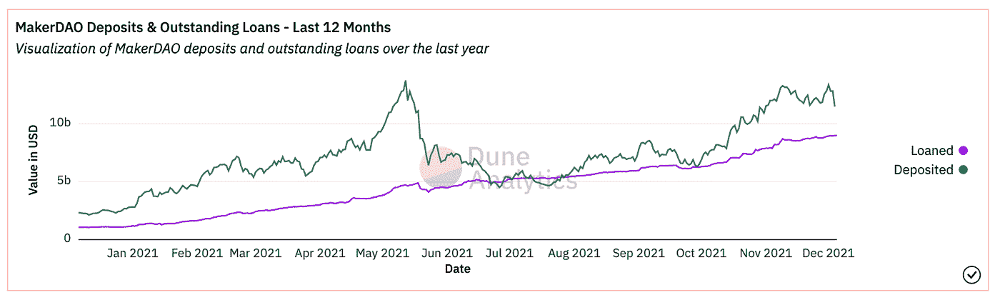
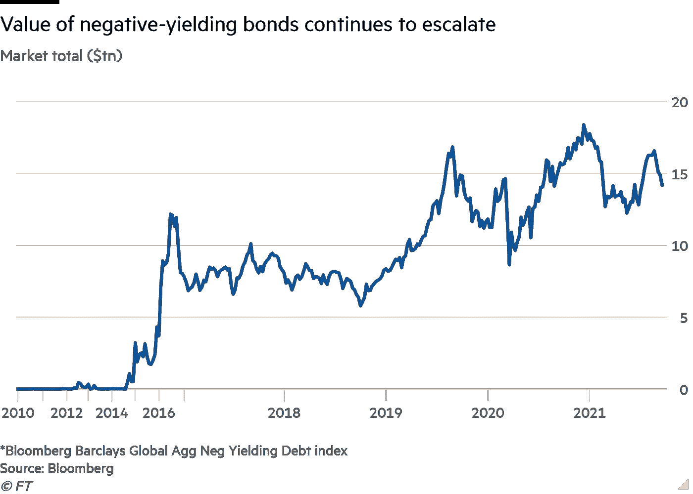
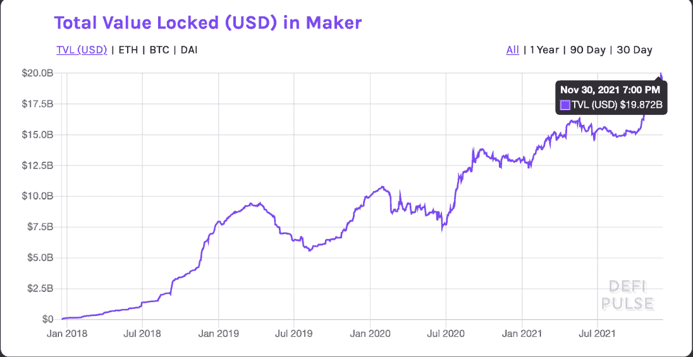
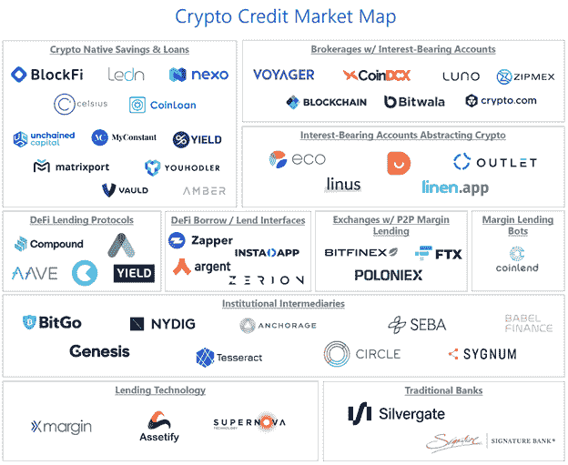

# DeFi，加密信贷市场与传统金融

> 原文：<https://medium.com/coinmonks/defi-crypto-credit-markets-vs-traditional-finance-implications-dec-2021-f871558a1392?source=collection_archive---------12----------------------->

Maker is the premier DeFi lending platform with $20B TVL — as of 5 Dec 2021, Deposits > 10B, Loans > 5B

这篇文章是写给谁的？

*   任何有好奇心的人，希望自己的储蓄账户收益率高于 0.5%，但不确定“8%-有时 20%”的收益率来自哪里，是什么让这成为可能(这是骗局吗？)
*   任何希望使用其“非生产性”资产(BTC、瑞士联邦储蓄银行的投资组合)甚至美元稳定资产作为抵押品的投资者，同时保持净多头并以其为抵押借款，以利用违约资产的收益率和可组合性
*   寻求了解 DeFi 中的主要机会、DeFi 与 TradFi 之间的差异以及对贷款和信贷的未来影响的人

# 问题是

传统的金融信贷市场为贷款人提供利率，并为借款人提供急需的获取资本的能力。

美国财政部支持的证券提供了无风险回报率的基线，为全球金融市场的借贷设定了标准。

**问题**:截至 2021 年 9 月，全球发行的债券和债务中至少有 16 万亿美元是负收益的(约为 10 万亿美元)。全球债券市场的 1/5)。

当债券投资者支付的价格高于持有至到期时收到的利息+本金时，债券产生负收益。

简而言之，这意味着债券投资者(债务出借人)因出借而获得净负回报。

在美国，储蓄账户的平均收益率[为 0.06%](https://smartasset.com/checking-account/average-savings-account-interest) ，有些甚至高达 0.5%。

在 2021 年 11 月 CPI 通胀率最近被记录为 [6.8%](https://www.cnbc.com/2021/12/10/consumer-price-index-november-2021.html) ，这是自 1982 年以来的最高涨幅的时候，投资者可以做些什么来寻求收益呢？

人们可以想象替代信贷市场发展背后的市场力量，例如 crypto 和 DeFi，因为所有类型的投资者都渴望收益，他们现在正在替代资产类别中寻求收益。

投资者寻求收益的一个主要资产类别是加密生态系统，既包括 BlockFi、Celsius 和 Voyager 等集中式平台，也包括 Maker、Compound、Aave 等分散式金融(DeFi)平台，以及 AVAX、LUNA、SOL 等其他[新兴区块链。](https://defillama.com/chains)

截至 2021 年 12 月，crypto 中的贷款利率[在 crypto 经济的各种平台上可以从 4%到 20%不等，适用于所有类型的抵押品，从 BTC 和 ETH 到美元稳定的债券。](https://defirate.com/lend/?exchange_table_type=lend)

不算在这个范围内的花哨的再基础代币或高风险产量农业，这超出了本文的范围。

[**锚定协议**](https://app.anchorprotocol.com/earn) **在 UST 提供 19.5%的 APY(美元稳定 Terra 生态系统中的硬币)。**

[这里](/everstake/anchor-protocol-for-beginners-how-to-get-started-5b19f54ced6d)是它是如何工作的。

虽然 20%的 APY(以美元计算，相当于硬币！)看起来好得不像真的，它是真实的，不是骗局——尽管有一些风险。

而且不仅仅是主播。

名义金融在 USDC 提供 10.5%的固定 APY。[这里](https://messari.io/article/notional-finance-borrowing-and-lending-at-fixed-rates-in-crypto?utm_source=twitter_matthewlewis&utm_medium=organic_social&utm_campaign=notional_finance_fixedrate_lending)是它的工作原理。

*是什么让这些类型的收益成为可能？*

*这在功能和风险方面与传统金融有何不同？*

*谁是这些加密信贷市场的主要参与者？*

*主要机会有哪些？*

# DeFi 采用和机制与 TradFi

让我们探索和理解加密信贷市场的作用，它们的采用，以及它们的影响。

就采用情况而言，MakerDao 是建立在区块链以太坊基础上的历史最长的 DeFi 贷款和信贷市场，仅自 2020 年 7 月以来，其锁定的总价值就增加了近 100 亿美元，仅在这一协议中，截至 2021 年 12 月就达到了近 200 亿美元。

创客是如何运作的？

Maker 是一个自动化的贷款市场，遵循清算的编程规则，匹配贷款人和借款人，并使用智能合同，允许世界上任何人审计协议的财务健康状况。

这就是我认为开放存取金融系统的迷人之处，对于所有这些贷款协议，任何人都可以查看和审计他们的实时贷款、资产负债表、偿付能力和风险，而不必担心数据是否是欺诈性的，因为这是区块链不可变公共账本的固有特征。

正如沙丘分析公司所说，

> 传统财务系统中的数据分散在各个业务部门，格式也不统一。那些努力收集数据的公司以高价出售这些数据。这些客户通常是投资银行、对冲基金等的分析师。很少有人能接触到，而且分析是私下进行的，所以除了内部圈子，没有人能从中受益。

相比之下，当有人向 Maker 贷款时，世界上的任何人都可以立即验证这一情况以及所述贷款的状态。

Maker 以钉住美元的稳定币(称为 Dai)的形式向愿意超额抵押其“非生产性”加密币或美元稳定币的借款人提供流动性。

任何市场参与者都可以使用 Maker 协议来存放 crypto 或 stablecoin 抵押品，并生成 Dai(美元稳定硬币)作为债务。

该协议使用 140-150%的抵押率，由此产生清算费用和算法系统，以避免违约并维持戴与美元的挂钩。

如果想了解更多关于创客的信息，可以说是以太坊上首要的 DeFi 借贷市场，我在这里有一篇更深入的文章。

对于那些拥有寻求收益的资产的人来说，这个市场的贷款提供了可变的利率，超过了传统金融中低得多的利率，以换取不同的风险状况——涉及协议、智能合同和基础资产价格波动风险。

对于许多投资者来说，这些利率从 5-8%不等，甚至更高，因为传统储蓄账户的收益率为 0.5%或更低。

这些投资者真的不会相信在 [Olympus Dao](https://www.olympusdao.finance/) 发生的事情(7000%不是财务建议，与上述贷款/信贷市场不同的风险状况)。

最终，让贷款人获得这些收益的原因是借款人愿意以高于贷款人所得的利率借款；这些当事人包括交易商、零售借款人和加密公司。

# **加密信贷市场参与者**

信贷市场怎么会有这么高的利率？

我们来快速看一下涉及的当事人。

当交易员认为他们可以从交易活动中获得比支付利息更高的回报时，他们就会以如此高的利率借款，鉴于加密市场的波动性，这当然是可能的。

鉴于传统金融机构通常不向加密交易者贷款，存在以这些高利率借款的市场需求，加上加密市场中存在的独特市场动态，允许交易者创造回报，包括套利交易(跨交易所或“现购自运”套利，以利用期货合同的融资利率)以及使用杠杆的定向和自由交易，因此不缺乏使用借入资本的机会。

由于监管的不确定性，银行不愿这样做，因此大型交易商使用加密贷款机构来满足大量借贷需求。

参与加密借贷的其他各方包括零售参与者，他们希望以其“非生产性”资产获得[抵押担保贷款](https://blockfi.com/crypto-loans/)(来自 CeFi 或 DeFi like ),以进行购买或进一步增加其风险敞口的杠杆，同时能够避免实现其收益、保持净多头以及利用 DeFi 的收益率和可组合性的税务影响。

加密公司也是资本支出的借款人。

BlockFi、Celsius 和 Voyager 等集中式服务因此可以向贷款人支付如此高的收益率，因为存在愿意支付更高收益率的借款人。

# DeFi 的主要机会

信贷市场中的主要机会包括在指定的时间内以预定的利率向上述中央加密贷款平台贷款，但 DeFi 中也存在许多机会，包括未经许可的流动性开采、产量农业等。

DeFi 涉及在区块链使用智能合约，任何人都可以获得金融产品和服务，而无需中介。

各种类型的 DeFi 应用程序包括以自己的抵押品(庄家)为抵押借入资金的能力，将资金存入分散交易所的流动性池(像 AVAX 上的 [Uniswap](https://app.uniswap.org/#/swap) 或 [JOE](https://www.traderjoexyz.com/#/lending) 这样的 dex)能够以点对点的方式运作，这使存款人能够赚取交易费用，并作为一个人的资产的流动性提供者——这被称为流动性挖掘。

另一个机会是产量农业——包括智能合同的存款利息。

今天，存在着[收益集合器](https://defiprime.com/yield-aggregators)，它使最终用户能够在不同的风险状况下获得期望的最高收益。

此外，由于一个称为可组合性的概念，DeFi 中的许多协议彼此之间的功能就像乐高积木一样；例如，在制造商示例中，一旦我们根据我们存放的抵押品铸造了 Dai(美元),我们就可以在不同平台上的其他智能合约中使用该 Dai 来赚取更多收益。

# 风险状况

就风险而言，由于基础价格的波动，现代 crypto 中的贷款通常被超额抵押 1.25-3 倍。

当然，还存在其他与传统金融截然不同的风险。这涉及协议风险、智能合约风险和基础抵押品资产价格波动风险(尽管没有使用美元稳定的货币作为抵押品)，尽管有各种方法来减轻所有这些风险。

Web3 钱包中的自我托管资金和 DeFi 交易与传统金融系统中的托管交易相比，还存在固有的技术和安全风险，或者使用 CeFi 的交易对手风险，特别是考虑到我们正在谈论的相对较新的市场。

此外，与银行不同的是，美国联邦存款保险公司对美元稳定的外币存款没有保险。

像 Maker 这样的既定协议不仅经过审计(这仍然不能保证安全)，而且 Maker 还在 2018 年的加密熊市中经受住了时间的考验，当时 ETH 抵押品的价值在最低时下降了 94%，而系统仍然健康，戴维持了接近 1 美元的盯住汇率。

# 结论和含义

随着时间的推移，由于加密市场效率的提高，这些利率将会下降，但随着 DeFi 使用和采用的增加，借款需求将继续增加，正如在 Defipulse.com[的 TVL DeFi 上看到的那样。](https://defipulse.com/)

值得注意的是，加密信贷市场允许世界各地的每个人满足对美元和美元计价债务日益增长的需求，这种方式无需许可和信任，没有金融中介，这也意味着更少的管理费用和即时结算(或结算)，与传统金融形成鲜明对比。

可以说，在 DeFi 和 crypto 经济中正在发生一些非常特殊和改变世界的事情。

[coin shares 的首席执行官 Meltem Demirors](/coinshares/understanding-crypto-credit-markets-6d1fe2a8676c) 指出，“对于加密生态系统和其中的许多公司来说，引入一个强大的资产支持债券市场是一个游戏规则的改变者。”

总之，加密信贷市场处于有利地位，可以从传统借贷市场中夺取大量市场份额，特别是当非加密公司和有借贷需求的个人利用基础设施时。

虽然加密信贷市场相比之下仍然很小，但一个新的无许可金融系统，即分散金融(DeFi)的创建，也带来了为公司和个人提供营运资本的能力，表明这一信贷市场有机会在未来几年实现增长。

这一新兴的全球金融系统将与 Web3 一起发展，其影响将远远超出交易员和加密用户，尽管它的出现是出于他们最初使用的需要。

让我知道你的想法，无论你是一个狂热的 DeFi 用户，并提供流动性或产量农场，或者如果你是 DeFi 好奇，并计划要么寻求 5-8%的 CeFi 收益率(例如航海家号上的 USDC)，或者可能是一个稍微更冒险的人，他将尝试锚协议的 UST 19.5%的 APY！

> 加入 Coinmonks [电报频道](https://t.me/coincodecap)和 [Youtube 频道](https://www.youtube.com/c/coinmonks/videos)了解加密交易和投资

## 也阅读

 [## 杠杆代币[多头代币]终极指南

### 杠杆化令牌是具有杠杆化风险敞口的 ERC20 令牌，不考虑保证金、要求、管理…

medium.com](/coinmonks/leveraged-token-3f5257808b22)  [## 最佳加密交易所| 2021 年十大加密货币交易所

### 编辑描述

blog.coincodecap.com](https://blog.coincodecap.com/crypto-exchange)  [## 2021 年最佳加密交换平台| CoinCodeCap

### 编辑描述

blog.coincodecap.com](https://blog.coincodecap.com/best-swap-platforms)  [## 2021 年最佳加密借贷平台| 6 大比特币借贷平台

### 获得比特币和其他加密货币的最佳贷款利率

medium.com](/coinmonks/top-5-crypto-lending-platforms-in-2020-that-you-need-to-know-a1b675cec3fa)  [## 2021 年 6 大最佳硬件钱包|顶级加密硬件钱包[更新]

### 最好的加密货币硬件钱包是绝对必要的。我们将在 NGRAVE、Ledger Nano X 和…

medium.com](/coinmonks/the-best-cryptocurrency-hardware-wallets-of-2020-e28b1c124069)  [## 2021 年最佳免费加密交易机器人

### 2021 年币安、比特币基地、库币和其他密码交易所的最佳密码交易机器人。四进制，位间隙…

medium.com](/coinmonks/crypto-trading-bot-c2ffce8acb2a)  [## 最佳 4 个加密交易信号电报通道

### 这是乏味的找到正确的加密交易信号提供商。因此，在本文中，我们将讨论最好的…

medium.com](/coinmonks/best-crypto-signals-telegram-5785cdbc4b2b)  [## 获取信号、交易机器人和套利

### 编辑描述

blog.coincodecap.com](https://blog.coincodecap.com/bitsgap-review)  [## 40 个最佳电报频道，用于加密、电影、表演和演讲| CoinCodeCap

### 编辑描述

blog.coincodecap.com](https://blog.coincodecap.com/best-telegram-channels)