# 谷歌表中的 DeFi 加密组合-金库，NFT，代币，利息

> 原文：<https://medium.com/coinmonks/defi-crypto-portfolio-in-google-sheets-vaults-nfts-tokens-interest-647ebac65739?source=collection_archive---------4----------------------->

简单的 Google Sheet 工具，使用 Zapper、Etherscan、Bscscan 等 API 评估您的 DEFI 加密组合。复制该工作表并使其成为您自己的工作表。

> [试用:现场样张](https://docs.google.com/spreadsheets/d/1eGiYXHjcB1XwIj2nQMLtvZ_h822ACOm2BCIuaVHEFQ4/edit?usp=sharing)

[https://docs.zapper.fi/zapper-api/api-getting-started](https://docs.zapper.fi/zapper-api/api-getting-started)

# 介绍

本教程旨在帮助非技术型 Google sheet 用户获得以太坊、[、](https://bscscan.com/)、[、](https://polygonscan.com/)、[、](https://ftmscan.com/)等资产组合列表..锁链。我已经在 Google Sheets 中收集加密数据好几年了，我发现 Sheets 是一个从分散协议中收集数据的有用接口。在本教程中，您将学习如何集成 javascript 代码，并使用用户定义的公式检索工作表中的投资组合资产。

# 先决条件

对于初学者来说，不需要编码技能，但基础知识是一个加号。本培训假设您有一个 Gmail/Google 帐户，因为我们将基于 Google Sheets 进行培训。

# 什么是 DEFI？

[**分散金融**](https://en.wikipedia.org/wiki/Decentralized_finance) (俗称 **DeFi** )是一种基于[区块链](https://en.wikipedia.org/wiki/Blockchain)的金融形式，它不依赖中央金融[中介](https://en.wikipedia.org/wiki/Intermediary)如[券商](https://en.wikipedia.org/wiki/Brokerage)、[交易所](https://en.wikipedia.org/wiki/Exchange_(organized_market))或[银行](https://en.wikipedia.org/wiki/Bank)提供传统的[金融工具](https://en.wikipedia.org/wiki/Financial_instrument)，而是利用[智能合约](https://en.wikipedia.org/wiki/Smart_contract)在区块链交易，最常见的是[DeFi 平台允许人们向他人借贷资金，利用衍生品对一系列资产的价格变动进行投机，交易加密货币，进行风险保险，并在类似储蓄的账户中赚取利息](https://en.wikipedia.org/wiki/Ethereum)

# 数据从哪里来？

## 遥控器

[https://zapper.fi/](https://zapper.fi/)

Z [apper](https://zapper.fi/) 是一个简单的 DeFi 仪表板，您可以在一个简单的界面中轻松跟踪和可视化您所有的 DeFi 资产和负债。

为了在 Google Sheet 中构建 DEFI portfolio 接口，我集成了公开可用的 Zapper API。文档可在此处找到[。](https://docs.zapper.fi/zapper-api/api-guides)

**Zapper API 端点概述，**

与其他 API 相比，**使用他们的 API 的主要优势**是他们拥有**可申请代币、计息、NFT、金库金额的直接端点。**

尽管如此，它并没有给出资产的完整清单，尤其是那些有时没有明确估价的资产。出于这个原因，我集成了其他 API:

## 以太扫描- BscScan —多边形扫描 API

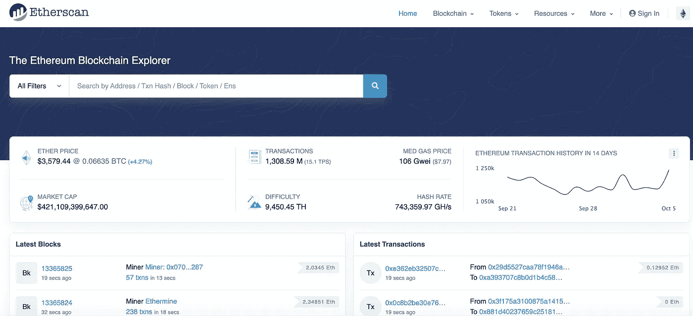

[https://etherscan.io/](https://etherscan.io/)

*   [**以太扫描**](https://etherscan.io/) 是以太坊的一个块浏览器和分析平台。您可以在下面的文档的[中找到 API 端点。](https://docs.etherscan.io/)
*   [**Bscscan**](https://bscscan.com/) 允许您探索和搜索币安区块链，了解币安智能链上发生的交易、地址、代币、价格和其他活动。( [API 文档](https://docs.bscscan.com/)
*   [**PolygonScan**](https://polygonscan.com/) 允许您探索和搜索 Polygon 区块链，以了解发生在 Polygon 智能链上的交易、地址、令牌、价格和其他活动。( [API 文件](https://polygonscan.com/apis))

使用这些 API，您可以从一个地址中检索所有令牌。这个 API 列表并不详尽，随着更多的可用，将会添加更多的智能链。

# 在 Google Sheet 里是什么样子的？

下面的 GIF 显示了如何加载投资组合估值。

## DIY:

1.  添加多达 3 个 ERC20、BEP20、MATIC 地址
2.  如果需要，添加特定的协议
3.  点击刷新

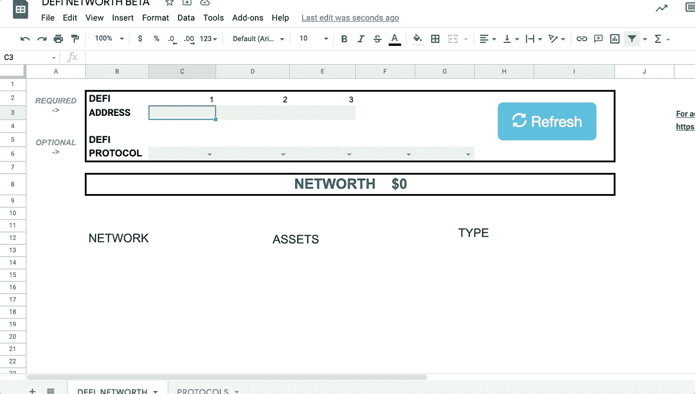

GIF 1 : Loading the portfolio valuation

Google 脚本将地址列表(限制为 3 个)和协议列表(限制为 5 个)作为参数，然后调用我的服务器，使用前面提到的 API 端点计算所有持有量，然后将数据转换为具有以下特征的范围:

> [试用:现场样张](https://docs.google.com/spreadsheets/d/1eGiYXHjcB1XwIj2nQMLtvZ_h822ACOm2BCIuaVHEFQ4/edit?usp=sharing)

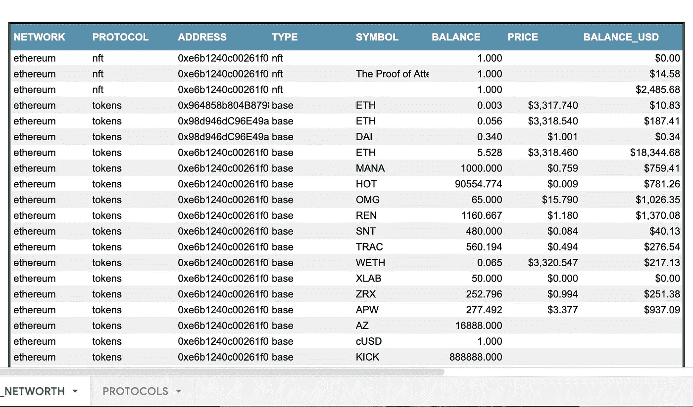

Google sheet Total Asset List & Valuation

1.  网络
2.  草案
3.  地址
4.  类型
5.  标志
6.  平衡
7.  价格
8.  余额 _ 美元

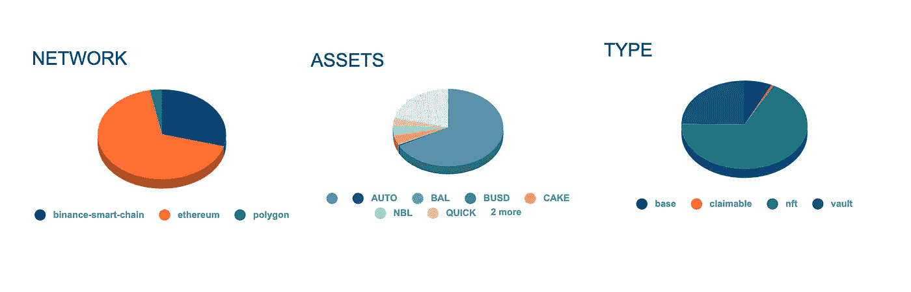

Google sheet Total DEFI Asset Allocation

它还将在 3 个饼图中总结持有情况，其中持有情况是按网络、资产和类型(计息、代币等)计算的

在 [**页签 DEFI_NETWORTH**](https://docs.google.com/spreadsheets/d/1eGiYXHjcB1XwIj2nQMLtvZ_h822ACOm2BCIuaVHEFQ4/edit?usp=sharing) 中，您需要做的是在提到 DEFI 地址的单元格中输入**DEFI 地址**。

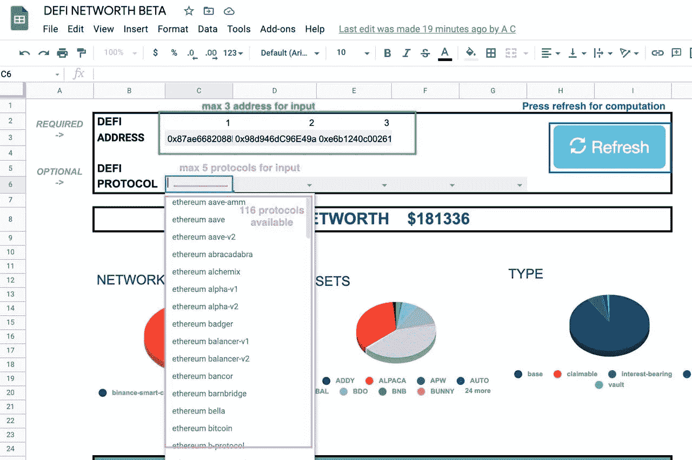

Green Required inputs : Green — Optional inputs : Purple — Refresh/Load script: Blue

然后你需要点击刷新，等待结果加载。如果地址有很多协议，加载可能需要 1 分钟。如果您希望指定协议，您可以通过选择 DEFI 协议旁边的单元格中的名称来进行指定。如果这些可选单元格为空，脚本将获得协议的总列表。

不要更改选项卡的名称，否则脚本将无法运行。它依赖于 DEFI_NETWORTH 作为选项卡的名称。

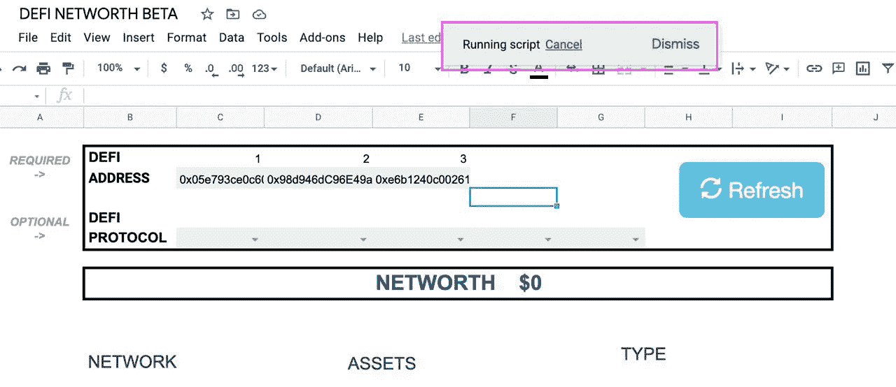

Once you press on the refresh button, wait until the Running Script button disappears

这种方法的缺点是，如果你有许多协议，它不会得到所有的数据，因为我必须优化我的服务器上的计算负载。因此，我创建了以下可定制的公式，您可以通过协议直接请求。

# 隐球菌

此公式通过 DEFI 协议获得所有资产(池、令牌、可申请的…)的**列表。**

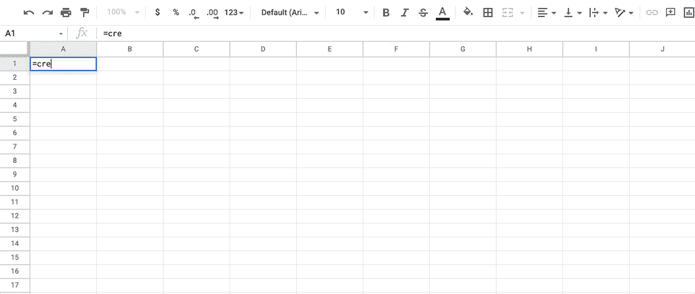

=CRYPTODEFI(“Holder Address”,”Protocol”)

# CRYPTODEFI _ 天平

这个公式得到每个符号/收报机和 DEFI 协议的**赌注/借出量**。

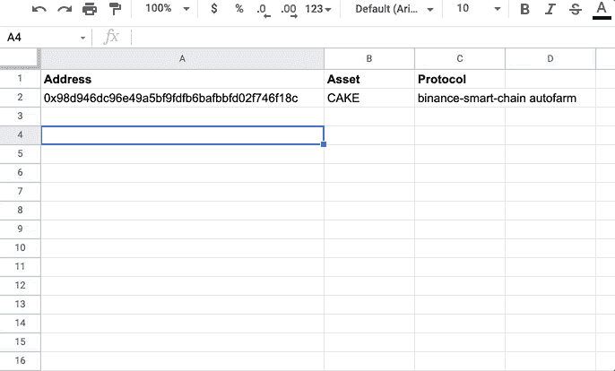

=CRYPTODEFI_BALANCE(“Holder Address”,”Symbol”,”Protocol”)

# CRYPTODEFI _ BALANCEUSD

该公式得出每个符号/股票和 DEFI 协议的**押记/借出美元金额**。

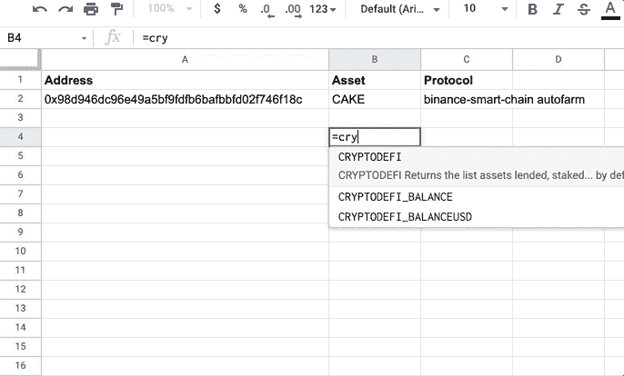

=CRYPTODEFI_BALANCEUSD(“Holder Address”,”Symbol”,”Protocol”)

# 获取协议名称列表

如果你想知道如何获得协议的名称，我为 Zapper 上所有可用的协议创建了一个快速脚本。以下 javascript 代码可用于列出和选择您想要的资产/池的特定协议。现在它是一个固定的列表，但很快它将完全自动化。

[**这是 Zapper 上的列表**](https://zapper.fi/protocols)

您可以在工作表中使用此公式显示名称列表:

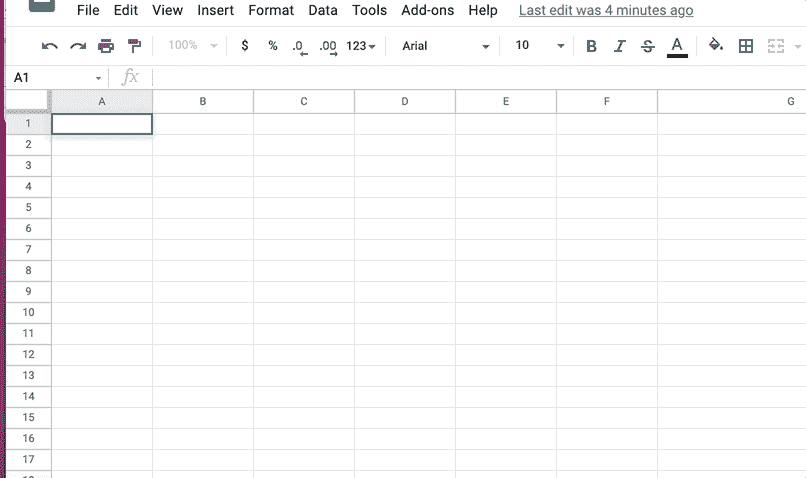

=PROTOCOLS()

如果你有一个协议的资产不在列表中，你可以在 Zapper 的网站上直接找到它的名字。

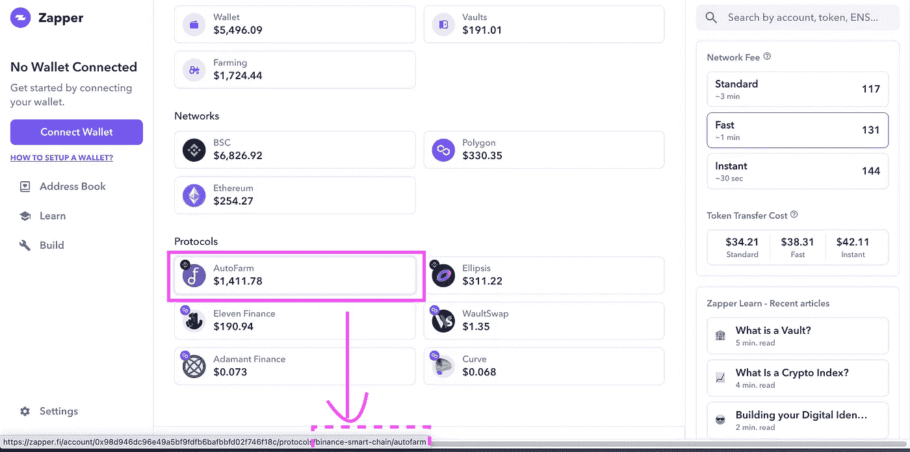

[https://zapper.fi/](https://zapper.fi/)

侧图显示了您可以在哪里找到要调用的协议的名称。在本例中，您将调用:

“币安智能链自动武装”

# NFT 的例子

如果您对评估您的表中 NFT 感兴趣，您可以使用 CRYPTODEFI 公式并使用:

-> **以太坊 NFT** 为协议

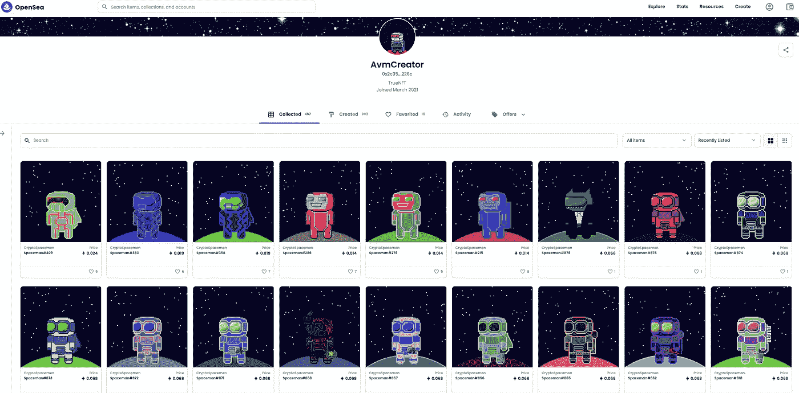

[https://opensea.io/AvmCreator](https://opensea.io/AvmCreator)

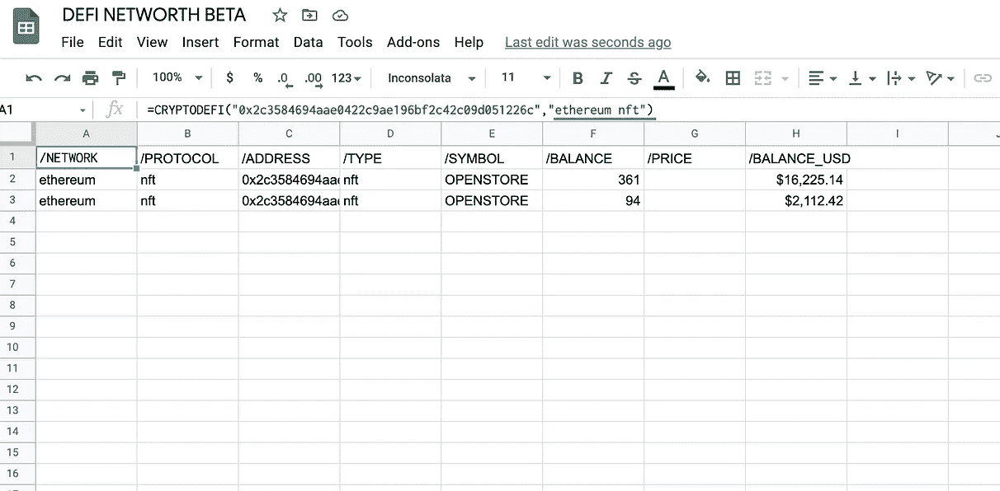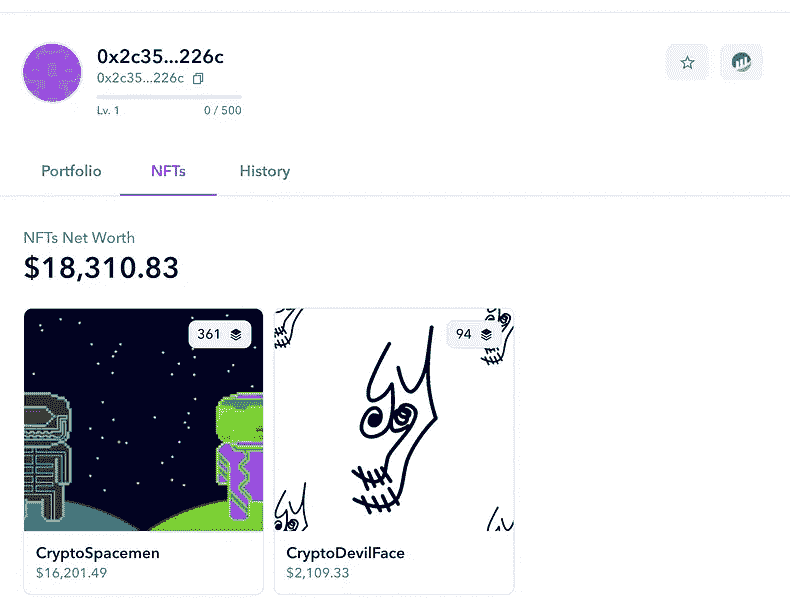

=CRYPTODEFI(“Holder’s address”,”ethereum nft”)

# 令牌示例

例如，如果您对获取您在以太坊上持有的令牌列表感兴趣，您可以使用 CRYPTODEFI 公式并输入:

-> **以太坊令牌**为协议

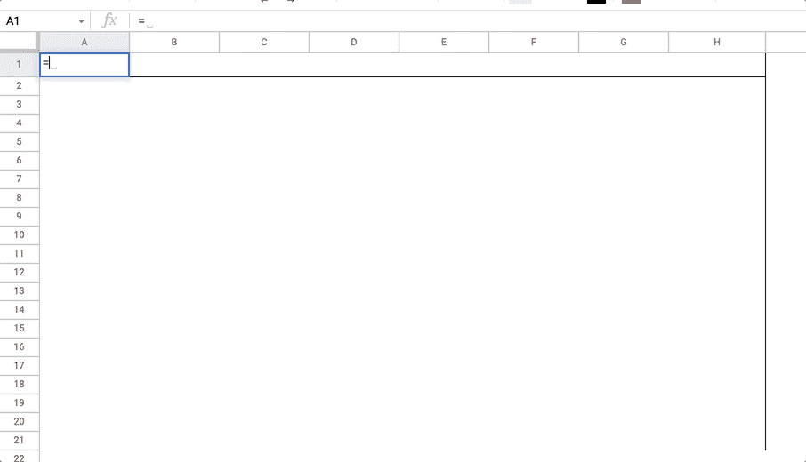

=CRYPTODEFI(“Holder’s address”, “ETHEREUM TOKENS”)

# JAVASCRIPT 代码设置:

1.  **简单易行的方法**

获取代码的最简单方法是 [**复制一份只读**](https://docs.google.com/spreadsheets/d/1eGiYXHjcB1XwIj2nQMLtvZ_h822ACOm2BCIuaVHEFQ4/copy) 表单，该表单会自动将代码添加到新创建的表单中。

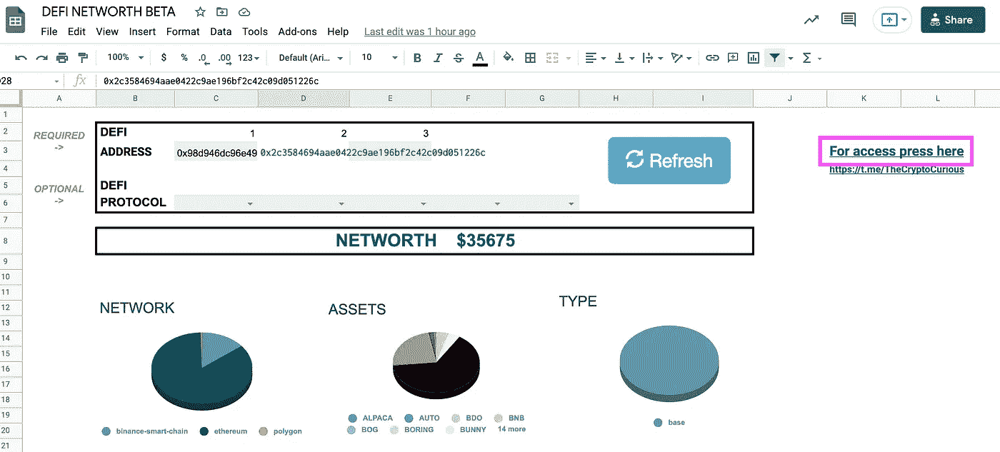

You can also press on the link “For access press here” to copy the sheet to your Google Account

**2。手动插入代码**

a)进入**工具/脚本编辑器**

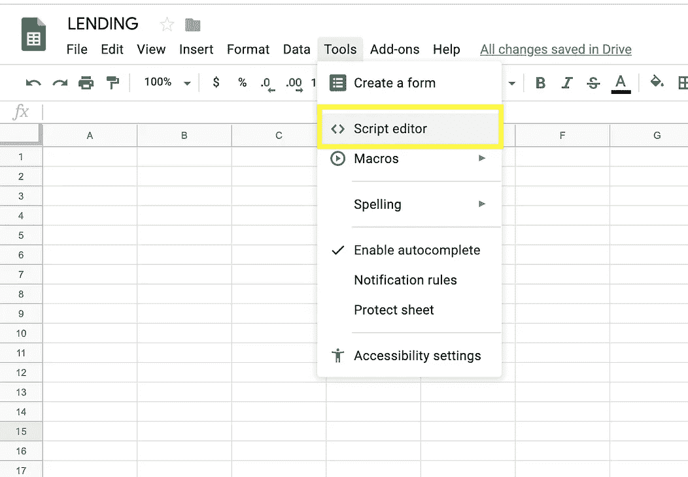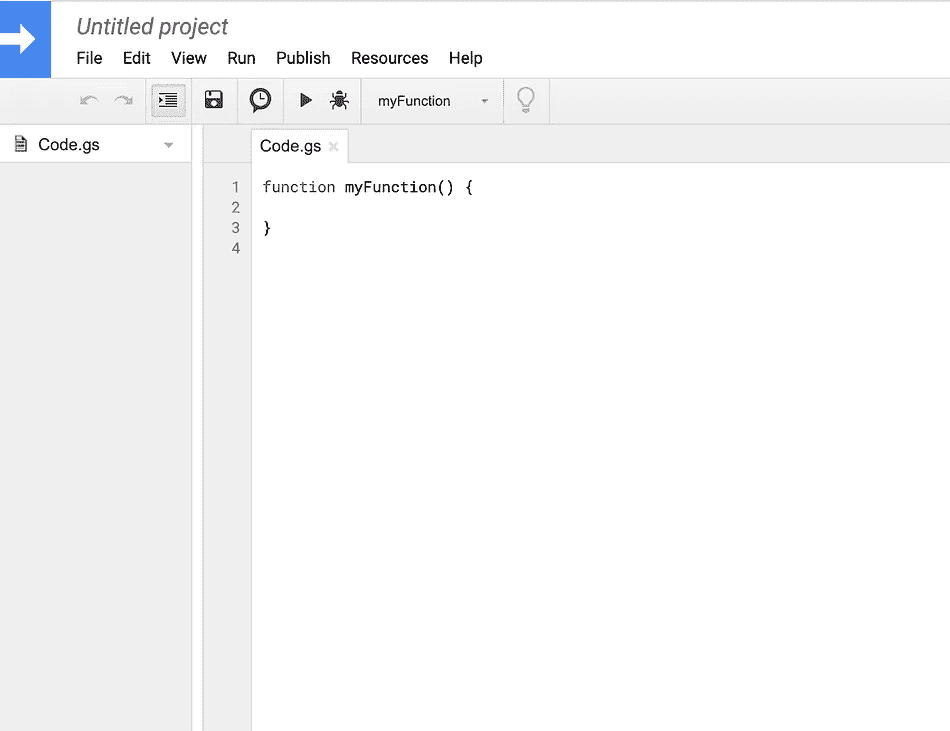

Google Script Editor

b) **复制粘贴并添加**以下脚本

*   从 [**Github**](https://github.com/Eloise1988/DEFIASSETS) ，**中复制**[**DEFI asset . GS**](https://raw.githubusercontent.com/Eloise1988/DEFIASSETS/main/defiasset.gs)**的内容，粘贴到脚本编辑器中(替换任何已有的内容)，命名为 DEFI。**

**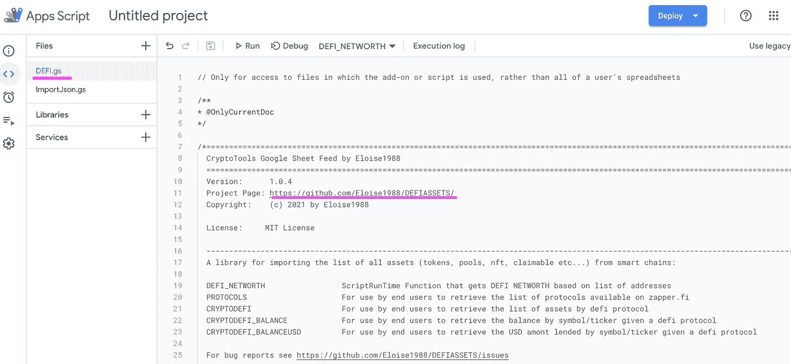**

**defiasset.gs**

**c) **用文件【保存】保存脚本** t，并**刷新表单****

**d) **确保你授权了谷歌服务**。应用程序脚本需要用户授权才能从[内置谷歌服务](https://developers.google.com/apps-script/guides/services)或[高级谷歌服务](https://developers.google.com/apps-script/guides/services/advanced)访问私人数据。**

**更多详情， [**点击此处**](/the-cryptocurious/google-sheet-open-source-cryptotools-set-up-9420e3940a8a) 。**

# **结论:**

**这个媒体向你展示了如何从一个公开的区块链地址检索 DEFI 资产的投资组合估值。**

*   ****应用程序脚本运行时**直接嵌入[谷歌应用程序脚本](https://docs.google.com/spreadsheets/d/1eGiYXHjcB1XwIj2nQMLtvZ_h822ACOm2BCIuaVHEFQ4/edit?usp=sharing)直接在工作表中加载投资组合估值。**
*   ****CRYPTODEFI** 通过 DEFI 协议获取所有资产(池、令牌、可声明的…)的**列表。****
*   ****CRYPTODEFI_BALANCE** 获取每个符号/报价器和 DEFI 协议的**下注/借出数量****
*   ****CRYPTODEFI_BALANCEUSD** 获取每个符号/股票和 DEFI 协议的**押记/借出美元金额**。**

# **代码参考**

*   **【https://github.com/Eloise1988/DEFIASSETS **

**这是正在进行的工作。我希望你能从我的工作中受益。对于希望直接连接到我的 API 的开发人员，您可以在这里使用 [*API 文档*](https://app.swaggerhub.com/apis-docs/Eloise1988/Crypto-Tools) *。***

**我很想获得反馈，了解哪些地方不起作用，缺少什么，哪些地方需要改进等等..非常欢迎反馈。一个 [*电报聊天*](https://t.me/TheCryptoCurious) *也可供支持，不要犹豫留言。如果这个项目增加了任何价值，CryptoTools 就在* [*patreon。*](https://www.patreon.com/cryptotools)**

**非常感谢您花时间阅读本文。**

> **加入 Coinmonks [电报频道](https://t.me/coincodecap)和 [Youtube 频道](https://www.youtube.com/c/coinmonks/videos)了解加密交易和投资**

## **也阅读**

** [## 最佳加密交易所| 2021 年十大加密货币交易所

### 编辑描述

blog.coincodecap.com](https://blog.coincodecap.com/crypto-exchange)  [## 2021 年 10 大最佳加密贷款平台| CoinCodeCap

### 编辑描述

blog.coincodecap.com](https://blog.coincodecap.com/crypto-lending)  [## 2021 年最佳免费加密交易机器人

### 2021 年币安、比特币基地、库币和其他密码交易所的最佳密码交易机器人。四进制，位间隙…

medium.com](/coinmonks/crypto-trading-bot-c2ffce8acb2a)  [## 最佳 4 个加密交易信号电报通道

### 这是乏味的找到正确的加密交易信号提供商。因此，在本文中，我们将讨论最好的…

medium.com](/coinmonks/best-crypto-signals-telegram-5785cdbc4b2b)  [## BlockFi 评论 2021:利弊和利率| CoinCodeCap

### 编辑描述

blog.coincodecap.com](https://blog.coincodecap.com/blockfi-review)  [## 如何在印度购买比特币？2021 年购买比特币的 7 款最佳应用[手机版]

### 如何使用移动应用程序购买比特币印度

medium.com](/coinmonks/buy-bitcoin-in-india-feb50ddfef94)  [## 加密税务软件——五大最佳比特币税务计算器[2021]

### 不管你是刚接触加密还是已经在这个领域呆了一段时间，你都需要交税。

medium.com](/coinmonks/best-crypto-tax-tool-for-my-money-72d4b430816b)  [## 存储比特币的最佳加密硬件钱包[2021] | CoinCodeCap

### 编辑描述

blog.coincodecap.com](https://blog.coincodecap.com/best-hardware-wallet-bitcoin)  [## Pionex 评论 2021 |免费加密交易机器人和交换

### Pionex 是为交易自动化提供工具的后起之秀。Pionex 上提供了 9 个加密交易机器人…

medium.com](/coinmonks/pionex-review-exchange-with-crypto-trading-bot-1e459d0191ea)**