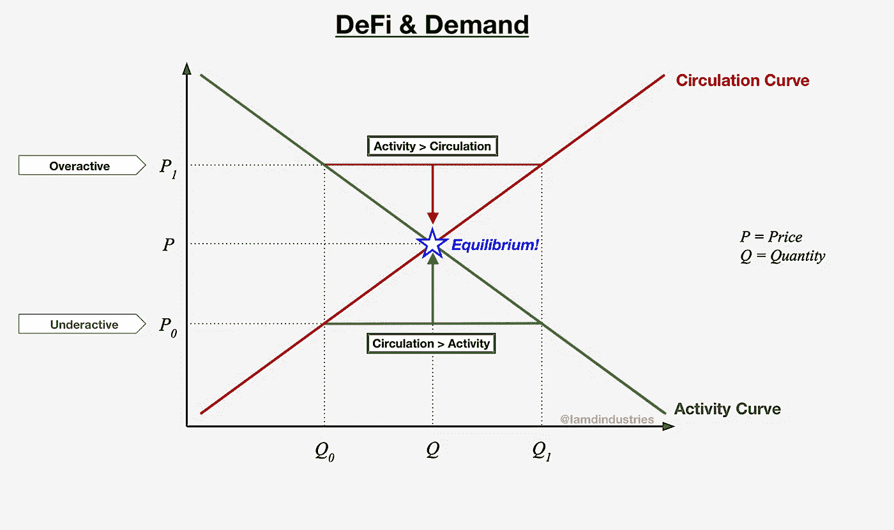
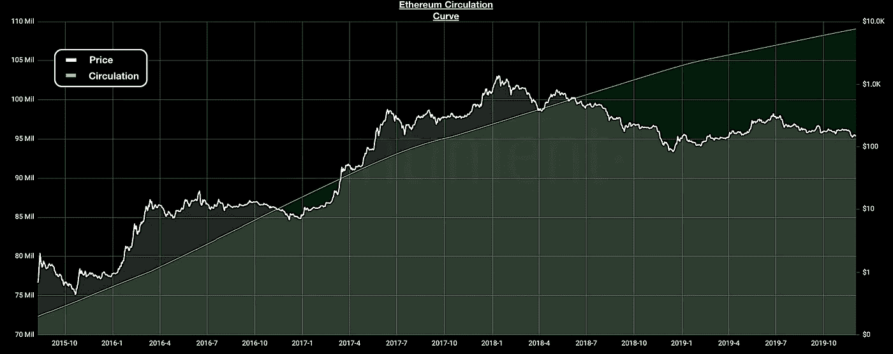
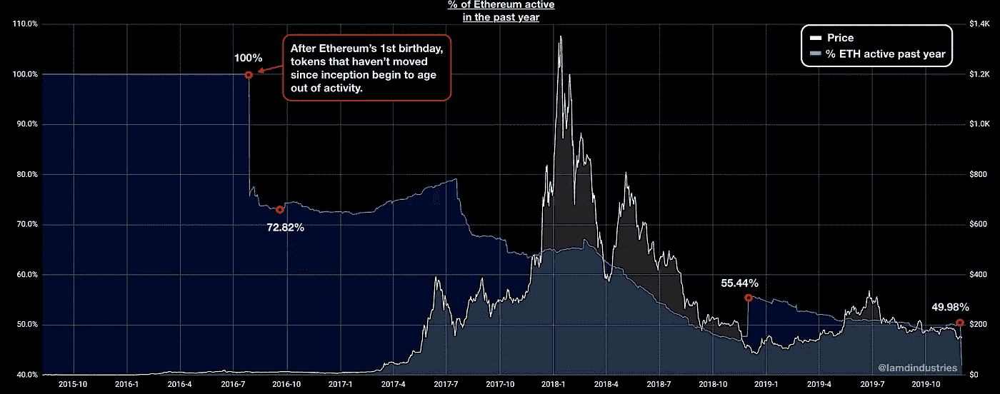
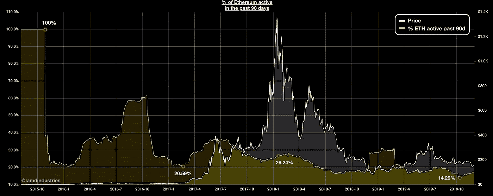

# 定义与需求:第一部分

> 原文：<https://medium.com/coinmonks/defi-demand-part-i-bb3b8121b971?source=collection_archive---------2----------------------->

似乎每天都有关于如何使用和查看加密货币的新产品、协议和方法被引入和/或改进。这常常让我想知道所有这些新信息将如何改变我们对整个经济学的看法。因此，我的目标是进一步扩展我对几篇文章的思考。我觉得最好是一步一步来，而不是把所有的东西都塞进 2500 个单词。如果幸运的话，这可能会让我更容易定义事情，让其他人更容易跟随，并允许一些人提供意见。

但是在我开始之前，有几件事需要澄清一下，关于我的前一篇文章(也是本系列的前言)，标题是“[窥视以太币活动](https://insights.santiment.net/read/a-peek-into-ethereum-token-activity-662)”首先，我对“活动和需求”这个短语的使用有些多余，因此会引起误解。根据我的想法，活动是市场参与者要求的硬币/代币的数量。因此，接下来，我将引用 DeFi &需求的相同理论，我知道，它非常吸引人，而且几乎非常聪明。

我必须指出的另一件事是，这是以一个理论为模型，而不是我在之前的文章中错误陈述的定律。很重要的一点是，我要把这个区别搞清楚，因为万一我犯了可怕的错误，我可以在以后依靠这个。

好了，现在让我们继续吧。你可能会注意到，我对下图做了一些改动。由于这一理论是对经济均衡的改编，以供给和需求为基础，我觉得最好是采用这一模型并修改它以适应我的需要。

***According the idea, the DeFi & Demand mechanism will strive to allocate resources in the most efficient way possible.***

这种机制以多种方式发挥作用:价格越高，市场参与者需求/提供的活跃硬币数量就越少，价格越高，做市商/矿商(在某些情况下是零售商)增加流通或从 DeFi 配置的数量就越多。也就是说，我们可以开始想象这些曲线在斜率和外观上是如何不断变化的。虽然在很大程度上，循环曲线呈上升趋势，但重要的是要记住，分散融资的持续增长和发展将有助于增加循环曲线所需的方差。

为了进一步澄清，让我们考虑一下《魔鬼经济学》的作者史蒂芬·列维特是如何描述供给与需求的；

*“如果一种商品的价格上涨，人们对它的需求就会减少，生产这种商品的公司就会想办法增加它的产量，每个人都会想办法生产它的替代品。此外还有技术创新的发展。”*

例如，在我描述的例子中，用“以太坊”代替“商品”，然后用“代币活动”代替“需求”，而不是公司，想想那些对供应有一些控制的人，如做市商、矿工/验证者和那些参与 DeFi 的人。最后，我想我们都知道替代者和模仿者是谁。

接下来，这里有几个例子来帮助说明这些观点:

***As we look at Ethereum’s historic circulation curve it is easy to see the trend.***

关键是要记住，在智能合约中押注和锁定 ETH 将允许人为回归整体流通曲线。很可能，其他的事情也会出现，也可能有这种效果。请记住，这样的曲线是波动的，不太可能相互耦合。

***Looking at historic % of Ethereum active in the past year, while considering the circulation curve, exemplifies my hypothesis.***

现在，我们可以看到，即使不断增加供应，活跃令牌的整体趋势仍然下降，波动程度也更大。我只想说，估值方面似乎也存在很大差异。此外，由于我们可以定义不同的范围，如 1 年或 90 天，我们还可以查看活动的不同程度的变化以及它与价格行为的关系。(见下文)

***A historic view of % of Ethereum active in the past 90 days offers yet another unique way to view token activity.***

但是，这有什么关系呢？首先，我相信这些想法可以展示以太坊的生态系统是如何演变成一个越来越有活力的生态系统的。这意味着，随着通货膨胀和通货紧缩两方面都获得更大的立足点，未来我们可能会在平台上看到更强大的价值转移形式。第二，如果这些曲线像我假设的那样相互作用，我们也许能够通过观察它们有效地预测未来的价格走势。

这就是我花了太多时间思考、研究和与同行讨论的东西的介绍。考虑到所有的事情，我想确保这些想法在发布之前和用一些深入的例子深入探讨之前得到很好的概述。在下一部分，我将着眼于扩展智能合约中锁定的 ETH、活跃令牌百分比和价格之间的关系。

*   本文中的所有链上数据均来自[https://santiment.net/](https://santiment.net/)

> [在您的收件箱中直接获得最佳软件交易](https://coincodecap.com/?utm_source=coinmonks)

