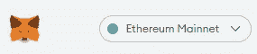
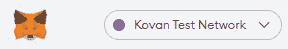

# 新手的定义:1)钱包设置

> 原文：<https://medium.com/coinmonks/defi-for-newbies-1-wallet-setup-960e0c69d12b?source=collection_archive---------0----------------------->

如果你对 DeFi 感兴趣，在你开始投入大量资金之前进行尝试是非常重要的。当然，你可以阅读许多关于 DeFi 的文章(包括我的😎)——每个人都会告诉你:

> “自己研究吧！”

但请不要把研究仅仅等同于“读书”。没有什么比亲身体验更好的了，尝试你感兴趣的 DeFi 项目。

Photo by [Natasha Chebanoo](https://unsplash.com/@chebanoo?utm_source=unsplash&utm_medium=referral&utm_content=creditCopyText) on [Unsplash](https://unsplash.com/s/photos/wallet-crypto?utm_source=unsplash&utm_medium=referral&utm_content=creditCopyText)

# 去做吧。

虽然“尝试”听起来很容易，但事实并非如此。大多数 DeFi 项目的用户体验(UX)远非用户友好，或者与您可能习惯的当前银行应用程序相差甚远。他们中的大多数生来就是“原生加密”——解决一个已经熟悉笨拙的种子短语和奇怪的浏览器插件弹出的社区。

请不要被这些经历吓倒。我们都必须习惯并克服这些最初的障碍。这对每个人来说都是一个陡峭的学习曲线。这就是为什么我试着后退一步，引导你了解一个 DeFi 新手需要掌握的一些最重要的方面。

所以，先从钱包说起。因为，没有钱包，你甚至看不到许多 DeFi 项目的用户界面的最基本部分——甚至在你开始之前就把你挡在外面。

## 笔记本电脑的回归

虽然在你的手机上使用 DeFi 产品是完全可能的，但我不建议这样开始。您当然可以使用手机来跟踪您的 DeFi 余额和交易，但从台式机或笔记本电脑上积极使用 DeFi 产品更安全——尤其是作为一名新手。

## 适合 DeFi 的浏览器

即使在 2021 年听起来很疯狂，但你对浏览器的选择很重要。大多数 DeFi 项目与 Chrome 或 Firefox 配合得相当好。如果你想成为一名真正的 DeFi 迷，我建议安装[勇敢](https://brave.com/download/)。Brave 的发明者还创造了[基本注意力令牌蝙蝠](https://www.coingecko.com/en/coins/basic-attention-token)。使用 Brave，你将在网上冲浪时收集一些蝙蝠令牌奖励，并在探索 DeFi 时接触到一个有趣的加密项目。此外，Brave 会阻止大多数不必要的 cookies 和广告，通过清除这些垃圾来保护您的安全并改善您的浏览体验。在过去的两年里，我使用 Brave 作为我的主要浏览器，到目前为止我非常开心。

## 您的钱包设置

现在，您可以考虑使用一个钱包来自行保管您的加密货币了。当然有可能避免这一步，而是使用中央交易所或更高层次的服务，由保管人保管你的资产。然而，你没有使用 DeFi。你只是从 DeFi 中获利，但仍然依靠“中间人”。这对你来说可能完全没问题，但你可能会错过“加密运动”的一个重要部分。大多数职业选手会低头看着你，喃喃自语:

> “不是你的钥匙，不是你的硬币”

比特币、以太坊和其他大部分东西的整体理念是对任何人的包容和开放——没有许可。然而，自由总是伴随着责任……这包括**你对你的资产 100%负责——以及访问它们的钥匙**。

这就是为什么你需要

*   有助于证明你在区块链拥有某些资产的钱包
*   访问您的钱包的密钥(如签署消息或向其他人发送资产)
*   保护好这些钥匙，这样就没人能偷走你的资产

任何人都可以看到您钱包的地址及其资产。记住:你的资产在区块链上。每个人都可以检查发生了什么(读取数据)。完全透明。但是您将是唯一一个移动资产的人(创建交易和发送资产)。你需要你的“私人密钥”来访问你的资产——这些密钥(不是你的资产)存储在你的钱包里。

> 这可能是 crypto 和 DeFi 中最常见的误解，即钱包存储您的资产。他们没有。他们只存储你的私人部分的钥匙。你的资产生活在链条上，只是与你的钱包相关联。

区块链证明您的资产与您的钱包地址相关联，只有您可以借助您的私钥移动它们。你可能会想:这听起来很奇怪，每个人都能看到我的余额？是的，他们可以—如果(！)他们知道去哪里找。大多数区块链是假名。地址的数量是无穷无尽的。只要你不告诉任何人在哪里找到你的钱包，没有人会知道在哪里找或者它是否是你的。但如果你告诉某人，他们将能够跟踪你过去用你的资产做的任何事情，或者将来会做的任何事情。你看:你的钱包和它的钥匙真的很重要。**这就是为什么选择钱包是非常重要的一步。这也是我写这篇文章的原因。**

## 元掩码

如果你想在 DeFi 中进行实验，你将无法避免 Metamask。Metamask 是一个免费的加密钱包，通过浏览器扩展工作，如果你与 DeFi 交互，通常会弹出一个窗口。每一个 DeFi 项目都会提示你**把你的钱包**连接到他们的网站。在大多数情况下，如果你拒绝这重要的一步，你将无法探索这个网站。许多(如果不是全部的话)当前的 DeFi 项目支持 Metamask。所以，即使你不投资一分钱，我也会敦促你安装 Metamask，创造你的第一个钱包。

请看看本教程视频的前 3 分钟，并设置自己的元蒙版。别忘了在一张你不想丢失的纸上写下你的秘密备份短语！

您已经设置好元掩码了吗？太好了！

您刚刚创建了一个网络钱包。这肯定不是地球上最安全的钱包设置。但是对于第一步来说是很实用的。当然还有更多选择，比如纸质钱包、不同种类的硬件钱包、智能合约钱包等等。尽管如此，元掩码相当简单，是一种默认设置。此外，Metamask 还有一些很酷的额外特性，我们将在另一篇文章中探讨。这也是我推荐从它开始的另一个原因。

# 增强安全性

另一个很酷的方面是，您可以使用 Metamask 来导入和访问硬件钱包(如 Ledger 或 Trezor)。在您旅程的后期阶段，这是一个非常优雅的设置和推荐。但是，我不建议这样开始。对于实验和第一步，一个纯粹的元蒙版设置是完全可以的。在投入大量资金之前，考虑使用硬件或智能合约钱包是非常明智的。

# 后续步骤

设置好元蒙版后，你就可以开始浏览所有的 DeFi 项目了。然而，你不能积极地玩耍。如果你想和 DeFi 互动，你需要用少量的 ETH 支付你的交易。所以，如果你的钱包里没有 ETH，你就不能进行真正的交易。

从现在开始，有三种选择可以让你的钱包变得更鼓:

*   使用以太坊测试网络
*   请朋友发送 ETH
*   购买一些 ETH

# a)使用以太坊测试网络

在 Metamasks UI 的顶部，你可以选择你正在工作的区块链网络。通常，你会在**以太坊主网**上工作，那里会发生严重的 DeFi 事件。

但是如果你只是想获得第一感觉，你可以选择使用以太坊测试网，例如**科万测试网**。

测试网络上的令牌不需要任何费用。你可以让“计量器”将一些以太网令牌发送到你的钱包中。阅读这个指南[在科万考试网上获得一些免费的 ETH](http://github.com/kovan-testnet/faucet) 。获得 testnet 令牌通常是几分钟的问题。现在，你可以开始玩了，例如，发送一些 testnet ETH 给一个朋友，并要求他们发送回来。还要学会在 [Etherscan](https://etherscan.io/) 上跟踪你的交易，这[也可用于测试网络，如 Kovan](https://kovan.etherscan.io/) 。

通常，DeFi 项目在这些测试网络上提供他们的最新版本。一个很棒的沙盒来玩。但是一旦在 mainnet 上发布，他们通常会将其删除。

# b)请朋友发送电子邮件

如果你知道有人在以太坊主网上有真正的 ETH，我推荐第二种方法。如果你马上把钱还给他们，他们肯定会帮助你，给你的钱包寄一些钱。你可以就你最迫切的问题寻求一些指导。是的，你肯定会有问题。

如你所见:这是你第一次告诉别人你的钱包地址。你的朋友需要它来给你发邮件。这是第一次侵犯隐私——即使“只是朋友”。以太坊在隐私方面还不完善。

# 购买一些 ETH

第三种方法当然是购买一些 ETH。这种通过某种交换的“菲亚特入口”听起来可能是最简单的一种，但实际上并非如此。大多数交易所遵守银行监管规则。这意味着他们必须实施反洗钱/KYC(反洗钱/了解你的客户)程序。即使你只是想把 50 美元兑换成 ETH，也要准备好表明自己的身份。通常，这种将法定货币转换成加密货币的经历是痛苦和令人生畏的，直到你的 ETH 最终进入你的钱包。再说一遍，这很正常。

有许多不同的方法可以做到这一点。你可能想和像[比特币基地](https://www.coinbase.com/)、[币安](https://www.binance.com/en/register?ref=N0OD5DAQ)或[北海巨妖](https://www.kraken.com/)这样的大玩家一起进入主流。或者你可以选择一个本地玩家。在德国和欧洲，我和来自柏林的 Bitwala 用他们流畅的用户界面和 KYC 程序做了很好的体验。如果您想获得 15 英镑的€欢迎礼券，可以使用[我的个人推荐链接](https://app.bitwala.com/r/97HN-E8VK)。

这些平台中的每一个都有自己单独的程序来设置…

1.将您的订单发送到他们的账户(通常称为存款)，

2.把你的菲亚特换成密码(ETH)

3.提取/发送 ETH 到您的钱包。

请务必执行所有三个步骤。只有这样，你才能在你的 DeFi 冒险中做好进一步的准备。

## 包裹

暂时就这样了。如果你按照上面的步骤，你现在应该是一个 Metamask 钱包和一些 ETH 的骄傲拥有者，准备好四处玩耍，让你自己的第一次 DeFi 体验。后续文章我有一些想法。与此同时，你可以阅读[这个小小的 DeFi 系列](https://www.publish0x.com/sgrasmann/how-defi-will-innovate-our-financial-ecosystems-part-1n-xxwokjq?a=46dBBylJd7)来获得更多的好奇。

***免责声明:*** *本文无意成为任何形式的投资建议。如果你打算投资本文提到的某个项目，自己做研究并寻求专业支持。*

这是一个十字架。我第一次发表这篇文章是在[*publish 0x*](https://www.publish0x.com/sgrasmann?a=46dBBylJd7&tid=medium)

*也欢迎你在 [Twitter](https://twitter.com/sgrasmann) 上关注我，或者通过 [LinkedIn](https://www.linkedin.com/in/sgrasmann/) 联系我(但请告诉我你联系的原因，以及你是如何找到我的)。*

> *加入 coin monks[Telegram group](https://t.me/joinchat/EPmjKpNYwRMsBI4p)并了解加密交易和投资*

## *另外，阅读*

*   *什么是[闪贷](https://blog.coincodecap.com/what-are-flash-loans-on-ethereum)？*
*   *最好的[密码交易机器人](/coinmonks/crypto-trading-bot-c2ffce8acb2a) | [网格交易](https://blog.coincodecap.com/grid-trading)*
*   *[3 商业评论](/coinmonks/3commas-review-an-excellent-crypto-trading-bot-2020-1313a58bec92) | [Pionex 评论](/coinmonks/pionex-review-exchange-with-crypto-trading-bot-1e459d0191ea) | [Coinrule 评论](https://blog.coincodecap.com/coinrule-review-a-perfect-trading-bot)*
*   *[AAX 交易所评论](/coinmonks/aax-exchange-review-2021-67c5ea09330c) | [德里比特评论](/coinmonks/deribit-review-options-fees-apis-and-testnet-2ca16c4bbdb2) | [FTX 密码交易所评论](/coinmonks/ftx-crypto-exchange-review-53664ac1198f)*
*   *[n 零审核](/coinmonks/ngrave-zero-review-c465cf8307fc)*
*   *[Bybit Exchange 审查](/coinmonks/bybit-exchange-review-dbd570019b71) | [Bityard 审查](https://blog.coincodecap.com/bityard-reivew)|[inter tax 审查](https://blog.coincodecap.com/interdax-review)*
*   *[3Commas vs Cryptohopper](/coinmonks/3commas-vs-pionex-vs-cryptohopper-best-crypto-bot-6a98d2baa203)*
*   *最好的比特币[硬件钱包](/coinmonks/the-best-cryptocurrency-hardware-wallets-of-2020-e28b1c124069?source=friends_link&sk=324dd9ff8556ab578d71e7ad7658ad7c) | [BitBox02 回顾](/coinmonks/bitbox02-review-your-swiss-bitcoin-hardware-wallet-c36c88fff29)*
*   *[总账 vs 平均](https://blog.coincodecap.com/ngrave-vs-ledger)*
*   *[密码拷贝交易平台](/coinmonks/top-10-crypto-copy-trading-platforms-for-beginners-d0c37c7d698c) | [比特码拷贝交易](https://blog.coincodecap.com/bityard-copy-trading)*
*   *[莱杰 nano s vs x](https://blog.coincodecap.com/ledger-nano-s-vs-x)*
*   *[Vauld Review](https://blog.coincodecap.com/vauld-review)|[you hodler Review](/coinmonks/youhodler-4-easy-ways-to-make-money-98969b9689f2)|[BlockFi Review](/coinmonks/blockfi-review-53096053c097)*
*   *最好的[加密税务软件](/coinmonks/best-crypto-tax-tool-for-my-money-72d4b430816b) | [CoinTracking 评论](/coinmonks/cointracking-review-a-reliable-cryptocurrency-tax-software-5114e3eb5737)*
*   *最佳[加密贷款平台](/coinmonks/top-5-crypto-lending-platforms-in-2020-that-you-need-to-know-a1b675cec3fa)*
*   *[莱杰纳米 S vs 特雷佐 one vs 特雷佐 T vs 莱杰纳米 X](https://blog.coincodecap.com/ledger-nano-s-vs-trezor-one-ledger-nano-x-trezor-t)*
*   *[block fi vs Celsius](/coinmonks/blockfi-vs-celsius-vs-hodlnaut-8a1cc8c26630)|[Hodlnaut 审核](https://blog.coincodecap.com/hodlnaut-review)*
*   *[Bitsgap 审查](/coinmonks/bitsgap-review-a-crypto-trading-bot-that-makes-easy-money-a5d88a336df2) | [Quadency 审查](/coinmonks/quadency-review-a-crypto-trading-automation-platform-3068eaa374e1)*
*   *[埃利帕尔泰坦评论](/coinmonks/ellipal-titan-review-85e9071dd029) | [赛克斯斯通评论](https://blog.coincodecap.com/secux-stone-hardware-wallet-review)*
*   *[BlockFi 评论](/coinmonks/blockfi-review-53096053c097) |在您的加密中赚取高达 8.6%的利息*
*   *[DEX Explorer](https://explorer.bitquery.io/ethereum/dex) 和[区块链 API](https://explorer.bitquery.io/graphql)*
*   *[加密套利](/coinmonks/crypto-arbitrage-guide-how-to-make-money-as-a-beginner-62bfe5c868f6)指南:新手如何赚钱*
*   *最佳[加密制图工具](/coinmonks/what-are-the-best-charting-platforms-for-cryptocurrency-trading-85aade584d80)*
*   *了解比特币的[最佳书籍有哪些？](/coinmonks/what-are-the-best-books-to-learn-bitcoin-409aeb9aff4b)*

> *[在您的收件箱中直接获得最佳软件交易](/coinmonks/newsletters/coinmonks)*

**