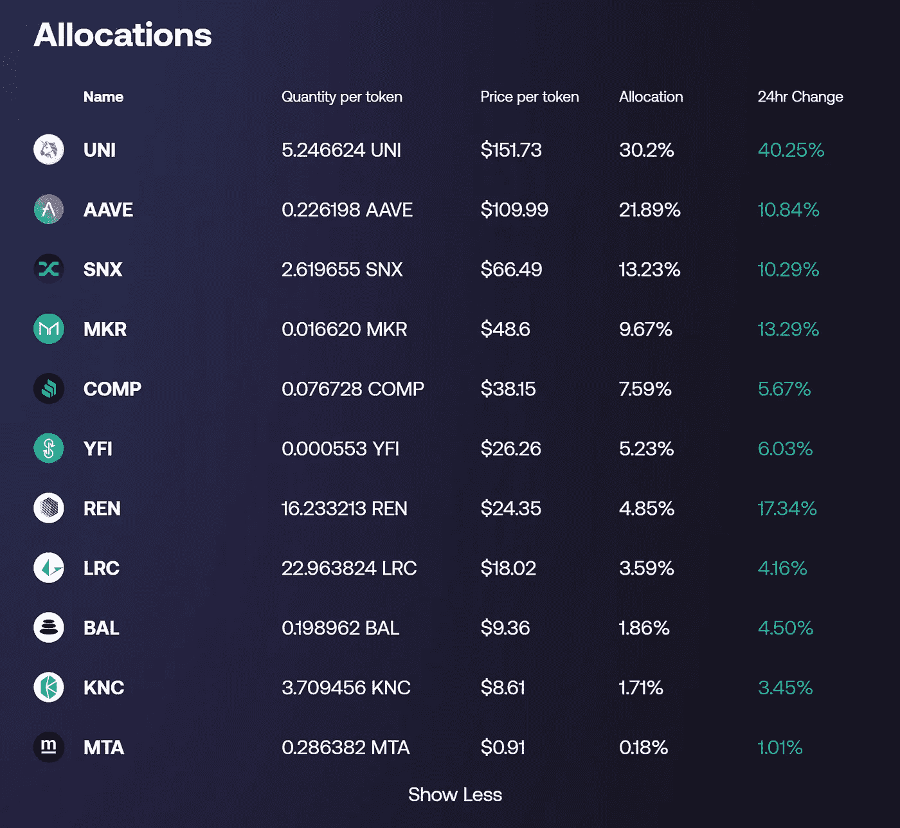
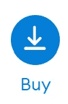
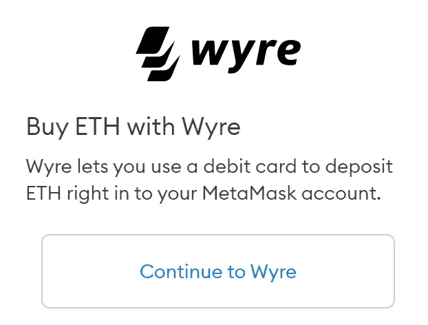
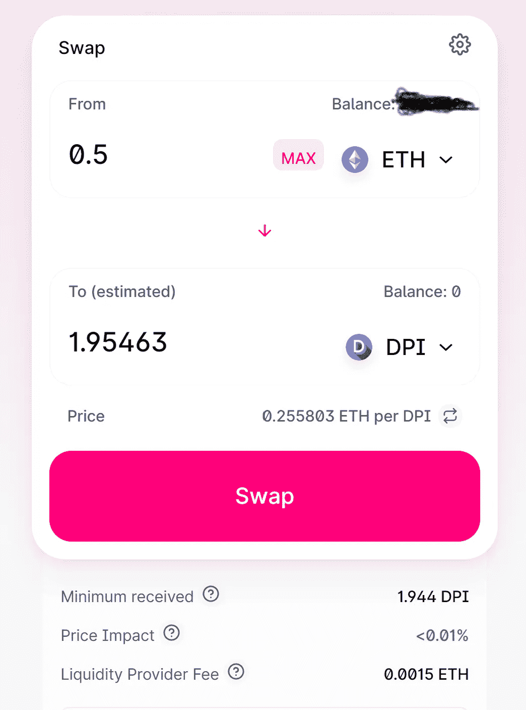
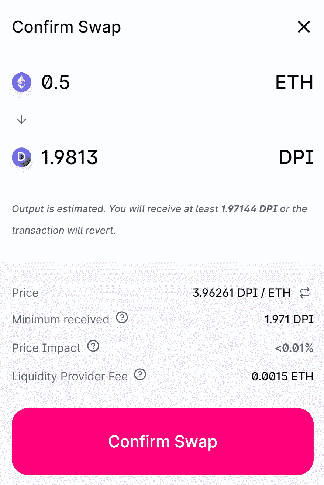
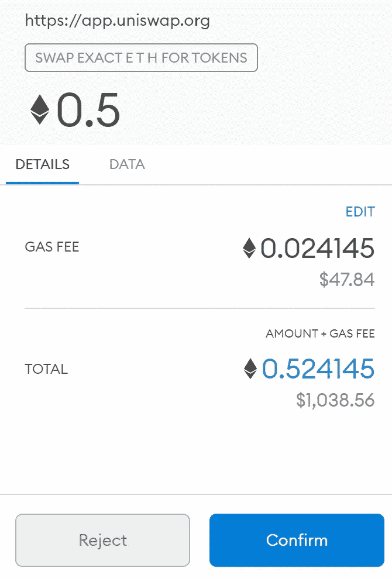
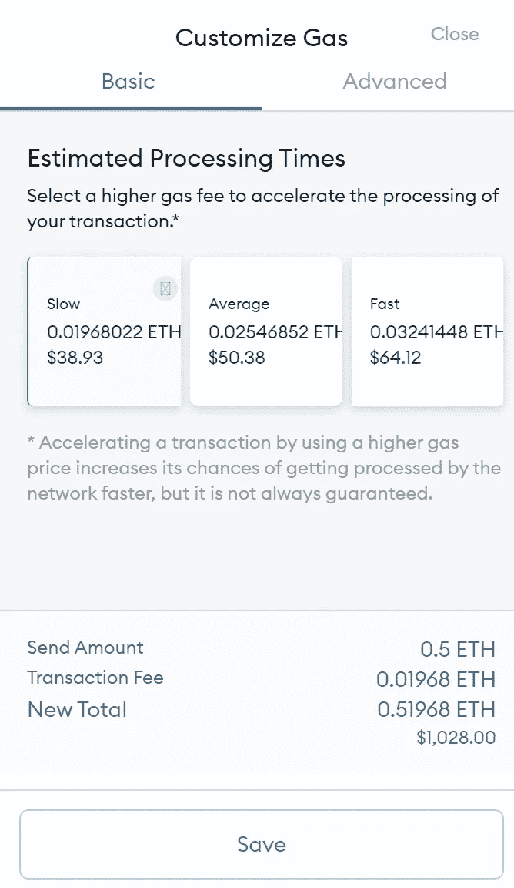
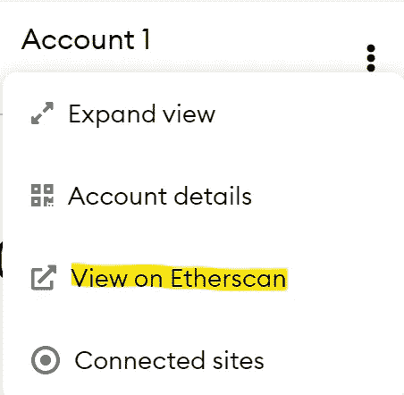

# 新手的定义:3)和行动！

> 原文：<https://medium.com/coinmonks/defi-for-newbies-3-and-action-6e41c2245dd3?source=collection_archive---------3----------------------->

Photo by [Martin Lopez](https://www.pexels.com/@mediocrememories?utm_content=attributionCopyText&utm_medium=referral&utm_source=pexels) from [Pexels](https://www.pexels.com/photo/man-holding-clapper-board-1117132/?utm_content=attributionCopyText&utm_medium=referral&utm_source=pexels)

我们在第一部分的[中讨论了 DeFi 钱包，在第二部分](/coinmonks/defi-for-newbies-1-wallet-setup-960e0c69d12b)的[中讨论了典型的 DeFi 投资者概况。现在，是时候真正开始投资了。在价格高、交易成本高的时候，我想了很多从哪里开始。](/coinmonks/defi-for-newbies-2-investor-profiles-3ece765fcd3)

## 去哪里投资？

所以，让我们假设你想从 DeFi 空间接触不同的项目。这有助于最小化您的风险。您还希望从小处着手，当然也希望避免过多的交易，以将成本控制在一定范围内。

这个场景属于我的投资者档案**懒惰聚集器**(见[第二部分](/coinmonks/defi-for-newbies-2-investor-profiles-3ece765fcd3))。让 DeFi 系统为你工作。在这种情况下， [**DeFi 脉搏指数**](https://www.indexcoop.com/dpi) (DPI)可能是您感兴趣的选项。该指数在选择顶级 DeFi 项目时有很高的标准，根据不同的特点，如基本令牌设计、令牌的流通供应、项目的吸引力及其用户安全。DPI 建立在[令牌集](https://www.tokensets.com/portfolio/dpi)之上，这是一个有趣的 DeFi 平台，用于创建一篮子或一组令牌。

在撰写本文时，DPI 包括以下令牌:

DeFi Pulse Index (snapshot from 2021–02–20)

经常阅读我的文章的读者应该会看到一些熟悉的名字，如 [Uniswap](https://uniswap.org/) 、 [Aaave](https://aave.com/) 、 [Synthetix](https://staking.synthetix.io/) 、 [MakerDAO](https://makerdao.com/) 、 [Compound](https://compound.finance/) 或[渴望金融](https://yearn.finance/)。

> 免责声明:DPI 只是一个可能的选项，并作为本文的示例。请不要把那个例子当成理财建议，自己做研究。

## 投资多少？

所以，现在我们知道了我们的目标，让我们考虑一个合理的投资金额。这有不同的层面。许多专家警告说，你应该只投资你愿意损失的钱，以防事情变糟。我完全同意。他们认为，你应该在这个不稳定的加密领域投入最多 10-20%的总投资。所以，我想这是对上限的好建议。

**但由于气价高，也有下限。**投入 100 美元，如果付出 20 美元的交易成本，获得 10 美元的利润是没有意义的。你肯定会从那项练习中学到一些东西，但它并不太有趣，会让你失去兴趣。

以太坊上 DeFi 的问题是，你的交易成本会随着时间而变化。它们取决于两个主要因素:

1.  以太坊的当前价格(ETH > 2000 美元)
2.  “天然气”的当前价格(标准天然气价格约为 175 Gwei)

你可能会想:Gwei？那是什么？它是 **g** iga(十亿)**威**——威是以太坊的最小单位。看了这个[精彩解说](http://ethgasstation.info/blog/gwei/)。换句话说:

> 1 Gwei = 0,000 000 001 ETH

听起来不算多，但是影响很大——我们很快就会知道。

第三个因素是 DeFi 产品智能合约中功能的复杂性。复杂性用 gas 表示，取决于我们在链上执行的功能的存储和计算需求。我们向区块链要求的空间或计算能力越多，我们支付的费用就越多。

所以，你可以这样看待交易成本:

> 交易成本($) =
> <智能合约复杂度> * <当前天然气价格> * <当前 ETH 价格>

请注意:在这个公式中，你的投资额不是一个因素。

> 这意味着:DeFi 中的交易成本不取决于你的投资规模。

我们举个例子:假设我们要从账户 A 向账户 b 发送令牌，这个智能合约函数的复杂度通常是 21.000 gas 左右。平均天然气价格为 175 Gwei，ETH 价格为 2000 美元，我们的交易成本约为:

**21.000 * 0，000000175 * 2.000 $ = 7.14 $**

如果你想更深入地研究交易成本的计算，你可能想读一下这篇文章。

在 DeFi 中，您通常至少要与智能合约进行三次交互。每一种都会导致交易成本:

1.  批准:你允许智能合约与你的钱包互动。
2.  投资:向智能合约发送令牌。
3.  撤回:拿回代币和奖励。

虽然步骤 1)通常非常便宜，但步骤 2)和 3)可能非常昂贵，这取决于 DeFi 项目及其智能合同的复杂性。

随着 **DeFi Pulse Index** (DPI)成为我们的第一笔 DeFi 投资，我们处于智能合约的简单一方。DPI 是一种代币，可以在像 [Uniswap](https://app.uniswap.org/#/swap) 这样的分散交易所购买。因此，DPI 令牌为我们屏蔽了更多的 DeFi 复杂性。这对于交易成本来说也是非常方便的。然而，在当前的市场条件下，购买 DPI 并不是免费的午餐，我们很快就会看到这一点。

如果我们试图在 Uniswap 上购买 [DPI，我们目前为第一步支付大约 15-20 美元，为第二步和第三步各支付 40-50 美元。因此，这使得 100 美元的端到端交易成本。从这个角度来看，我认为 1.000 美元以下的 DeFi 实验目前没有太大意义——至少从经济角度来看是这样。](https://app.uniswap.org/#/swap?outputCurrency=0x1494ca1f11d487c2bbe4543e90080aeba4ba3c2b)

> 相比之下:2020 年 6 月，我们看到以太网价格为 250 美元，天然气价格约为 35 千兆瓦。同样的三笔交易只花费了大约 10 美元…

开始！

## 元蒙版方式…

正如在第 1 部分中提到的，大多数 DeFi 项目使用 MetaMask 效果最好。因此，如果您还没有这样做，请下载并安装[元掩码](https://metamask.io/)，创建一个帐户，并且**不要忘记记下您的种子短语。** **如果您想要或需要找回钱包(例如在另一台电脑上)，这一点非常重要**。如果你有问题，请按照我的建议[第一部分，并观看那里的 MetaMask 视频教程](/coinmonks/defi-for-newbies-1-wallet-setup-960e0c69d12b)。

你现在需要用 ETH 为你的 Metamask 钱包提供资金。否则，你就不可能用你的钱包做任何有意义的事情。有数百种方法可以将 ETH 放入您的 Metamask 钱包。在当前版本中，甚至有一个通过 Wyre 购买 ETH 的内置选项:

Wyre 似乎收取大约 5%的网络和交易费用。这是一个非常简单的方法。但同样，购买 ETH 的方式有很多(像[北海巨妖](https://www.kraken.com/)、[币安](https://www.binance.com/en)或[比特币基地](https://www.coinbase.com/))，舒适度和成本结构各不相同。如果您选择其他提供商，请确保购买 ETH 并将其发送/提取到您的 Metamask 钱包中。

你现在可以去 uni swap 把 ETH 换成 DPI。它看起来应该有点像这样:

> 重要提示:不要花光你所有的积蓄。总是留一些给以后用，因为你总是需要 ETH 来支付你的油费。

如果这是你第一次在 Uniswap 上用 ETH 交易另一个代币，你首先需要**批准**uni swap 可以访问你的 ETH 并在交易中使用它(还记得我上面提到的三次交易中的第一次吗？).

您的元掩码窗口弹出，您需要确认批准。对于您在 Uniswap 上的所有后续操作，这种情况只会发生一次。

现在，您已经准备好将您的 ETH 换成 DPI。你需要确认交易并得到一个像这样的窗口:

现在，您应该会看到第二个确认屏幕—这次是在元掩码窗口中:

请注意，您**可以编辑燃气费**以节省一些交易成本。在这种情况下，如果我们选择“慢”而不是“平均”交易速度，我们将节省大约 10 美元。但是请注意，“慢”意味着我们可能需要等待一个小时才能完成交易…

一旦我们确认了交易，Uniswap 会询问我们是否要在 [Etherscan](https://etherscan.io/) 上跟踪我们的交易处理。我们当然想。以太扫描是以太坊最著名的街区探索者，将成为你在 DeFi 的好伙伴。你可以用它来跟踪活跃的交易，也可以查看你的以太坊账户的所有历史记录。

> 恭喜您，您现在已经成功投资了 DeFi Pulse Index，并且自豪地拥有了您的第一枚 DPI 代币！

## 跟踪你的投资

有很多方法可以跟踪你在以太坊和其他地方的 DeFi 投资。以太扫描就是其中之一。只要导航到你的钱包地址，你就会有一个概览。最快的方法可能还是你的 MetaMask 钱包。只需点击这三个点，前往以太扫描:

也有很好的移动选项来快速浏览您的投资组合。我可以推荐来自 [Delta](https://delta.app/en/crypto-tracker) 和 [Blockfolio](https://blockfolio.com/) 的移动应用。只需将它们指向您的公共钱包地址，您就可以随时了解最新信息。

## 摘要

综上所述，我展示了如何投资于各种 DeFi 产品的一种可能方式。在高油价时期，我们选择 DPI 作为一个有趣的选择。在那次旅行中，您学到了一些成本计算和工具方面的经验。

欢迎您在 [Twitter](https://twitter.com/sgrasmann) 上关注我，或者通过 [LinkedIn](https://www.linkedin.com/in/sgrasmann/) 联系我(请告诉我您联系我的原因以及您是如何找到我的)。

*【这是一个十字架。我第一次发表这篇文章是在*[*publish 0x*](https://www.publish0x.com/sgrasmann/defi-for-newbies-3-and-action-xzwzrxl)*。]*

***延伸阅读:*** *你可以在我的博客*[*publish 0x*](https://www.publish0x.com/sgrasmann/?a=46dBBylJd7)*和*[*Medium*](https://sgrasmann.medium.com/)*上找到更多关于区块链和 DeFi 的文章。*

***免责声明:*** *本文无意成为任何形式的投资建议。如果你打算投资本文提到的某个项目，自己做研究并寻求专业支持。*

> 加入 coin monks[Telegram group](https://t.me/joinchat/EPmjKpNYwRMsBI4p)学习加密交易和投资

## 另外，阅读

*   什么是[闪贷](https://blog.coincodecap.com/what-are-flash-loans-on-ethereum)？
*   最好的[密码交易机器人](/coinmonks/crypto-trading-bot-c2ffce8acb2a) | [网格交易](https://blog.coincodecap.com/grid-trading)
*   [3 商业评论](/coinmonks/3commas-review-an-excellent-crypto-trading-bot-2020-1313a58bec92) | [Pionex 评论](/coinmonks/pionex-review-exchange-with-crypto-trading-bot-1e459d0191ea) | [Coinrule 评论](https://blog.coincodecap.com/coinrule-review-a-perfect-trading-bot)
*   [AAX 交易所评论](/coinmonks/aax-exchange-review-2021-67c5ea09330c) | [德里比特评论](/coinmonks/deribit-review-options-fees-apis-and-testnet-2ca16c4bbdb2) | [FTX 交易所评论](/coinmonks/ftx-crypto-exchange-review-53664ac1198f)
*   [n rave 零点回顾](/coinmonks/ngrave-zero-review-c465cf8307fc) | [Phemex 回顾](/coinmonks/phemex-review-4cfba0b49e28) | [PrimeXBT 回顾](/coinmonks/primexbt-review-88e0815be858)
*   [by bit Exchange Review](/coinmonks/bybit-exchange-review-dbd570019b71)|[bit yard Review](https://blog.coincodecap.com/bityard-reivew)|[coin spot Review](https://blog.coincodecap.com/coinspot-review)
*   [3 commas vs crypto hopper](/coinmonks/3commas-vs-pionex-vs-cryptohopper-best-crypto-bot-6a98d2baa203)|[赚取加密利息](/coinmonks/earn-crypto-interest-b10b810fdda3)
*   最好的比特币[硬件钱包](/coinmonks/the-best-cryptocurrency-hardware-wallets-of-2020-e28b1c124069?source=friends_link&sk=324dd9ff8556ab578d71e7ad7658ad7c) | [BitBox02 回顾](/coinmonks/bitbox02-review-your-swiss-bitcoin-hardware-wallet-c36c88fff29)
*   [莱杰 vs n 格拉夫](https://blog.coincodecap.com/ngrave-vs-ledger) | [莱杰 nano s vs x](https://blog.coincodecap.com/ledger-nano-s-vs-x)
*   [加密副本交易平台](/coinmonks/top-10-crypto-copy-trading-platforms-for-beginners-d0c37c7d698c) | [比特码副本交易](https://blog.coincodecap.com/bityard-copy-trading)
*   [Vauld Review](https://blog.coincodecap.com/vauld-review)|[you hodler Review](/coinmonks/youhodler-4-easy-ways-to-make-money-98969b9689f2)|[BlockFi Review](/coinmonks/blockfi-review-53096053c097)
*   最好的[加密税务软件](/coinmonks/best-crypto-tax-tool-for-my-money-72d4b430816b) | [硬币追踪评论](/coinmonks/cointracking-review-a-reliable-cryptocurrency-tax-software-5114e3eb5737)
*   最佳[密码借贷平台](/coinmonks/top-5-crypto-lending-platforms-in-2020-that-you-need-to-know-a1b675cec3fa) | [杠杆令牌](/coinmonks/leveraged-token-3f5257808b22)
*   [莱杰纳米 S vs 特雷佐 one vs 特雷佐 T vs 莱杰纳米 X](https://blog.coincodecap.com/ledger-nano-s-vs-trezor-one-ledger-nano-x-trezor-t)
*   [BlockFi vs Celsius](/coinmonks/blockfi-vs-celsius-vs-hodlnaut-8a1cc8c26630)|[Hodlnaut 回顾](https://blog.coincodecap.com/hodlnaut-review)
*   [Bitsgap 审核](https://blog.coincodecap.com/bitsgap-review) | [Quadency 审核](/coinmonks/quadency-review-a-crypto-trading-automation-platform-3068eaa374e1) | [Bitbns 审核](https://blog.coincodecap.com/bitbns-review)
*   [埃利帕尔泰坦评论](/coinmonks/ellipal-titan-review-85e9071dd029) | [赛克斯斯通评论](https://blog.coincodecap.com/secux-stone-hardware-wallet-review)
*   [DEX Explorer](https://explorer.bitquery.io/ethereum/dex)|[w](https://explorer.bitquery.io/graphql)|[local bitcoins 评论](https://blog.coincodecap.com/localbitcoins-review)
*   最佳[区块链分析](https://bitquery.io/blog/best-blockchain-analysis-tools-and-software)工具| [赚比特币](https://blog.coincodecap.com/earn-bitcoin)
*   [加密套利](/coinmonks/crypto-arbitrage-guide-how-to-make-money-as-a-beginner-62bfe5c868f6)指南:新手如何赚钱
*   最佳[加密制图工具](/coinmonks/what-are-the-best-charting-platforms-for-cryptocurrency-trading-85aade584d80) | [最佳加密交易所](/coinmonks/crypto-exchange-dd2f9d6f3769)
*   [如何在印度购买比特币](https://blog.coincodecap.com/buy-bitcoin-app-india)？
*   [印度比特币交易所](/coinmonks/bitcoin-exchange-in-india-7f1fe79715c9) | [比特币储蓄账户](https://blog.coincodecap.com/bitcoin-savings-account)
*   了解比特币最好的[书籍有哪些？](/coinmonks/what-are-the-best-books-to-learn-bitcoin-409aeb9aff4b)

> [直接在您的收件箱中获得最佳软件交易](/coinmonks/newsletters/coinmonks)

