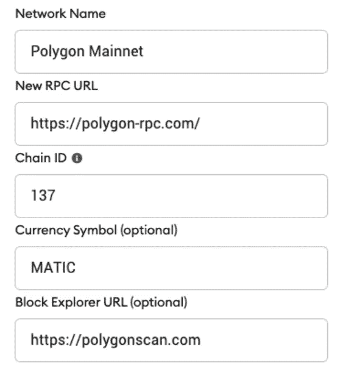
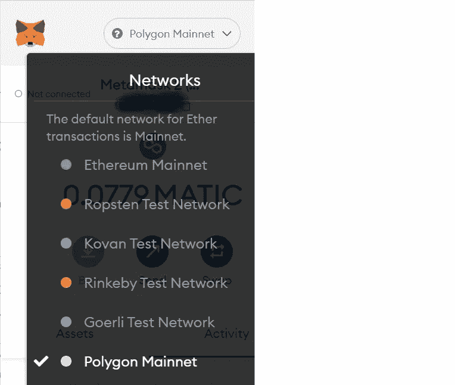

# 新手的定义:超越以太坊

> 原文：<https://medium.com/coinmonks/defi-for-newbies-4-beyond-ethereum-d86f9951bdcc?source=collection_archive---------2----------------------->

我们目前在 DeFi 中看到很多动作。以太坊的高交易成本引发了其他第一层区块链网络的快速发展，如[索拉纳](https://solana.com/)、[雪崩](https://www.avax.network/)或[方顿](https://fantom.foundation/)。以太坊侧链如[多边形](https://polygon.technology/)获得牵引力。以太坊第二层解决方案，如[乐观](https://www.optimism.io/)或[仲裁](https://portal.arbitrum.one/)也在大幅增长。

是时候让 DeFi 用户进入多链未来了…

> 从最终用户的角度来看，**这些链中的大多数感觉与使用以太坊非常相似**——除了**交易通常结算得更快并且非常便宜**(在撰写本文时是 10-1000 倍)。

Foto von [Jessica Bryant](https://www.pexels.com/de-de/@jessica-bryant-592135?utm_content=attributionCopyText&utm_medium=referral&utm_source=pexels) von [Pexels](https://www.pexels.com/de-de/foto/verschiedene-farben-wandfarbe-haus-foto-1370704/?utm_content=attributionCopyText&utm_medium=referral&utm_source=pexels)

这使得这些网络对于第一步和实验非常有吸引力。在大多数情况下，我们可以使用我们在本系列文章的第 [1](/coinmonks/defi-for-newbies-1-wallet-setup-960e0c69d12b) 、 [2](/coinmonks/defi-for-newbies-2-investor-profiles-3ece765fcd3) 和 [3](/coinmonks/defi-for-newbies-3-and-action-6e41c2245dd3) 部分讨论过的**完全相同的钱包设置**。 [Metamask](https://metamask.io/) 钱包可与上述所有链条配合使用——除了 Solana，我们需要使用替代钱包，例如 [Phantom 钱包](https://phantom.app/)。为了简单起见，我们将继续使用经过验证的 Metamask 钱包设置。

但是在我们更深入地使用这些区块链网络之前，让我们简单地看一下它们与以太坊的区别:

## 引擎盖下的差异

> Solana、Avalanche 和 Fantom 等竞争激烈的第 1 层区块链都有自己的安全架构。

因此，虽然它们表面上看起来与以太坊非常相似，但它们

*   带上他们自己的**共识机制**(利害关系证明)，
*   信任他们自己的一套验证器，
*   是由它们自己的本机令牌驱动的。

类似 Polygon(又名 Matic)或 [xDAI](https://www.xdaichain.com/) 的以太坊侧链更接近以太坊。Polygon 甚至宣布计划将许多不同的侧链和易拉宝放在同一个屋檐下。但是现在 Polygon 也是由它们自己的令牌($MATIC)和它们自己的验证器集驱动的。然而，他们认为自己是以太坊生态系统的一部分。

(乐观)**以太坊汇总**像 Arbitrum 和乐观(以及预计将很快普遍上市的 ZK-汇总——见 [Starkware](https://starkware.co/) )甚至更接近以太坊，因为它们直接建立在以太坊之上，并继承了它的安全架构——包括矿工(以太坊 v1)和验证器(以太坊 v2)。他们被称为“以太坊第二层”，定期在以太坊第一层分组和结算他们的第二层交易，并将其作为“基链”。他们也使用$ETH 作为本地令牌。这就是为什么他们被许多以太人视为“DeFi 的未来家园”。

这些易拉罐上的大量 DeFi 流量意味着以太坊的成功。Arbitrum 目前的吸引力是巨大的——我们可以在他们的门户网站上看到[。许多“蓝筹 DeFi 项目”,如 Aave、Curve、Uniswap、Sushiswap 等，都在 Arbitrum 上活跃着。](https://portal.arbitrum.one/)

## 用户的视角

但是，让我们回到用户的角度:在使用这些网络之前，我们需要做两件事:

1.  我们需要配置我们的钱包与这些网络互动。
2.  我们需要连接资产——并购买他们的一些本地令牌，以便用我们的资产做任何有意义的事情。

## 钱包配置

每个网络都为元掩码定义了自己的钱包配置。我们通常可以在他们的文档页面上找到它，比如[多边形](https://docs.polygon.technology/docs/develop/metamask/config-polygon-on-metamask/)的这个页面。模式总是相同的:我们必须定义一个网络名称、一个到达该网络的端点(RPC URL)、一个链 id、它的本地货币以及——为了方便起见——该网络的一个合适的块浏览器的地址:

我们可以在 Metamask 中找到这些设置，方法是单击我们的钱包图标并导航菜单:设置/网络/添加网络。

> 注意:获得正确的参数很重要！骗子可能希望我们输入错误的坐标并攻击我们。因此，我们应该始终小心地从可信的来源(如项目的原始网站)提取这些参数。否则，我们可能会被一个虚假的配置所欺骗，认为我们在链 A 上触发了事务，而实际上在链 b 上执行了操作。

通过 https://chainlist.org/的[向元掩码添加网络的一种**非常便捷的方式就是点击两下。它将以太坊兼容网络的所有配置数据集中在一个地方，并定期更新。同样，我建议事后检查一下你的钱包里到底存了些什么。这是个网站，可能已经被黑了。我们永远不知道。**](https://chainlist.org/)

现在，我们已经设置好，可以轻松地在以太坊和新配置的区块链网络(如 Polygon)之间切换 Metamask 中的网络。这是通过元掩码顶部的小下拉菜单实现的。

## 过渡性资产

现在最复杂的部分是连接我们的资产，例如从以太坊到这些其他链中的一个。桥梁是危险的——因为它们是危险的

1.  新建的
2.  (潜在的)中心故障点

当我们将我们的资产从链 A 连接到链 B 时，我们必须意识到在两个链之间存在通信，这两个链原本可能不是为了相互对话而构建的。我们正在抛弃区块链的安全承诺——至少是暂时的。相反，我们信任两个链之间的消息传递，这两个链试图确保您的令牌很好地到达“另一边”。令牌存在于不同的智能契约中，在不同的链上有不同的地址—因此，它们需要正确映射。有些网桥提供了映射表，这样我们可以仔细检查，哪个地址是“另一边”的正确地址——以太坊 x 多边形映射见[这个例子。](https://mapper.matic.today/)

在许多情况下，明智的做法是桥接众所周知的令牌(如$ETH ),然后使用分散式交易所(DEX ),如 SushiSwap、Uniswap 或目标链上的突出 DEX，将桥接的 ETH 交换为目标货币。对于像 Fantom 这样有自己的本地令牌(在这个例子中是$FTM)的姐妹链，在以太坊上把$ETH 换成$FTM 可能更明智，因为我们无论如何都需要$FTM 来做这个链上的任何事情。一些桥接工具如 https://multichain.xyz/swap 一步就能完成。像 [Zapper](https://zapper.fi/bridge) 这样的 DeFi 工具将桥接集成到它们的 UI 中，使得桥接越来越用户友好。现在有许多不同的桥被建造。他们是年轻的技术，或多或少是分散的。请小心，自己做研究。

## 避开桥梁:菲亚特入职

搭桥是危险的——而且需要交易费。这就是为什么它是一个引人注目的想法，甚至从以太坊第 2 层或它的一个侧链或姊妹链开始——完全省略以太坊第 1 层。

这是可能的:我最喜欢的从菲亚特直接搭载到 Polygon、Solana 或 Fantom 的平台之一是一个名为 [Transak](https://global.transak.com/) 的网关。他们收费很低，在过去的几个月里为我工作得相当好(就我而言，是通过 SEPA 银行转账)。由于 KYC 法案/反洗钱法案的限制，您需要表明自己的身份，但对于任何严肃的菲亚特-crypto 入口来说都是如此。

## 结论

有许多区块链为他们的用户提供有趣的 DeFi 服务。以太坊仍然处于中心位置，并提供有趣的新选项，例如通过其第 2 层汇总。但是像 Polygon 这样的侧链和 Solana 这样的姊妹链显然越来越受欢迎。

这就是为什么许多 DeFi 项目试图创建他们自己的多链版本，并在许多链上提供他们的服务。密切关注所有这些链上的流动性总是一个好主意，如每个链的总锁定价值(TVL)或某些指数的交易池，例如通过 [Coingecko](https://www.coingecko.com/en/dex) 、 [DeFi Llama](https://defillama.com/chains) 或 [Dune analytics](https://dune.xyz/hagaetc/dex-metrics) 。我们仍然处于最开始的阶段。

## 本系列以前的文章:

[新手 DeFi:1)钱包设置](/coinmonks/defi-for-newbies-1-wallet-setup-960e0c69d12b)
[新手 DeFi:2)投资者简介](/coinmonks/defi-for-newbies-2-investor-profiles-3ece765fcd3)
[新手 DeFi:3)行动！](/coinmonks/defi-for-newbies-3-and-action-6e41c2245dd3)

***延伸阅读:*** *你可以在我的博客*[*publish 0x*](https://www.publish0x.com/sgrasmann/?a=46dBBylJd7)*和*[*Medium*](https://sgrasmann.medium.com/)*上找到更多关于区块链和 DeFi 的文章。*

***免责声明:*** *本文无意成为任何形式的投资建议。如果你打算投资本文提到的某个项目，自己做研究并寻求专业支持。*

> 加入 Coinmonks [电报频道](https://t.me/coincodecap)和 [Youtube 频道](https://www.youtube.com/c/coinmonks/videos)了解加密交易和投资

## 另外，阅读

*   [新加坡十大最佳加密交易所](https://blog.coincodecap.com/crypto-exchange-in-singapore) | [收购 AXS](https://blog.coincodecap.com/buy-axs-token)
*   [投资印度的最佳密码](https://blog.coincodecap.com/best-crypto-to-invest-in-india-in-2021)|[WazirX P2P](https://blog.coincodecap.com/wazirx-p2p)|[Hi Dollar Review](https://blog.coincodecap.com/hi-dollar-review)
*   [加拿大最佳加密交易机器人](https://blog.coincodecap.com/5-best-crypto-trading-bots-in-canada) | [库币评论](https://blog.coincodecap.com/kucoin-review)
*   [火币加密交易信号](https://blog.coincodecap.com/huobi-crypto-trading-signals) | [HitBTC 审核](/coinmonks/hitbtc-review-c5143c5d53c2)
*   [如何在 FTX 交易所交易期货](https://blog.coincodecap.com/ftx-futures-trading) | [OKEx vs 币安](https://blog.coincodecap.com/okex-vs-binance)
*   [OKEx vs KuCoin](https://blog.coincodecap.com/okex-kucoin) | [摄氏替代品](https://blog.coincodecap.com/celsius-alternatives) | [如何购买 VeChain](https://blog.coincodecap.com/buy-vechain)
*   [币安期货交易](https://blog.coincodecap.com/binance-futures-trading)|[3 commas vs Mudrex vs eToro](https://blog.coincodecap.com/mudrex-3commas-etoro)
*   [如何购买 Monero](https://blog.coincodecap.com/buy-monero) | [IDEX 评论](https://blog.coincodecap.com/idex-review) | [BitKan 交易机器人](https://blog.coincodecap.com/bitkan-trading-bot)
*   [尤霍德勒 vs 科恩洛 vs 霍德诺特](/coinmonks/youhodler-vs-coinloan-vs-hodlnaut-b1050acde55a) | [Cryptohopper vs 哈斯博特](https://blog.coincodecap.com/cryptohopper-vs-haasbot)
*   [顶级付费加密货币和区块链课程](https://blog.coincodecap.com/blockchain-courses)
*   [MXC 交易所评论](/coinmonks/mxc-exchange-review-3af0ec1cba8c) | [Pionex vs 币安](https://blog.coincodecap.com/pionex-vs-binance) | [Pionex 套利机器人](https://blog.coincodecap.com/pionex-arbitrage-bot)
*   [如何在印度购买比特币？](/coinmonks/buy-bitcoin-in-india-feb50ddfef94) | [WazirX 评论](/coinmonks/wazirx-review-5c811b074f5b)
*   [印度的加密交易所](/coinmonks/bitcoin-exchange-in-india-7f1fe79715c9) | [比特币储蓄账户](/coinmonks/bitcoin-savings-account-e65b13f92451)
*   [币安收费](/coinmonks/binance-fees-8588ec17965) | [僵尸加密审查](/coinmonks/botcrypto-review-2021-build-your-own-trading-bot-coincodecap-6b8332d736c7) | [热点审查](/coinmonks/hotbit-review-cd5bec41dafb)
*   [我的加密副本交易经历](/coinmonks/my-experience-with-crypto-copy-trading-d6feb2ce3ac5) | [AAX 交易所评论](/coinmonks/aax-exchange-review-2021-67c5ea09330c)
*   [逐位融资融券交易](/coinmonks/bybit-margin-trading-e5071676244e) | [币安融资融券交易](/coinmonks/binance-margin-trading-c9eb5e9d2116) | [超位审核](/coinmonks/overbit-review-9446ed4f2188)
*   [有哪些交易信号？](https://blog.coincodecap.com/trading-signal) | [比特斯坦普 vs 比特币基地](https://blog.coincodecap.com/bitstamp-coinbase)