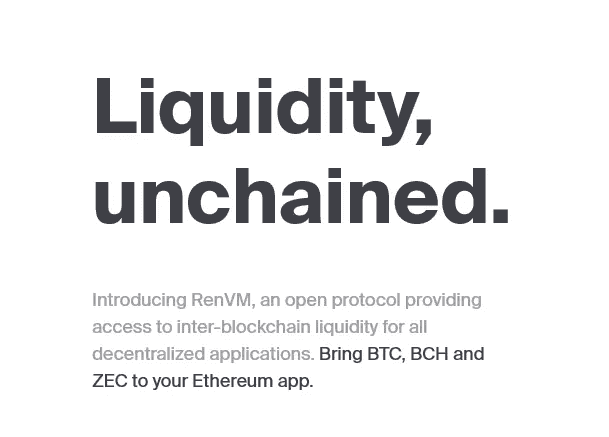

# DeFi & Future:DeFi 世界的 10 个有前途的项目

> 原文：<https://medium.com/coinmonks/defi-future-10-promising-projects-in-the-defi-world-ff2b697ab006?source=collection_archive---------1----------------------->

让我们分析一下 DeFi 领域中一些最有趣的项目，并重点关注加密货币领域正在出现的一些趋势。**以太坊生态系统**，**刚满 5 岁，已经在不同的方向蓬勃发展**，使得几年前在加密货币领域不可想象的项目成为可能。想想 [**稳定币**](https://blog.coincodecap.com/stablecoins-a-simple-overview) **、代币和** [**DeFi**](https://blog.coincodecap.com/the-ultimate-guide-to-defi-decentralized-finance) :在五年的时间里，智能合约的开发平台扩展了区块链的概念，并为开发者提供了创建性能越来越好的应用的可能性。正如我们所知，我们只是在一条想要彻底改变金融基础的道路的开端。让我们找出这个生态系统中最有前途的项目，分析 10 个最有趣的平台和协议:

# **renBTC**

renBTC 是一个平台，通过创建可替换的 ERC20 令牌，在以太坊的基础上对比特币进行令牌化。然后，这些代币可以用于 DeFi 项目，例如使用流动性指数，如 UniSwap。通过 renVM(虚拟机)，用户**可以创建基于实际比特币 1: 1 的 ren BTC**:用户将他的 BTC 发送到一个特定的地址，并作为交换接收一个新铸造的具有相同面值的令牌。通过这种方式，**令牌可以在以太坊生态系统**内使用，一旦完成，只需兑换即可获得您的比特币作为交换(取决于当前的汇率)。这个平台被提议作为更集中的项目(如 WBTC)的替代方案，并且正在成为 DeFi 最有趣的领域之一。其他支持的币还有**比特币现金和 ZCash，让这个项目成为不同区块链之间的桥梁**。

# **抹茶**

匹配分散的交换，使简单和设计成为它的强项。**交易所的流动性来源于多个来源**，如 0x Mesh、Kyber Network、Uniswap:来自交易所平台 Matcha 的聚合流动性每笔交易的价格都是最好的。正如我们所知，虽然 DEX 已经是 DeFi、Matcha 和**不可或缺的一部分，但其平台的简单性有可能带来美好的未来**。

# **Loopring Pay**

Loopring Pay 是以太坊上用于解决加密货币可扩展性问题的**二层平台**。虽然我们没有直接谈论 DeFi，但这个平台将自己定位于支付系统，例如闪电网络(比特币)。 **Loopring Pay 允许您立即免费发送 ETH 和 ERC20 令牌**，在链上保存数据，但在链外使用 ZeroProof-Knowledge 算法进行交易计算以进行确认。这个项目无疑是以太坊可扩展性问题的最佳解决方案之一。
它的优点是安全和性能。该协议每秒可处理多达**2025 次交换，确保与底层以太坊区块链**相同的安全级别。这是通过使用一个名为 zkRollup 的结构和一个名为链上数据可用性或 OCDA 的特性实现的。如果 **OCDA 被禁用**，环路吞吐量上升到**每秒 16，400 次交换**，但是安全性降低到持有该数据的财团的安全性。

# **诉讼**

Lition 是以太坊之上的**第 2 层**区块链基础设施**，支持**dApps**的商业使用。Lition 协议通过**添加隐私、可伸缩性和可删除性等特性**来补充以太坊主链，以符合 GDPR 标准。该平台的主要用例有: **P2P 能源交易平台**，区块链证书和银团贷款。在这里，和 Loopring Pay 一样，我们不是直接谈论 DeFi，而是，准确地说，是关于 DeEn，即分散能源。该平台具有自己的能量交换，用于**对等能量交换，因此无需中介**。通过这种方式，绿色能源的销售成本很低，绿色能源的生产者赚得更多，烦人的中间商也被淘汰。这个项目仍处于早期阶段，但无疑具有巨大的潜力。**

# **mStable**

mStable 是一个专注于稳定硬币的协议，旨在改善流通中各种硬币的碎片化。创造的第一个产品叫 mUSD，是由戴、、、支持的**亚稳定币。这样，通过 mUSD，你就可以和任何一个底层马厩以 1: 1 的比例进行赎回。同样的 mUSD 也可以与 Aave 或 Compound 一起使用，通过佣金和贷款产生回报。此外，还有在 mStable 储蓄合约中保存美元的选项，以及以美元进行零滑点交易的选项。**

# APY。金融

APY。Finance 是一个自动化投资服务平台，允许用户以风险/回报优化的方式获得各种 DeFi 产品的收益。它旨在通过让用户更容易获得高产农业，将更多用户带入 DeFi 领域。如今的高产农业给用户带来了很高的准入门槛、成本和风险。APY。金融解决了这些痛点，为用户提供了一种低成本、无摩擦的方式来汇集他们的流动性，并在一系列策略中进行分配。通过汇集流动资金，该平台将一笔交易中的资金用于最大和最高产量的农业策略，从而为用户节省天然气费用。该平台计划于 10 月发布。

# **强制协议**

force 协议是一种为 DeFi 世界的用户提供**安全、包容、创新和透明的加密金融服务**的协议。因此，该项目是分散融资的额外一揽子计划，旨在为跨平台交易、稳定的硬币发行和链上支付提供解决方案。简而言之，它是一个建立在区块链系统上的分散式金融服务协议，由一组 DeFi 技术组件和令牌化协议组成。

# **平衡器**

平衡是 DeFi 中最有前途的流动性协议之一。【Uniswap 是一家 AMM(自动做市商)，能够支持仅**两个代币**的流动性池，而**平衡器可以使用任意权重达到 8 个代币**。它仍然是一个年轻的项目，但已经进入了价值排名的前十名。在 Balancer 上，**池由智能合约**控制，可以实现任何任意的交易策略或逻辑。互换和**费用是任意的，并根据潜在的波动性进行调整**。你可以**参与多代币池，即使只有一项资产**也可以按照你认为合适的方式管理你的投资组合。

# **NFTfi**

NFTfi 是一个利用 NFT 作为抵押品来获得贷款的市场。这个项目介于 DeFi 和 NFT 之间，允许任何拥有闲置或未使用的数字资产的人将其用作贷款抵押。因为每个借贷平台都有贷方和借方。**借款人可以将任何 ERC-721 代币作为抵押**。其他用户现在可以向你提供贷款，如果贷款被接受，ETH 将从贷款人的账户中支付，NFT 将被锁定在 NFTfi 智能合同中。一旦偿还贷款，资产将归还给第一个所有者。对于**的贷款人来说，**相反，**他们可以浏览他们最喜欢的 NFT** 比如《解放的神》、《分散的土地》、《密码体》、《密码猫》或者任何其他的 NFT **,并提供他们乐意支持的资产的贷款**。

# **乌玛的合成器**

**UMA 的 synts**是一个利用合成资产创建**全球分散金融市场的协议。该协议的第一个产品是一个令牌，它依赖于一个指数而不是 oracle 来跟踪 ETH / BTC 的价格。该平台允许用户**创建他们自己的合成资产**，能够存款或取款，兑换代币，并轻松跟踪已经发布的 synths 上的信息。**

# 

InfiNFT 是一个**NFT 代币的铸造平台，其数据保存在链上，因此更加安全、可验证和透明**。此外，该解决方案与 DeFi 没有直接联系，旨在使不可替换令牌的使用更加主流化，并简化其操作和维护。

你认为以太坊和 DeFi 景观中最好的项目有哪些？

有没有你想深化的项目？请在评论中告诉我！

关注我在加密和区块链领域的其他文章！

## 另外，阅读

*   最好的[密码交易机器人](/coinmonks/crypto-trading-bot-c2ffce8acb2a)
*   [密码本交易平台](/coinmonks/top-10-crypto-copy-trading-platforms-for-beginners-d0c37c7d698c)
*   最好的[加密税务软件](/coinmonks/best-crypto-tax-tool-for-my-money-72d4b430816b)
*   [最佳加密交易平台](/coinmonks/the-best-crypto-trading-platforms-in-2020-the-definitive-guide-updated-c72f8b874555)
*   最佳[加密贷款平台](/coinmonks/top-5-crypto-lending-platforms-in-2020-that-you-need-to-know-a1b675cec3fa)
*   [最佳区块链分析工具](https://bitquery.io/blog/best-blockchain-analysis-tools-and-software)
*   [加密套利](/coinmonks/crypto-arbitrage-guide-how-to-make-money-as-a-beginner-62bfe5c868f6)指南:新手如何赚钱
*   最佳[加密制图工具](/coinmonks/what-are-the-best-charting-platforms-for-cryptocurrency-trading-85aade584d80)
*   [莱杰 vs 特雷佐](/coinmonks/ledger-vs-trezor-best-hardware-wallet-to-secure-cryptocurrency-22c7a3fd391e)
*   了解比特币的[最佳书籍有哪些？](/coinmonks/what-are-the-best-books-to-learn-bitcoin-409aeb9aff4b)
*   [3 商业评论](/coinmonks/3commas-review-an-excellent-crypto-trading-bot-2020-1313a58bec92)
*   [AAX 交易所评论](/coinmonks/aax-exchange-review-2021-67c5ea09330c) |推荐代码、交易费用、利弊
*   [Deribit 审查](/coinmonks/deribit-review-options-fees-apis-and-testnet-2ca16c4bbdb2) |选项、费用、API 和 Testnet
*   [FTX 密码交易所评论](/coinmonks/ftx-crypto-exchange-review-53664ac1198f)
*   [n 零审核](/coinmonks/ngrave-zero-review-c465cf8307fc)
*   [Bybit 交换审查](/coinmonks/bybit-exchange-review-dbd570019b71)
*   3Commas vs Cryptohopper
*   最好的比特币[硬件钱包](/coinmonks/the-best-cryptocurrency-hardware-wallets-of-2020-e28b1c124069?source=friends_link&sk=324dd9ff8556ab578d71e7ad7658ad7c)
*   最佳 [monero 钱包](https://blog.coincodecap.com/best-monero-wallets)
*   [莱杰纳米 s vs x](https://blog.coincodecap.com/ledger-nano-s-vs-x)
*   [bits gap vs 3 commas vs quad ency](https://blog.coincodecap.com/bitsgap-3commas-quadency)
*   [莱杰 Nano S vs 特雷佐 one vs 特雷佐 T vs 莱杰 Nano X](https://blog.coincodecap.com/ledger-nano-s-vs-trezor-one-ledger-nano-x-trezor-t)
*   [block fi vs Celsius](/coinmonks/blockfi-vs-celsius-vs-hodlnaut-8a1cc8c26630)vs Hodlnaut
*   Bitsgap 评论——一个轻松赚钱的加密交易机器人
*   为专业人士设计的加密交易机器人
*   [PrimeXBT 审查](/coinmonks/primexbt-review-88e0815be858) |杠杆交易、费用和交易
*   [埃利帕尔泰坦评论](/coinmonks/ellipal-titan-review-85e9071dd029)
*   [赛克斯石评论](https://blog.coincodecap.com/secux-stone-hardware-wallet-review)
*   [BlockFi 评论](/coinmonks/blockfi-review-53096053c097) |从您的密码中赚取高达 8.6%的利息