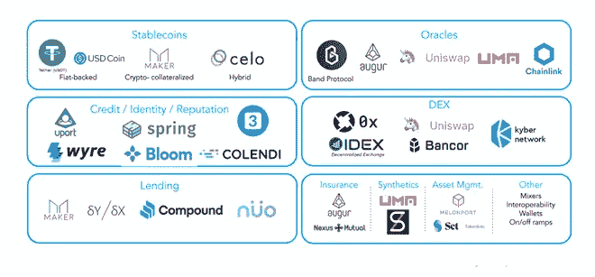
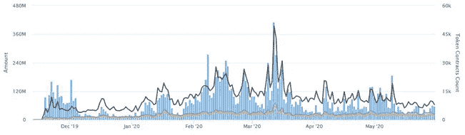

# DeFi-您的财务正在发生怎样的变化

> 原文：<https://medium.com/coinmonks/defi-how-your-finance-is-changing-d4ff642cfd55?source=collection_archive---------0----------------------->

近十年来，金融界发生了一些重大变化。加密货币的世界旨在让所有人都可以获得金融服务，而无需任何中间人的干预。听起来雄心勃勃，但由于一场被称为“去中心化金融”的革命，它已经成为现实。

Blockchain Whitepaper

2008 年，一个名叫中本聪的神秘人闯入金融界，当时金融界是一头受伤的狮子，手里拿着一份名为比特币的白皮书。由于比特币的身份神秘，身穿黑色西装的金融界巨头也同样难以认出它。对于当时的华尔街之狼来说，这只是一个新的雄心勃勃的计划，几年后就会被遗忘。比特币在某种程度上为人们认识到区块链技术的潜力奠定了基础，区块链技术在 90 年代首次被引入世界，但仍远未被全球接受。

以太坊是另一个垫脚石。由 17 岁的俄罗斯少年 Vitalik Butorin 开发，他启动这个项目的目的是以区块链网络的形式制造世界上最大的超级计算机。这个孩子一点也不知道他的项目有一天会成为第三次互联网革命或 WEB 3.0 的垫脚石。对于许多人来说，这只是一个高中项目，但今天以太坊已经让硅谷的巨头们将他们的资源投入到区块链技术中。以太坊引领了区块链科技领域无数的创新和创业，其中大部分都试图改变金融领域。

 [## 首页| Ethereum.org

### 以太坊是一个全球性的、分散的资金和新型应用平台。在以太坊上，你可以写代码…

ethereum.org](https://ethereum.org/) 

分散金融(DeFi)或开放金融运动承诺加密货币将使开放的事情更进一步。想象一下，一个全球性的、开放的金融服务替代了你今天使用的金融服务——储蓄、贷款、交易、保险等等——世界上任何一个拥有智能手机和互联网连接的人都可以使用。在历史上的大部分时间里，金融界是一个吸收新技术缓慢的行业。但在以太坊推出后，金融业成了创新的新温床。

这在智能合约区块链上是可能的。以太坊“智能合约”是在区块链上运行的程序，在满足特定条件时可以自动执行。这些智能合约使开发人员能够构建远比简单地发送和接收加密货币更复杂的功能。这些程序已经成为实现自动化的新方法。从自动支付到出售代币作为工资，智能合约为金融的所有领域都增加了新的功能。

这些程序就是我们现在所说的分散式应用程序或 dapps。人们可以认为 Dapp 是一个基于分散技术的应用，而不是由一个单一、集中的实体或公司构建和控制的。Dapps 的基本原则是它们是分散的，不受单一实体控制，这导致了它在金融科技行业的广泛使用。
DeFi 现在是区块链中发展最快的部门之一。行业观察人士用一个独特的新指标来衡量牵引力——“ETH locked in DeFi”，它大致给出了当前在各种 DeFi 项目中使用的资金量。截至撰写本文时，据估计，用户已经向这些智能合同中存入了价值超过 9.42 亿美元的加密货币。

Trends of ETH locked in DeFi in current year

这些 DeFi 业务如此成功的原因在于，在它们的核心，这些业务的运营**不是由一个机构**及其员工管理的——相反，规则是用代码(或智能合同，如上所述)编写的。一旦智能合同部署到区块链，DeFi dapps 可以在很少或没有人工干预的情况下自行运行(尽管实际上开发人员经常通过升级或错误修复来维护 dapp)。

Defi 见证了金融系统各个领域的多项创新。Defi 市场中一些最常见的用途是-

**借贷:**在公共区块链上借贷，与传统平台相比，摩擦要小得多。

**衍生产品/资产:**合成资产是其他资产的衍生产品，允许在没有实际资产的情况下进行投资。

**分散交易所:**交易者可以在不持有其资金托管的平台上交易

**支付解决方案:**传统的集中支付解决方案可以分散使用，在不受审查的情况下同样有效。

# DeFi 与 Fintech

乍一看，DeFi 听起来可能类似于“金融技术”，或简称为 Fintech，其目的也是利用技术来改善金融服务。然而，DeFi 和 Fintech 之间的关键区别在于，Fintech 只是建立在传统的金融基础设施上，而不是使用像区块链技术这样的新技术。DeFi 旨在以分布式区块链技术的形式将技术引入金融领域。

一个受欢迎的金融科技服务的例子是国际支付服务 Transferwise。尽管 Transferwise 收取的费用低于大多数银行和货币兑换公司，但它仍使用银行账户和其他传统金融基础设施。Transferwise 的不同之处在于，它不是通过其他中间人(如银行)跨境转移资金，而是在不同的国家拥有银行账户。
例如，当您向欧盟的某人发送美元时，Transferwise 会提取您的美元，然后从其欧盟银行账户中取钱给收款人。这使得他们可以收取更低的费用，更快地处理交易。
然而，你仍然必须信任 Transferwise 来批准和清算交易。此外，你还必须获得许可才能将钱汇往国外。在大多数情况下，您需要提供身份证明文件，如果收款人位于黑名单上的国家，您可能无法向其汇款。

现在与 DeFi 产品相对应的是 Dai，这是一个基于以太坊的项目，旨在反映美元的价值，以防止加密货币的波动。
有了戴，您不必再依赖金融科技公司或银行来批准和结算您的交易。相反，以太坊矿商验证新的基于以太坊的交易，包括戴的交易，并将其添加到区块链。

更不用说你可以把戴送给任何一个钱包支持戴的人，即使他们生活在与传统金融体系隔绝的国家。

通过这种方式，我们可以看到区块链的基本特征是如何使其脱颖而出的，这也是 DeFi 成功超越其他传统金融科技同行的原因。

使用 DeFi 产品要方便得多，因为任何有区块链钱包的人都可以参与这些产品的各种交易。

当人们在没有第三方参与的情况下自己做一些事情时，他们总是感觉很舒服。与其他金融科技同行相比，这一点加上人们可以轻松使用 DeFi 平台，使 DeFi 业务成为热门。

*Graph- Daily transaction of Dai coin in the last year.*

# 与 DeFi 相关的挑战

每一个高回报的金融产品都伴随着风险。因此，可以肯定的是，还会有一系列与 DeFi 相关的挑战。

理解和安全处理加密货币工具需要专业知识和相关风险。用户有责任保管好自己的密钥，并在最大限度保护隐私的情况下遵循多因素身份认证流程。

此外，发生了太多与安全相关的事件，导致一家健全的区块链开发公司引入了严格的安全和隐私算法进行干预。虽然解决方案的创造者已经控制了这项任务，但作为 DeFi 的用户，你也必须随时了解不同钱包、交易所和其他区块链项目之间的服务条款变化。

最后，就传统货币而言，投资者在做出任何投资决定之前，都有基准和历史数据可供参考。然而，DeFi 用户却没有同样的特权。缺乏历史数据使得他们很难评估相关的风险。这反过来又使他们有必要自己进行广泛的研究。

即使在所有这些挑战之后，DeFi 系统仍然是最有前途和革命性的市场之一。

# DeFi 的未来

DeFi 是一个从一开始就存在的行业的最新数字产品。在未来的时间里，我们将看到我们今天在菲亚特计划下使用的每一项金融服务在 DeFi 和开放金融生态系统中得到重建。

第一代类型的 DeFi 应用程序主要依赖于使用抵押品作为保护机制，这意味着，你必须拥有加密货币，然后提供它作为借入更多加密货币的抵押品。

由于 DeFi 应用程序的最新迭代，我们也已经看到保险领域正在发生大规模创新。今天的许多 DeFi 贷款都是超额抵押的——这些贷款本质上是安全的，因为储备中有大量的资产缓冲。

在未来，我们还可以期待加密货币钱包成为所有数字资产活动的门户。你可以把它想象成一个仪表板，不仅显示你拥有的资产，还显示有多少资产被锁定在不同的开放金融协议上，如资金池、贷款和保险合同。

我们还看到治理和决策权力下放的趋势。今天，尽管在 DeFi 中关注的是“分散”一词，但这些项目为 DeFi 平台开发解决方案提供商提供了关闭 dapps 的万能钥匙，以便于升级或保护错误代码的实例。然而，DeFi 社区正在寻找使利益相关者能够对决策进行投票的方法，引入更广泛的 DeFi 用例。

事实上，DeFi 的未来和金钱的未来掌握在任何会编码的人手里，这一点对我们来说很有趣。

# 结论

曾经被认为是技术的活靶子，金融在某种程度上引领着向 web 3.0 的过渡
就像人类看到的每一次变革一样，区块链也有其健康的批评部分。从手工织布机工人抗议动力织布机到华尔街之狼称 DeFi 为雄心勃勃的高中项目，工业变革从来都不容易。但是没人能否认的是 DeFi 业务上升到顶端的受欢迎程度。
从成为毒贩在黑市交易的货币到引领世界金融，区块链走过了漫长的道路。

> 加入 Coinmonks [电报集团](https://t.me/joinchat/EPmjKpNYwRMsBI4p)，了解加密交易和投资

## 另外，阅读

*   什么是[闪贷](https://blog.coincodecap.com/what-are-flash-loans-on-ethereum)？
*   最好的[密码交易机器人](/coinmonks/crypto-trading-bot-c2ffce8acb2a)
*   [3 商业评论](/coinmonks/3commas-review-an-excellent-crypto-trading-bot-2020-1313a58bec92) | [Pionex 评论](/coinmonks/pionex-review-exchange-with-crypto-trading-bot-1e459d0191ea) | [Coinrule 评论](https://blog.coincodecap.com/coinrule-review-a-perfect-trading-bot)
*   [AAX 交易所评论](/coinmonks/aax-exchange-review-2021-67c5ea09330c) | [德里比特评论](/coinmonks/deribit-review-options-fees-apis-and-testnet-2ca16c4bbdb2) | [FTX 密码交易所评论](/coinmonks/ftx-crypto-exchange-review-53664ac1198f)
*   [零审核](/coinmonks/ngrave-zero-review-c465cf8307fc)
*   [Bybit Exchange 审查](/coinmonks/bybit-exchange-review-dbd570019b71) | [Bityard 审查](https://blog.coincodecap.com/bityard-reivew)
*   [3Commas vs Cryptohopper](/coinmonks/3commas-vs-pionex-vs-cryptohopper-best-crypto-bot-6a98d2baa203)
*   最好的比特币[硬件钱包](/coinmonks/the-best-cryptocurrency-hardware-wallets-of-2020-e28b1c124069?source=friends_link&sk=324dd9ff8556ab578d71e7ad7658ad7c)
*   [总账 vs 平均](https://blog.coincodecap.com/ngrave-vs-ledger)
*   [密码本交易平台](/coinmonks/top-10-crypto-copy-trading-platforms-for-beginners-d0c37c7d698c)
*   [莱杰 nano s vs x](https://blog.coincodecap.com/ledger-nano-s-vs-x)
*   [沃德评论](https://blog.coincodecap.com/vauld-review) | [尤霍德勒评论](/coinmonks/youhodler-4-easy-ways-to-make-money-98969b9689f2)
*   最好的[加密税务软件](/coinmonks/best-crypto-tax-tool-for-my-money-72d4b430816b) | [硬币追踪评论](/coinmonks/cointracking-review-a-reliable-cryptocurrency-tax-software-5114e3eb5737)
*   最佳[加密贷款平台](/coinmonks/top-5-crypto-lending-platforms-in-2020-that-you-need-to-know-a1b675cec3fa)
*   [莱杰 Nano S vs 特雷佐 one vs 特雷佐 T vs 莱杰 Nano X](https://blog.coincodecap.com/ledger-nano-s-vs-trezor-one-ledger-nano-x-trezor-t)
*   [block fi vs Celsius](/coinmonks/blockfi-vs-celsius-vs-hodlnaut-8a1cc8c26630)vs Hodlnaut
*   [Bitsgap 审查](/coinmonks/bitsgap-review-a-crypto-trading-bot-that-makes-easy-money-a5d88a336df2) | [Quadency 审查](/coinmonks/quadency-review-a-crypto-trading-automation-platform-3068eaa374e1)
*   [埃利帕尔泰坦评论](/coinmonks/ellipal-titan-review-85e9071dd029) | [赛克斯斯通评论](https://blog.coincodecap.com/secux-stone-hardware-wallet-review)
*   [BlockFi 评论](/coinmonks/blockfi-review-53096053c097) |在您的密码中赚取高达 8.6%的利息
*   [DEX Explorer](https://explorer.bitquery.io/ethereum/dex) 和[区块链 API](https://explorer.bitquery.io/graphql)
*   [加密套利](/coinmonks/crypto-arbitrage-guide-how-to-make-money-as-a-beginner-62bfe5c868f6)指南:新手如何赚钱
*   最佳[加密制图工具](/coinmonks/what-are-the-best-charting-platforms-for-cryptocurrency-trading-85aade584d80)
*   了解比特币最好的[书籍有哪些？](/coinmonks/what-are-the-best-books-to-learn-bitcoin-409aeb9aff4b)

> [直接在您的收件箱中获得最佳软件交易](/coinmonks/newsletters/coinmonks)

