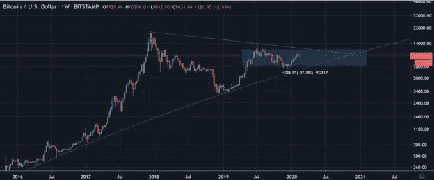
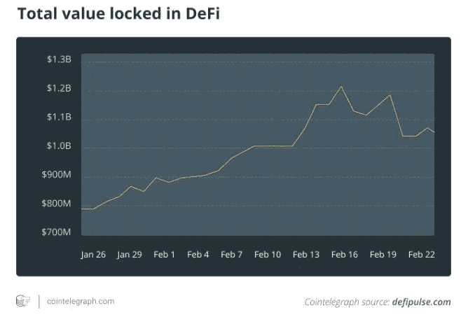
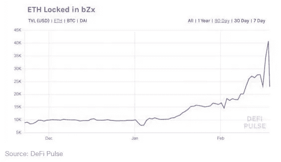
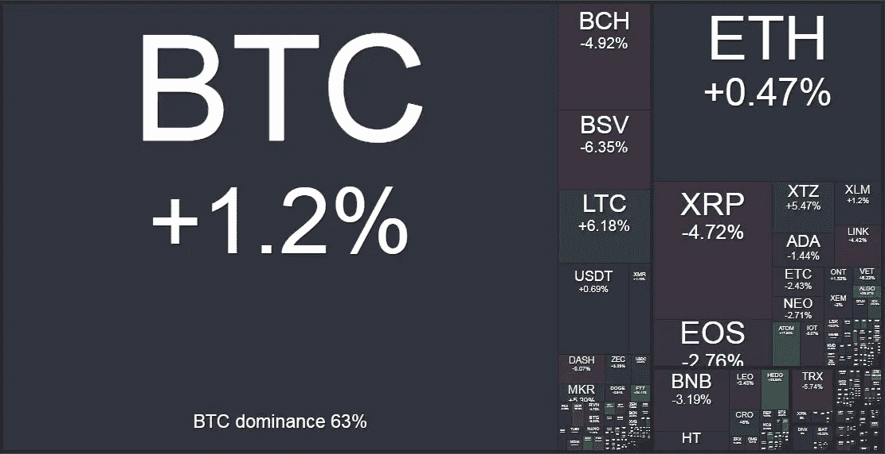

# DeFi 受到攻击

> 原文：<https://medium.com/coinmonks/defi-is-attacked-4830d6dfa2db?source=collection_archive---------5----------------------->

## **本周在 Crypto**

杠杆多头在过去一周遭受了打击，周三比特币在一小时内下跌了近 1000 美元，从 10200 美元的日高跌至不到 9300 美元。似乎没有什么重大消息引发抛售，只是过度杠杆化的弱手出现了一次不错的老式同花。由于市场表现出强烈的正相关性，所有主要硬币都遭受了类似的下跌，这是短期剧烈波动中的典型现象。

随着我们进入本周，价格继续在 9500 至 10000 英镑之间波动，今天早上几次试图打破 5 位数的神奇数字的尝试再次失败。我们目前仍保持谨慎的乐观态度，但在大幅走高至 Halvening 之前，我们不会对再次测试 9200 点感到惊讶，现在距离 halve ning 只有 77 天了。

展望未来，我们现在正进入这个长期三角结构的商业末端——如下。我们预计市场将重新测试这一模式的顶部，导致交易者试图抢在消息前面。阻力位大约在 12，700-13，000 之间，看看市场参与者如何积极参与这一事件会很有趣。

然而，在接下来的几个月里，我们确实预计波动会加剧，尤其是如果我们有意义地走向上行的话。期权市场目前偏向上行，价外看涨期权的交易价格高于价内看跌期权。在我们看来，如果我们突破 12，700-13，000 点的阻力，这种偏斜仍然不够，没有充分反映市场的凸性潜力。交易者玩这一主题的一种方法是通过购买价外看涨期权(例如，6 月 16，000 份看涨期权)，通过出售价外看跌期权(例如，6 月 6，000 份看跌期权)获得资金，或者对于更老练的从业者，可以通过出售看涨期权比率(6 月 10，000-16，000 份 1x3)实现对上涨凸性的看法，并动态地对头寸进行 delta 对冲，从而对市场方向保持相对中性的看法，同时在我们出现非常大的波动时捕捉上涨凸性。我们的交易平台可以为那些有兴趣建立头寸的人提供更多的想法和解决方案。

**德菲受到攻击**

正如我们几周前首次强调的那样，以太坊的去中心化金融( [DeFi](https://blog.coincodecap.com/tag/defi/) )生态系统中锁定的美元总价值最近超过了 10 亿美元，凸显了这一以太坊“杀手级应用”无可置疑的发展势头。随着社区团结起来支持 [DeFi](https://blog.coincodecap.com/tag/defi/) 用例，[许多有趣的项目继续被构建，](https://defiprime.com/?utm_campaign=Structured%20Products%201&utm_source=hs_email&utm_medium=email&_hsenc=p2ANqtz-_d9PIZbdPGaQH15P2htKC6qlVkEyMUe0Ru4ANBhlSKGfFDMBW5krO0pgYBI_CW0IKjxXIx)其中许多现在被部署在主网上。

目前， [DeFi](https://blog.coincodecap.com/tag/defi/) 应用程序的主要用户通常是精通加密的早期采用者，他们了解这是一项蕴含高风险的新生技术，并且通常乐于使用自己的资金在这一新技术堆栈上进行试验。上周，我们看到分散式贷款和衍生品交易平台 [bZx network](https://bzx.network/?utm_campaign=Structured%20Products%201&utm_source=hs_email&utm_medium=email&_hsenc=p2ANqtz-_d9PIZbdPGaQH15P2htKC6qlVkEyMUe0Ru4ANBhlSKGfFDMBW5krO0pgYBI_CW0IKjxXIx) 受到了有趣的“攻击”,这值得进一步讨论。

在 DeFi 应用中，bZx 是第六大协议，大约有[2500 万美元的资金被锁定](https://defipulse.com/?utm_campaign=Structured%20Products%201&utm_source=hs_email&utm_medium=email&_hsenc=p2ANqtz-_d9PIZbdPGaQH15P2htKC6qlVkEyMUe0Ru4ANBhlSKGfFDMBW5krO0pgYBI_CW0IKjxXIx)，凸显出这个市场仍然相对较小。随着资产的增长和潜在回报的扩大，我们可能会看到更多的人试图利用这个系统。

发生了什么事？

攻击者使用了一种叫做闪贷的产品来利用 bZx 的设计弱点。这些快速贷款允许借款人(多数情况下是交易员)获得无抵押资本，以提高他们的交易头寸。只要在同一笔交易中同时偿还，借款人就可以获得零抵押贷款。如果没有偿还，交易就不会进行。这是因为这一切都是在一个封闭的系统(以太坊)中自动发生的。智能合同可以完全依赖于它正在查看的数据，以了解如果贷款发放，那么它可以立即从其他地方偿还。

在 bZx 漏洞利用的案例中，攻击者利用了 bZx 合约仅依赖一个定价来源来计算市场价值、抵押品水平和清算价格的事实——在本例中是 Kyber Uniswap，这是一个源于[以太坊](https://blog.coincodecap.com/tag/ethereum/)的分散式交易所(DEX)。他们还发现，控制价格馈送的代码没有任何冗余措施来在定价变得不规则或错误时停止交易。因此，攻击者能够执行快速贷款，同时还操纵 Kyber Uniswap 的市场价格(通过一系列杠杆卖空交易),以便在偿还贷款时实现大量“利润”,因为 Kyber Uniswap 的价格与市场上其他地方的公平价格相差很大。在这里可以找到[对所发生事情的详细分析。](https://bzx.network/blog/postmortem-ethdenver?utm_campaign=Structured%20Products%201&utm_source=hs_email&utm_medium=email&_hsenc=p2ANqtz-_d9PIZbdPGaQH15P2htKC6qlVkEyMUe0Ru4ANBhlSKGfFDMBW5krO0pgYBI_CW0IKjxXIx)

这一策略为攻击者净赚了 35 万美元。

不久之后，第二次攻击接踵而至，这次使用的是合成美元(sUSD)——一种应该正好代表 1 美元的合成美元。攻击者再次利用 bZx 提供的快速贷款的定价机制，这一次通过一系列原子交易操纵 Kyber Uniswap 上 sUSD 的价格，例如 1 sUSD 暂时估价为 2.50 美元，这使攻击者能够获得比 sUSD 正确价值 1.00 更大的贷款。最终，攻击者带走了价值近 65 万美元的 ETH，而 bZx 则留下了大量抵押不足的贷款。

显而易见的是，随着 DeFi 变得越来越受欢迎，DeFi 服务和产品开始找到合适的市场，锁定在系统内的不断增加的价值将成为对攻击者极具吸引力的奖励。开发人员的任务是分析其产品的攻击面，并确保定价、清算和抵押机制免受威胁。如果有任何弱点，那么你可以放心，一些聪明的市场参与者会发现它，并利用它为自己谋利。

关于这次攻击是“黑客攻击”还是一次巧妙的套利交易，已经有了很多讨论。大多数评论者认为它应该属于前一类，bZx 的首席执行官 Kyle Kistner 说，“这是一种攻击，因为它以非设计的方式使用我们的代码，产生了意想不到的结果，给第三方带来了责任。”然而，我们对此有不同的看法…..

在我们看来，货币、合约和衍生品要想成功并变得有用，就必须进行适当的设计。如果一份合同有可以被利用的弱点，那么它*就会*被利用，事实上它*应该*被利用——这就是自由市场应该如何运作。攻击者没有责任确定什么*是*一个“意外的结果”,什么*不是*一个，而是由公司和开发人员(以及用户)来确保合同按“预期”执行，如果不执行，责任就在他们身上。如果我们真的希望 DeFi 改变金融系统，那么我们不能只是假设每个人都会“诚实地”行动(不管这意味着什么)，事实上，发展分散化系统的最初原因是消除作为交易障碍的信任——如果我们要求每个人诚实地行动并相互信任，那么我们哪里也去不了。我觉得有点讽刺的是，DeFi 行业的一些最大支持者都急于指责“黑客”利用了贷款合同中的一个弱点，而事实上，我们所有参与者都有责任建立更强大的、抗脆弱的合同，这些合同可以经受住时间的考验，并经得起多次破坏——这是实现真正规模的唯一途径。

Crypto weekly performance: 24th February 2020\. Source [www.bitgur.com](http://www.bitgur.com)

点击 [www.kenetic.capital](http://www.kenetic.capital/) 订阅我们的每周简讯

> [直接在您的收件箱中获得最佳软件交易](https://coincodecap.com/?utm_source=coinmonks)

