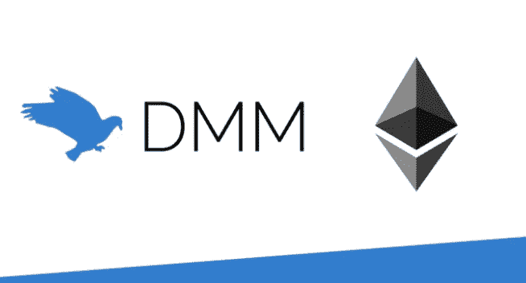
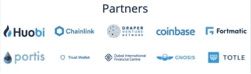
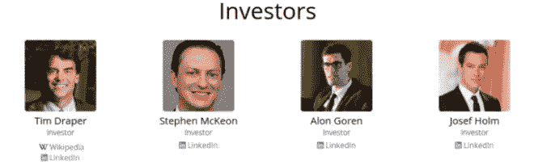
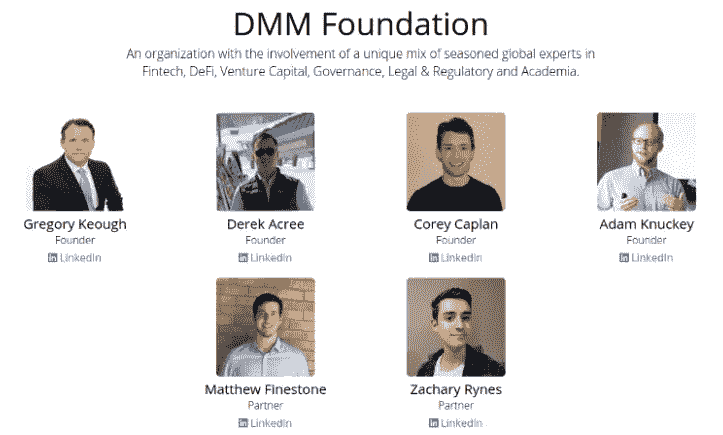
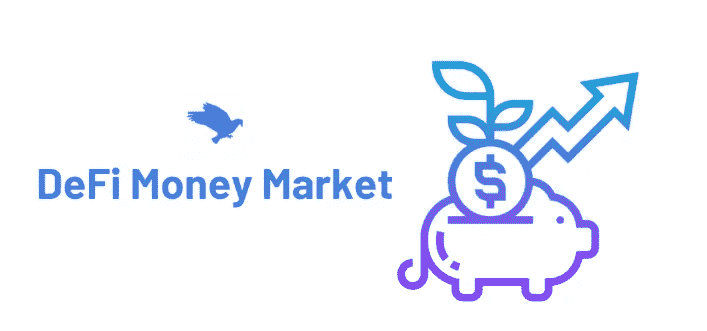

# DeFi 货币市场生态系统

> 原文：<https://medium.com/coinmonks/defi-money-market-ecosystem-e64110d0f478?source=collection_archive---------3----------------------->

## ***赚取由链上现实世界资产支持的数字资产的利息。***

*   [电报](https://t.me/DmmOfficial) — [推特](https://twitter.com/DMMDAO) — [不和](https://discord.gg/YGZEbA)

## **概述**

就像道路需要红绿灯，现代国家没有法治就无法运转一样，投资的每一个重要方面都需要安全和潜在利润。

DeFi 货币市场生态系统(DMME)引入了一种新颖的、技术驱动的方式来实现投资的安全性和利润。通过将 DMG 令牌作为 DDM 生态系统价值的媒介，DMME 使人们有可能获得由现实世界资产支持的数字资产的利益。这是一种区块链担保的投资方式，适用于法定货币不是投资的好选择的情况。DMME 将以太坊数字资产与 DMM 包装相结合，可以获得 6.25%的持续年利率。

虽然现实世界的资产提供了安全和稳定的投资，但将这种资产与不太可预测的加密资产结合起来可能会带来更高的收益。目前已确立的投资方式很少能显著盈利，在大多数情况下，投资者只能获得略高于通货膨胀率的利润。

另一方面，在 DMME 的情况下，加密货币的利息是由现实世界资产的利息保障的。这些利率通常高于 6.25%，因此投资者有可能提供 6.25%的利息。所有当前的数字多用表数据也可以使用区块链[数字多用表浏览器](https://explorer.defimoneymarket.com/)进行验证。

根据 DDM 白皮书和相关研究，目前估计有 90.4 万亿美元的资金存在没有任何利息的账户中，这意味着这些钱正在贬值。作为现实世界资产和低市值加密货币的混合产品，DDM 为这些资金投资于未来十年可能快速增长的领域提供了机会。

已经购买了 DMM 股份的投资者包括 [**蒂姆西·库克·德雷柏**](https://en.wikipedia.org/wiki/Tim_Draper) **，**一位美国[风险投资](https://en.wikipedia.org/wiki/Venture_capital)投资人和企业创始人，以及其他成功的投资者，如斯蒂芬·麦肯诺、阿隆·戈伦和约瑟夫·霍尔姆。

> “许多加密和传统投资者正在寻找稳定、安全、被动的收入。Gregory Keough 和 DMM 基金会的团队利用区块链让用户获得被动收入。
> 
> - [蒂姆·德雷珀](https://cointelegraph.com/news/billionaire-tim-draper-sees-potential-in-defi-and-backs-new-dao)

DMME 团队与成功的区块链项目 [Chainlink](http://crypto.marketswiki.com/index.php?title=Chainlink_(LINK)) 合作，为 DMM 智能合约提供可靠的防篡改输入和输出。Chainlink 的区块链 oracles 分散网络提供了与智能合约相同的安全保证，消除了任何单点故障，并保持了 DMM 智能合约的整体价值，以确保系统高度安全、可靠和值得信赖。

甲骨文提供了必要的数据，如关于基础资产和定价的数据，但也通过编写详细描述生态系统健康和抵押的基本数据，为生态系统增加了一层额外的安全和信任。

对于 Chainlink 的功能来说，oracles 获取 DMM 手头的链外数据，并使这些数据可验证、可信任并可供每个人查看。

## **其他有趣的事实**

*   DMME 首次分散交易所发行(IDO)在两天内售罄，令牌评估范围从售价 36c 开始，分为 30 个 83 333 DMG 的区块，每个区块价格上涨 1.5%，收于 55c。
*   DMME 已经与比特币基地和霍比交易所建立了伙伴关系。此外，有可能在不久的将来在 Gemini Centralised exchange 上市。
*   如果代币变得有利可图，DMG 代币持有者将获得额外奖励

## **路线图**

DMME 的技术路线图侧重于以下主要发展。

1.增加对更多真实资产类别的支持，这可以进一步支持系统，并为令牌持有者提供收益。

2.添加更多工具，进一步提高透明度，随着更多人加入(并留在)生态系统中，增加信任。

3.集成和 API 将允许现有工具挂钩到 DMME，这将授予项目更多的用户和曝光。

4.随着生态系统的成熟，改进资金管理职能，使其更加高效和透明。

5.DMM DAO 的实现，它可以管理协议、资助开发、添加资产和接收奖励。

## **DMG 令牌**

*   DMM *治理* ( *DMG* )
*   循环供应量:**33**18】百万
*   总供应量:**2.5 亿**
*   当前价格:**~ 1.3–1.6 美元/** 市值:~**2500 万** MC

## **结论**

DMM 是一种在基于加密的存款中赚取稳定利息的协议。这里的目标是提供收益率良好的利息(许多乘数高于传统世界中典型的货币市场基金或储蓄账户)，其利率至少在 12-18 个月内不会变化，使个人能够对其财务前景做出高度确定的预测。他们想要解决的最大挑战是提供更大的金融包容性和资本获取的民主化。

这个项目 2017 年基于加密货币的问题是:这解决了一些问题吗？在这里，我需要说是，因为它提供了一种挑战当前银行储蓄体系的投资产品。2018 年，问题会是:“这是不是有一个好的团队和投资者做后盾。”再说一次，我不得不说是的，因为这个团队能够实现目标，而且知名的成功投资者也有兴趣。最后，与已经存在并成功运营的加密货币项目的合作伙伴签署了这份声明。2019 年，问题将是:“采用区块链和加密怎么样？”。这使得几乎没有区块链科技和加密货币背景的用户可以使用金融工具进行投资，并有效地产生货币收入。所以是的，第三次了。

**关于链环**

Chainlink 的既定目标是解决智能合约可能出现的连接性和互操作性问题。为此，他们打算创建区块链“中间件”，或设计用于与外部软件连接的软件。Chainlink 旨在使用该技术，使银行和零售支付系统、市场数据 API、后端系统、非 Chainlink 区块链和其他软件 API 更容易连接到智能合约和区块链网络。

Chainlink 为任何区块链提供智能合约的输入和输出，包括合约甲骨文。Oracles 是智能合约运行所必需的，它提供了从合约之外的来源输入到智能合约的真实世界数据。

## **继续阅读**

*   [**DMM DAO 治理仪表板和新生态系统更新**](/dmm-dao/dmm-dao-governance-dashboard-and-new-ecosystem-updates-dfc041dccd9)
*   [**DeFi 货币市场(DMM)基金会:常见问题解答**](/dmm-dao/defi-money-market-dmm-foundation-faq-c274d682e3f)
*   [**DMM 白皮书**](https://defimoneymarket.com/DMM-Ecosystem.pdf)
*   [什么是 DeFi](https://defipulse.com/blog/what-is-defi/)
*   [**【去中心化自治组织(道)**](/dmm-dao/the-basics-of-a-decentralized-autonomous-organization-dao-23ac71b357d0)
*   **评** [**DeFi 货币市场**](https://blog.coincodecap.com/a-review-of-defi-money-market-project-dmm) **项目(DMM)**

> [直接在您的收件箱中获得最佳软件交易](https://coincodecap.com?utm_source=coinmonks)

