# 定义数据和可视化资源

> 原文：<https://medium.com/coinmonks/defi-resources-and-data-visualization-9aff00842cdc?source=collection_archive---------1----------------------->

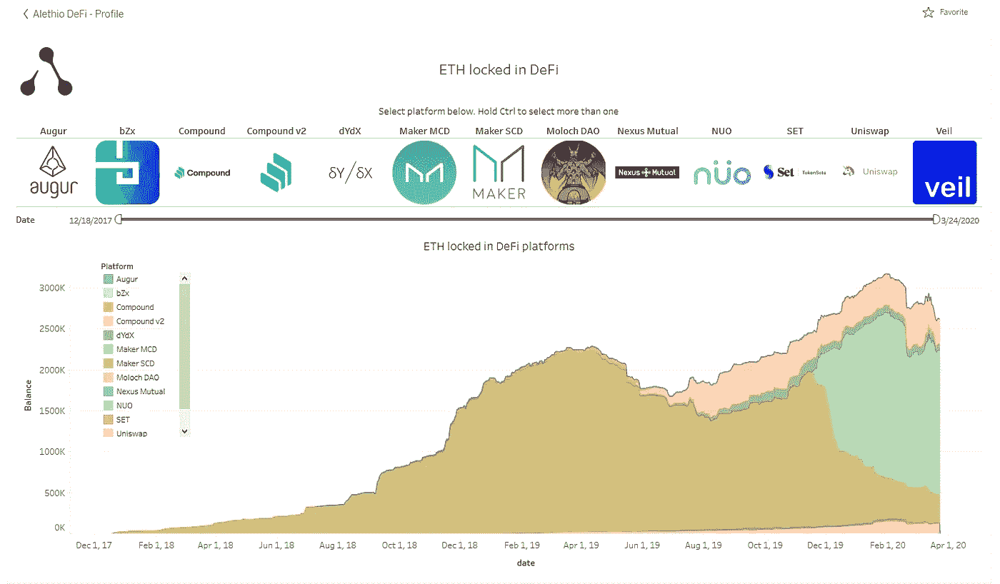

自 2017 年末以来，分散融资(或称 [DeFi](https://blog.coincodecap.com/the-ultimate-guide-to-defi-decentralized-finance/) )一直在以惊人的速度增长。这些协议中的大部分都是建立在以太坊网络上的，并且继续主导着以太坊网络的使用。这些 DeFi 协议使得[借贷](https://coincodecap.com/category/lend-and-borrow)、衍生品、交易所、赌博和[支付](https://coincodecap.com/category/payment)无需中央机构(或者这就是目标)。在我看来，DeFi 在 2017 年末和 2018 年的出现拯救了[以太坊](https://blog.coincodecap.com/tag/ethereum/)网络，为其提供了 ICO 之外的第二个主流应用(第一个是稳定硬币)。这些 DeFi 协议中的许多(如果不是全部的话)目前以某种方式集中，最终目标是完全分散。目前，他们应该被称为许可金融，或 PeFi，因为他们能够为地球上的任何用户提供服务，无论他们的地理位置，当地法规，法律，信用记录或职业。

以下是我获取 DeFi 数据、可视化、统计和 API 点的资源。此页面最后一次更新于 2020 年 4 月 21 日，并将持续更新以添加新资源、移除断开的链接等。

如需更多资源，请在 [www.coinresources.io.](http://www.coinresources.io.) 为我的资源仪表板添加书签

遗漏了什么吗？在 Twitter 上关注我 [@realvivek_](https://twitter.com/realvivek_)

# 一般 DeFi 统计和图像

[**DeFi Pulse(DeFipulse.com)**](https://defipulse.com/)
DeFi Pulse 是寻找高水平 DeFi 数据的绝佳资源和起点。总值“锁定”数据点显示了在 DeFi 生态系统中使用的比特币、以太坊或 DAI 的总数。以太坊上的贷款、衍生产品、支付、交换和资产协议的这些数据被跟踪并制成图表。主页列出了所有协议及其锁定总值排名。每个协议页面都有关键的增长统计数据、简单的图表、应用摘要和相关链接。页面有一套完整的资源，包括项目、钱包、界面、时事通讯和播客。

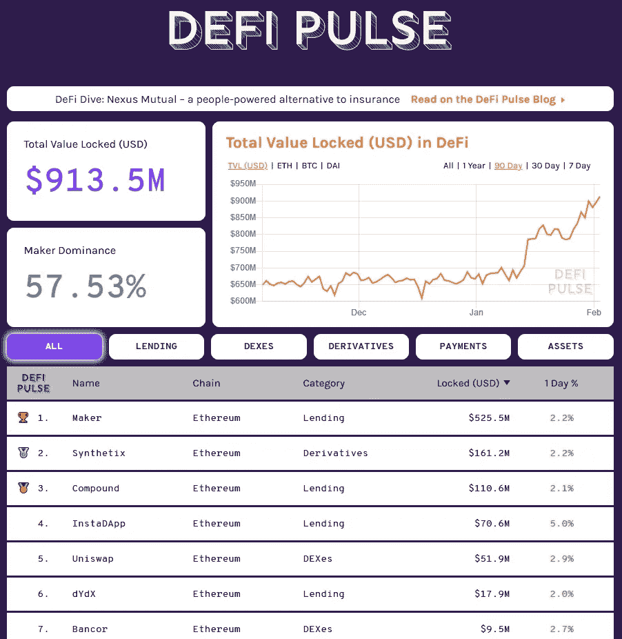

[**【DeFi Rate . com】**](https://defirate.com/)
与 DeFi Prime 类似，DeFi Rate 提供所有流行协议的借贷利率，包括 Aave、Compound、Curve、Dharma、Maker 和 Nuo Network。项目部分通过贷款、dex、衍生品、资产管理、钱包、保险等细分 DeFi 空间。对于希望了解 DeFi 项目、阅读评论和了解最新变化的用户来说，这是一个很好的起点。

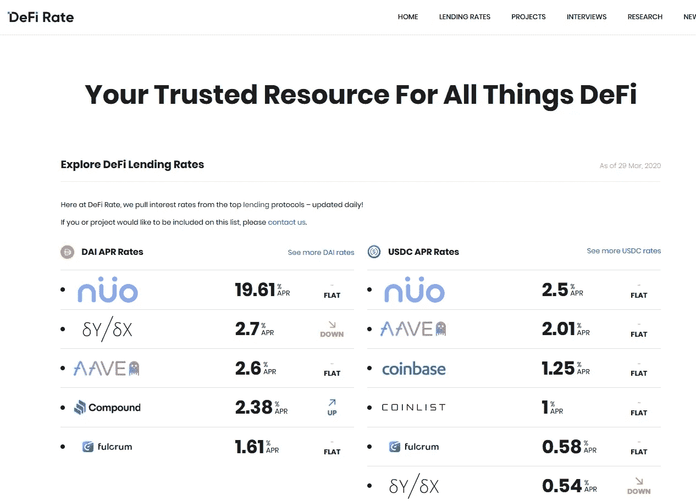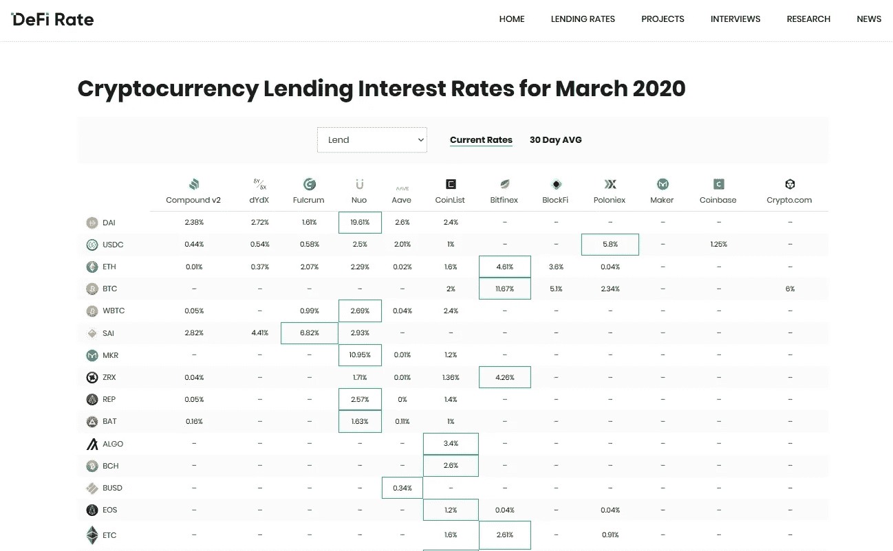

[**LoanScan(LoanScan . io)**](https://loanscan.io/)
LoanScan 为 DeFi 协议提供财务信息。复合，dYdx，达摩，制造商道，诺，Aave，DDEX 的当前利率和借款利率，并可在一个简单的表格中查看。BlockFi 和 Nexo 等集中式服务的费率也会显示出来。在寻找美元、USDC、USDT、戴、赛、、帕克斯和 GUSD 的高水平利率和分析时，这是一个合理的起点。

Loanscan 还提供 MCD、Compound 和 DyDx 的历史利率、贷款详细信息(原始、未偿、偿还)和抵押品详细信息(供应、比率、清算)。免费的 API 文档可以在[这里](https://api.loanscan.io/swagger/index.html)找到。

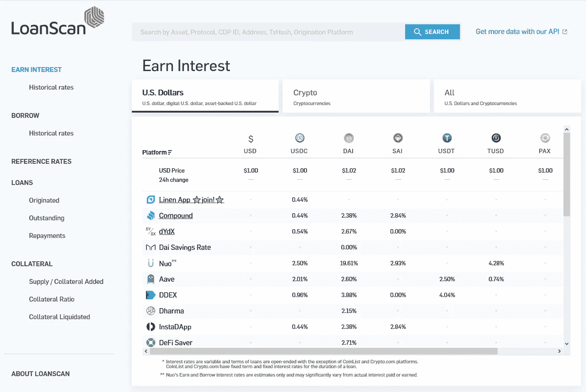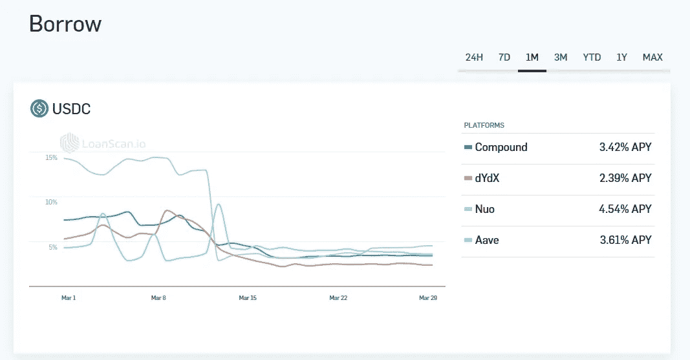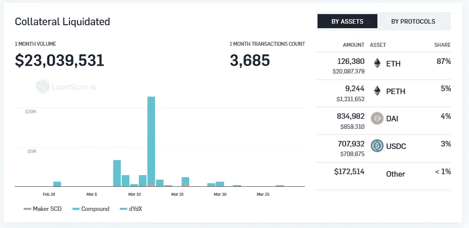

[**Dai Stats(Daistats.com)**](https://daistats.com/)
由 [Mariano Conti](https://twitter.com/nanexcool) 创建，Dai Stats 是一个简单的仪表板，提供关于总 Dai、总 SAI、锁定在制造者 DAO 中的 ETH、当前稳定费、担保比率、打开的金库数量、制造者燃烧率等的统计数据。

仪表板已更新，还包括 BAT 和 USDC 统计数据，这些数据已添加到 Maker DAO 协议中，以帮助提高流动性。

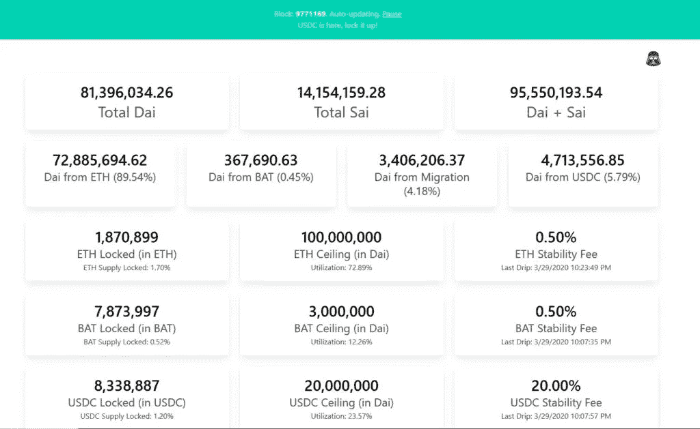

[**Alethio DeiFi 画面视觉效果(public.tableau.com/profile/alethio.defi)**](https://public.tableau.com/profile/alethio.defi#!/)
Alethio 为 DeFi 空间提供了画面视觉效果的仪表板。视觉和图表包括固定在 DeFi 中的 ETH、固定在 DeFi 中的 Sai、Synthetix 概述、DeFi 利率、复合流动性和其他。视觉效果是 tableau 格式的，这使得视觉效果很漂亮，可以通过滑块和滤镜进行定制。

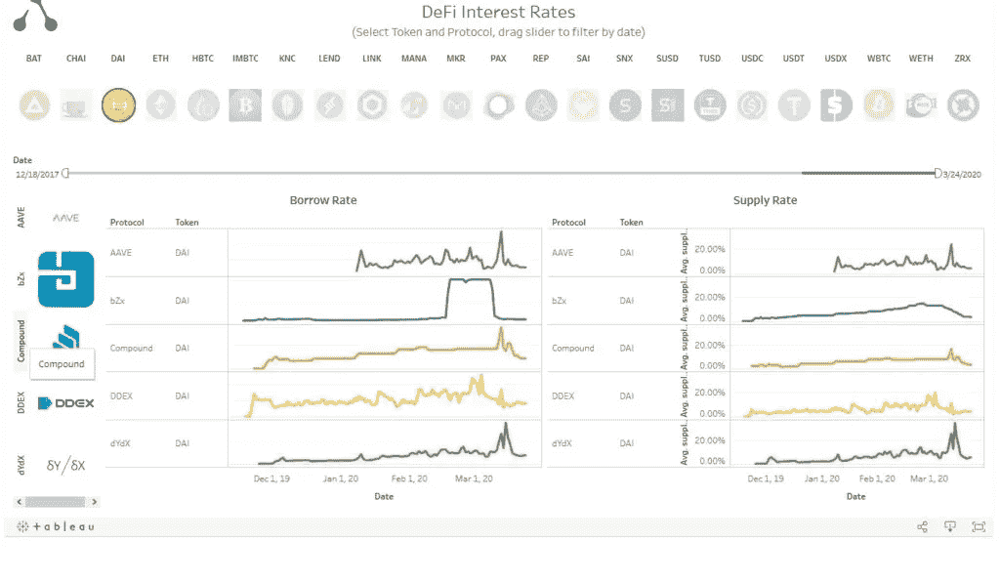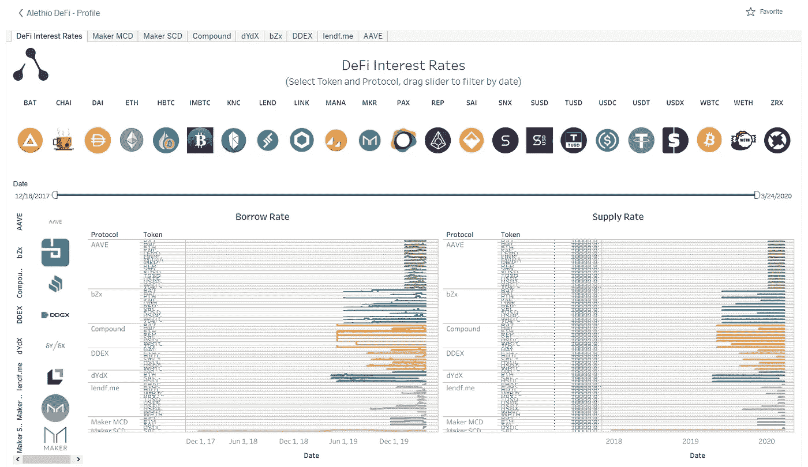

[**【DeFi Explore(defiexplore.com)**](https://defiexplore.com/)
这是一个了解多抵押债务(MCD)详细信息的伟大工具。搜索功能允许用户按 CDP ID、交易或地址进行搜索。提供的一些统计数据包括顶级 CDP 头寸列表、CDP 总额、DAI 债务和系统系统抵押。DeFi Explore 还在协议中锁定了 USDC 和英美烟草的数据，这两个数据都是 Maker 协议中相当新的内容。

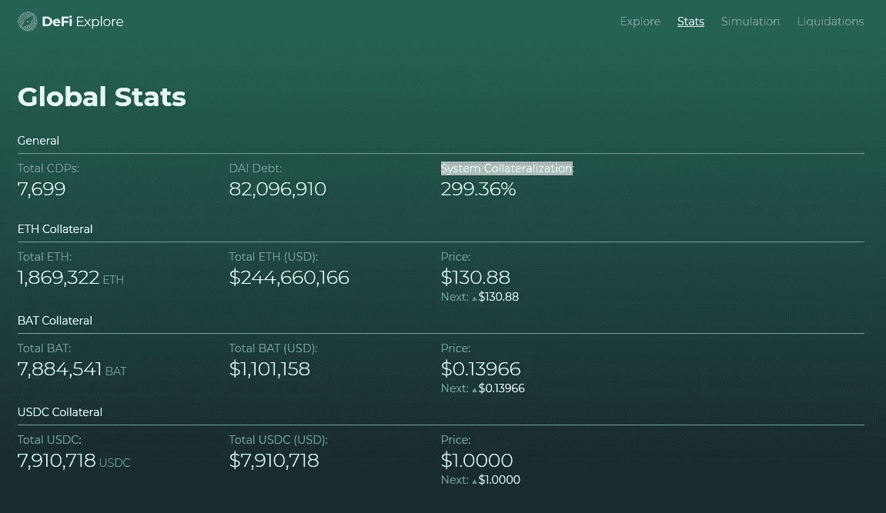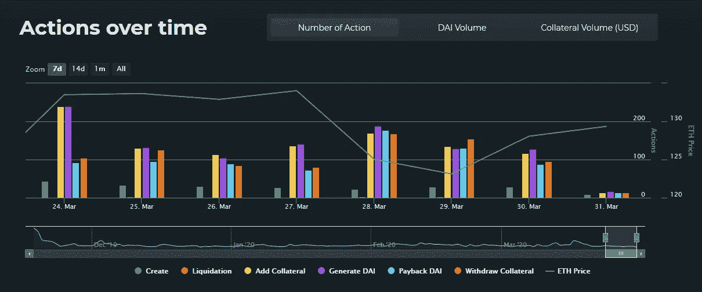

# DeFi 协议统计和图像

[**【阿拉贡仪表板(scout.cool.aragon/mainnet)**](https://scout.cool/aragon/mainnet)
类似于设置协议仪表板，Scout 也有一个阿拉贡仪表板。创建的组织总数、活跃组织、每日投票、平均余额(ETH、DAI、SAI)是该仪表板上可用的一些高级视觉和图表。

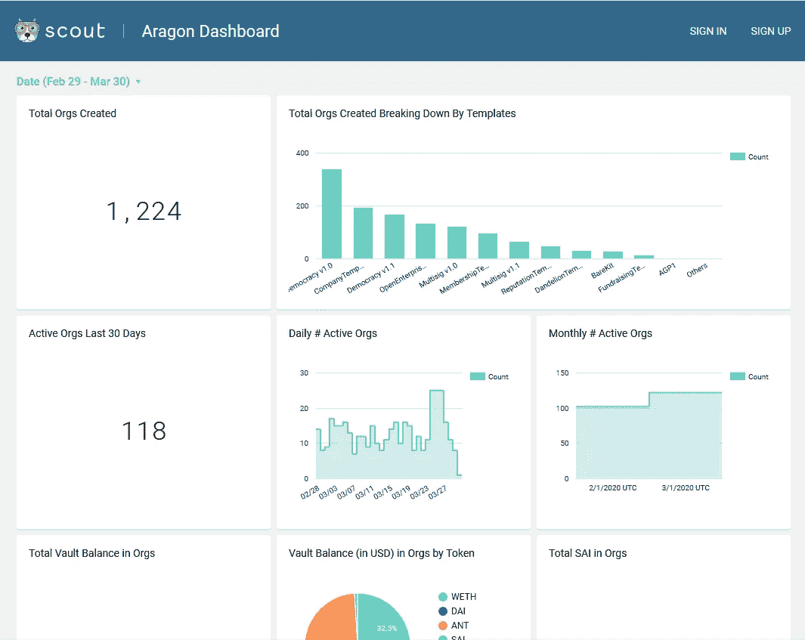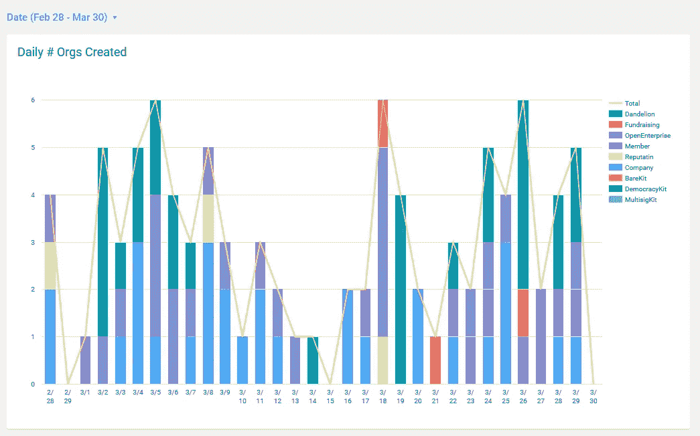

[**Aave Watch(aavewatch . now . sh)**](https://aavewatch.now.sh/)
Aave 是一个开源的 DeFi 协议，用于出借和借用数字资产，包括 SNX、USDT、MKR、TUSD、ETH、ZRX 等。该仪表板统计数据包括每项资产的存款利率、贷款利率、可用供应量和借款数量。Aave 还能够提供在 Aave watch 仪表盘上捕捉到的快速贷款。

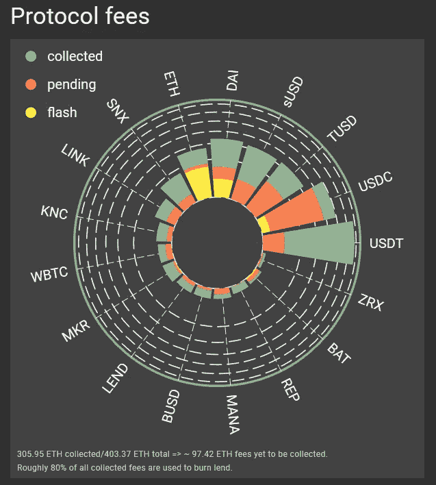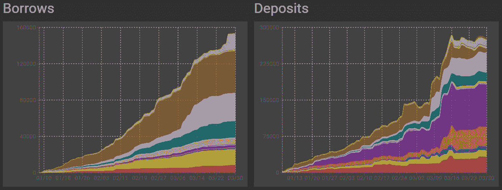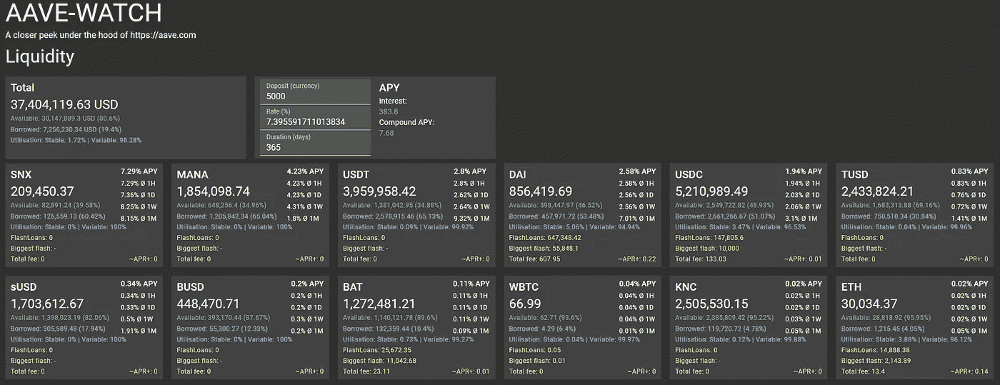

[**MKR 工具(mkr.tools)**](https://mkr.tools/)
由[迈克·麦克唐纳](https://twitter.com/mikeraymcdonald)创建，MKR 工具是一个用于 Maker DAO 平台的分析仪表板，可跟踪协议统计数据，包括 CDPs 交易、DAI 交易、稳定性费用以及 DAI 和上的令牌数据。历史 CDP 可视化显示一段时间内的抵押率

截至 2020 年 3 月 26 日，该仪表板尚未更新其 API 来跟踪多抵押品 DAI。该统计仅针对单个抵押品戴。有关包括 MCD 和 SCD 在内的总体 DAI 统计数据，请参考[Daistats.com](https://daistats.com/)

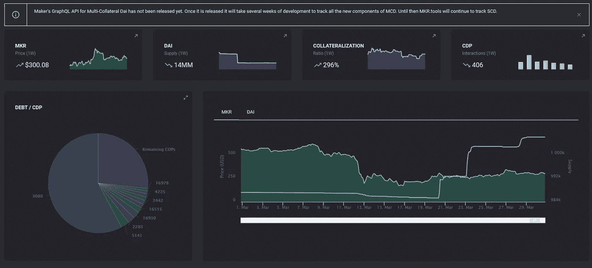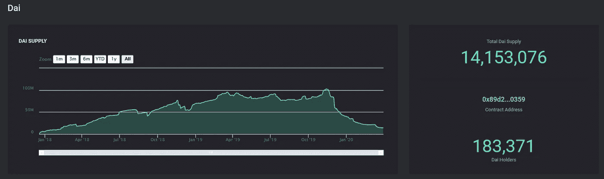

[**设置协议仪表板(Scout . cool/Set Protocol/mainnet)**](https://scout.cool/setprotocol/mainnet)
设置协议仪表板由 [Scout](https://scout.cool/) 提供设置金库统计和可视化。视觉效果包括金库总余额和按资产分列的金库余额明细:WBTC、SAI、、WETH、cUSDC、DAI 和 LINK。在寻找累计买卖、每周再平衡和 24 小时统计时，成交量图是非常有用的参考。交易数据、社交交易集概览和机器人集概览数字也以表格形式显示。可以按特定日期过滤统计数据。[官方 Token Sets 网站](https://www.tokensets.com/explore)最适合在寻找特定数据时使用，如持有人数量、每月交易者数量、地址和直接以太扫描链接。

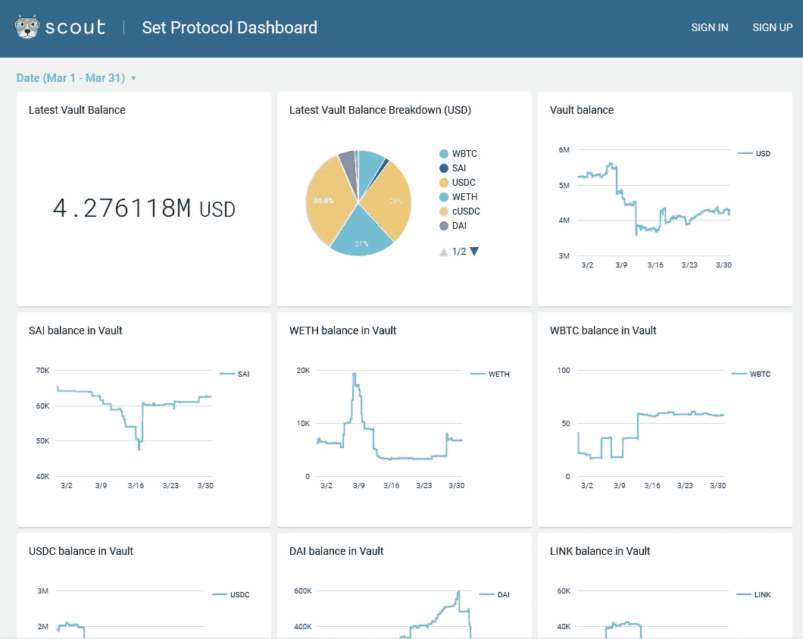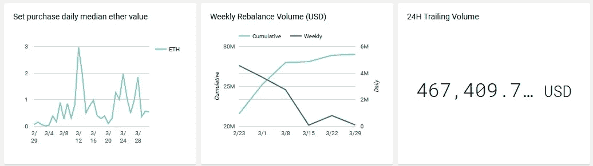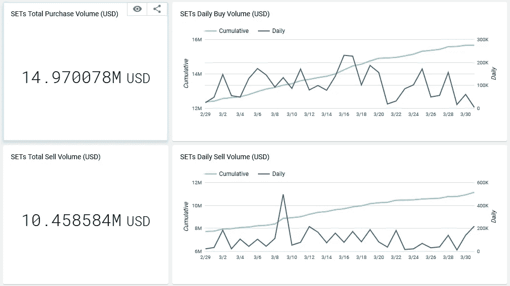

[**【Synthetix Stats(synthetixstats.com)**](https://synthetixstats.com/)
这是一个非常酷的、可定制的仪表盘，充满了 Synthetix 协议的图表和小部件。小部件包括活跃 exchange 用户、新的和唯一的 exchange 用户、锁定的总 SNX 值、SNX 供应量、exchange 钱包、顶级持有者等统计数据。图表包括数量、费用、SNX 购买量、费用、供应量、每个地址的数量、资产分布等。

从 2020 年 3 月 28 日起，[官方 Synthetix 仪表盘](https://dashboard.synthetix.io/)不再可用，因此我强烈推荐 Synthetix Stats。

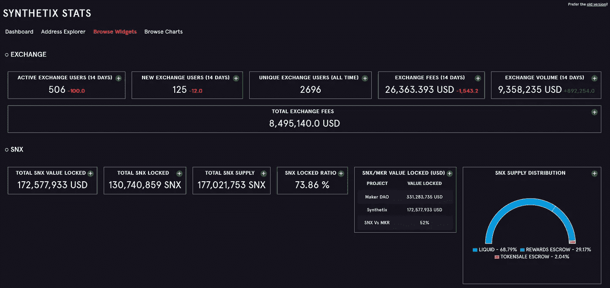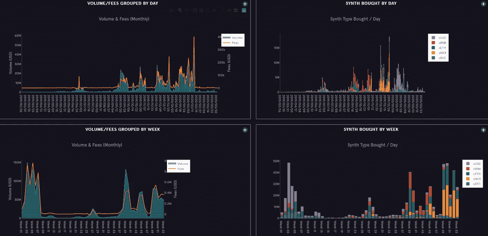

# 其他资源

[Bloxy Maker Dao Analytics](https://stat.bloxy.info/superset/dashboard/makerdao/?standalone=true)—仅限 SCD。

[硬币利率](https://coininterestrates.com/)s—noo、DyDx、MakerDAO、Nexo、Compound 和其他的借入 APR、借出 APR、总借入和市场规模统计。

[流动性池](https://pools.fyi)—uni swap、Curve 和 Bancor 的流动性池统计。

[DeFi 扫描(DeFiscan.com)](https://defiscan.io/)—复合、Uniswap 和 SpankChain explorer。可通过地址或 ENS 名称搜索。

[Whois0x (whois0x.io)](https://whois0x.io/) —以太坊块浏览器，显示地址余额、ERC20 令牌、收藏品、DeFi 位置。

建议？在推特上联系我 [@realvivek_](https://twitter.com/realvivek_)

> [在您的收件箱中直接获得最佳软件交易](https://coincodecap.com/?utm_source=coinmonks)

