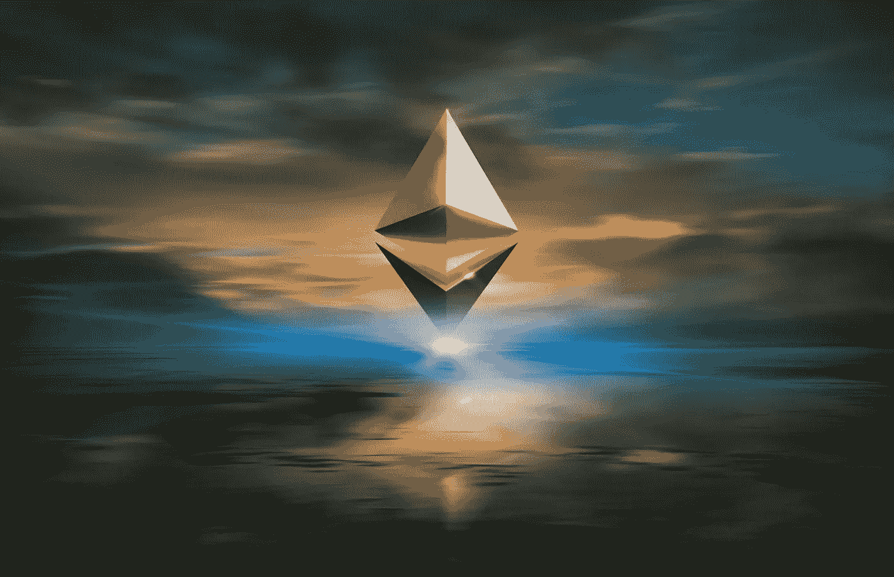

# DeFi 风险解释:如何在区块链保持安全

> 原文：<https://medium.com/coinmonks/defi-risks-explained-how-to-stay-safe-on-the-blockchain-7e4572658e69?source=collection_archive---------5----------------------->

Photo by [Zoltan Tasi](https://unsplash.com/@zoltantasi?utm_source=unsplash&utm_medium=referral&utm_content=creditCopyText) on [Unsplash](https://unsplash.com/s/photos/ethereum?utm_source=unsplash&utm_medium=referral&utm_content=creditCopyText)

虽然分散融资允许构建和采用新的金融产品和服务，但重要的是要理解，任何金融和技术创新都可能存在使资本面临风险的漏洞。在普路托斯，我们有效地应对这些风险，并为我们的投资者提供可靠和容错的投资策略。