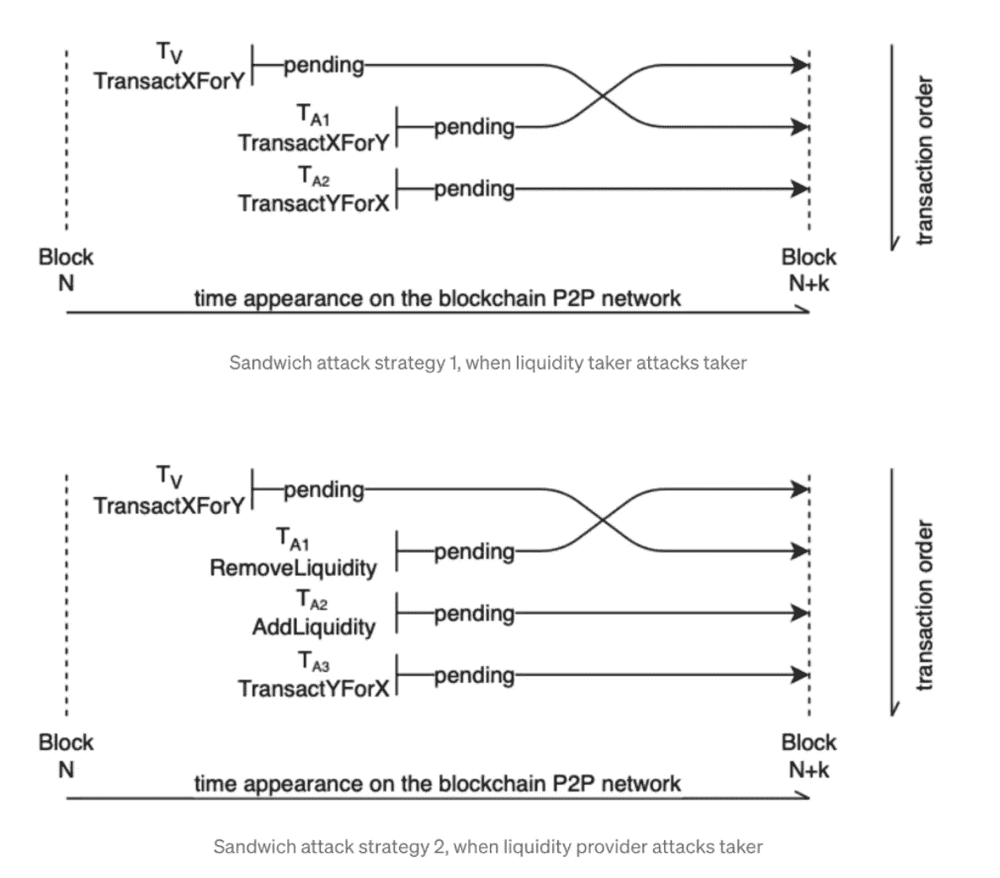
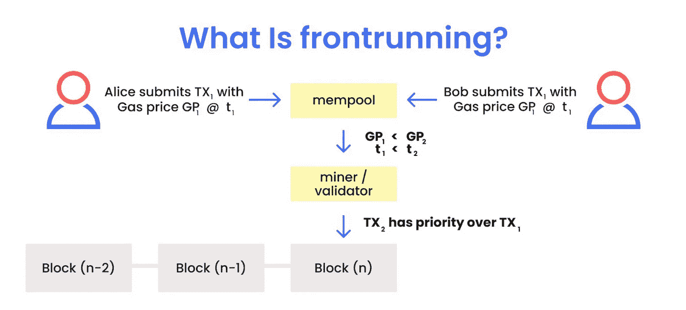

# DEFI 三明治攻击解释

> 原文：<https://medium.com/coinmonks/defi-sandwich-attack-explain-776f6f43b2fd?source=collection_archive---------0----------------------->

在这篇文章中，我将通过一个例子和数学观点来总结什么是三明治攻击，这样你就可以理解加密市场操纵。

三明治攻击并不新鲜， [Vitalik 已经在 2018 年的 Uniswap 中谈到过它们](https://ethresear.ch/t/improving-front-running-resistance-of-x-y-k-market-makers/1281)。

让我们试着用简单的术语来理解什么是三明治攻击。

## **什么是三明治攻击？**

受害者交易将加密货币资产 X(例如:瑞士联邦理工学院、戴、赛、)交易到另一加密资产 Y，并进行大额购买。一个机器人嗅到了交易，并在大宗交易被批准之前，通过购买资产 Y 抢先受害者一步。这种购买提高了受害交易者的资产 Y 的价格，并增加了滑点(基于交易量和可用流动性的预期价格上涨或下跌)。

因为资产 Y 的高购买，它的价格上升，受害者以更高的价格购买资产 Y，然后攻击者以更高的价格出售。



## 打破三明治攻击

由于区块链的公共性质，这些攻击经常出现在野外，所有交易都可以被 [mempool](/@danrobinson/ethereum-is-a-dark-forest-ecc5f0505dff) 中的任何人观察到(除非有人与矿池有特殊的直接联系)。或者，智能合约可以包含没有执行这种交易的访问限制的功能。这些功能通常用于申请 LP 奖励代币，并使用 DEX 立即将它们换成其他代币。

```
[mempool](/@danrobinson/ethereum-is-a-dark-forest-ecc5f0505dff) : The main utility of a mempool, is its ability to store network transactions so that they can be processed later.Front-Runs: Front Running happens when a attacker manupulate a standard transaction. The Front-Running bot(attacker) searches for victims by scanning transactions in the mempool so an attacker can jump ahead of the trade. 
```



**Frontrunning**

*   三明治攻击遵循类似的过程:

1.  检测受害者的交易。
2.  提前处理受害者的交易。
3.  受害者交易并遭受更高的滑点。
4.  攻击者然后从背后袭击受害者。

[](https://blog.coincodecap.com/sandwiched-wtf-review) [## wtf:你输给 MEV 交易者了吗？

### 您是否曾经遇到过这样的情况:您打算在 uni WAP/ETH 网络上购买令牌，但不知从哪里…

blog.coincodecap.com](https://blog.coincodecap.com/sandwiched-wtf-review) 

## Uniswap

让我们用一个例子来理解市场是如何运作的。

*   **交换马卡尼萨姆:**市场包含一个内部状态，`**PRICE**`，是当前市场价格。它也有两个参数，`**FEE**`和`**DEPTH**`。如果用户想购买`**ORDER_AMOUNT**`硬币，他们会把价格提高到`**PRICE + ORDER_AMOUNT / DEPTH**`，然后付款

```
ORDER_AMOUNT * (PRICE + ORDER_AMOUNT / DEPTH / 2) * (1 + FEE).
```

本质上，这构成了在旧价格和新价格之间的每个价格点购买无限数量的硬币。

*   **Uniswap:** Uniswap 方程特征是`r0 * r1 = k`一个方程，其中`r_i`是 Uniswap 池的储量。Uniswap 对每笔交易的投入金额收取 0.3%的费用。
*   [Uniswap 贸易方程式](https://github.com/Uniswap/uniswap-v2-core/blob/master/contracts/UniswapV2Pair.sol#L182)
*   三明治攻击包括用购买相同资产的交易抢先受害者交易。获得的代币在受害者交易后再次出售。

## **什么构成了三明治攻击:**

让我们仔细看看，分析是什么造成了三明治攻击。

*   **自动做市商(AMM):** 这是一个预定义的定价算法，根据流动性池中的资产自动执行价格发现和做市。AMM 允许流动性提供者观察和跟踪市场，然后设定买价和卖价。流动性接受者反过来与 AMM 进行交易。
*   **价格滑移:**价格滑移是交易过程中资产价格的变化。预期价格滑移是基于交易量和可用流动性的预期价格上涨或下跌，在交易开始时形成预期。

“意外价格滑动是指价格的上涨或下跌。在交易过程中由于某种未知或不可预测的原因`。

*   **预期执行价格:**当流动性接受者在 X/Y 发布交易时，接受者希望以预期执行价格(基于 AMM 算法和 X/Y 状态)执行交易，给定预期滑点。
*   **意外价格滑移:**执行价格与预期执行价格之间的差异。
*   **意外滑点率:**超出预期价格的意外滑点。

## **总结**

你可以理解三明治攻击的一般工作原理。所以在我看来，机器人或攻击者分析内存池中的事务来决定是否发起攻击。所以最好加密交易细节。

**zk-SNARKs:** 社区中有人提议使用 zk-SNARKs，一种零知识证明技术来实现这个目标。换句话说，zk-SNARKs 将用于加密和隐藏每笔交易的信息，因此机器人对此无能为力。

然而，这种方法不足以控制这种类型的攻击，因为它具有诸如高 Gas 成本的缺点，并且它可能被用来执行阻塞攻击，从而导致整体活跃度的降低。

目前的情景仍然是 R&D 在区块链 mempool 为这种攻击进行辩护的工作。

**参考:**

*   [https://unis WAP . org/docs/v2/smart-contract-integration/trading-from-a-smart-contract/](https://uniswap.org/docs/v2/smart-contract-integration/trading-from-a-smart-contract/)
*   【https://cmichel.io/de-fi-sandwich-attacks/ 号
*   [https://www . semantic scholar . org/paper/High-Frequency-Trading-On-Decentralized-On-Chain-Zhou-Qin/3 baaa 599187 dddadf 085 ed 6 c 43141874d 4189 c 51](https://www.semanticscholar.org/paper/High-Frequency-Trading-on-Decentralized-On-Chain-Zhou-Qin/3baaa599187dddadf085ed6c43141874d4189c51)

> 加入 Coinmonks [电报频道](https://t.me/coincodecap)和 [Youtube 频道](https://www.youtube.com/c/coinmonks/videos)获取每日[加密新闻](http://coincodecap.com/)

## 另外，阅读

*   [复制交易](/coinmonks/top-10-crypto-copy-trading-platforms-for-beginners-d0c37c7d698c) | [加密税务软件](/coinmonks/crypto-tax-software-ed4b4810e338)
*   [网格交易](https://coincodecap.com/grid-trading) | [加密硬件钱包](/coinmonks/the-best-cryptocurrency-hardware-wallets-of-2020-e28b1c124069)
*   [密码电报信号](http://Top 4 Telegram Channels for Crypto Traders) | [密码交易机器人](/coinmonks/crypto-trading-bot-c2ffce8acb2a)
*   [最佳加密交易所](/coinmonks/crypto-exchange-dd2f9d6f3769) | [印度最佳加密交易所](/coinmonks/bitcoin-exchange-in-india-7f1fe79715c9)
*   开发人员的最佳加密 API
*   最佳[密码借贷平台](/coinmonks/top-5-crypto-lending-platforms-in-2020-that-you-need-to-know-a1b675cec3fa)
*   [杠杆代币](/coinmonks/leveraged-token-3f5257808b22)终极指南
*   [7 个最佳零费用加密交换平台](https://coincodecap.com/zero-fee-crypto-exchanges)
*   [最佳网上赌场](https://coincodecap.com/best-online-casinos) | [期货交易机器人](/coinmonks/futures-trading-bots-5a282ccee3f5)
*   [分散交易所](https://coincodecap.com/what-are-decentralized-exchanges) | [比特 FIP](https://coincodecap.com/bitbns-fip)
*   [用信用卡购买密码的 10 个最佳地点](https://coincodecap.com/buy-crypto-with-credit-card)
*   [加拿大最佳加密交易机器人](https://coincodecap.com/5-best-crypto-trading-bots-in-canada) | [Bybit vs 币安](https://coincodecap.com/bybit-binance-moonxbt)