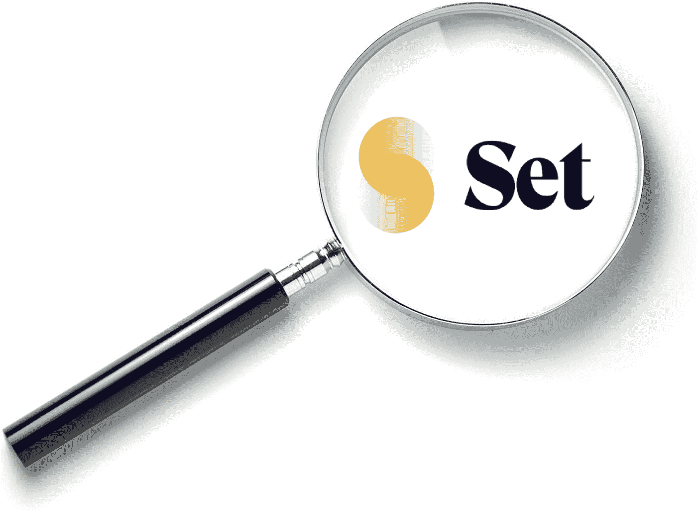
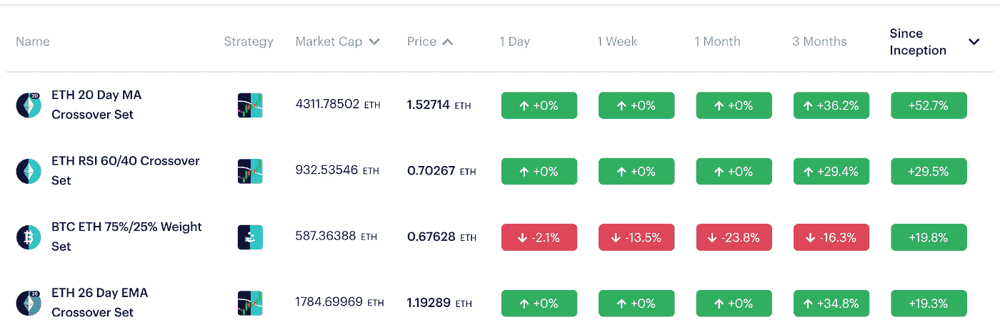

# DeFi Spotlight —设置协议

> 原文：<https://medium.com/coinmonks/defi-spotlight-set-protocol-57cfce196d38?source=collection_archive---------1----------------------->

## 钱包中的自动交易

Set Protocol 是一个 DeFi 项目，允许任何人只需在钱包中持有 ERC20 令牌即可利用自动化交易策略。无论是跟随“机器人 set”还是专业交易员，Set 协议都允许任何拥有加密货币钱包的人利用自动化交易的力量。

非托管设计与器械包的透明链上再平衡相结合，意味着器械包协议的社交交易和机器人器械包最大限度地降低了用户的交易对手风险。与 eToro 等集中式竞争对手相比，Set 的费用也非常低。

# 为什么要自动化？

我们大多数人在交易时都会犯错误，要么是因为缺乏经验，要么是因为我们让自己的情绪影响了我们的交易。即使你的交易 90%都是好的，那一次不好的交易也会抹去几个月的利润。Set Protocol 为普通加密投资者提供了一个更智能的交易机会，要么遵循基本的自动化策略，要么让专业交易员为我们交易。

# 机器人器械包

Robo 集合是 ERC20 令牌，具有管理基础资产的自动化交易算法。对于对技术分析有基本了解的用户来说，这些代币是理想的，当技术指标被触发时，它们的基础资产会自动重新平衡。

# 社交交易

Set 的社交交易集更有意思。与 eToro 等其他社交交易平台类似，用户可以允许自己的交易跟随某个人的交易。一般来说，这些是“专家”交易者，但他们也可能是秘密影响者或其他人。

# 采访 Set 首席执行官 Felix Feng

本月在旧金山，我借此机会与 Set Protocol 首席执行官兼联合创始人 Felix Feng 坐在一起，了解更多关于 Set 的信息——它是如何开始的，它的目标是什么，以及它即将推出的计划。

**Set 协议是如何开始的？**

Set Protocol 诞生于 ETHWaterloo 2017。当时我在一家初创公司做软件工程师。我对 crypto 很感兴趣，打算去 ETHWaterloo 黑一个关于 [TypeScript](https://en.wikipedia.org/wiki/TypeScript) 的 web3 项目。但是在飞来的飞机上，我突然有了灵感，最终我创造了 Set 协议的开端。

那一年，我一直在参加一些 ico，像 0x 和 dydx 这样的金融协议真的让我眼前一亮。阅读 dydx 让我大吃一惊。这让我意识到，你实际上可以利用智能合约创造复杂的金融产品。

我原本打算去 ETHWaterloo 黑掉 web3 和 Typescript，但在来的飞机上，我意识到没有人在做一个完全分散的指数基金。我在飞机上构建了这个概念，最终被这个想法所驱使，以至于我放弃了我最初的团队，在黑客马拉松期间创建了 Set 的第一个版本。

我在活动中向 Joe Lubin、Will Warren 和 Scalar Capital 的 Linda Xie 介绍了这个想法，甚至在稍后的时间正式向 Consensys 介绍了这个想法。我在那里得到了一个 EIR 的职位，但最终我决定自己开始创业。

你一直对加密感兴趣吗？

我在 2013 年从一个朋友那里听说了 crypto。很快我就开始交易了。我记得买了价值 1000 美元的比特币，后来卖掉赚了点小钱。这只是 10 美元的利润，但它让我上瘾了。

2014 年，我参加了比特币 2014，这是一个大型的年度比特币会议。在那里，我见到了所有来自比特币基地、查理·李等地的大人物。我离开会议时想，哇，比特币背后的技术将会改变金融和法律行业，就像互联网改变媒体和通信一样。

我离开会议时想，哇，比特币背后的技术将会改变金融和法律行业，就像互联网改变媒体和通信一样，所以我认为这将是一件大事——我需要参与进来。

**你是怎么卷进来的？**

实际上，我最初是从财务部门开始接触 crypto 的，后来转到了工程部门。所以我在加州大学伯克利分校学习商业，毕业后我从事金融工作。就在那时，我遇到了潘迪拉资本公司的保罗。在业余时间，我帮助潘迪拉考察交易所和钱包等公司。我们还考察了思域和 Filecoin 等公司。

在兼职帮助潘迪拉之后，我全职加入了 21.co(现在的[挣](https://earn.com/))。当时它是一家比特币采矿公司，我帮助他们从采矿数据中心过渡到 Raspberry Pi 产品，以获得付费电子邮件服务。

2016 年，我实际上对规模辩论非常反感，以至于我决定休息一段时间。当时，我是比特币最大化主义者。正是在这段时间里，我参加了一个编码训练营，并作为一名软件工程师开始在一家初创公司工作。当我在 2017 年从事这项编码工作时，来自潘迪拉的保罗告诉我“你应该看看以太坊。”这让我掉进了一个兔子洞，这个洞现在变成了 Set。

Set 最近怎么样？

2018 年初，我们开始筹集资金，最终我们与硅谷当时做加密的一些最好的投资者进行了种子轮投资。这包括 Craft ventures、VY 资本、DFJ、社会资本、Kindred 以及其他一些天使投资人。这笔初始资本帮助我们扩大规模，我们于 2019 年 4 月在 mainnet 上推出

从那时起，我们的协议已经从 0 美元增长到大约 570 万美元的 AUV ( AUV 代表保险库下的资产，因为这些资产是通过智能合同控制的)

**你最近推出了社交交易——进展如何？**

我们最近推出的是社交交易，这是一个专家分享他们的交易策略或基金策略的平台，他们可以将关注他们的人货币化。没有投资或交易经验的人可以跟随更有经验的人，利用他们的交易。

做得很好。

几周前，我们和 13 个交易者一起推出了 18 套。这些商人对我们来说非常强大，因为他们最终会在他们的社区中传播 Set 的信息。例如，亚伦·克鲁格做得非常好。两天之内，他就能把 50 万美元存入他的账户。

社交交易也拓展了我们的国际市场。我们的明星交易员之一是 [Fidelitas Lex](https://twitter.com/fidelitas_lex) 。他住在土耳其，在推特上有 36000 名粉丝。当我们聘用他时，我们看到我们的客户群从主要是西方转向土耳其，成为我们的第二大市场。这让我们意识到，社会交易者对我们真的很重要，不仅仅是单纯的数字，而是一个将 Set 扩展到其他国家的机会。

我们认为自己在某种程度上是通向 DeFi 的大门，而社会交易者可以帮助我们完成这一使命。大多数人不会通过化合物或制造商了解 DeFi。这些产品对大多数零售用户来说太深奥了。相反，他们从他们已经信任的人那里了解这些产品。

例如，如果你已经在 youtube 上看到某人，他们分享了一些关于他们的集合或令牌集合的东西，你会信任他们，他们会说你的语言。他们将分享你的文化、你的理想和价值观，这些人将最成功地分享像 Compound、dydx、Set 这样的 DeFi 项目是关于什么的，以及它们如何能让你受益。

这是我们的信念，也是为什么交易者对我们如此重要。我们希望来自世界各地的交易员都是专家，他们了解这项新技术的价值主张，并能够将其传达给他们的追随者。

这种全球教育和推广是 DeFi 今天不太擅长的。DeFi 仍然主要是西方的，非常以美国为中心，讲英语。它还没有发展出渗透其他文化的能力，这是我们在 set 非常专注于尝试做的事情——让下一个 1 万、10 万人进入 DeFi

*如果你喜欢这篇文章，请在*前表示赞赏👏ing！

**更多关于 DeFi 的文章:**

*   [**什么是 DeFi？**](/coinmonks/what-is-defi-2cee0dceeeab)

> [直接在您的收件箱中获得最佳软件交易](https://coincodecap.com/?utm_source=coinmonks)

