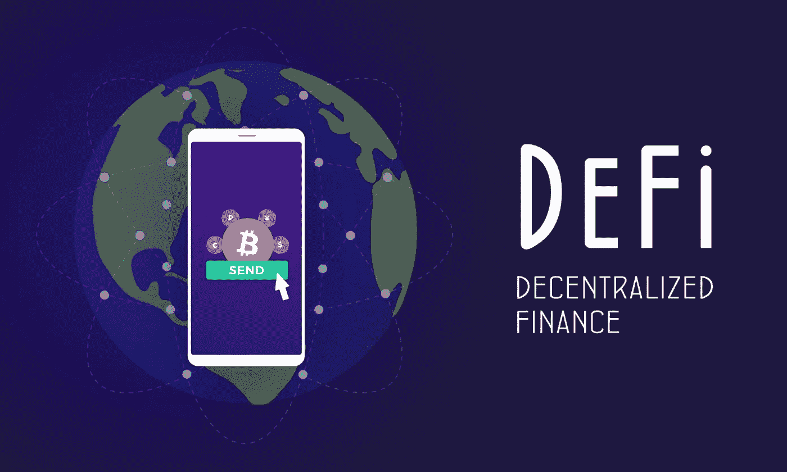
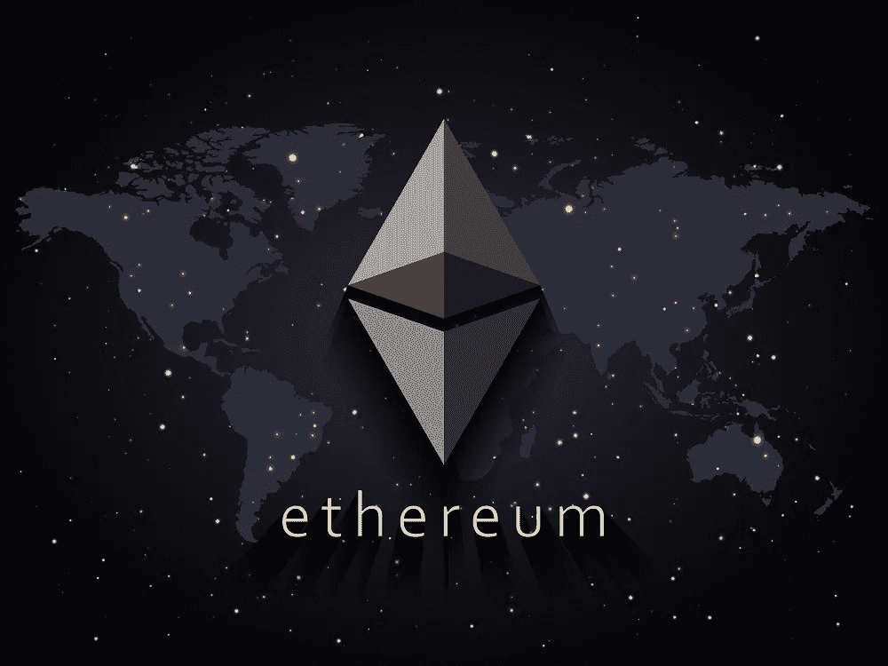
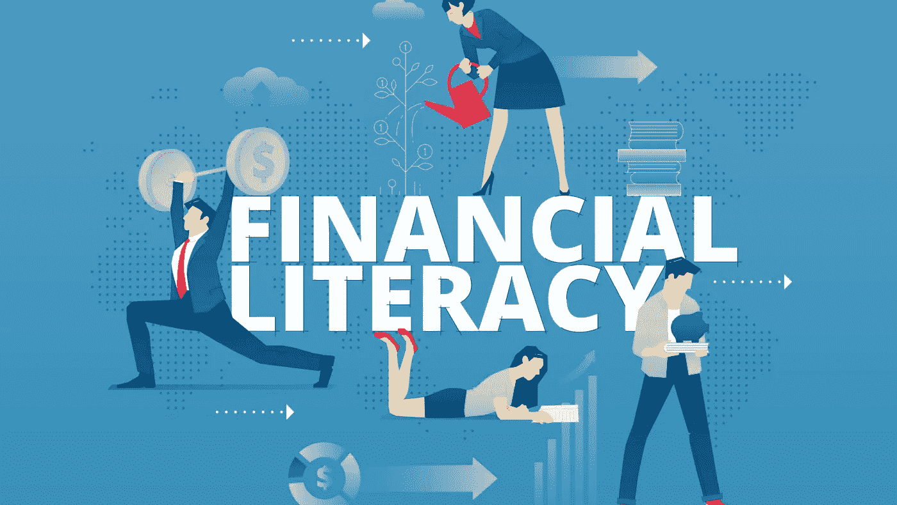

# DeFi:金融的未来

> 原文：<https://medium.com/coinmonks/defi-the-future-of-finance-1bfe3dab0e71?source=collection_archive---------4----------------------->

*作者:* [**雅各布·拉克**](https://www.linkedin.com/in/jacob-rucker-070b55144/) ，NEU 区块链研究分析师

Source from Angad Singh at officialhacker.com

金融服务世界。全球经济中最不受信任的部门。不信任的核心是银行——这个行业中使用最广泛的工具。

话虽如此，银行被遗忘已久的目的是提供金融稳定和增长，同时把客户放在第一位。那么，为什么只有大约一半(54%)的消费者信任这个行业呢？找一个值得信赖的顾问或银行不是很容易吗？透明收费难道不会减少使用它们的麻烦和负担吗？如果没有创造性营销的使用，想象一下广告中的诚实，在使用特定的银行时，你到底能期望看到和得到什么。根据它们在全球和国内金融市场的规模和影响力，银行是不可战胜的，它需要改变。

这个问题的核心是非常明显的。银行通常被认为是管理个人财务的安全和适当的方式，而替代金融服务和技术被认为是剥削性和欺骗性的。

全球仍有近 17 亿人没有银行账户。术语“[无银行账户的](https://globalfindex.worldbank.org/sites/globalfindex/files/chapters/2017%20Findex%20full%20report_chapter2.pdf)”是指无法获得银行服务的人；这意味着没有支票或储蓄账户，没有退休计划，也没有应急基金。因此，具有讽刺意味的是，金融排斥是昂贵的。它确实影响了人们的生活质量，阻碍了他们对未来的投资。适当的金融知识和包容性是应对和摆脱贫困的必要条件，这也是为什么联合国概述的 17 个可持续发展目标中有 7 个将此视为改善最边缘化群体状况的重要因素。

然而，幸运地获得银行和其他金融服务的贫困个人仍然不清楚。

> 时报*报道，一些银行，即* [*美国银行、Regions Financial 和富国银行*](https://www.forbes.com/sites/halahtouryalai/2012/04/26/how-banks-are-getting-richer-off-the-poor/?sh=5f806f4a3861) *，正在吸引低收入消费者注册预付费借记卡和发薪日贷款等产品，这些产品通常附带各种费用和收费。*

此外，由于银行业是一项为赚钱而存在的业务，现代银行给客户的账户增加了更多的成本、费用和罚款。消费者优先于利润的日子已经过去了。相反，利润和货币政策由极少数人决定的年代将会持续下去。

自银行业发明以来，全球金融体系变得越来越**集中化**。[集权是指将一项活动或组织的控制权集中在单一或极少数权力机构之下。](https://businessjargons.com/centralization.html)主要参与者包括中央银行、大型金融机构、政府监管机构和政府间组织。在这个中央集权的体系中，全球金融市场往往被那些与它们关系最密切的人所主宰。

具体而言，领导人无法获得稳定的全球金融体系的国家实际上错过了公民的实质性知识和国内增长。在这些国家，由于高度集中的制度，某些障碍阻碍了金融包容性，这与错过教育、卫生和社会保护投资相关。这不仅让生活得到改善的个人受益，而且有证据表明，强调金融包容性和权力下放直接有助于国家的经济增长和更大的稳定性。

对资金流动的控制不公平地集中在少数人手中，而不是受资金流动影响最大的人。话虽如此，银行并不需要消失。一种金融自然选择将会发生，并以另一个顶端捕食者的出现而告终。

# 输入定义

想象一个没有银行、边界或经纪人的金融行业。这就是被称为分散金融(DeFi)的雄心勃勃的总体理论的愿景，在这一理论中，金融产品和服务变得更快、更便宜，任何有互联网连接的人都可以轻松获得。

该术语是由 [0x 团队](https://www.coindesk.com/five-years-in-defi-now-defines-ethereum)的成员在 2018 年创造的，该团队是一群加密货币专家，旨在为资产创建一个比过去任何系统都更高效、透明和公平的金融网络。从全局角度将 0x 作为 DeFi 使命的支柱；基本上没有最低交易量，没有必要的投资或起始金额，也没有开立储蓄或支票账户所需的文书工作。

DeFi 的广泛采用可能会带来全球金融体系的完全透明和可听见性。它可以增加对金融机构的信任，倡导金融知识，减少财富不平等，促进无银行账户和无服务人群的全球金融包容性。

Source from SuperCryptoNews.com

然而，在当前全球金融体系失灵的情况下，采用 DeFi 真的能成功吗？

是的，可以。

互联网的诞生、智能手机的普及、数字银行的采用以及比特币和区块链的发展都有助于培育一个更加包容和分散的金融体系。

这些工具是分散金融技术的典范，促进了全球数字金融包容性。更具体地说，采用最广泛、发展最快的技术是区块链仪器的技术及其用例。

# 解除银行的束缚

区块链技术为当前金融系统无法满足其需求的人们所面临的问题提供了一个可行的解决方案。它让日常生活中的每个人都能掌控全局。用户不再严重依赖陈旧而昂贵的中央经纪人和银行，而是可以保管自己的财富，并且可以安全地进行交易，而无需中央方的验证。DeFi 和区块链技术的真正潜力不在于为没有银行账户的人提供银行服务，而是在于为有银行账户的人提供银行服务。是时候重塑金融体系，为所有人提供更安全、更实惠的金融产品了。这个故事的目标是宣布 DeFi 的发展不仅会带来社会变革，还会培育一个能够实现更大的匿名性、隐私性和自主性的替代性货币和金融系统。

虽然很难想象一个分散金融完全取代集中金融的世界，但如果它们可以共存呢？

这种混合的一个例子是用户如何在公共区块链上进行经济活动，并把他们新获得的财富交换到中央系统中。事实上，对冲系统性风险的一种常见做法也可以是将投资组合分散到集中和分散系统中的持股中。

# 区块链的好处

Source from NullTX

当今最新、最受期待的技术出现在加密货币和区块链开发中，特别是**智能合约。**智能合约是自动执行的基于代码的协议，通常托管在区块链网络上，通过降低交易成本，特别是依赖昂贵的第三方来监控和执行交易和协议，为消费者和公司释放价值。

在最近的[世界银行报告](https://openknowledge.worldbank.org/bitstream/handle/10986/33723/Smart-Contract-Technology-and-Financial-Inclusion.pdf?sequence=1&isAllowed=y)中，经济学家得出结论“智能合同可以推动消费者和微型、小型和中型企业在某些金融服务中的包容性。”智能合约使用的一个当前例子是在**以太坊**，这是一种加密货币，让你拥有和控制价值，并将其发送到世界各地。它目前对任何人开放，任何一方都无权改变其规则。这大大提高了金融体系的整体自主性。这意味着，与当前的金融体系不同，基本的金融工具和用途非常容易获得。

更有创意的说法是，一家美国金融公司的顶级交易员将拥有与印度偏远地区的农民同等的权限。几乎每个拥有手机的人都可以从 DeFi 和智能合约的优势中受益。在上述统计中，在目前没有银行账户的 17 亿个人中，有 2/3 的人有可用的手机。

DeFi 改进的另一个财务方面是可交易性。在传统金融领域交易的每一种非数字资产都可以被令牌化和交易。这降低了费用，加快了交易速度，同时为大规模采用和更简单的功能奠定了基础。最后，DeFi 的所有数据都是公开的，可以很容易地为研究或安全原因进行检查。这增加了金融系统的透明度，这个系统有着不可信任和腐败的历史。

# 知识:实现 DeFi 和消除不平等的最后一步

如果一个人不能建立一个储蓄账户，预算资金，并知道信用历史的重要性，那就很难真正理解金融知识的力量。

因此，DeFi 和金融扫盲的目标是一致的；使金融知识在世界各地的教育和金融系统中得到广泛采用。金钱可能会也可能不会带来幸福，但它肯定会带来舒适和选择的可能性。

通过大力强调金融包容性和扫盲作为减贫的一种手段，将通过 DeFi 的视角引领服务不足和银行服务不足的人群在经济进步方面实现巨大飞跃。这些技术进步将通过创造提高社会和经济福祉的机会，为被剥夺权利的社会成员创造一种新型的包容性金融地位。

DeFi 的支持者重新设想金融系统如何运作，重点是金融知识和教育齐头并进的[。个人对金钱、储蓄、债务和风险的本质了解得越多，他们就能更好地控制自己和家人的财务未来。](https://www.kogocrypto.com/uncovering-financial-literacy-crypto-takes-the-lead-in-retail-investing/)

Source from Green Bay Press-Gazette Editorial Board

DeFi 推动的创新是改变金融体系格局和提高服务水平低下的个人的稳定性的核心。在某些情况下，这包括移动钱包和免费投资平台，这些平台帮助实现了民主化，增加了现有人群以前无法获得或无法获得的服务。

在一个完美的世界中，DeFi 使用率的增加与金融知识和教育的大幅增长是同步进行的。因此，全球存在的巨大教育和财富不平等是我们这个时代的决定性挑战之一。

从长期来看，促进受教育机会和金融包容性是减少财富不平等分散的两个有力手段，但这还不够。

需要一种更加通用且易于使用的解决方案。那个解决方案是 DeFi。它真的有机会塑造金融业的未来，让每个人都受益，而不仅仅是顶层人士。

要了解更多关于区块链和加密货币的新闻和更新，请访问以下[链接](https://linktr.ee/NEUBlockchain)！

*作者:* **Jacob Rucker** ，*东北大学金融专业四年级学生，辅修西班牙语。他对分散金融、NFTs、玩赚游戏感兴趣，并了解区块链和 crypto 如何在世界各地的学校和企业中教育和提高金融知识。*

> 加入 Coinmonks [电报频道](https://t.me/coincodecap)和 [Youtube 频道](https://www.youtube.com/c/coinmonks/videos)了解加密交易和投资

## 另外，阅读

*   [币安 vs 比特邮票](https://blog.coincodecap.com/binance-vs-bitstamp) | [比特熊猫 vs 比特币基地 vs Coinsbit](https://blog.coincodecap.com/bitpanda-coinbase-coinsbit)
*   [如何购买 Ripple (XRP)](https://blog.coincodecap.com/buy-ripple-india) | [非洲最好的加密交易所](https://blog.coincodecap.com/crypto-exchange-africa)
*   [非洲最佳加密交易所](https://blog.coincodecap.com/crypto-exchange-africa) | [胡交易所评论](https://blog.coincodecap.com/hoo-exchange-review)
*   [eToro vs robin hood](https://blog.coincodecap.com/etoro-robinhood)|[MoonXBT vs by bit vs Bityard](https://blog.coincodecap.com/bybit-bityard-moonxbt)
*   [Stormgain 回顾](https://blog.coincodecap.com/stormgain-review) | [Bexplus 回顾](https://blog.coincodecap.com/bexplus-review) | [币安 vs Bittrex](https://blog.coincodecap.com/binance-vs-bittrex)
*   [Bookmap 点评](https://blog.coincodecap.com/bookmap-review-2021-best-trading-software) | [美国 5 大最佳加密交易所](https://blog.coincodecap.com/crypto-exchange-usa)
*   [如何在 FTX 交易所交易期货](https://blog.coincodecap.com/ftx-futures-trading) | [OKEx vs 币安](https://blog.coincodecap.com/okex-vs-binance)
*   [如何在势不可挡的域名上购买域名？](https://blog.coincodecap.com/buy-domain-on-unstoppable-domains)
*   [印度的加密税](https://blog.coincodecap.com/crypto-tax-india) | [altFINS 审查](https://blog.coincodecap.com/altfins-review) | [Prokey 审查](/coinmonks/prokey-review-26611173c13c)
*   [布洛克菲 vs 比特币基地](https://blog.coincodecap.com/blockfi-vs-coinbase) | [比特坎评论](https://blog.coincodecap.com/bitkan-review) | [币安评论](/coinmonks/binance-review-ee10d3bf3b6e)
*   [Coldcard 评论](https://blog.coincodecap.com/coldcard-review) | [BOXtradEX 评论](https://blog.coincodecap.com/boxtradex-review)|[uni swap 指南](https://blog.coincodecap.com/uniswap)
*   [阿联酋 5 大最佳加密交易所](https://blog.coincodecap.com/best-crypto-exchanges-in-uae) | [SimpleSwap 评论](https://blog.coincodecap.com/simpleswap-review)
*   [购买 Dogecoin 的 7 种最佳方式](https://blog.coincodecap.com/ways-to-buy-dogecoin) | [ZebPay 评论](https://blog.coincodecap.com/zebpay-review)
*   [iTop VPN 审查](https://blog.coincodecap.com/itop-vpn-review) | [曼陀罗交易所审查](https://blog.coincodecap.com/mandala-exchange-review)
*   [美国最佳加密交易机器人](https://blog.coincodecap.com/crypto-trading-bots-in-the-us) | [经常性回顾](https://blog.coincodecap.com/changelly-review)
*   [A-Ads 审查](https://blog.coincodecap.com/a-ads-review) | [Bingbon 审查](https://blog.coincodecap.com/bingbon-review) | [Mudrex 投资](https://blog.coincodecap.com/mudrex-invest-review-the-best-way-to-invest-in-crypto)