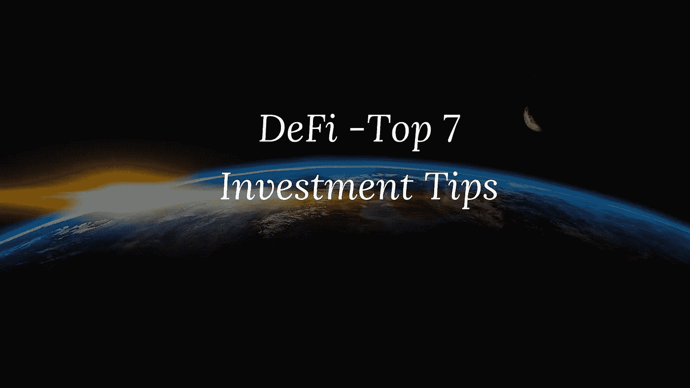

# DeFi-7 大投资技巧

> 原文：<https://medium.com/coinmonks/defi-top-7-investment-tips-9999d1679da2?source=collection_archive---------2----------------------->

看我在[语音](https://app.voice.com/post/@tulip/cryptowriter-defi-top-7-investment-tips-1602159675-1)上的原创文章。

最近几天，分散金融(DeFi)吸引了很多关注。 [Uniswap](https://uniswap.org/) 和[大院](https://compound.finance/)走在了创新的前列。

## 一些值得注意的发展包括:

*   DeFi 的市值已超过 100 亿美元
*   Uniswap 已经[超过比特币基地](https://thedailychain.com/uniswap-24-hour-trading-volume-surpasses-coinbase?ref=hackernoon.com)
*   渴望金融已经超过了比特币的单价，达到了 43000 美元的历史新高

然而，在 DeFi 景观中有一个隐藏的黑暗点。流氓和黑客玷污了市场。人们已经损失了大量的金钱。了解危险区域并保持安全是很重要的。

这里有 7 个小贴士可以帮助你做出更好的农业决策:

1.高 APY 并不总是意味着高回报:人们首先会爱上高 APY。许多项目提供大于 10，000%的初始 APY。这似乎是一个快速增加你的钱的方法。获得两个问题的答案:

*   **高产会持续吗？**查看高收益时间表。在最初几天，供应过度膨胀，导致高产量。快速继承也有不利之处。然而，这在短时间内急剧下降。
*   **你能盈利销售吗？**在许多情况下，即使你能在最初的高通胀时期赚得一大笔钱，你也不能出售代币，因为其中大部分将被锁定。检查您可以出售多少赢取的代币。

示例: [Luaswap](https://luaswap.org/#/) 中 75%的令牌在前 16 个月被锁定。

2.**投资有实际用例的令牌:**问问自己，为什么需要项目给的令牌。对于许多项目来说，治理被高估了。除了治理，令牌还有其他用途吗？

知道可以用 UNI 做抵押在其他平台贷款吗？那才是真正的实用。这给出了单位价值。许多其他的 DeFi 代币是没有适当效用的金钱掠夺者，注定要堕落。

3.**只投资被审计的项目**:经常检查项目是否由知名机构审计。项目的代码必须被审计。

当 Andre Cronje 透露他与“生产中”项目 Eminence 有联系时，人们开始根据他的良好声誉投入资金。然而，Eminence 仍然是一项正在进行的工作，未经审计。不可避免地，一名黑客从[项目](https://financemagnates.com/cryptocurrency/news/hackers-stole-15-million-from-andre-cronjes-new-defi-project)中窃取了 1500 万美元。

著名的审计师包括 Quantstamp、Trail of Bits 等。

4.**在你的利润计算中包括汽油费**:注意，在汽油费高的这些日子里，你的实际投资是

*(在 Uniswap 中购买代币对+在 Uniswap 中批准流动性池对+在 Yield Farming 协议中批准 LP 赌注+在 Yield Farming 协议中实际赌注+在 Yield Farming 协议中取消赌注+在 Uniswap 中出售 Yield 代币+在 Uniswap 中移除流动性)的费用*

你不能忽视这笔总费用。在你的利润计算中一定要包括这一点。

5.你什么时候进入高产农业项目？如果你很晚才进入一个项目，可能早到一天，这并不是说已经产生了销售压力。这是第一天的利润。最初几天过后，市场往往会下跌。在这一点上决定你是否要进入。

**6。考虑非永久性损失:**

随着产量养殖代币价格下跌，Uniswap 会调整您在流动性池中配对的代币数量。你的产量农业代币数量将增加，你的第二代币(假设 ETH)将减少。1 .这将是你的原始池提交的比例。你的总价值将会减少，如果你只是持有这 2 个代币的话。但是，请注意，在您移除流动性之前，您不会招致非永久性损失。资金池中的长期流动性供应可能会解决这个问题。

7.**始终计算总供应量的价格:**在最初的日子里，由于发行量少，代币价格一直很高。合乎逻辑的是，随着未来几天更多代币流通，价格将会下跌。确定您投资的项目在 coinmarketcap 排名中的位置(sat Top 100–200)，并尝试根据 CMC 排名中的另一个类似供应项目确定其单价。你会惊讶地发现单价会非常低！

**结论**

DeFi 是一个高风险游戏。只投资你准备损失的金额。只投资可信的项目。不要在 FOMO。留出一点钱作为学习的费用。

**跟着我**

https://twitter.com/rumadas123➡推特:

https://www.linkedin.com/in/ruma-das-a1439320/➡领英: