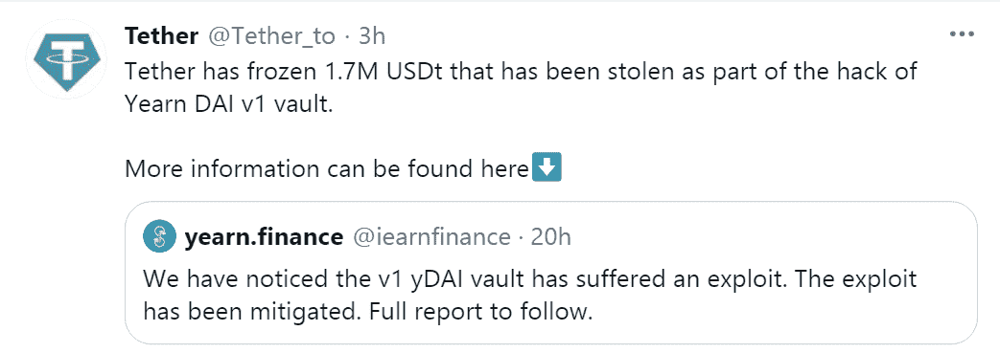

# 2021 年的定义趋势和黑客

> 原文：<https://medium.com/coinmonks/defi-trends-hacks-of-2021-a2142cab3669?source=collection_archive---------4----------------------->

## 那会让你毛骨悚然

人们在不知道潜在风险的情况下参与了 DeFi 传奇！

分散金融俗称“DeFi”，旨在扰乱银行等传统金融机构，与加密货币进行交易，其中大部分在以太坊区块链上运行。

最近的 DeFi 热潮带来了各种相关的风险。每个 DeFi 项目都有不同程度的风险，主要风险类型有:技术风险、资产风险和产品风险。

作为初学者，任何人都应该意识到任何平台所引发的“危险信号”。自从 DeFi 在最近十年爆发以来，我们已经看到数以亿计的资金因各种黑客攻击、盗窃、诈骗和系统故障而损失。

以下是今天的情况:仅在 8 月 21 日一个月内发生的值得注意的 DeFi 黑客事件:

*   poly network——6.13 亿美元(臭名昭著的最大密码盗窃案！)
*   日本的流动性全球交易所——9400 万美元
*   棒冰金融——2500 万美元
*   朋克协议——890 万美元
*   对 XSURGE DeFi 的快速贷款攻击——500 万美元

来源— [此处](https://decrypt.co/78146/defi-has-lost-474-million-hacks-fraud-2021-report)

这些只是 2021 年上半年发生的突出黑客攻击清单中的几个数字。

在接下来的章节中，我们将向您介绍各种 DeFi 趋势，以及在 DeFi 领域掀起风暴的黑客。这将有助于你更明智地做出与 DeFi 相关的决定。

## **嘿，迪菲！2021 年你过得怎么样？**

最近十年见证了 DeFi 经济的急剧上升。据 [**DeFi 脉**](https://defipulse.com/)**总成交量锁定(TVL)本文写作时触及**829.5 亿美元**。尽管 DeFi 正在快速发展，但 DeFi 领域的项目仍有很大的创新空间。**

****

***来源:*[*https://defipulse.com/*](https://defipulse.com/)**

**如果这是真的，那么我们必须让我们了解 2021 年值得关注的最新 DeFi 趋势:**

## ****非可替代代币****

**NFTs(或)不可替换令牌是代表现实世界对象(如艺术、音乐、游戏项目或视频)的数字资产。除了收藏品和艺术品，NFT 还有许多其他应用。利用 NFT 力量的其他部门有:**

*   **社交网络**
*   **电子商务**
*   **游戏，以及**
*   **时尚**

**这些只是 NFTs 的几个用例，但是这个领域在未来几年还没有发生巨大的变化。**

## ****流动性挖掘****

****

**流动性挖掘(或)收益农业利用加密货币为分散式交易所(dex)提供流动性。**

**复合融资协议是流动性挖掘的最新例子之一。去年，COMP 推出了一个名为 COMP 的治理令牌，从那时起，流动性挖掘成为一种不可战胜的趋势。**

## ****stable coins—“2021 年的烫手山芋”****

**稳定货币是与任何基础资产挂钩的数字货币，如国家货币(或)黄金等贵金属。这给了 Stablecoins 在安全性、透明度和隐私方面的自由。**

**自 2019 年初以来，stablecoins 的营业额大幅增长。2021 年 4 月，它将阶梯从每天数十亿美元扩大到 1000 亿美元的中位数，并在 4 月中旬达到 2500 亿美元。**

**不久前，我们目睹了一场“*稳定币入侵*”。**

**在全球范围内，大约有 200 个 stablecoins 已经发布或正在开发中。然而，他们突然增长的原因之一是他们可靠的点对点(P2P)交易环境。它消除了使用任何不稳定的加密货币(如比特币)进行交易的需要。**

**在最近的[报告](https://messari.io/article/q2-21-defi-review)中，梅萨里透露，2021 年，Stablecoin 在 Q2 的活动急剧增加。**

****

**这只是让经济陷入风暴的几大趋势的短暂一瞥。到目前为止，2021 年是分散财政的典范之年，我们可以保证 2022 年不会比这更糟。DeFi enthus 广泛参与的原因有很多，但与此同时，不确定性的阴云一直笼罩着各种 DeFi 项目。**

## **席卷 DeFi 世界的攻击！**

**从 2021 年初开始，我们已经开始目睹导致各利益相关方损失数百万美元的黑客攻击和利用。显然，从 [**值得信赖的审计公司**](https://audits.quillhash.com/smart-contract-audit) 获得审计的平台不太容易被黑客攻击。DeFi 中锁定的总价值(TVL)是有史以来最高的，与 DeFi 相关的开发也是如此。**

**让我们来看看过去几个月发生在各种 DeFi 平台上的一些著名攻击:**

****渴望金融剥削—2011 年 2 月 4 日****

****利用方式:**闪贷**

****资金损失:**1100 万美元**

**渴望。金融业成为大规模闪贷攻击的受害者，损失总计超过 1000 万美元。攻击者获得 1.7 米 USDT，513K 戴，506K 3CRV。下面的截图描述了攻击者从每笔交易中获得的 3CRV 利润。**

****

**向往。财务团队及时披露了事件并减轻了未来损失:yDAI、yTUSD、yUSDc 和 yUSDT 保险库通过调用 setMin(0)函数被关闭。**

****

**它清楚地概述了闪贷是最大的收益农业风险，可能会使 DeFi 平台处于风险之中。必须强调及时检测此类漏洞的重要性，并进行彻底分析以防止其他 DeFi 平台受到潜在威胁。**

****猫鼬金融剥削——2011 年 3 月 4 日****

****利用方法:**拉地毯**

****资金损失:**:3100 万美元**

**DeFi project Meerkat Finance 的 3100 万美元加密资产被抽走。这是一个在币安智能链上运行的产量农业协议。攻击是在 BSC 上启动后仅一天执行的。**

**被抽走的资金被转移到多个新的区块链地址。该项目随后耗费了 1300 万 BUSD &约 7.3 万 BNB，相当于目前的 3100 万美元。**

**该报告在 BSC 社区页面上公开发布后不久，许多用户强调了他们面临的风险，并向 crypto exchange 寻求解决方案。**

****

**嗯，有疑云表明这次袭击可能不是一次简单的袭击。通过链上数据点报告，它说，真正的 Meerkat 的部署帐户被付诸实践，而改变智能合同。**

****武力攻击—2011 年 4 月 4 日****

****漏洞利用方法:**工程疏忽**

****资金损失:**$ 36.7 万**

**Force 被定义为量化对冲基金，是一个协议，也是一个去中心化的自治组织。它旨在为其社区提供更高收益的 DeFi 机会。**

**ForceDAO 环境中两个组件的不匹配使得这种攻击成为可能。**

****

**在攻击过程中，UniSwap 和 SushiSwap 上的 Force、xForce 和 Force/ETH LP 处于危险之中。ForceDAO 生态系统中的漏洞很容易识别，并且可以通过深入的智能合同审计来修复。**

**如果由值得信赖的公司进行智能合同审计，那么一旦转移成功，就可以识别/检测到错误处理代码的缺失。**

## ****有人来救他们吗？****

**2020 年对 DeFi 来说是反响强烈的一年，但 2021 年的 DeFi 正在上升，随着 TVL 价值的上升，它也吸引了攻击者的注意力。在接下来的一年里，赌注应该会越来越高。**

**随着不确定性和不安全性的阴云，在各种平台上获得用户的信任变得越来越困难。**

**审计公司还应该利用测试工具对被审计的智能合同进行深入分析。许多领先的 DeFi 解决方案提供商已经与知名审计公司合作来保护他们的金库。**

## ****最终拍板！****

**对于 DeFi 来说，这是重要的一年，各种 DeFi 协议显示了巨大的创新和可扩展性。毫无疑问，DeFi 有可能扰乱全球经济中的金融服务。**

**尽管这是一个新兴的行业&各种开发仍处于开始阶段。像 [**QuillAudits**](https://audits.quillhash.com/smart-contract-audit) 这样的公司建议用户在处理 DeFi 仪器时要小心谨慎，并在做出任何决定之前进行初步分析。虽然一次审计不能确保您的审计万无一失，但至少有必要对您的智能合同进行两到三次审计。不仅如此，各种企业已经在 bug 奖励计划上下了很大的赌注来寻找关键缺陷。**

> **加入 Coinmonks [电报频道](https://t.me/coincodecap)和 [Youtube 频道](https://www.youtube.com/channel/UCbyDhTbOiKh2iUMKBi4-4Zg)了解加密交易和投资**

## **另外，阅读**

*   **[尤霍德勒 vs 科恩洛 vs 霍德诺特](/coinmonks/youhodler-vs-coinloan-vs-hodlnaut-b1050acde55a) | [Cryptohopper vs 哈斯博特](https://blog.coincodecap.com/cryptohopper-vs-haasbot)**
*   **[币安 vs 北海巨妖](https://blog.coincodecap.com/binance-vs-kraken) | [美元成本平均交易机器人](https://blog.coincodecap.com/pionex-dca-bot)**
*   **[新加坡十大最佳加密交易所](https://blog.coincodecap.com/crypto-exchange-in-singapore) | [购买 AXS](https://blog.coincodecap.com/buy-axs-token)**
*   **[投资印度的最佳密码](https://blog.coincodecap.com/best-crypto-to-invest-in-india-in-2021) | [HitBTC 评论](/coinmonks/hitbtc-review-c5143c5d53c2)**
*   **[加拿大最好的加密交易机器人](https://blog.coincodecap.com/5-best-crypto-trading-bots-in-canada) | [赌注加密](https://blog.coincodecap.com/staking-crypto)**
*   **[如何在印度购买比特币？](/coinmonks/buy-bitcoin-in-india-feb50ddfef94) | [瓦济克斯评论](/coinmonks/wazirx-review-5c811b074f5b)**
*   **[比特币主根](https://blog.coincodecap.com/bitcoin-taproot) | [Bitso 回顾](https://blog.coincodecap.com/bitso-review) | [排名前 6 的比特币信用卡](/coinmonks/bitcoin-credit-card-bc8ab6f377c6)**
*   **[最佳免费加密信号](https://blog.coincodecap.com/free-crypto-signals) | [YoBit 评论](/coinmonks/yobit-review-175464162c62) | [Bitbns 评论](/coinmonks/bitbns-review-38256a07e161)**
*   **[OKEx 回顾](/coinmonks/okex-review-6b369304110f) | [Kucoin 交易机器人](/coinmonks/kucoin-trading-bot-automate-your-trades-8cf0ca2138e0) | [期货交易机器人](/coinmonks/futures-trading-bots-5a282ccee3f5)**
*   **[AscendEx Staking](https://blog.coincodecap.com/ascendex-staking)|[Bot Ocean Review](https://blog.coincodecap.com/bot-ocean-review)|[最佳比特币钱包](https://blog.coincodecap.com/bitcoin-wallets-india)**
*   **[op 付费加密货币和区块链课程](https://blog.coincodecap.com/blockchain-courses)**
*   **[在美国如何使用 BitMEX？](https://blog.coincodecap.com/use-bitmex-in-usa) | [BitMEX 评论](https://blog.coincodecap.com/bitmex-review)**
*   **[最佳期货交易信号](https://blog.coincodecap.com/futures-trading-signals) | [流动性交易所评论](https://blog.coincodecap.com/liquid-exchange-review)**
*   **[南非的加密交易所](https://blog.coincodecap.com/crypto-exchanges-in-south-africa) | [BitMEX 加密信号](https://blog.coincodecap.com/bitmex-crypto-signals)**
*   **[MoonXBT 副本交易](https://blog.coincodecap.com/moonxbt-copy-trading) | [阿联酋的加密钱包](https://blog.coincodecap.com/crypto-wallets-in-uae)**
*   **[雷米塔诺评论](https://blog.coincodecap.com/remitano-review)|[1 英寸协议指南](https://blog.coincodecap.com/1inch)**
*   **[MoonXBT vs Bybit vs 币安](https://blog.coincodecap.com/bybit-binance-moonxbt) | [Arbitrum:第二层解决方案](https://blog.coincodecap.com/arbitrum)**
*   **[买 PancakeSwap(蛋糕)](https://blog.coincodecap.com/buy-pancakeswap)|[matrix export Review](https://blog.coincodecap.com/matrixport-review)**
*   **[最佳免费加密信号](https://blog.coincodecap.com/free-crypto-signals) | [YoBit 评论](/coinmonks/yobit-review-175464162c62) | [Bitbns 评论](/coinmonks/bitbns-review-38256a07e161)**
*   **[OKEx 评论](/coinmonks/okex-review-6b369304110f) | [Kucoin 交易机器人](/coinmonks/kucoin-trading-bot-automate-your-trades-8cf0ca2138e0) | [期货交易机器人](/coinmonks/futures-trading-bots-5a282ccee3f5)**
*   **[AscendEx Staking](https://blog.coincodecap.com/ascendex-staking)|[Bot Ocean Review](https://blog.coincodecap.com/bot-ocean-review)|[最佳比特币钱包](https://blog.coincodecap.com/bitcoin-wallets-india)**
*   **[霍比审核](https://blog.coincodecap.com/huobi-review) | [OKEx 保证金交易](https://blog.coincodecap.com/okex-margin-trading) | [期货交易](https://blog.coincodecap.com/futures-trading)**
*   **[比特币基地赌注](https://blog.coincodecap.com/coinbase-staking) | [Hotbit 评论](/coinmonks/hotbit-review-cd5bec41dafb) | [KuCoin 评论](https://blog.coincodecap.com/kucoin-review)**
*   **[最佳加密交易信号电报](/coinmonks/best-crypto-signals-telegram-5785cdbc4b2b) | [MoonXBT 评论](/coinmonks/moonxbt-review-6e4ab26d037)**
*   **[Coinswitch 俱吠罗评论](/coinmonks/coinswitch-kuber-review-1a8dc5c7a739) | [电网交易机器人](https://blog.coincodecap.com/grid-trading) | [比特币基地收费](/coinmonks/coinbase-fees-831e77d4f2c5)**
*   **[Bitget 回顾](https://blog.coincodecap.com/bitget-review)|[Gemini vs block fi](https://blog.coincodecap.com/gemini-vs-blockfi)|[OKEx 期货交易](https://blog.coincodecap.com/okex-futures-trading)**
*   **[OKEx vs KuCoin](https://blog.coincodecap.com/okex-kucoin) | [摄氏替代品](https://blog.coincodecap.com/celsius-alternatives) | [如何购买 VeChain](https://blog.coincodecap.com/buy-vechain)**
*   **[币安期货交易](https://blog.coincodecap.com/binance-futures-trading)|[3 comas vs Mudrex vs eToro](https://blog.coincodecap.com/mudrex-3commas-etoro)**
*   **[在印度利用加密套利赚取被动收入](https://blog.coincodecap.com/crypto-arbitrage-in-india)**
*   **[德国最佳加密交易所](https://blog.coincodecap.com/crypto-exchanges-in-germany) | [WazirX P2P](https://blog.coincodecap.com/wazirx-p2p)**
*   **[如何购买 Monero](https://blog.coincodecap.com/buy-monero) | [IDEX 评论](https://blog.coincodecap.com/idex-review) | [BitKan 交易机器人](https://blog.coincodecap.com/bitkan-trading-bot)**
*   **[币安 vs 比特邮票](https://blog.coincodecap.com/binance-vs-bitstamp) | [比特熊猫 vs 比特币基地 vs Coinsbit](https://blog.coincodecap.com/bitpanda-coinbase-coinsbit)**
*   **[如何购买 Ripple (XRP)](https://blog.coincodecap.com/buy-ripple-india) | [非洲最好的加密交易所](https://blog.coincodecap.com/crypto-exchange-africa)**
*   **[非洲最佳加密交易所](https://blog.coincodecap.com/crypto-exchange-africa) | [胡交易所评论](https://blog.coincodecap.com/hoo-exchange-review)**
*   **[eToro vs robin hood](https://blog.coincodecap.com/etoro-robinhood)|[MoonXBT vs Bybit vs Bityard](https://blog.coincodecap.com/bybit-bityard-moonxbt)**
*   **[Stormgain 回顾](https://blog.coincodecap.com/stormgain-review) | [Bexplus 回顾](https://blog.coincodecap.com/bexplus-review) | [币安 vs Bittrex](https://blog.coincodecap.com/binance-vs-bittrex)**
*   **[Bookmap 评论](https://blog.coincodecap.com/bookmap-review-2021-best-trading-software) | [美国 5 大最佳加密交易所](https://blog.coincodecap.com/crypto-exchange-usa)**
*   **[如何在 FTX 交易所交易期货](https://blog.coincodecap.com/ftx-futures-trading) | [OKEx vs 币安](https://blog.coincodecap.com/okex-vs-binance)**
*   **[如何在势不可挡的域名上购买域名？](https://blog.coincodecap.com/buy-domain-on-unstoppable-domains)**
*   **[印度的秘密税](https://blog.coincodecap.com/crypto-tax-india) | [altFINS 审查](https://blog.coincodecap.com/altfins-review) | [Prokey 审查](/coinmonks/prokey-review-26611173c13c)**
*   **[Blockfi vs 比特币基地](https://blog.coincodecap.com/blockfi-vs-coinbase) | [比特坎评论](https://blog.coincodecap.com/bitkan-review) | [币安评论](/coinmonks/binance-review-ee10d3bf3b6e)**
*   **[Coldcard 评论](https://blog.coincodecap.com/coldcard-review) | [BOXtradEX 评论](https://blog.coincodecap.com/boxtradex-review)|[unis WAP 指南](https://blog.coincodecap.com/uniswap)**
*   **[阿联酋 5 大最佳加密交易所](https://blog.coincodecap.com/best-crypto-exchanges-in-uae) | [SimpleSwap 评论](https://blog.coincodecap.com/simpleswap-review)**
*   **[购买 Dogecoin 的 7 种最佳方式](https://blog.coincodecap.com/ways-to-buy-dogecoin) | [ZebPay 评论](https://blog.coincodecap.com/zebpay-review)**
*   **[美国最佳加密交易机器人](https://blog.coincodecap.com/crypto-trading-bots-in-the-us) | [不断回顾](https://blog.coincodecap.com/changelly-review)**
*   **[huo bi 的加密交易信号](https://blog.coincodecap.com/huobi-crypto-trading-signals) | [BitMEX 评论](https://blog.coincodecap.com/bitmex-review)**