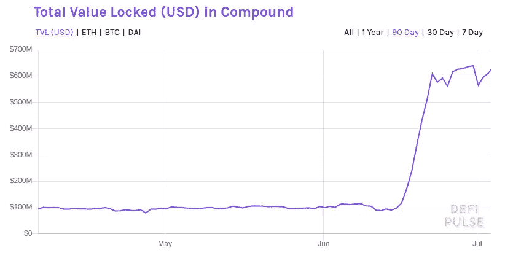
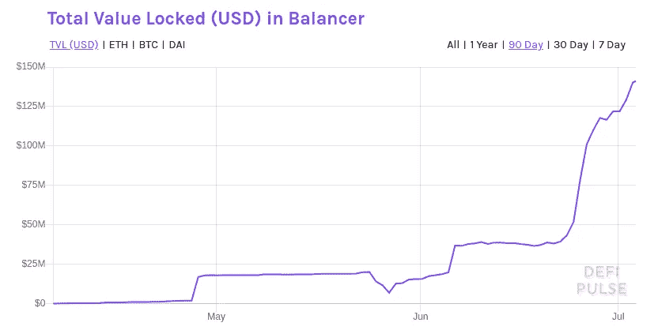
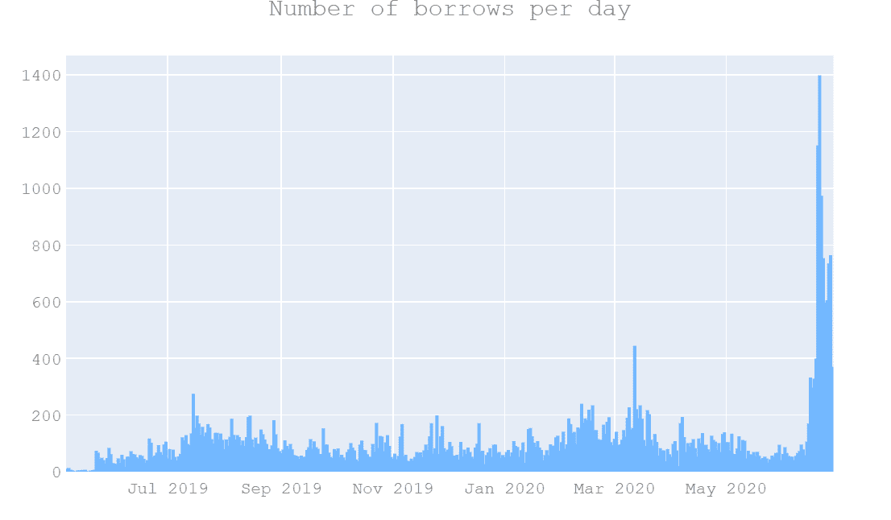

# 低产量农业和流动性采矿

> 原文：<https://medium.com/coinmonks/defi-yield-farming-and-liquidity-mining-6463d6cdf4fc?source=collection_archive---------6----------------------->

DeFi 镇出现了一种新趋势，有人称之为“高产农业”，有人称之为“流动性开采”。那些持有加密货币的人现在打算回归农业。

# 什么是产量农业？

当你用你的资产为协议提供流动性以赚取利息/费用或额外的资产时，这就是收益农业。也叫流动性挖掘。

> *高产农业激励用户，为协议提供流动性。*

# 产量农业是如何运作的？

假设有一个协议，帮助用户兑换不同的加密货币。然而，为了实现交易，该协议将要求流动性。如果没有资产，人们怎么去交易代币。

但是如何获得他的流动性呢？在传统市场中，你要向对冲基金和其他做市商支付一定费用，才能获得这种流动性。但是在 DeFi 中，你可以通过提供任何人为协议提供流动性来使这个系统民主化，以换取价值象征和/或利息和/或费用。

> *DeFi Yield 农业为任何愿意提供流动性的人创造价值。*

如前所述，流动性开采或产量耕作是在传统市场中实现流动性的一种古老技术。在 crypto 中， [Hummingbot 为交易所提供流动性提供奖励](https://hummingbot.io/blog/2019-11-liquidity-mining/)。然而，在 DeFi，这一趋势在 2020 年开始流行。

让我们看一些协议支持高产农业的例子。

# 复合产量农业(复合采矿)

2020 年 6 月，[复合协议](https://compound.finance/)启动了产量养殖计划。Compound 是一个自动化的货币市场协议，使用它您可以借出或借入数字资产。到目前为止，复合协议主要由复合团队管理。但是为了实现去中心化，Compound 推出了一个 COMP 治理令牌，它将用于治理协议。

然而，问题是如何分配红利令牌？为此，复合团队推出了一个流动性挖掘计划，其中任何使用复合协议进行借贷的人都将按比例获得报酬令牌。每天共发放 2880 份红利。

这样，每个人都有机会通过向协议提供流动性来获得补偿令牌。这也使得 COMP 有价值，因为当你在协议中锁定你的资产时，你在游戏中有皮肤；因此，协议治理对您来说变得至关重要。

Change in value locked in Compound after launching COMP mining program — [source](https://defipulse.com/)

# Synthetix 流动性采矿公司(SNX)

谈到低产农业，Synthetix 是一个 T2。2019 年，Synthetix 启动了一项流动性挖掘计划，在该计划中，你可以通过锁定 Snythetix 协议中的资产来赚取 SNX 代币。

你锁定你的资产并创造 sUSD(合成美元)。然后你可以用 sUSD 去买其他 synth(Synthetix 资产)。

为了实现这一功能，Synthetix protocol 需要流动性，该团队通过用 SNX 令牌激励流动性提供者来获得流动性。

# 曲线产量农业(CRV)

[曲线](https://www.curve.fi/)是另一个项目，是[稳定收益](https://blog.coincodecap.com/stablecoins-a-simple-overview)的货币市场协议。使用 Curve，用户可以获得最佳汇率，并以分散的方式兑换稳定的货币。查看下面的视频，了解 Curve 的流动性挖掘计划是如何工作的。

# 平衡器流动性挖掘(BAL)

[Balancer](https://balancer.finance/) 是另一个协议，任何人都可以创建流动性池，以便为不同的资产提供最佳的汇率。这些池包含不同类型的数字资产。然而，要实现这一点，协议需要流动性，因此平衡器现在用 BAL 令牌激励流动性提供者。

Balancer liquidity mining launched on 23 june

# DeFi 产量农业风险

产量农业看起来非常有吸引力，因为其中一些协议每年提供超过 50%的回报。然而，高产农业有许多风险。

## 智能合约错误

DeFi 协议是使用[智能合约](https://blog.coincodecap.com/tag/smart-contact)实现的，这些智能合约对每个人都是公开的。因此，总是存在漏洞浮出水面的风险，智能合约被利用来窃取资金。

例如，最近一名黑客利用平衡器协议窃取了价值 50 万美元的令牌。这是平衡器协议的智能合约在处理通货紧缩令牌时的一个错误。你可以在这里阅读更多信息[。](/@peckshield/balancer-hacks-root-cause-and-loss-analysis-4916f7f0fff5)

这些协议中的大多数都通过了适当的智能合同审计。然而，安全审计并不能完全消除风险。因此，始终意识到风险并在这些情况下保护自己，使用像 [Nexus mutual](https://nexusmutual.io/) 这样的解决方案。

## 稳定硬币钉失败

几乎所有的 DeFi 协议都使用 stablecoins。一些协议，例如 Curve，仅仅依赖于稳定的曲线。然而，由于不同的原因，这些挂钩总是有失败的风险。例如，MakerDAO 团队分析了由于复合协议的治理变更而导致 DAI peg 失败的[风险。](https://forum.makerdao.com/t/upcoming-comp-farming-change-could-impact-the-dai-peg/2965)

此外，这些协议使用[系绳稳定币，没有可信的钉住美元的历史](https://www.forbes.com/sites/francescoppola/2019/03/14/tethers-u-s-dollar-peg-is-no-longer-credible/#432caf6d451b)。

> *在电除颤器中使用系绳是电除颤器方案的系统性风险。*

## 管理密钥

管理密钥控制智能合约的不同方面。例如，管理键可以暂停智能合同，更改不同的参数，锁定用户的资金，升级智能合同等。

DeFi 协议的开发者控制这些密钥。因此，总是存在集中接管协议的风险。为了消除这种风险，加班协议正在向 DAOs(去中心化自治组织)发展。

## 流动性紧缩

当大量特定资产被锁定在不同的协议中以赚取收益时。它会造成市场流动性紧缩，使资产高度不稳定。这可以直接影响不同协议的资产价格和收益率机制。

## 杠杆产量农业

像 [DeFi flash loans](https://blog.coincodecap.com/what-are-flash-loans-on-ethereum) 这样的创新现在使得杠杆收益农业成为可能。例如，使用 [InstaDapp](https://instadapp.io/) ，点击几下就可以“最大化$COMP mining”。你可以利用你的资产 4 倍，但这涉及到很大的清算风险。此外，价格波动还会清算你在协议中锁定的资产。观看以下视频，了解如何使用 InstaDapp 最大化$COMP mining。

## 用户行为变化

此外，当协议强烈激励用户利用协议功能时，存在用户行为改变的巨大风险。例如，在 COMP 的情况下，用户现在激励从协议中借或借，而不是因为他们需要它；相反，他们想赚更多的报酬。这些探索在没有正确分析的情况下会导致协议的频繁变化。

下图显示了由于复合流动性挖掘计划，每天增加的贷款数量。

[Source](/coinmonks/are-compound-defi-users-riskier-since-comp-rewards-885f0097407c)

# 生产农具

虽然每个协议都提供了一个流动性挖掘的接口，但也有第三方应用程序，如 [Zerion](https://zerion.io?utm_source=coincodecap) 和 InstaDapp，可以实现额外的功能。例如，InstaDapp 发布了一个简单的工具，使用闪贷和复合来利用采矿。使用该工具，您可以通过将资产利用 4 倍来“最大化复合开采”。

# 结论

DeFi 正在使高产农业民主化。任何人都可以将自己的资产投入到工作中，并获得传统市场无法提供的收益。然而，这里涉及的风险更大，如果资金丢失，您将无法追回。所以要谨慎，只把这些协议看做实验。

> *可编程货币正在使金融民主化。迷人的未来在我们面前。*

*原载于 2020 年 7 月 3 日 https://blog.coincodecap.com***。**

> *[直接在您的收件箱中获得最佳软件交易](https://coincodecap.com/?utm_source=coinmonks)*

**