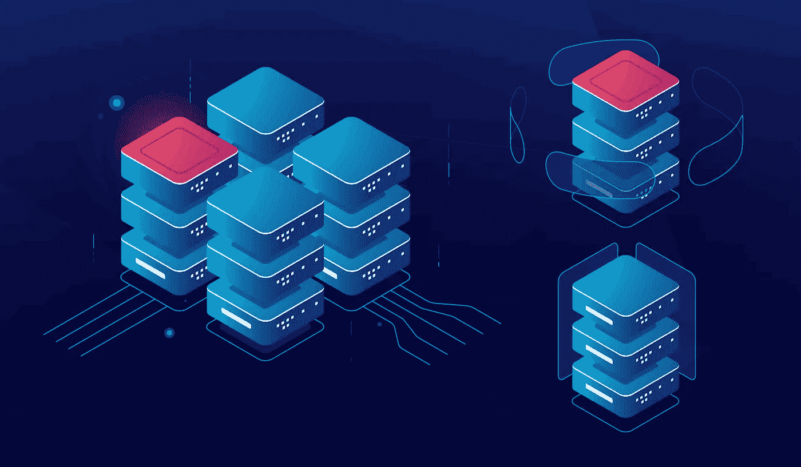

# 闪电网络的定义及其工作原理

> 原文：<https://medium.com/coinmonks/definition-of-lightning-network-and-how-it-works-7c957fdf273e?source=collection_archive---------4----------------------->

Definition of Lightning Network and how it works

闪电网络是用于比特币的第二层技术诀窍，它利用微支付渠道来扩展其区块链的功能，以提高交易效率。在闪电网络上进行的交易比在比特币区块链 [on-chain](https://cryptoworldfinace.blogspot.com/2021/12/on-chain-vs-off-chain-work-on-bitcoin.html) 上进行的交易更快，成本更低，而且没有任何困难。

通过将交易从基本的区块链中移除，并使其成为链外的 T2，闪电网络过去被设计成解除比特币区块链的拥塞，并限制相关的交易费用。闪电网络还可以用于习惯不同种类的涉及加密货币之间交换的链外交易。例如，它有利于促进原子交换，允许一种加密货币被交换为另一种加密货币，而不涉及中介，如加密货币交易所。

*   闪电网络是一种技术解决方案，旨在通过引入账外交易来解决比特币区块链的交易速度问题。
*   与区块链非常相似，闪电网络解除了中央机构的中介作用，即负责路由交易的银行。
*   闪电网络曾经在一篇论文中被首次正式阐述

# 什么是闪电网络

闪电网络最初是在 Joseph Poon 和 Thaddeus Dryja 的帮助下提出的，由于时间的原因，一直没有得到改进。lights 社区过去被设计来解决的问题是比特币缓慢的交易时间和吞吐量。如果比特币想要成为一种日常交易的媒介，它将希望达到每秒数万或数千堆的交易，堪比信用评分扑克牌或数字还款网络。由于其分散科学的性质，需要网络内所有节点的共识，比特币在目前的状态下受到这些问题的拖累。

例如，如果比特币社区中的交易数量激增，批准和存储交易将变得非常耗时。交易数量的增加还要求执行涉及比特币的交易所需的计算机系统的处理能力提高几个数量级。此外，计算这些事实的基本力量是巨大的，这使得为日常交易保留比特币的成本高得惊人。

闪电网络(lightning network)提议借助在比特币的基本区块链上生长第二层来解决缩放问题。第二层由事件或比特币用户之间的几个价格渠道组成。闪电网络通道是双方之间的交易机制。使用通道，事件可以从每个其他事件进行或获得偿还。这些交易的处理方式不同于比特币区块链上的广泛交易。当两个事件打开和关闭一个通道时，它们在主区块链上是唯一最新的。

在这两个行为之间，事件可以在它们之间转移美元，除了通知基本面区块链它们的活动之外，看不到尽头。这种方法大大加快了交易的速度，因为现在不需要借助区块链内的所有节点来认证所有交易。一系列事件之间的独立充电通道混合在一起，形成一个闪电节点网络，可以在它们之间路由交易。多个价格渠道之间的互联最终形成了闪电网络。

> 阅读:[区块链技术将革命供应链](https://cryptoworldfinace.blogspot.com/2021/12/blockchain-technology-will-revolution.html)
> [比特币交易的链上与链下工作](https://cryptoworldfinace.blogspot.com/2021/12/on-chain-vs-off-chain-work-on-bitcoin.html)

# 闪电网络是如何工作的

假设爱丽丝打开了一个频道，里面有她最喜欢的浓缩咖啡，并在里面存入了价值 1000 美元的比特币。她与 espresso save 的交易直接归因于她拥有直接的渠道。Bob 在他最常光顾的杂货店开有任何其他频道，他另外从 Alice 的商店购买浓咖啡。浓缩咖啡店 Alice 和 Bob 之间的联系确保 Alice 可以使用她在浓缩咖啡店的稳定收入从 Bob 的商店购买杂货。类似地，Bob 可以使用他的杂货店 save stability 来与 Alice 网络中的公司进行行为交易。

如果 Bob 关闭了他与杂货店的频道，并且在 espresso save 和杂货店之间没有不同的客户，那么 Alice 将不得不打开与杂货店的每个其他频道，以便在那里进行购买。通过这种方式，一个交易网络被创建并以分散的方式在几个闪电节点之间路由。

在更高的技术层面上，闪电网络利用智能合约和多重签名脚本来实现其愿景。当一个或每个事件资助一个渠道时，创建一个初步交易，称为资助交易。在通常的多重签名环境中，两个 grasp 密钥(一个公钥和一些私钥)在开始时交换。这一改变允许资金的进入和支出。

然而，在闪电节点的情况下，签名现在不被交换。这是为了防止通过基本区块链对资金交易的支出进行诊断。相反，这两个事件交换单个密钥，该密钥用于验证它们之间的支出交易(也称为专用交易)。

这两个事件可以习惯于它们自己和闪电网络上的不同节点之间的无限奉献事务。只有当它们之间的通道关闭时，它们才交替使用它们的抓取键。

# 闪电网络使用费

是的，使用闪电网络需要支付交易费用。它们是闪电节点之间路由费用统计的路由成本和比特币打开和关闭通道的交易价格的混合物。

# 闪电网络的问题

闪电网络本应是去中心化的，但它最明显的问题是，它应该会导致复制当今经济体系中的轮辐式人体模型。在当今的模式中，银行和经济机构是所有交易发生的基本中介。

通过与其他公司建立更开放的连接，知名公司的 lightning 节点可能会成为网络中可比较的集线器或集中式节点。一个这样的集线器的故障可能会毫无困难地使相当大的一个组件或整个网络崩溃。

前面提到的另一个大问题是，为了保持网络的经济可行性，有必要提高价格。现在，这不仅仅对保留闪电网络本身的节点是真实的，然而，此外，转化到网络的无疑更大的比特币费用的冲击费用也是真实的。

此外，闪电网络被认为容易遭到黑客攻击和盗窃，因为它们需要一直在线。因此，不流血的现金存储现在不是一个选择，因为网络不再允许它。

# 闪电网络的优点

闪电网络是更快和更具成本效益的交易，使小额支付成为可能。如果没有闪电网络，用户将不得不为一个简单的交易支付过高的价格，然后等待半个小时或更多的时间来验证。对于较小的交易，等待时间较长，因为矿工选择验证大型交易，因为他们这样做可以获得较大的回报。

闪电网络与比特币区块链有关，电流就像它的顶峰上的一层。闪电网络的连接能力仍然得益于比特币的安全协议。然后，用户可以选择主要的区块链进行更大的交易，并在不影响安全的情况下，用闪电网络的链外交易进行较小的交易。闪电网络收费频道还允许非公开交易，因为旁观者无法偷看每个男人或女人的交易，这是正常套餐的唯一替代方案。

加密货币的粉丝们还额外检查了原子交换，这是一种将一种加密货币交换到另一种加密货币的行为，禁止使用 0.33 方或交换。原子交换比交换更有利，因为它们提供了几乎即时的交换，几乎没有费用或钱包转移。

> 阅读:[了解认证区块链安全专家(CBSP)](https://cryptoworldfinace.blogspot.com/2021/11/learn-about-certified-blockchain.html)

# 闪电网络的缺点

一个人必须收集一个非常适合闪电网络的钱包来真正利用它。虽然发现一个与 Lightning 网络兼容的钱包很容易，但人们希望从常规的比特币钱包中为其注资。从普通到闪电网络钱包的初步交易收取费用，因此用户正在投入一些比特币来参与协议。在现金进入闪电网络钱包后，客户应该锁定他们的比特币，以创建一个收费通道。

在钱包之间发送比特币可能会有压力且昂贵，这让更现代的用户感到不快。也就是说，一些钱包除了支付费用之外，还可以操纵每个链上和链下的还款，而且舒适度很可能会随着时间的推移而提高。

如果通道中的两个参与者都决定撤出一些资金，他们必须主动关闭一个通道并收购比特币。例如，拿出一点现金，然后放开渠道，这已经不再可行。甚至关闭或打开一个价格通道都需要每个参与者进行一次初步的交易，这就是所谓的交易费用。虽然开设一个渠道在概念上很容易，但所有这些更多的还款使这种方式变得更加奢侈，超出了许多貌似合理的客户的兴趣。

然而，闪电网络最大的麻烦之一是离线交易诈骗。如果收费通道中的一个参与者在另一个生日派对离线时选择关闭它，前者可以窃取资金。当后者的生日聚会最终上线时，做什么都晚了。骗子可以简单地继续离线，没有办法联系他们。

此外，Lightning Network 确实存在一些漏洞，例如被抓支付，这是一种没有经过验证的传出交易。比特币社区将退款，然而，可能需要 3-7 天才能获得，因为合法交易有额外的优先权。

最后，即使闪电网络解决了所有的问题，监管者仍然是个问题。监管者也可能抵触逮捕闪电网络足以颁布理想的立法。如果监管机构陷入困境，主流加密用户可能也会反对使用闪电网络。即使监管机构理解了该协议，由于其匿名性，他们也可能不再启用闪电网络。匿名交易可能会吓跑立法者，因为他们认为在一个人关闭其费用通道后，他们只能看到最终交易，而不再是通道内的单个交易。[阅读更多](https://cryptoworldfinace.blogspot.com/2021/12/definition-of-lightning-network-and-how.html)。

> 加入 Coinmonks [电报频道](https://t.me/coincodecap)和 [Youtube 频道](https://www.youtube.com/c/coinmonks/videos)了解加密交易和投资

## 也阅读

 [## 2021 年最佳免费加密交易机器人

### 2021 年币安、比特币基地、库币和其他密码交易所的最佳密码交易机器人。四进制，位间隙…

medium.com](/coinmonks/crypto-trading-bot-c2ffce8acb2a)  [## 最佳 4 个加密交易信号电报通道

### 这是乏味的找到正确的加密交易信号提供商。因此，在本文中，我们将讨论最好的…

medium.com](/coinmonks/best-crypto-signals-telegram-5785cdbc4b2b)  [## 获取信号、交易机器人和套利

### 编辑描述

blog.coincodecap.com](https://blog.coincodecap.com/bitsgap-review)  [## 40 个最佳电报频道，用于加密、电影、表演和演讲| CoinCodeCap

### 随着我们周围无限的信息，我们很难筛选和了解有价值的信息。电报有…

blog.coincodecap.com](https://blog.coincodecap.com/best-telegram-channels)  [## 5 个最佳社交交易平台[2021] | CoinCodeCap

### 困惑于社交交易和副本交易哪个平台最好？本文将带您了解各种…

blog.coincodecap.com](https://blog.coincodecap.com/best-social-trading-platforms)  [## BlockFi 评论 2021:利弊和利率| CoinCodeCap

### 编辑描述

blog.coincodecap.com](https://blog.coincodecap.com/blockfi-review)  [## 如何在印度购买比特币？2021 年购买比特币的 7 款最佳应用[手机版]

### 如何使用移动应用程序购买比特币印度

medium.com](/coinmonks/buy-bitcoin-in-india-feb50ddfef94)  [## 加密税务软件——五大最佳比特币税务计算器[2021]

### 不管你是刚接触加密还是已经在这个领域呆了一段时间，你都需要交税。

medium.com](/coinmonks/best-crypto-tax-tool-for-my-money-72d4b430816b)  [## 存储比特币的最佳加密硬件钱包[2021] | CoinCodeCap

### 保管您的数字资产很容易，但找到正确的存储方式却是一项繁琐的任务。在线钱包有一个风险…

blog.coincodecap.com](https://blog.coincodecap.com/best-hardware-wallet-bitcoin)  [## Pionex 评论 2021 |免费加密交易机器人和交换

### Pionex 是为交易自动化提供工具的后起之秀。Pionex 上提供了 9 个加密交易机器人…

medium.com](/coinmonks/pionex-review-exchange-with-crypto-trading-bot-1e459d0191ea)