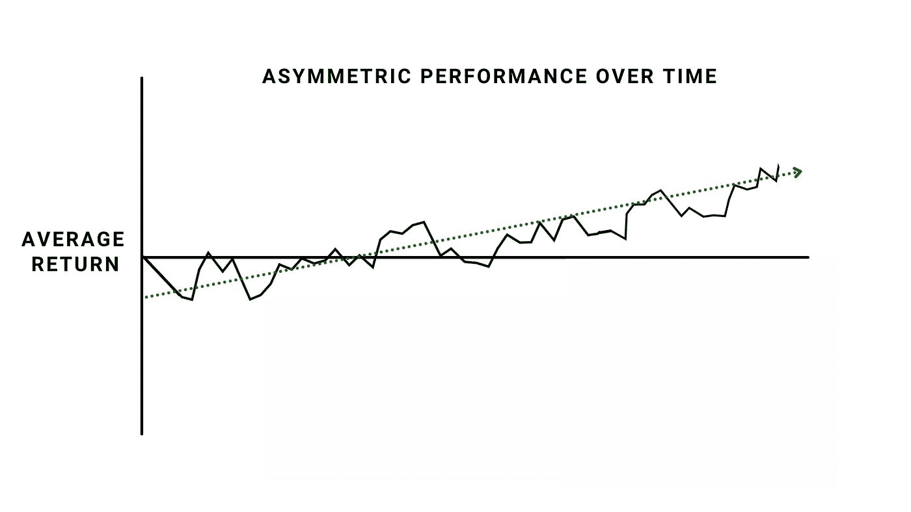
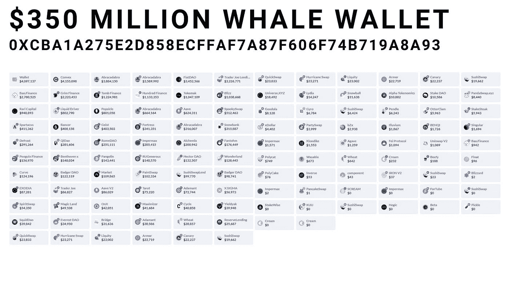
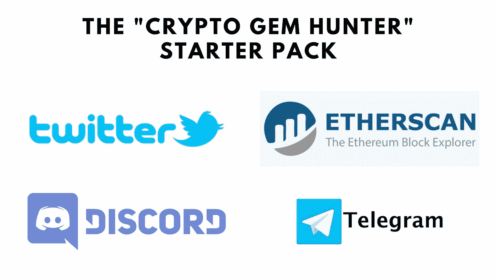

# 挑战加密市场，Gamestop 风格:理解深度价值投资

> 原文：<https://medium.com/coinmonks/defying-crypto-markets-gamestop-style-understanding-deep-value-investing-634e545d7cd4?source=collection_archive---------1----------------------->

## 还记得在 Gamestop 交易中赚了 5000 万美元的 Reddit 用户吗？看看他的一些内容(这是他的 Youtube 频道)，你会开始发现，在他挑战市场的表现背后，有一个合理的、可复制的价值提取框架。

更好的消息？这种投资风格让他在股票市场上取得了可笑的成功，这种风格在很大程度上适用于任何有一点知识和经验的人，只要他愿意付出努力。

所以，保留你的推特定向交易者，你的信号组，你的贝塔-阿尔法-伽马-斐波纳契技术分析师。我们今天有任务——不，是探索。对基思·吉尔(又名咆哮的小猫)所说的**深层价值的追求。**

当应用于加密时，基本的想法是:最大的蓝筹加密公司得到最多的分析师报道和投资，仅仅因为它们是最大的蓝筹加密公司。成功和关注会带来成功和关注，即使可用的价值是模糊和拥挤的。通过观察其他地方，特别是找出被忽视或被忽略的部分，我们可以发现有助于我们长期超越的不对称现象。

## **不对称:深度价值投资的基本概念**

深度价值投资颠覆了流行的说法。如果我们不是寻找共识，而是寻找信息的缺失，即几乎没有分析可用的加密协议，由于某种原因而被忽略的加密协议，或者以类似协议或之前的历史高点的巨大折扣进行交易的加密协议，会怎么样？

在这个加密的黑暗领域，我们希望发现不对称:只要我们有高于平均水平的机会找到赢家，就没有理由害怕潜在的输家。

以上面的图表为例:虽然深度价值可能在某些时间段表现不佳，但我们希望在大获全胜、黑天鹅事件、证明我们的论点始终正确的大泵中提取价值。

为了找到这些不对称，我们寻找可以推动爆炸性情绪变化的想法和催化剂:处于困境的加密货币，只需一点点帮助或创新性变化，就可以在瞬间翻转并推动价格上涨。这些彻底转变的可能性往往被市场低估，可能代表着平均预期回报不对称的买入机会。

## **寻求基本折扣**

加密货币难以置信地难以估值:真正的去中心化协议不纳税，不承担债务，甚至不存在于物理管辖区。传统金融中使用的许多常见比率根本不相关或毫无意义。

你能做什么？基于*确实*存在的指标，将该协议与其他加密货币进行比较:许多加密货币都有现金流、回购或赌注收益率。令牌排放量对于理解通货膨胀很重要，用户增长/锁定总价值都是有原因的。确保你以一种明智的方式权衡协议:贷款平台应该与其他贷款平台进行比较，指数对指数。

举个例子，我们为一份[密码实用主义专家报告](https://cryptopragmatist.ck.page/products/crypto-pragmatist-pro)制作了这个表格，比较了一些分散的交易所。我们观察日交易量，并将其与市值进行比较，以了解是否有一些协议被高估或低估。

果不其然，Trader Joe(乔)看起来绝对是个抢手货，日成交量是其市值的两倍。由于其他协议在 3 倍估值的基础上交易量较小，乔可能值得一试。有时，你会发现一个危险信号，可以解释部分或全部的低估。但是当你找不到的时候，你可能正在寻找一个有深度价值的交易。

## **钱包分析**

由于大多数加密货币存在于公共账本上，小规模投资者有一个巨大的优势:他们可以看看所谓的鲸鱼钱包，复制更富有和更成功的市场参与者。看看这个价值 3.5 亿美元的以太坊钱包，它被认为是 DeFi 的圣杯钱包之一:

这些高价值的钱包通常可以让我们深入了解专业参与者正在用他们的资本做什么，如何聪明地分配资金，以及他们是否正在进入高风险、小市值的头寸，或者他们是否正在进行融资。

不过，你不必只看价值数亿美元的鲸鱼钱包。只要看看在单个协议中拥有大量股权的钱包(内部人士)，就能极大地有助于发现良好的购买机会。大量销售？这是一个不好的迹象。已经拥有这些资产的钱包中的大量买入通常是一个买入信号。

这里引用投资者彼得·林奇的话:**“内部人士可能出于任何原因卖出他们的股票，但他们买入股票的原因只有一个:他们认为股价会上涨。”**

****

## **论文投资**

当从深度价值投资的角度来看加密货币时，我们不会寻找情绪强烈、社交媒体表现良好、增长数字全面上升的东西。我们经常为一个单一的理论或概念(论点)购买资产，等待该论点被证实或否认，看到价格反应，然后撤出我们的投资。

以 Trader Joe(乔)为例，我们之前讨论过它被低估了。如果讨论的比率突然翻转，Trader Joe 提升了 5 倍，现在与其他交易所相比，该协议相对于其交易量变得*高估了*，这可能是卖出的好时机。

或者说，我们基于内部人士的变动买入，但随后象征性的价格下跌，这些内部人士撤出了投资。这可能会使我们关于内部人士知道一些市场不知道的事情的论点无效，并可能是减少损失的信号。​

## **深阿尔法**

在 crypto 中可以发现许多不对称，尤其是在这种深度价值、精明的投资风格中。由于缺乏分析师覆盖、低流动性和匿名开发团队，垂死协议和地毯拉的雷区让位于巨大的机会，因为你意识到在被忽视的小市值替代硬币中寻找基本价值的力量。

重要的一点是创建一个网络。在社交媒体上立足。匿名账户在加密货币 Twitter 中无处不在。一旦到了那里，给谈话增加价值。问问题，写下你学到的东西。在你意识到之前，你将会加入到私人不和以及有大量[阿尔法](https://www.investopedia.com/terms/a/alpha.asp)可用的电报团体中。

​

最后一步是加入链上分析平台，如 [etherscan.io](http://etherscan.io/) 和其他区块链探索者。Zapper.fi 帮助你追踪鲸鱼钱包，有丰富的付费和免费选项供你进行所有你能想到的密码分析。

## **管理深度价值投资组合**

管理深度价值投资组合需要认识到市场中存在低效率。任何认为所有低效率都已被套利交易消除的投资者，最好是配置蓝筹股或指数。

因此，一个深度价值投资者必须改变思维，才能真正跑赢大盘；他们必须开始思考:“我知道什么，而市场不知道什么”，而不是看着一项资产问“市场知道什么，我不知道什么。”

​

## **投资组合组织**

在 Crypto Pragmatist，我们经常谈论像风险资本家一样管理投资组合。这是投资小盘股时通常使用的投资风格，根据我们的经验，这些买入并持有的策略更简单，也更有利可图。我们不是真的在寻找一个月内 50%的波动，而是一年或更长时间内 10 倍的波动。在密码学中，它们不一定那么稀缺。

因为深度价值投资最终会产生很多输家，为了保护自己，我们必须分散投资。那么我们如何组织职位呢？把它们分成我们投资组合的几个小部分，然后慢慢度过。十个或更多的仓位是常见的，如果你有更多的资金(和时间)，甚至 25%或 50%的投资可能是正确的。因为我们是长期投资，所以我们不必每分钟都盯着他们，只是等待我们的论点被否定或被证实。

简单说明一下:以这种方式投资的人通常会将一小部分净值投资于这些高风险头寸。尽管深度价值投资组合可能以有意义的方式跑赢大盘，但对冲下跌风险很重要。此外，由于这种投资方式依赖于市场发现价值并使其达到合理估值，利润最终必须从高风险头寸转移到更安全的资产或更新、被低估的资产。

​

**如何确定头寸规模**

虽然扩大规模很重要，当势头发生变化时加倍押注赢家是一项很好的技能，但避免过度分配也至关重要。随着赢家的成长，这种策略会自动将你投资组合中更高的比例分配给他们，所以一开始用你投资组合中一个平均的、较小的比例可能是正确的做法。

## 
**如何利用**

我们在 Crypto Pragmatist 撰写的投资类型可能最好归类为“深度价值”投资:我们寻找大的不对称性、现金流的大折扣、可量化(但有时模糊不清)的价值，并寻找往往与市场共识相悖的头寸。最终，这给我们带来了成功的记录。

虽然这项研究可以由个人进行，并且所有这些技能都可以学习和发展，但我们在我们的[加密实用主义者专业报告](https://cryptopragmatist.ck.page/products/crypto-pragmatist-pro)中巩固了我们的研究，在那里我们对特定的替代硬币进行了深入分析。这就是我们赚钱支持这份免费通讯的地方。

如果你有兴趣，请去看看！你可以订阅一个月的无风险担保[这里](https://cryptopragmatist.ck.page/products/crypto-pragmatist-pro)。如果你不感兴趣，请忽略并原谅我们的自我推销。

> 加入 Coinmonks [电报频道](https://t.me/coincodecap)和 [Youtube 频道](https://www.youtube.com/c/coinmonks/videos)了解加密交易和投资

## 也阅读

 [## 杠杆代币[多头代币]终极指南

### 杠杆化令牌是具有杠杆化风险敞口的 ERC20 令牌，不考虑保证金、要求、管理…

medium.com](/coinmonks/leveraged-token-3f5257808b22)  [## 最佳加密交易所| 2021 年十大加密货币交易所

### 加密货币交易所的加密交易需要了解市场，这可以帮助你获得利润。之前…

blog.coincodecap.com](https://blog.coincodecap.com/crypto-exchange)  [## 存储比特币的最佳加密硬件钱包[2021] | CoinCodeCap

### 保管您的数字资产很容易，但找到正确的存储方式却是一项繁琐的任务。在线钱包有一个风险…

blog.coincodecap.com](https://blog.coincodecap.com/best-hardware-wallet-bitcoin)  [## Pionex 评论 2021 |免费加密交易机器人和交换

### Pionex 是为交易自动化提供工具的后起之秀。Pionex 上提供了 9 个加密交易机器人…

medium.com](/coinmonks/pionex-review-exchange-with-crypto-trading-bot-1e459d0191ea)  [## 仙境提供了 83，412%的 APY 赌注:仙境是一个骗局吗？CoinCodeCap

### 仙境是雪崩网络的第一个基于时间令牌的分散储备货币协议。一篮子…

blog.coincodecap.com](https://blog.coincodecap.com/wonderland-offers-an-83412-apy-on-staking-is-wonderland-a-scam)  [## 天秤座货币——脸书的加密货币

### 自 2018 年马克·扎克伯格决定致力于改善区块链以来，关于天秤座货币的传言就一直存在…

blog.coincodecap.com](https://blog.coincodecap.com/libra-currency-a-cryptocurrency-by-facebook)