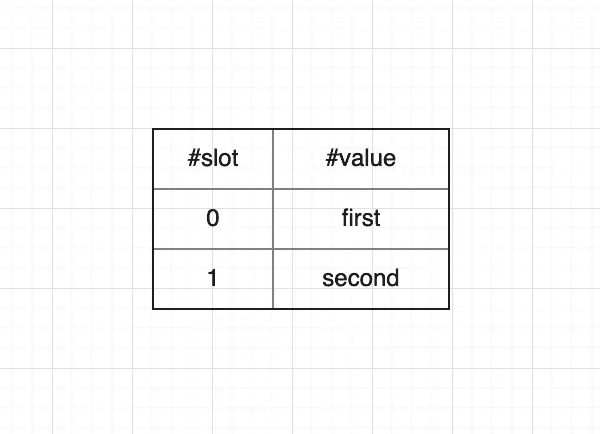
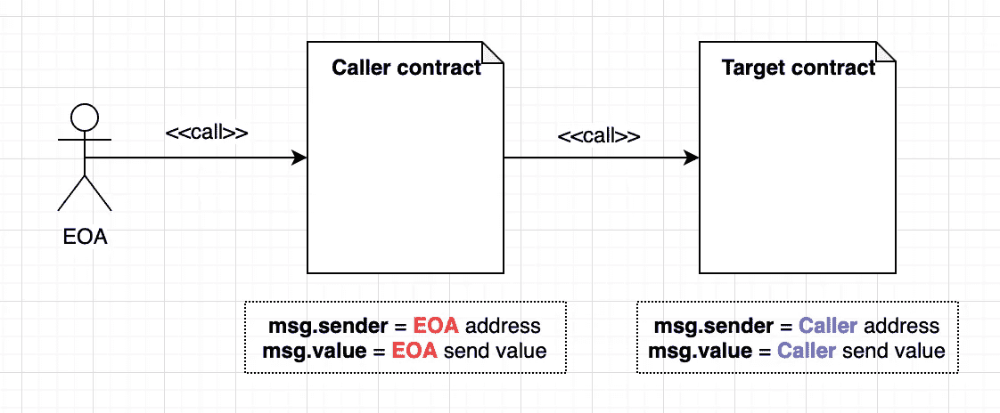
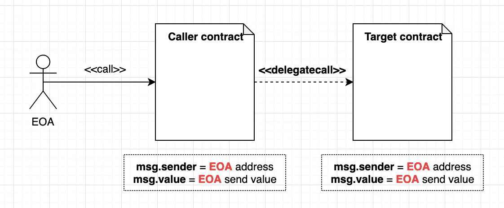
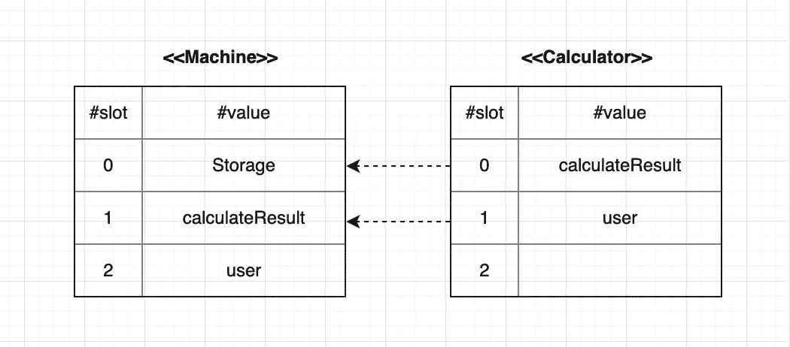

# DelegateCall:在 Solidity 中调用另一个合同函数

> 原文：<https://medium.com/coinmonks/delegatecall-calling-another-contract-function-in-solidity-b579f804178c?source=collection_archive---------0----------------------->


Photo by NOAA on Unsplash

在这篇文章中，我们将看到如何调用另一个契约函数。而且我们更深入地谈论了关于`delegatecall`

在编写以太坊 SmartContract 代码时，有些情况下我们需要与其他契约进行交互。在坚固性上，为了这个目的，有几种方法可以达到这个目的。

## 如果我们知道目标合同 ABI，我们可以直接使用函数签名

假设我们已经部署了一个名为“存储”的简单契约，它允许用户保存一个值。

```
pragma solidity ^0.5.8;contract Storage {
    uint public val;constructor(uint v) public {
        val = v;
    }function setValue(uint v) public {
        val = v;
    }
}
```

我们希望部署另一个名为“机器”的合同，它是“存储”合同的调用方。“机器”引用“存储”契约并改变其值。

```
pragma solidity ^0.5.8;import "./Storage.sol";contract Machine {
    Storage public s;constructor(Storage addr) public {
        s = addr;
        calculateResult = 0;
    }

    function saveValue(uint x) public returns (bool) {
        s.setValue(x);
        return true;
    }function getValue() public view returns (uint) {
        return s.val();
    }
}
```

在这种情况下，我们知道“存储”的 [ABI](https://solidity.readthedocs.io/en/develop/abi-spec.html) 和它的地址，这样我们就可以用这个地址初始化现有的“存储”契约，ABI 告诉我们如何调用“存储”契约的功能。我们可以看到“机器”契约调用`setValue()`的“存储”功能。

并编写测试代码来检查【机器】`saveValue()`是否真正调用【存储】`setValue()`功能并改变其状态。

```
const StorageFactory = artifacts.require('Storage');
const MachineFactory = artifacts.require('Machine');contract('Machine', accounts => {
  const [owner, ...others] = accounts;beforeEach(async () => {
    Storage = await StorageFactory.new(new BN('0'));
    Machine = await MachineFactory.new(Storage.address);
  });describe('#saveValue()', () => {
    it('should successfully save value', async () => {
      await Machine.saveValue(new BN('54'));
      (await Storage.val()).should.be.bignumber.equal(new BN('54'));
    });
  });
});
```

测试通过了！

```
Contract: Machine
  After initalize
    #saveValue()
      ✓ should successfully save value (56ms)1 passing (56ms)
```

## 如果我们不知道目标合同 ABI，使用呼叫或委托呼叫

但是如果调用者(在这个例子中是“机器”契约)不知道目标契约的 ABI 呢？

尽管如此，我们可以用`call()`和`delegatecall()`调用目标契约的函数。

在解释以太坊的稳固性`call()`和`delegatecall()`之前，看看 EVM 如何保存合约的变量对理解`call()`和`delegatecall()`会有所帮助。

## EVM 如何将字段变量保存到存储器中

在以太坊中，有两种空间用于保存契约的字段变量。一个是“内存”，一个是“存储”。而什么‘foo 被保存到存储器’意味着‘foo’的值被永久地记录到状态中。

那么一个契约中的这么多变量怎么可能不互相重叠地址空间呢？EVM 将槽号分配给字段变量。

```
contract Sample1 {
    uint256 first;  // slot 0
    uint256 second; // slot 1
}
```



EVM saves field variables using slot

因为`first`在“样本 1”中首先被声明，所以它被分配了 0 个槽。每个不同的变量通过其槽号来区分。

在 EVM 中，它在智能合约存储中有 2 个⁵⁶槽，每个槽可以保存 32 字节大小数据。

## 如何调用智能合同函数

和 Java、Python 等通用编程代码一样，Solidity 函数可以看作是一组命令。当我们说“函数被调用”时，这意味着我们将特定的上下文(如参数)注入到该组命令(函数)中，命令在该上下文中被一个接一个地执行。

和功能、命令组、地址空间可以通过其名称找到。

在以太坊中函数调用可以用长达 4 + 32 * N 字节的字节码来表示。这个字节码由两部分组成。

*   **函数选择器**:这是函数调用字节码的前 4 个字节。这是通过散列目标函数的名称加上它的参数类型(不包括空格)生成的。比如`savaValue(uint)`。目前，以太坊使用 keccak-256 哈希函数来创建函数选择器。基于这个函数选择器，EVM 可以决定在契约中应该调用哪个函数。
*   **函数参数**:将参数的每个值转换成一个固定长度为 32 字节的十六进制字符串。如果有多个参数，请连接

如果用户将这个 4 + 32 * N 字节的字节码传递给事务的数据字段。EVM 可以找到应该执行哪个函数，然后向该函数注入参数。

## 用测试案例解释委托通话

## 语境

我们讲智能合约函数怎么调用的时候有一个词“上下文”。实际上,“上下文”这个词在软件中是一个非常通用的概念，其含义会根据*上下文*而有所变化。

当我们谈到程序的执行时，我们可以说“上下文”就像所有环境变量或执行点的状态一样。例如，在程序“A”的执行点上，执行该程序的用户名是“zeroFruit”，那么用户名“zeroFruit”可以是程序“A”的上下文。

在以太坊智能合约中，有许多上下文，其中一个代表性的内容是“谁执行此合约”。你可能会在 Solidity 代码中看到`msg.sender`很多，`msg.sender`地址的值根据谁执行这个契约函数而变化。

## 委派电话

**DelegateCall，顾名思义，是调用方契约调用目标契约函数的调用机制，但是当目标契约执行其逻辑时，上下文不在执行调用方契约的用户上，而是在调用方契约上。**



Context when the contract calls another contract



Context when contract delegatecall another contract

那么当合同委托给目标时，存储的状态会发生怎样的变化？

因为当 delegatecall 到 target 时，上下文在调用者契约上，所有的状态改变逻辑都反映在调用者的存储上。

例如，我们有代理合同和商业合同。代理合同委托调用业务合同函数。如果用户调用代理契约，代理契约将委托调用业务契约，功能将被执行。但是所有状态更改都将反映在代理契约存储中，而不是业务契约中。

## 判例案件

这是之前解释的合同的扩展版本。除了测试存储将如何改变之外，它仍然有“存储”作为字段和`addValuesWithDelegateCall`、`addValuesWithCall`。而“机器”有`calculateResult`、`user`用于保存加法结果和调用此功能的人各一个。

```
pragma solidity ^0.5.8;import "./Storage.sol";contract Machine {
    Storage public s;

    uint256 public calculateResult;

    address public user;

    event AddedValuesByDelegateCall(uint256 a, uint256 b, bool success);
    event AddedValuesByCall(uint256 a, uint256 b, bool success);

    constructor(Storage addr) public {
        ...
        calculateResult = 0;
    }

  ...

    function addValuesWithDelegateCall(address calculator, uint256 a, uint256 b) public returns (uint256) {
        (bool success, bytes memory result) = calculator.delegatecall(abi.encodeWithSignature("add(uint256,uint256)", a, b));
        emit AddedValuesByDelegateCall(a, b, success);
        return abi.decode(result, (uint256));
    }

    function addValuesWithCall(address calculator, uint256 a, uint256 b) public returns (uint256) {
        (bool success, bytes memory result) = calculator.call(abi.encodeWithSignature("add(uint256,uint256)", a, b));
        emit AddedValuesByCall(a, b, success);
        return abi.decode(result, (uint256));
    }
}
```

这是我们的目标合同“计算器”。它还有`calculateResult`和`user`。

```
pragma solidity ^0.5.8;contract Calculator {
    uint256 public calculateResult;

    address public user;

    event Add(uint256 a, uint256 b);

    function add(uint256 a, uint256 b) public returns (uint256) {
        calculateResult = a + b;
        assert(calculateResult >= a);

        emit Add(a, b);
        user = msg.sender;

        return calculateResult;
    }
}
```

## 测试 addValuesWithCall

这是我们的`addValuesWithCall`测试代码。我们需要测试的是

*   因为上下文是在“计算器”而不是“机器”上，所以加法结果应该保存到“计算器”存储器中
*   所以【计算器】`calculateResult`应该是 3，而`user`地址应该设置为“机器”地址。
*   而【机器】`calculateResult`应为 0，而`user`为 0 地址。

```
describe('#addValuesWithCall()', () => {
  let Calculator;

  beforeEach(async () => {
    Calculator = await CalculatorFactory.new();
  });

  it('should successfully add values with call', async () => {
    const result = await Machine.addValuesWithCall(Calculator.address, new BN('1'), new BN('2'));expectEvent.inLogs(result.logs, 'AddedValuesByCall', {
      a: new BN('1'),
      b: new BN('2'),
      success: true,
    });(result.receipt.from).should.be.equal(owner.toString().toLowerCase());
    (result.receipt.to).should.be.equal(Machine.address.toString().toLowerCase());(await Calculator.calculateResult()).should.be.bignumber.equal(new BN('3'));
    (await Machine.calculateResult()).should.be.bignumber.equal(new BN('0'));(await Machine.user()).should.be.equal(constants.ZERO_ADDRESS);
    (await Calculator.user()).should.be.equal(Machine.address);
  });
});
```

并按预期测试通过！

```
Contract: Machine
  After initalize
    #addValuesWithCall()
      ✓ should successfully add values with call (116ms)1 passing (116ms)
```

## 测试 addValuesWithDelegateCall

这是我们的`addValuesWithCall`测试代码。我们需要测试的是

*   因为上下文是在“机器”而不是“计算器”上，所以加法结果应该保存到“机器”存储器中
*   所以【计算器】`calculateResult`应该是 0，而`user`地址应该设置为零地址。
*   而【机器】应该是 3，`user`应该是 EOA。

```
describe('#addValuesWithDelegateCall()', () => {
  let Calculator;

  beforeEach(async () => {
    Calculator = await CalculatorFactory.new();
  });

  it('should successfully add values with delegate call', async () => {
    const result = await Machine.addValuesWithDelegateCall(Calculator.address, new BN('1'), new BN('2'));expectEvent.inLogs(result.logs, 'AddedValuesByDelegateCall', {
      a: new BN('1'),
      b: new BN('2'),
      success: true,
    });(result.receipt.from).should.be.equal(owner.toString().toLowerCase());
    (result.receipt.to).should.be.equal(Machine.address.toString().toLowerCase());// Calculator storage DOES NOT CHANGE!
    (await Calculator.calculateResult()).should.be.bignumber.equal(new BN('0'));

    // Only calculateResult in Machine contract should be changed
    (await Machine.calculateResult()).should.be.bignumber.equal(new BN('3'));(await Machine.user()).should.be.equal(owner);
    (await Calculator.user()).should.be.equal(constants.ZERO_ADDRESS);
  });
});
```

**但是失败了！什么？？？**哪里来的“562046206989085878832492993516240920558397288279”？

```
0 passing (236ms)
1 failing1) Contract: Machine
     After initalize
       #addValuesWithDelegateCall()
         should successfully add values with delegate call:AssertionError: expected '562046206989085878832492993516240920558397288279' to equal '3'
    + expected - actual-562046206989085878832492993516240920558397288279
    +3
```

正如我们之前提到的，每个字段变量都有自己的槽。而当我们 delegate call“Calculator”时，上下文是在“Machine”上，但是槽号是基于“Calculator”的。所以因为“计算器”逻辑用`calculateResult`覆盖了`Storage`地址，所以从`calculateResult`到`user`，测试失败。

基于这些知识，我们可以找到‘562046206989085878832492993516240920558397288279’来自哪里。这是 EOA 的十进制版本。



“Calculator” contract field variable overrides “Machine” contract field variable

所以要解决这个问题，我们需要改变“机器”字段变量的顺序。

```
contract Machine {
    uint256 public calculateResult;

    address public user;

    Storage public s;

    ...
}
```

最后，测试通过了！

```
Contract: Machine
  After initalize
    #addValuesWithDelegateCall()
      ✓ should successfully add values with delegate call (106ms)1 passing (247ms)
```

## 包裹

在这篇文章中，我们看到了如何从契约中调用另一个契约的函数。

*   如果我们知道目标函数的 ABI，我们可以直接使用目标函数签名
*   如果我们不知道目标函数的 ABI，我们可以使用`call()`，或者`delegatecall()`。但是在`delegatecall()`的情况下，我们需要关心字段变量的顺序。

## 源代码

如果您想自己测试，您可以在这个资源库中找到代码。

[](https://github.com/zeroFruit/upgradable-contract/tree/feat/delegatecall) [## 零水果/可升级合同

### 这个库是为了演示两件事如何委托调用，调用可以在可靠性如何升级智能…

github.com](https://github.com/zeroFruit/upgradable-contract/tree/feat/delegatecall) 

> 加入 Coinmonks [电报频道](https://t.me/coincodecap)和 [Youtube 频道](https://www.youtube.com/c/coinmonks/videos)获取每日[加密新闻](http://coincodecap.com/)

## 另外，阅读

*   [密码电报信号](http://Top 4 Telegram Channels for Crypto Traders) | [密码交易机器人](/coinmonks/crypto-trading-bot-c2ffce8acb2a)
*   [复制交易](/coinmonks/top-10-crypto-copy-trading-platforms-for-beginners-d0c37c7d698c) | [加密税务软件](/coinmonks/crypto-tax-software-ed4b4810e338)
*   [网格交易](https://coincodecap.com/grid-trading) | [加密硬件钱包](/coinmonks/the-best-cryptocurrency-hardware-wallets-of-2020-e28b1c124069)
*   [最佳加密交易所](/coinmonks/crypto-exchange-dd2f9d6f3769) | [印度最佳加密交易所](/coinmonks/bitcoin-exchange-in-india-7f1fe79715c9)
*   开发人员的最佳加密 API
*   最佳[密码借贷平台](/coinmonks/top-5-crypto-lending-platforms-in-2020-that-you-need-to-know-a1b675cec3fa)
*   [杠杆代币](/coinmonks/leveraged-token-3f5257808b22)终极指南
*   [最适合加密交易的 VPN](https://coincodecap.com/best-vpns-for-crypto-trading)
*   [最佳加密分析或链上数据](https://coincodecap.com/blockchain-analytics) | [Bexplus 评论](https://coincodecap.com/bexplus-review)
*   [NFT 十大市场造币集锦](https://coincodecap.com/nft-marketplaces)
*   [AscendEx Staking](https://coincodecap.com/ascendex-staking)|[Bot Ocean Review](https://coincodecap.com/bot-ocean-review)|[最佳比特币钱包](https://coincodecap.com/bitcoin-wallets-india)
*   [Bitget 回顾](https://coincodecap.com/bitget-review)|[Gemini vs block fi](https://coincodecap.com/gemini-vs-blockfi)|[OKEx 期货交易](https://coincodecap.com/okex-futures-trading)