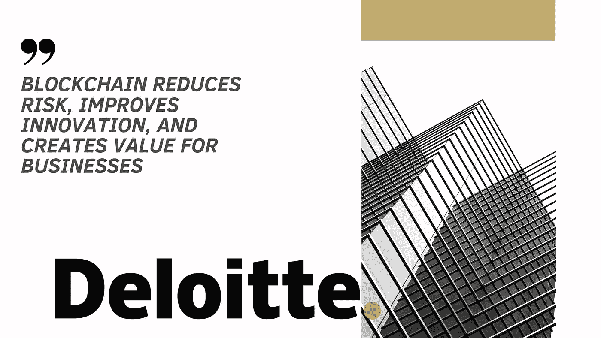
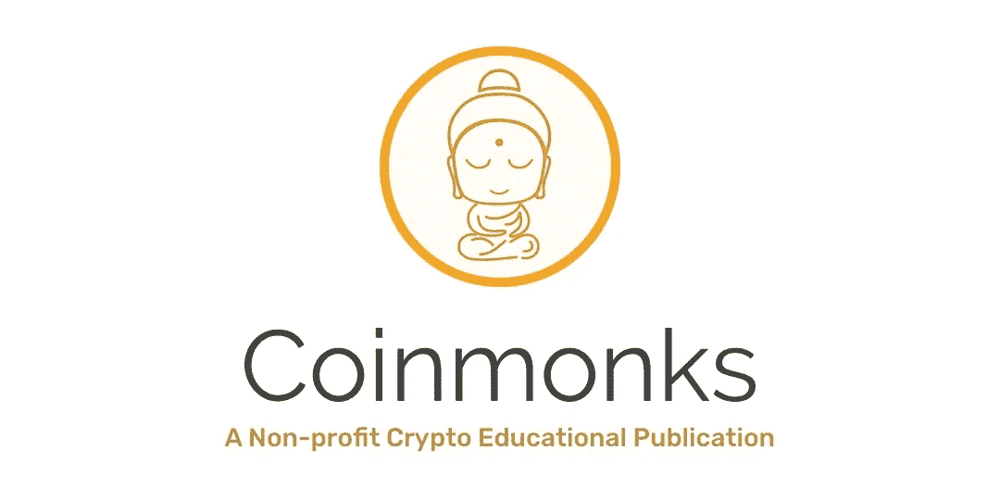

# 德勤:区块链降低风险，促进创新，为企业创造价值

> 原文：<https://medium.com/coinmonks/deloitte-blockchain-reduces-risk-improves-innovation-and-creates-value-for-businesses-acff8cb65f40?source=collection_archive---------4----------------------->

全球会计巨头德勤发布了一份报告，展示了 T2 区块链科技的发展和活力。这些发现是在 2019 年 2 月对十几个国家的主要高管进行调查后得出的。

[区块链](https://medium.com/coinmonks/blockchain/home)技术有了令人兴奋的发展。目前，许多公司都在寻找在运营中实现[区块链](https://medium.com/coinmonks/blockchain/home)透明性和不变性的方法。因此，区块链正在从以前的边缘实体转变为现在的公司战略的前沿和中心。

加密货币通常是一个巨大的成功故事。然而，像比特币这样的领先货币近年来也有其相应的涨跌。这种不一致性往往会吓跑某些类型的投资者，他们坚持稳定。

缓慢但坚定地，区块链科技正以其实用价值脱颖而出。加密技术和区块链技术的命运似乎不再像最初那样纠缠在一起了。甚至像中国这样对加密货币交易有严格监管的政府也在积极研究分布式账本技术。

# 区块链颠覆越来越严重

区块链技术可行性的不确定性正在降低。领先的高管们承认，这项技术是真实的，区块链解决方案可以成为他们未来商业模式的一部分。

根据德勤的报告，53%的高管认为[区块链](https://medium.com/coinmonks/blockchain/home)技术是他们 2019 年业务的重要组成部分。这个数字比去年增加了 10 个百分点。更重要的是，在接下来的 12 个月里，愿意投资 500 万美元或更多在新的[区块链](https://medium.com/coinmonks/blockchain/home)项目上的高管增加了 40%。

随着时间的推移，[区块链](https://medium.com/coinmonks/blockchain/home)技术在其使用案例中表现出令人印象深刻的多样化。其解决方案的实用性，尤其是在供应链和数据管理方面，继续赢得赞誉。这种深度和成熟度赢得了各个行业的行业领导者。

尽管如此，实际部署的水平与围绕[区块链](https://medium.com/coinmonks/blockchain/home)的热情并不相符。对于每一项创新，潜在采纳者都会对其长期可行性表现出一定程度的怀疑。在高管中，有 43%的人认为[区块链](https://medium.com/coinmonks/blockchain/home)技术被夸大了。因此，我们不难发现，这些高管对区块链赞不绝口，但在看到更多发展之前，他们仍会保持观望态度。

# 大局

各行各业都见证了区块链公用事业带来的立竿见影的影响。金融科技是区块链时代的主要成功案例。结合人工智能和区块链的透明度，金融科技初创公司有望成为下一个硅谷独角兽。

底线是，绝大多数受访者认为[区块链](https://medium.com/coinmonks/blockchain/home)具有广泛的可扩展性，并相信它最终会被广泛采用。对区块链来说，一个令人信服的商业案例是这种情绪的先决条件。这种情绪证明了区块链多年来的成熟和韧性。

现有的担忧包括替换或改造当前的遗留系统，监管障碍，甚至投资回报的不确定性。展望未来，看看持怀疑态度的高管们对创新的看法将会非常有趣。

根据德勤的调查，大多数受访者认为商业模式/价值链创新的潜在优势是区块链的一些关键优势。[区块链](https://medium.com/coinmonks/blockchain/home)技术不断脱颖而出。随着智能合同在 2015 年的推出，区块链现在是开发商的一个宝库。

分散式应用程序( [dApps](https://medium.com/coinmonks/dapp/home) )是创建无信任交易的动态工具。进入 2020 年，LinkedIn 的 2020 年新兴工作报告发现，区块链开发人员的工作与人工智能专家和机器人流程自动化顾问等其他工作一样，在顶级新兴工作中排名很高。

因此，区块链将成为明年最热门的领域之一。无论是作为开发者、投资者，还是临时参与者，每个人都有很多事情要做。

# 政府采用 DLTs

围绕[加密货币](https://medium.com/coinmonks/crypto/home)的许多怀疑源于这样一个事实，即世界各国政府试图以悲观的方式忽视或监管这一领域。中国现在对 DLTs 越来越热情，这可能是时代变化的一个迹象。

政府采用区块链可能是这一创新的另一个分水岭。随着在医疗保健和供应链管理等领域的可能应用，这项技术可能会真正爆发。

印度是另一个对 T4 密码交易有严格政策的国家。*印度时报*2019 年 11 月 27 日报道了一个与 DLTs 有关的令人兴奋的发展:印度电子和信息技术部打算采用区块链技术，采取国家战略。

# 区块链的采用对加密可能意味着什么

印度和中国不断变化的态度证明了区块链的韧性。出于主权原因、波动性以及无法发挥常规货币的功能，印度已经禁止了加密交易。

拥抱区块链技术的举动可能会产生多米诺骨牌效应，改变人们对加密货币的态度。尤其是机构投资者，他们渴望站在监管者的安全一边。

以美国为首的西方政府必须在这一领域的发展中扮演更加自信的角色。如果像中国这样的国家在推动区块链前进方面发挥带头作用，那么其他发达国家效仿这种做法只是时间问题。

拥有区块链友好环境的国家包括爱沙尼亚、马耳他、瑞士、美国、中国和英国。这份名单来自 2019 年 11 月发表的一份 [Consensys research](https://consensys.net/blog/enterprise-blockchain/which-governments-are-using-blockchain-right-now/) 报告。这些国家在政府和公共部门实施区块链的程度不同。爱沙尼亚是第一个在国家层面实施区块链的国家，区块链测试可以追溯到 2008 年。马耳他也是一个重要的区块链中心，因为马耳他有合适的监管制度。

# 美国市场和区块链应用的重要性

由于其经济规模，美国是区块链技术的一个非常重要的市场。政府的采纳已经令人印象深刻。例如，美国卫生与公众服务部(HHS)投资 4900 万美元建立人工智能和区块链解决方案。这些解决方案将减少运营积压和成本。亚利桑那州、伊利诺伊州和特拉华州也有不同的措施将区块链技术融入他们的活动。

政府采用可能是区块链技术的生命线。然而，就像商业的其他方面一样，私营企业将是区块链全球化的关键。像亚马逊、苹果和三星这样的大公司的崛起显示了这种企业的潜力。

有了适当的监管环境，这些公司可以通过区块链发挥作用。区块链最大的资产是它的透明性，这一特性对于有供应链管理需求的公司来说可以派上用场。

降低人员成本是任何寻求提高盈利能力的公司都会关注的问题。区块链技术是一个在提高效率的同时削减这些成本的机会。

# 区块链的未来

对于任何创新来说，挑战总是在于它是否能不负众望。网络泡沫是一个永恒的证据，证明许多科技奇迹故事并不符合他们的营销。这种现象是区块链在其整个发展过程中不得不回答的一个问题，并将在未来继续解决。

到目前为止，一切顺利。毕竟，尽管缺乏其他创新所享有的主流营销，区块链还是走到了今天。事实上，它的增长看起来像是与比特币紧紧相连，这意味着它必须有一个很长的接受曲线。比特币是一种去中心化的数字货币——许多人很难理解这个概念。

随着 2020 年的临近，区块链在全球商业中的地位越来越突出。这是所有利益相关者最感兴趣的领域之一。

区块链代表了一种新的商业、管理甚至跟踪价值的方式，创业公司处于这个新时代的前沿。因此，说区块链技术有一个光明的未来并不过分。随着越来越多的行业领导者给它开绿灯，现在是时候认真寻找这个领域的机会了。在未来，看到这个行业发展到什么样的高度将会非常有趣。

> [在您的收件箱中直接获得最佳软件交易](https://coincodecap.com/?utm_source=coinmonks)

