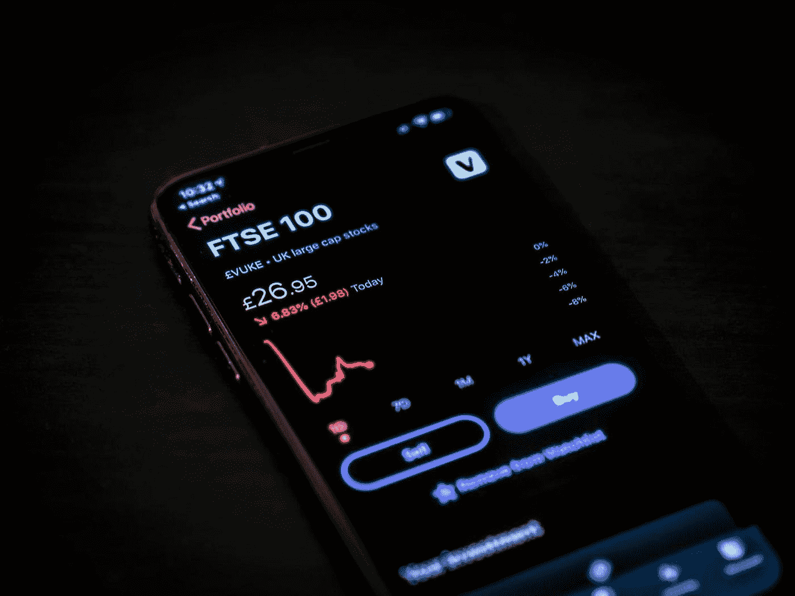
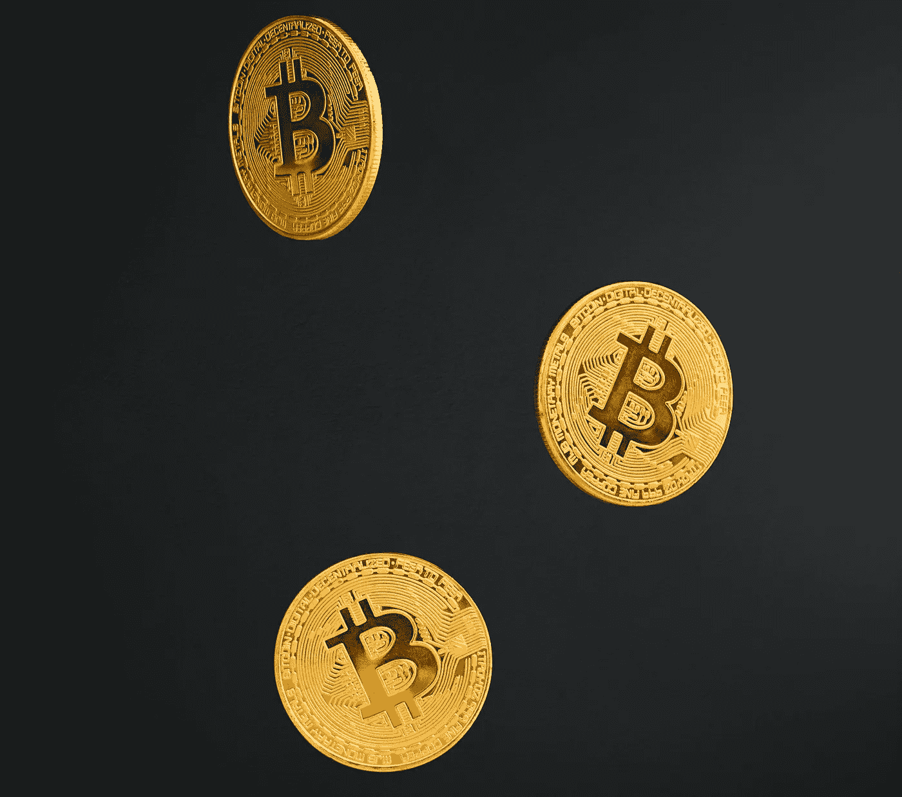

# Delta-Gamma 套期保值和赌注

> 原文：<https://medium.com/coinmonks/delta-gamma-hedging-and-staking-6da4a80511d9?source=collection_archive---------1----------------------->

## 什么对冲叫 Delta-Gamma？

Delta gamma 套期保值是波动性策略的 Delta 中性风险管理方法的变体。在这种方法中，我们不仅要处理 Delta，还要处理 Gamma，在确定用于再套期保值的基本工具数量时要考虑它。通常，在创建策略时考虑 Gamma 的问题仍未解决。这取决于对[市场形势](https://stakero.com/tpost/idc7z939a1-what-are-the-ways-to-hedge-acrypto-portf)的看法，它的发展前景，以及对风险的看法。

# Delta-Gamma 对冲的解释

期权交易者必须考虑的风险不是单方面的。期权的成本取决于多种因素。当使用理论价值模型对期权定价时，总是存在错误选择输入的风险。即使充分评估了当前形势，市场条件也可能随着时间的推移而变化，并对期权头寸的价值产生不利影响。

由于许多因素影响期权的价值，价格变化可能是意想不到的，即使是对一个有经验的交易者。因为决策通常必须非常迅速地做出，并且每个交易者需要知道市场条件的变化如何影响期权价值以及与其头寸相关的风险。

我们讨论的不是利率变化对期权价值的影响。由于它取决于基础合同的类型和结算程序，在这种情况下，不可能制定一个适用于所有选择的规则。然而，可以估计这种影响，将买入看涨期权作为买入基础合同的替代方案。这也适用于购买看跌期权作为出售基础合同的替代方案。

Gamma 提供了对战略风险升级的洞察。在此帮助下，您可以确定曝光在正方向或负方向增长的速率，分别赋予该位置更长或更短的字符。当然，在存在不同执行价格的期权的策略中，Gamma 可能更有用。对于“价内”(ITM)或“价外”(OTM)战略来说尤其如此。由于波动性偏差或不对称，策略可以增加或减少 gamma 值。

随着基础合约价格的上涨或下跌，期权最终成为 ITMs 的可能性也随之上涨或下跌。随着波动性的增加，基础合同的极值变得更有可能，这增加了期权的价值。随着波动性的降低或到期时间的缩短，极端价格值变得不太可能，这降低了价值。

# 如何使用 Delta-Gamma 对冲

动态对冲的主要问题在于，它需要不断的再平衡。一种简单的 delta 对冲，其中期权的价值通过基础资产的所有权进行对冲。对冲期权变化所需的基础资产数量要求重新平衡头寸。

当价格发生剧烈变化时，头寸将不再完全对冲，甚至可能出现突然亏损。在通常使用动态对冲的高度套利关联策略中，这可能是灾难性的。

答案是使用伽玛对冲来对冲 Delta 变化。当然，对于真正的大跳跃来说，情况仍然不是这样，因为 Gamma 也随着价格而变化。此外，其他因素可能会发生变化，如由于市场对基础资产波动性的感知而导致的期权价值差异。

增量在原始资产变化的影响下发生变化。Delta 变形是 Gamma，它是与原始资产价格相关的 Delta 的数学导数。当看涨期权多于看跌期权时，期权的多头头寸以正数表示。当情况相反，看跌期权多于看涨期权时，空头头寸以负伽玛表示。

因此，对于完全价外或价内的期权，Gamma 趋近于零。γ，或者在负值的情况下，其绝对值对于具有平价的期权具有最大比率。投资组合的 Gamma 等于其组成期权的 Gamma 的代数和。

量表的使用有多种变化，尽管它们都大致符合以下情况:

如果一个头寸有很大的负 Gamma，这是由空头期权造成的，人们希望消除它的风险。然后，您应该添加一个由长选项提供的正伽玛。要减少多头期权创造的高正伽玛，就要卖出，也就是增加空头期权头寸。

获胜的可能性在于买入期权时支付的溢价与卖出期权所得的比率。一般来说，这种策略是信贷性质的，其目的是在几种市场运动情况的发展中获得利润。Gamma 的使用尤其适用于低波动性的市场。在这里，Delta 敏感度指标的值大大超过了高波动性资产的固有值。此外，在策略中引入各种选项允许您创建伽玛-德尔塔中立策略，这可能是一个有吸引力的选项。

从形式上讲，买入或卖出所需的期权数量是通过将策略中包含的期权数量定义为主要组成部分来确定的。然后确定必须引入策略以获得伽马中性的选项的数量。在最后一步，使用基础资产将风险平准到 Delta-neutral。

为了理解在管理市场中性策略的风险时对 Gamma 的需求，应该理解达到期权头寸完全对冲的可能性极小。尤其公平的是，所有期权都由头寸覆盖或平仓基础资产中的所有头寸。这一事实应引起人们对使用投资于期权的资本的效率的一些关注，因为很可能没有充分利用该战略的现有潜力，并且存在未使用的风险。

有时会出现极端的价格波动，导致非常强烈的变化，并确保价格达到所有水平。波动性策略的潜力在所提到的点上已经耗尽，但这种情况极其罕见。你不应该依赖它们的规律性。为了消除这种负面影响，有必要改变极端价格区策略的风险管理概念。这些区域离创建仓位的点足够远。

因此，举例来说，有一种方法可以让买方用做空期权来补充他的策略，而波动率的卖方可以用做多期权来补充。但是可以通过包括考虑到伽玛值或其变化的附加条件来修改策略本身的管理。

# Delta-Gamma 套期例子

假设一个 50，000 美元/比特币看涨期权的 50，000 美元 Delta 为 0.65，与现货市场中 32，500 美元的等价头寸相匹配。操作员使用 Delta 跟踪他的位置。通过计算 Delta，它确定了每种货币的等价头寸。为了避免受到标的资产价格波动的影响，他通过在现货或远期市场建立相反的头寸来对冲他的头寸。

这种中性的 Delta 管理有助于保护头寸免受基础资产价格波动的影响。该看涨期权的卖方是一个 50，000 美元的潜在卖方，他将在现货市场上购买 32，500 美元，以消除他的即时外汇风险。

同时，应用中性 Delta 管理的投资组合永远不会被完全覆盖，因为这个 Delta 是模型变量的其余部分的函数。

因此，三角洲在不断变化。只有不断估计其价值和不断调整货币头寸，才能实现最佳对冲。因此，如果其中一个参数有任何微小的变化，就应该改变套期保值。

# 作为投资组合对冲策略的赌注

## **正面**

-这种类型的加密收益通常被称为无忧开采，因为它需要最小的成本，对环境友好，不需要地理参考以及技术知识和经验；

-根据保存期限的不同类型，可以是固定的和无限期的；

- [资产和平台的大量选择](https://stakero.com/tpost/skonjpt001-where-to-stake-cryptocurrency),并提供打桩支持；

-由于加密货币保留在赌注者的钱包中，所以没有不返还投入硬币的风险；

-外部因素不影响支付；

-它带有适度的风险。

## **风险与劣势**

加密货币市场的高度波动性可能带来了主要风险，因为硬币的价格可能会上涨，也可能会大幅下跌。预测可以帮助确定汇率的动态，但最常见的是，汇率的上升或下降是一系列完全不可预测的事件的结果。如果赌注加密货币崩溃，那么投资只会贬值。稳定的硬币将能够保护他们的价值稳定下来。

此外，当很大一部分资本集中在同一个人手里或一个平台上时，就有网络中心化的威胁。

资产不能被使用或撤回，它们实际上被冻结了。

大部分知名项目都提供中等回报。

此外，许多[风险](https://stakero.com/tpost/idc7z939a1-what-are-the-ways-to-hedge-acrypto-portf)都与错误选择存储资产有关。新的和未知的硬币总是带来被骗的风险。与此同时，许多新资产往往具有飞向月球的前景和诱人的条件。这是一个从赌注中赚钱的冒险策略，尽管它可能非常有利可图。

> 加入 Coinmonks [电报频道](https://t.me/coincodecap)和 [Youtube 频道](https://www.youtube.com/c/coinmonks/videos)了解加密交易和投资

## 另外，阅读

*   [加拿大最好的加密交易机器人](https://blog.coincodecap.com/5-best-crypto-trading-bots-in-canada) | [赌注加密](https://blog.coincodecap.com/staking-crypto)
*   [MoonXBT 副本交易](https://blog.coincodecap.com/moonxbt-copy-trading) | [阿联酋的加密钱包](https://blog.coincodecap.com/crypto-wallets-in-uae)
*   [雷米塔诺评论](https://blog.coincodecap.com/remitano-review)|[1 inch 协议指南](https://blog.coincodecap.com/1inch) | [购买 Floki](https://blog.coincodecap.com/buy-floki-inu-token)
*   [MoonXBT vs Bybit vs 币安](https://blog.coincodecap.com/bybit-binance-moonxbt) | [Arbitrum:第二层解决方案](https://blog.coincodecap.com/arbitrum)
*   [买 PancakeSwap(蛋糕)](https://blog.coincodecap.com/buy-pancakeswap)|[matrix export Review](https://blog.coincodecap.com/matrixport-review)
*   [最佳免费加密信号](https://blog.coincodecap.com/free-crypto-signals) | [YoBit 评论](/coinmonks/yobit-review-175464162c62) | [Bitbns 评论](/coinmonks/bitbns-review-38256a07e161)
*   [OKEx 评论](/coinmonks/okex-review-6b369304110f) | [Kucoin 交易机器人](/coinmonks/kucoin-trading-bot-automate-your-trades-8cf0ca2138e0) | [期货交易机器人](/coinmonks/futures-trading-bots-5a282ccee3f5)
*   [AscendEx Staking](https://blog.coincodecap.com/ascendex-staking)|[Bot Ocean Review](https://blog.coincodecap.com/bot-ocean-review)|[最佳比特币钱包](https://blog.coincodecap.com/bitcoin-wallets-india)
*   [霍比审核](https://blog.coincodecap.com/huobi-review) | [OKEx 保证金交易](https://blog.coincodecap.com/okex-margin-trading) | [期货交易](https://blog.coincodecap.com/futures-trading)
*   [比特币基地赌注](https://blog.coincodecap.com/coinbase-staking) | [Hotbit 评论](/coinmonks/hotbit-review-cd5bec41dafb) | [KuCoin 评论](https://blog.coincodecap.com/kucoin-review)
*   [最佳加密交易信号电报](/coinmonks/best-crypto-signals-telegram-5785cdbc4b2b) | [MoonXBT 评论](/coinmonks/moonxbt-review-6e4ab26d037)
*   [Coinswitch 俱吠罗评论](/coinmonks/coinswitch-kuber-review-1a8dc5c7a739) | [电网交易机器人](https://blog.coincodecap.com/grid-trading) | [比特币基地收费](/coinmonks/coinbase-fees-831e77d4f2c5)
*   [Bitget 回顾](https://blog.coincodecap.com/bitget-review)|[Gemini vs block fi](https://blog.coincodecap.com/gemini-vs-blockfi)|[OKEx 期货交易](https://blog.coincodecap.com/okex-futures-trading)