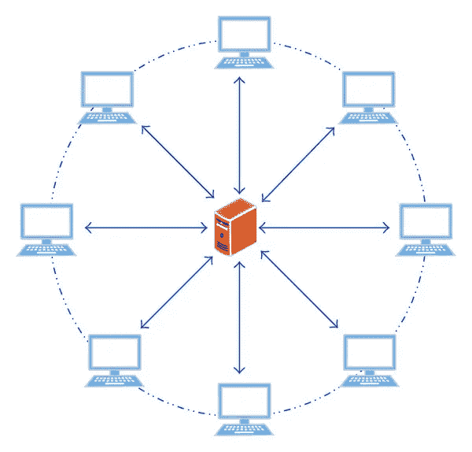
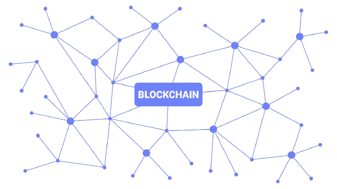

# 民主分权

> 原文：<https://medium.com/coinmonks/democracy-decentralized-d53c32ea1ec4?source=collection_archive---------1----------------------->

## 利用区块链技术重新建立对我们选举系统的信任。

未来不是我们进入的，未来是我们创造的。每个人都有改变世界的能力。有所作为。很多小人物，在小地方，做点小事就能改变世界。

每一票都很重要。每个公民都有投票的责任，每一张选票都为一个国家的未来做出贡献。

每次选举都有影响，每个人如何选择投票会影响他们的生活和社会的运作。

民主允许人民对国家的未来和将要做出的决定有发言权。

> 民有、民治、民享。~亚伯拉罕·林肯

民主制度是社会运作的基础。但是我们如何确定我们的选票真的有效并且没有被篡改。

目前，我们相信政府能够确保这一过程得到简化，并保持透明和道德。

但是，当负责维护透明度的人腐败时，会发生什么呢？

人们对现行选举制度的安全性和透明度没有信心。即使在最近的 2020 年美国选举中，关于结果的准确性仍有大量争议。

很多人根本不相信当前的投票过程和系统是准确、公平和透明的。

此外，在新冠肺炎疫情，让大规模人群聚集投票是不安全的，尤其是有很多人面临感染病毒的高风险。邮寄投票系统已被证明效率低下，并大大增加了整个选举过程所需的时间。

没有交通工具的公民、没有交通工具的人、居住在国外的人或目前在该国军队服役的人一直无法亲自投票。

难道他们不应该仍然有投票权和发言权吗？

此外，人工计票存在巨大的人为误差，这延长了计票过程，同时不得不多次重新计票以确保结果尽可能准确。

网上投票平台包含着个人失去匿名的巨大风险，而匿名是在民主国家投票的结果。通过网上投票，有什么能阻止政府篡改这些投票或者阻止平台被黑呢？

一次简单的黑客攻击可能会永远影响一个国家的未来。

想象一下，如果可以通过提高效率和准确性以及保持实时投票来简化投票流程。该系统允许每个人都可以访问，没有被篡改的风险，同时还维护和保护投票人的身份。

听起来像一场梦，不是吗？这怎么可能呢？

# 答案是区块链。

通过使用区块链技术，我们将有能力分散民主的权力，通过投票分散应用程序(DApps)确保易用性、可访问性和安全性。

区块链是一个不可变的分散式分类账，这意味着一旦进入区块链，数据就不能被更改或篡改。

我们当前的大多数系统都是在集中式网络上，这意味着有一个中心节点控制着所有其他节点的连接。这种网络有一个故障点，并且很容易被网络中心的一次攻击破坏。

区块链是分散和分布式的，这意味着所有节点都相互连接，并且每个节点都有一份分类账。在区块链，所有的交易都有能力做到透明和匿名。

> 点击了解更多关于这项技术的工作原理[！](https://manroopkalsi.medium.com/blockchain-101-b51a75780567)

# **复制我自己的投票 DApp**

以太坊区块链允许代码在区块链的以太坊虚拟机上通过一种叫做智能合约的东西来执行。

智能契约是应用程序的所有业务逻辑所在的地方，也是必须实际编写应用程序的分散部分的地方。

契约的工作是在执行业务逻辑的同时在区块链上读写数据。这些契约是用 Solidity 的语言写的，类似于 JavaScript。

智能合同代表一个契约或协议。在这种情况下，投票 DApp 是一个协议，即:

*   每一票都很重要
*   每个用户只能投票一次
*   得票最多的候选人获胜

对于这个投票 DApp，合同部署在以太坊平台上。它使用现成的区块链来处理 DApps 和智能合同，而没有从头构建区块链的所有麻烦。

为了部署智能合同，天然气被用作交易的支付。气体是少量的以太(以太坊的加密货币)，这些是防止恶意用户利用系统(通过部署永无止境的循环)的支付，因为它在经济上抑制了这种行为。

这个 DApp 是 DApp 大学投票应用程序的复制品。

它对前端 UI 和后端使用 HTML、CSS 和 JS，而不是连接到后端服务器，应用程序连接到本地以太坊区块链。

观看此视频，详细了解合同的设计、演示及其功能。

通过使用区块链，我们可以分散民主，将权力还给人民。

# 我们连线吧！

> *如果你喜欢阅读这篇文章或学习新的东西，我很乐意在* [*LinkedIn*](https://www.linkedin.com/in/manroop-kalsi/) *上联系。如果你想了解我的新文章或项目，你可以订阅我的每月简讯* [*这里*](https://landing.mailerlite.com/webforms/landing/l4f5k1) *！*