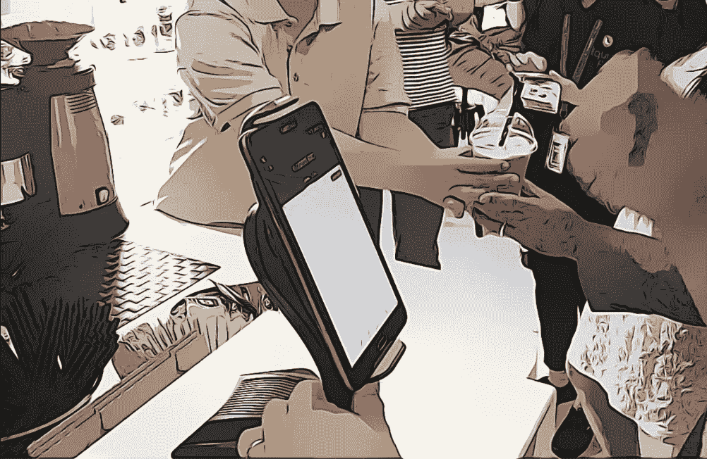

# 通过机器学习实现民主。之后:Meta、Crypto、NFTs、DAOs？一个新手试图解释。

> 原文：<https://medium.com/coinmonks/democracy-through-machine-learning-2d934d862223?source=collection_archive---------12----------------------->

在希腊语中，Meta 翻译为之后的*，而 Alphabet 则是由前两个字母衍生而来。昨晚，在脸书公司宣布更名时，我从一位古典文学教授那里得知了这一点。*

*经过什么？*

我昨天去兔子洞了解更多，并填补了前沿技术疯狂图书馆的空白。

封面是我(据称)成为新加坡第一个用比特币进行商业交易的人的照片。2017 年 11 月，美国消费者新闻与商业频道上有一个片段突出了我办公室对面的咖啡馆接受招标，我冲下来怕输，并尝试了一下。咖啡是 3.5 美元，比特币基地交易费是 31.04 美元。这是我第一次涉足加密领域，在接下来的 4 年里，我只是让我的钱包闲置着，忽略了偶尔给我发邮件询问加密交易员工作的古怪招聘人员..

新技术的规模化和商业化需要时间。消费者行为、文化和 C2C 互动是几个因素的函数:可访问性、信息、“酷”因素、相关数字、易用性。目前，宇宙的大部分是孤立的，超出了大多数消费者的词典。我认为这将在 2022 年发生显著变化。

无需深入 5G 承诺的加速，环顾四周——增强现实游戏正在开发中，金融科技应用分散了交易、贷款和投资。在我的 MBA 课程中，我们学习了自 dot.com 时代以来就已出现的分权组织。但这是 Web 3.0，所以我们需要应用一些新的术语。

进入 DAOs(分散自治组织)。通过机器学习实现民主(DTML)。过去的半个世纪开启了技术弥合全球社会经济鸿沟的乌托邦梦想。尽管怀疑者会说世界银行一直在改变贫困的目标(作为一名前顾问，我不得不同意这一点)。

过去十年，我在新兴市场花了很多时间。科技当然是一种向善的力量。我在玩和我在仰光街上路过的孩子一样的手机游戏。我嘲笑我在加纳徒步旅行时提到的相同的迷因，我的抖音算法肯定已经发现中东烹饪视频是我的菜。

全球化 4.0 与贸易量无关，更与文化的分散渗透有关。这位美国前总统并没有摧毁后 WTO 时代的世界。相反，笨拙的政策无意中迫使我们超越关税甚至物理世界进行思考。

我是故意乱跳的。我对文化、政治以及从消费者或选民的角度来看这两者的交集的兴趣，与这个我们很快都会谈到的元宇宙有关。

作为一名投资者，我很想分析各部分的总和，并思考伴随这一变化的企业重组。然而，这篇文章是探索性的——所以回到 DAOs。

简而言之,“道”是一种消除组织中等级关系的手段，它对区块链的决策进行加密，并嵌入规则以不带人为偏见地进行治理。和我在一起。

你需要一个令牌，加密世界中的交换手段(想想比特币，以太坊等等。).这些代币基于诸如委员会工作和国库结构中的分配的动作而累积。如果没有高管层，成员们就会被激励去提升组织，并为实现上述目标而努力，而不必互相了解。

这种设置的要点是“所有权”。我们把价值放在哪里，谁维护权威？NFT(不可替代的代币)是一个不断增长的空间，可以被视为独特的资产——通常在艺术/创意领域是以 crytpo(通常在区块链以太坊)支付的数字财产。

如果你感到困惑，那也没关系(承认密码世界令人困惑也没关系！).简而言之，这听起来很像 20 世纪的资本主义和 19 世纪的工业组织和垄断。跟我来，这里。

让我们把这一切联系起来，回到元宇宙、脸书和组织。忘掉 NFT 和 ico 以及其他的。Web 3.0 的承诺是一种更好的数字化共存方式——管理、组织和发展。

回到物质世界，脸书已经成为你种族主义叔叔从布莱巴特发布杂志文章的避难所。这是一个问题，已经渗透到政治和文化中。如果元宇宙、DAOs 和 crypto 只是成为股份公司、b 股结构、细价股崩溃和消费者与生产者剩余之间的利润率变薄的翻版，我们就输了。

这个新世界的希望需要负责任的人类行为。对于任何读过爱默生或内战后超验主义和乌托邦社会的人来说，你会发现历史有一种轮回循环问题的方式。20/21 世纪的资本主义只是这种不对称的一种微妙形式。

“之后”是一个邀请。机器学习和人工智能，投票和代币的去中心化将会以我们可以帮助塑造的方式发展，但也容易出现任何前沿技术特有的意想不到的后果。

技术最终会带来一种更好的方式来争取一个公平的全球社会吗？我不知道。我是一个乐观主义者，从我周围的人的生活经历中了解我的观点:既有相似的，也有远离我所知的世界。这就是为什么我痴迷于面向消费者的产品和服务——消除差异，看看国家和人民之间的差异。我坚信我们的相似之处大于不同之处。

任何人都不知道脸书会在元宇宙做什么。我将打赌基于 AR 的程序化广告，但这是另一个故事的主题。

如果你和我一样，在加密和 VR/AR 数字世界中有很多需要学习和探索的东西——我不认为我会成为“那些人”中的一员，但随着方言变得稍微更加用户友好，这肯定是我更多考虑的一个领域。

迈克尔

> 加入 Coinmonks [电报频道](https://t.me/coincodecap)和 [Youtube 频道](https://www.youtube.com/c/coinmonks/videos)了解加密交易和投资

## 也阅读

 [## 最佳加密交易所| 2021 年十大加密货币交易所

### ICON _ PLACEHOLDEREstimated 预计阅读时间:28 分钟加密货币交易所的加密交易需要知识…

blog.coincodecap.com](https://blog.coincodecap.com/crypto-exchange)  [## 2021 年 10 大最佳加密贷款平台| CoinCodeCap

### 当谈到加密货币贷款时，大量因素等同于良好的收入状况。此外，借款的一部分…

blog.coincodecap.com](https://blog.coincodecap.com/crypto-lending)  [## 2021 年最佳免费加密交易机器人

### 2021 年币安、比特币基地、库币和其他密码交易所的最佳密码交易机器人。四进制，位间隙…

medium.com](/coinmonks/crypto-trading-bot-c2ffce8acb2a)