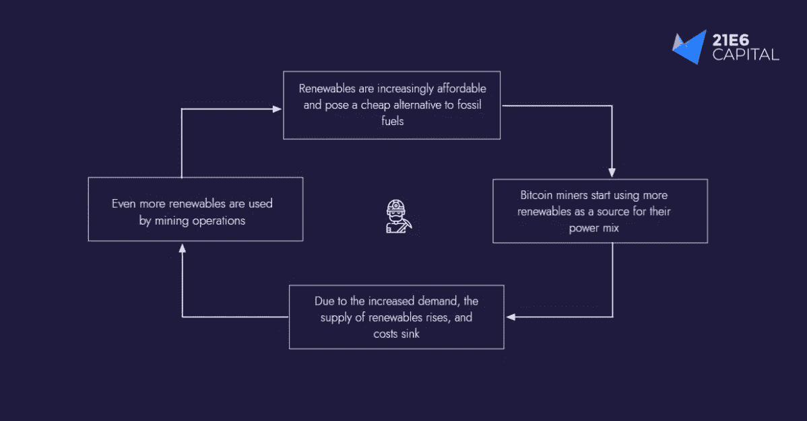
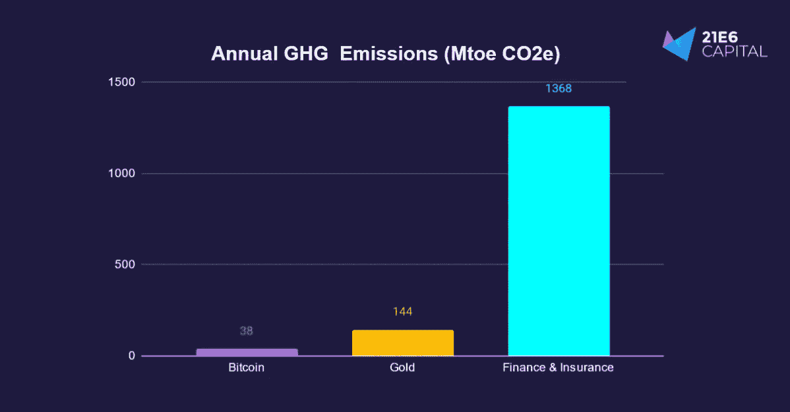

# 揭开比特币能耗的神秘面纱

> 原文：<https://medium.com/coinmonks/demystifing-bitcoins-energy-consumption-d9e89c3ae563?source=collection_archive---------5----------------------->

**谈到比特币的能源消耗，最近一直不缺乏关注，随着气候危机的加剧，这种关注几乎完全是批评，指出比特币网络不负责任的能源消耗。虽然比特币网络确实需要比整个国家更多的能源，但如此频繁讲述的故事未能考虑到一些关键方面，而这些方面在进行这种两极分化的讨论时必须牢记。这就是为什么我们决定客观地分解一些最广泛使用的论点，并在一个顽固的话题上揭示一些线索。**

*作者:伊利亚·孟德尔*

# 秘密采矿被破坏

在我们深入前述讨论之前，让我们倒回去，先澄清共识机制到底是什么，加密挖掘与它有什么关系，以及为什么它如此重要。

在最基本的层面上，共识机制是几方达成协议的一种方式。一群举棋不定是去看电影还是去公园的朋友之间的简单多数投票可以被视为一种共识机制。类似的逻辑也适用于加密货币，尽管规模更大。对于一个分散的、遍布全球的计算机网络来说，要想在没有中央政府的情况下无缝运行，就必须有一个明确的决策方式。

在比特币的例子中，这种方式恰好是一种工作证明(PoW)共识机制，这需要激烈辩论的加密挖掘。

比特币矿工解决密码难题，将新的区块添加到区块链中，从而每秒计算**万亿次哈希**——一种将任何输入转换成预定长度**的输出的函数。**

由于这种机制的固有的和完全预期的困难，执行所述计算需要大量能量。

正是挖掘过程保持了网络的安全，并防止恶意行为者篡改区块链账本或花费比他们实际拥有的更多的比特币(这被称为臭名昭著的“双重支出问题”，是任何形式的数字货币的核心问题之一)。矿工们受到激励来保持网络安全，因为每当他们解决了加密难题时，他们就会收到新发行的比特币形式的集体奖励。

有人可能会反对存在其他更可持续的共识机制，如利益证明(PoS)或权威证明(PoA ),事实上，它们是目前采用最多的共识机制。然而，它们也有一些缺点，例如倾向于支持那些拥有大量资金的网络验证者，随着时间的推移，可能会恶化网络的分散性。他们既没有 PoW 的良好记录和声誉，也没有进行涉及精力和时间的独特转变过程，我们将在后面更深入地讨论这一点。

说完这些，让我们来看看一些事实。

# #1“仅比特币的排放就可能将全球变暖推高 2 摄氏度以上”

这一说法来源于《自然》杂志气候变化期刊上发表的一项著名且被频繁引用的 2018 年研究。

2 摄氏度，因为这是气候变得真正糟糕的时候(目前，我们大约是 1.4 摄氏度)。地中海的淡水资源将急剧减少，海平面将上升 10 厘米，直到 2100 年，威胁到沿海地区，一些地区的农作物产量将下降 6%-16%。

从本质上讲，该研究提出了一些严厉的主张，认为仅比特币开采就可能将全球变暖推至可怕的 2 摄氏度阈值。事实上，它大部分是基于一些有问题的假设。

提交人的程序如下:

*   作者估计了 2017 年比特币采矿的电力消耗。
*   基于这一假设的电力消耗，他们使用东道国的国家电力组合，将其比特币采矿电力估计值转换为二氧化碳排放量。
*   他们推断 2017 年的数字，假设比特币网络将在未来 80-100 年内每年处理约 3140 亿笔交易。

首先，作者暗示比特币网络将继续以类似于 2017 年加密热潮期间的速度增长，当然这并没有发生。

此外，他们预计比特币最终将每天处理近 10 亿笔交易，鉴于比特币的 tx/s 统计数据和阻塞时间，这也是完全不现实的。在目前阶段，该网络每天处理约 250，000 个事务(每秒约 7 个事务)。比特币达到可比规模的唯一方式是使用闪电网络，然而，由于第二层扩展解决方案的架构，这不会导致任何重大的进一步排放。

作者还将单笔交易的用电量设定为相当于整个 block⁴.的用电量但是，在当前阶段，一个块最多可以包含 3，000 个交易。

此外，作者没有考虑采矿硬件的效率改进。他们的推断基于 2013 年至 2015 年期间采矿硬件的能源消耗数字(约 2 瓦特/千兆赫)，如果我们看一下最近的 hardware⁵.采矿，现在已经减少了 80%以上矿商已经并将继续受到激励，投资于更高效的技术，以节省成本和实现利润最大化。

# #2“比特币由化石燃料驱动”

另一个经常提出的论点是，比特币主要由化石燃料驱动，因此严重破坏了环境。

在过去的几年里，在对环境可持续性和价格下降的紧急呼吁的推动下，可再生能源已经成为负责运行比特币网络的主要能源来源。

关于比特币网络有多少是由可再生能源驱动的，有很多估计，从 40%到 75%不等。

然而，可以注意到两项发展:

1.  随着可再生能源变得更加经济实惠，可再生能源的份额在过去几年中有所增加，并且在未来只会增加。
2.  比特币采矿利用了原本浪费的能源，提高了可再生能源的经济性，例如在特别潮湿的季节使用水能或油井燃烧的天然气。理论上，仅得克萨斯州燃烧的天然气就可以为 today⁶.整个比特币网络的⅓供电虽然用于比特币开采的能源不能用于其他用途，但这种能源密集型过程充当了价值储存的角色。此外，对电能的需求也在波动。在晚上，家庭或工厂没有消耗的多余能量可以被转换成比特币，永远存储在区块链上。作为进一步采矿作业需求的驱动力，新开采的比特币随后可用于为可再生能源的扩张融资，从而引领一个更可持续的未来。

自从中国政府在今年夏天打击比特币挖矿以来，美国已经确立了自己作为矿商的明显热点，8 月份占全球所有矿商的 42%以上——相比之下，在 2020 年 9 月，他们仅占 4.1%⁷.

好消息是，美国主要的“矿业州”在提供可持续能源方面取得了很大进展。纽约州比落基山脉以东的任何一个州生产更多的水力发电，华盛顿州以其水力发电的采矿农场而闻名，德克萨斯州的可再生能源份额也在增长——2020 年，25%的能源来自太阳能或风能，46%的能源来自天然气，诚然天然气仍然是一种化石燃料，但与核能或煤炭能源相比，在碳排放方面相对无害。总体而言，北美矿商使用的可再生能源比亚洲同行(主要是中国)多得多。截至 2020 年，北美地区可再生能源的平均份额为 63%，而 Asia-Pacific⁸.仅为 26%因此，从环境角度来看，中国的采矿禁令似乎是一个好的举措。

根据国际可再生能源机构的一份报告，2020 年，比最具竞争力的化石燃料方案成本更低的可再生能源份额增加了 100%。去年新增的 162 千兆瓦(GW)可再生能源发电总量的 62%比最便宜的新化石燃料 alternative⁹.的成本更低

由于采矿是一项低利润的业务，能源消耗平均占运营费用的 79%,因此矿业公司有动力去能源成本最低的地方获取最大利润。作为需求的强大推动力，地下采矿在加速绿色能源增长方面发挥了不可忽视的作用(见下图 1)。

此外，我们不要忘记，用于采矿的能源正在并将越来越多地被重新用于其他目的。以加拿大比特币矿业公司 MintGreen 为例，该公司希望利用这种能源为温哥华北部的 100 栋商业建筑和住宅供暖，为大约 155，000 名市民提供供暖。或者是荷兰的 GreenMine Container，在那里，采矿作业产生的热能被一种无腐蚀性的油移除，在转化为热水加热邻近的⁰.温室番茄农场之前，先经过一个热交换器

**Figure 1: A simplified graphic illustrating how increasing renewables use can lead to growing affordability**

# #3“比特币消耗太多能源”

法兰克福学派区块链中心和 intas.tech 最近进行的一项研究发现，在 2020 年 9 月 1 日至 2021 年 8 月 21 日的年化时期内，全球比特币网络需要 90.86 TWh 和 37.97 MtCO2eq((公吨二氧化碳当量)。

从背景来看，比特币开采只剩下全球二氧化碳当量的 0.08%(37.97 mtco 2 eq/45，873.85 MtCO2eq)，这听起来像是运行人类有史以来最安全、最分散、最自主的货币系统的公平“价格”。

如果我们将比特币的温室气体排放与黄金或金融保险业的温室气体排放进行比较，也可以得出类似的结论，如图 2 所示。

**Figure 2: Annual GHG emissions of different sectors and assets¹²**

# 结论

不可否认，比特币确实对气候产生了影响，然而，它的后果经常被夸大或被断章取义。作为回应，围绕抵消 BTC 碳排放可能性的某些方法已经出现(并将继续出现)，我们将在后面的文章中讨论。

从本质上来说，电力是有意使用能源。这是一个通过破解密码谜题将能量转化为数字商品的过程。

运行这个生态系统所需的资源量是比特币内在价值的一部分，也是比特币成为“数字黄金”(一种无限储存能量的手段)的竞争者的一部分。它是一项功能，而不是一个缺陷，通过证明工作是通过昂贵的计算和设备完成的，来保护整个网络。

它甚至可能是最初帮助加密货币获得流行的因素之一。**真正的焦点应该从能源消耗本身转移到能源的来源，以及如何以一种越来越可持续的方式进行开采。**

# 关于 21E6 大写

21e6 Capital 是一家瑞士投资顾问公司，为专业投资者提供最佳加密投资产品。21e6 Capital 已经分析了全球 1000 多只加密基金，并将其浓缩为一个精选，可以在最大限度降低下行风险的情况下产生加密风险。21e6 Capital 拥有一支经验丰富的加密和金融专家团队，他们在数字资产和 DLT 方面有着深入的知识，在此团队的支持下，21e 6 Capital 创建了一个独特的量化策略，旨在实现类似加密的回报，同时将全球股票水平的风险和波动性降至最低。21e6 资本团队建立在强大的学术基础之上，拥有领先的加密资产和分散金融出版物和研究的记录，确保为金融行业专业人士提供最先进的加密投资解决方案。

# 作者

***伊利亚·孟德尔*** *在施马尔卡尔登应用科技大学学习国际商务和经济。目前，他从事几个项目，涉及 DLT、数字资产和区块链。你可以通过* [*邮箱*](mailto:elias.mendel@blockchain-founders.io) *或者*[*LinkedIn*](https://www.linkedin.com/in/elias-mendel-5ab187220/)*联系他。*

# 资源

1.  [https://www.nature.com/articles/s41558-018-0321-8?source = content _ type % 3a react % 7c first _ level _ URL % 3a article % 7c section % 3a main _ content % 7c button % 3a body _ link](https://www.nature.com/articles/s41558-018-0321-8?source=content_type%3Areact%7Cfirst_level_url%3Aarticle%7Csection%3Amain_content%7Cbutton%3Abody_link)
2.  [https://www . vox . com/energy-and-environment/2018/1/19/16908402/global-warming-2 degrees-climate-change](https://www.vox.com/energy-and-environment/2018/1/19/16908402/global-warming-2-degrees-climate-change)
3.  [https://bitcoinmagazine . com/markets/the-state-of-lightning-network-bit coin-adoption](https://bitcoinmagazine.com/markets/the-state-of-lightning-network-bitcoin-adoption)
4.  [https://www.youtube.com/watch?v=DidAwxWaDKI](https://www.youtube.com/watch?v=DidAwxWaDKI)
5.  [https://www . researchgate . net/publication/328804344 _ bit coin % 27s _ Energy _ Consumption _ scarmer ing _ or _ Truly _ the _ Nail _ in _ the _ Coffin _ of _ Climate _ Change](https://www.researchgate.net/publication/328804344_Bitcoin%27s_Energy_Consumption_Scaremongering_or_Truly_the_Nail_in_the_Coffin_of_Climate_Change)
6.  [https://www . CNBC . com/2021/10/09/war-to-attract-bit coin-miners-pits-Texas-against-new-York-Kentucky . html](https://www.cnbc.com/2021/10/09/war-to-attract-bitcoin-miners-pits-texas-against-new-york-kentucky.html)
7.  [https://ccaf.io/cbeci/mining_map](https://ccaf.io/cbeci/mining_map)
8.  [https://www . research gate . net/publication/344626767 _ 2020 _ CCAF _ 3rd _ Global _ Cryptoasset _ Benchmarking _ Study](https://www.researchgate.net/publication/344626767_2020_CCAF_3rd_Global_Cryptoasset_Benchmarking_Study)
9.  [https://www . irena . org/news room/press releases/2021/Jun/Majority-New-Renewables-under cut-priest-Fossil-Fuel-on-Cost](https://www.irena.org/newsroom/pressreleases/2021/Jun/Majority-of-New-Renewables-Undercut-Cheapest-Fossil-Fuel-on-Cost)
10.  [https://braiins . com/blog/green-innovation-in-bit coin-mining-recycling-ASIC-heat](https://braiins.com/blog/green-innovation-in-bitcoin-mining-recycling-asic-heat)
11.  [https://philippsandner . medium . com/study-the-carbon-emissions-of-a-investor-perspective-4c 90707474 b 8](https://philippsandner.medium.com/study-the-carbon-emissions-of-bitcoin-from-an-investor-perspective-4c90707474b8)
12.  [https://bitcoinmagazine . com/business/bit coin-vs-financial-sector-energy-use](https://bitcoinmagazine.com/business/bitcoin-vs-financial-sector-energy-use)

> 加入 Coinmonks [电报频道](https://t.me/coincodecap)和 [Youtube 频道](https://www.youtube.com/c/coinmonks/videos)了解加密交易和投资

# 另外，阅读

*   [如何使用 Solidity 在以太坊上创建 DApp？](https://coincodecap.com/create-a-dapp-on-ethereum-using-solidity)
*   [币安 vs FTX](https://coincodecap.com/binance-vs-ftx) | [最佳(SOL)索拉纳钱包](https://coincodecap.com/solana-wallets)
*   [如何在 Uniswap 上交换加密？](https://coincodecap.com/swap-crypto-on-uniswap) | [A-Ads 审查](https://coincodecap.com/a-ads-review)
*   [加密货币储蓄账户](/coinmonks/cryptocurrency-savings-accounts-be3bc0feffbf) | [YoBit 审核](/coinmonks/yobit-review-175464162c62)
*   [Botsfolio vs nap bots vs Mudrex](/coinmonks/botsfolio-vs-napbots-vs-mudrex-c81344970c02)|[gate . io 交流回顾](/coinmonks/gate-io-exchange-review-61bf87b7078f)
*   [CoinFLEX 评论](https://coincodecap.com/coinflex-review) | [AEX 交易所评论](https://coincodecap.com/aex-exchange-review) | [UPbit 评论](https://coincodecap.com/upbit-review)