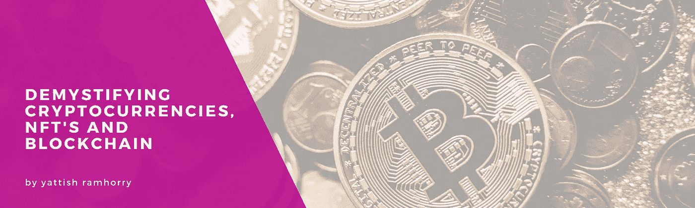

# 解密加密货币、NFT 和区块链

> 原文：<https://medium.com/coinmonks/demystifying-cryptocurrencies-nfts-and-blockchain-a5e88fa76151?source=collection_archive---------14----------------------->

如果你是加密货币的新手，你可能听说过比特币，你可能想知道比特币到底是什么，它是如何工作的。比特币是一种数字货币，由一个名为区块链的系统维护，这是一个分散的交易网络。

数字货币不同于传统货币，如美元、欧元或英镑，通常被称为“法定”货币。

数字货币是一种使用计算机算法创造的货币形式。它不是由中央银行或政府这样的中央机构维护和控制，这使得**数字货币是去中心化的。**

区块链也被称为数字分类账(DLT)，因为通过区块链发送的每笔交易都记录在不可变的分类账中。

区块链是**不可变的**，这意味着存储在区块链上的所有信息都不能以任何方式更改、删除或修改，这使得区块链非常适合金融交易，也非常适合存储有关固定资产的详细信息，例如有形财产、土地、建筑物和其他固定资产。

数字货币可以用来买卖产品和服务，也可以用来将一种数字货币兑换成另一种数字货币。你也可以将数字货币或加密货币兑换成“法定”货币，如欧元、美元或英镑。

你可以在一个分散的交易所购买、交易和投资这些货币对中的任何一个，这个交易所通常也称为“DEX”。一些著名和流行的分散式交易所是币安、鲁诺、比特币基地。

**比特币数字货币是最早创造的数字货币形式之一。从那以后，其他形式的数字货币也在他们的区块链系统的基础上发展起来。**

其他数字货币的几个例子，又名加密货币是以太坊，索拉纳，卡尔达诺。这些数字货币中的每一种都有其独特的特征，并且这些数字货币中的每一种都以它们自己的区块链形式发挥作用。

# 那么，什么是 NFT 呢？

NFT 或“不可替代令牌”是一种数字资产形式，可用于表示现实世界中的常见对象，如艺术、视频、音乐和游戏中的项目。NFT 经常使用加密货币在网上出售，并使用加密货币的相同编码方法进行编码。

NFT 现在越来越受欢迎，因为它们已经成为买卖数字艺术的一种简化方式。自 2017 年 11 月以来，与 NFT 的交易金额高达 1.74 亿美元。

NFT 的也是有问题的数字资产的限量版，有独特的识别码。NFT 通过限制流通来制造稀缺。

今天创造出来的大多数 NFT，已经以其他形式存在于其他地方。例如，已经在 Instagram 和其他在线艺术和数字平台上的 NBA 篮球运动员的视频剪辑或艺术的数字化版本。

如果任何人都可以在网上免费观看个人图像，那么为什么人们会花数百万美元购买可以轻松下载或截图的东西呢？

这是因为 NFT 允许数字资产的购买者也拥有原始项目。此外，NFT 还内置了身份验证功能，可作为买家所有权的证明。

# NFT 与加密货币有何不同？

NFT 也存储在区块链上，这是一种存储交易的分布式公共分类账。更具体地说，NFTS 是在以太坊区块链上创造的，以太坊本身就是一种数字货币。

NFT 是由代表有形和无形项目的数字资产“铸造”而成的，包括:

艺术

收藏品

音乐

录像

体育集锦

游戏中的皮肤和虚拟化身

GIF 的

NFT 的就像实物收藏品，但现在它只是数字性质的。NFT 的主人不用把一件艺术杰作挂在墙上，而是得到了一份艺术作品的数字文件。

NFT 的所有者也获得数字资产的专有权。这就是为什么 NFT 是限量版的，一次只有一个所有者。

为了购买 NFT，你需要一个加密货币钱包，以及一些加密货币，如以太。有时，一些 NFT 提供商可能接受其他加密货币，如索拉纳或比特币。

如前所述，你可以从比特币基地、北海巨妖、币安甚至 PayPal 等平台购买加密货币。你可能还想记住，一些 NFT 交易所在购买加密货币时也会向你收取交易费。

一些受欢迎的 NFT 市场，你可以在那里购买 NFT 的。

OpenSea.io

稀有的

基础

# 概括起来

NFT 和加密货币尚未达到顶峰，我们也远未探索这些数字技术的全部功能。

这两种技术的应用是无止境的，如果操作得当，NFT 和加密货币仍然可以赚钱。

由于加密货币仍然不受政府和金融机构的监管，投资和交易加密货币仍然存在风险。然而，如果你只能投资你能承受损失的钱，那么冒险探索 NFT 和加密货币可能是值得的。

> 加入 Coinmonks [电报频道](https://t.me/coincodecap)和 [Youtube 频道](https://www.youtube.com/c/coinmonks/videos)了解加密交易和投资

## 也阅读

 [## 杠杆代币[多头代币]终极指南

### 杠杆化令牌是具有杠杆化风险敞口的 ERC20 令牌，不考虑保证金、要求、管理…

medium.com](/coinmonks/leveraged-token-3f5257808b22)  [## 最佳加密交易所| 2021 年十大加密货币交易所

### 加密货币交易所的加密交易需要了解市场，这可以帮助你获得利润。之前…

blog.coincodecap.com](https://blog.coincodecap.com/crypto-exchange)  [## 2021 年最佳加密交换平台| CoinCodeCap

### 如果我们看看今天的场景，许多加密货币交换平台提供了广泛的功能和深度…

blog.coincodecap.com](https://blog.coincodecap.com/best-swap-platforms)  [## 2021 年最佳加密借贷平台| 6 大比特币借贷平台

### 获得比特币和其他加密货币的最佳贷款利率

medium.com](/coinmonks/top-5-crypto-lending-platforms-in-2020-that-you-need-to-know-a1b675cec3fa)  [## 2021 年最佳免费加密交易机器人

### 2021 年币安、比特币基地、库币和其他密码交易所的最佳密码交易机器人。四进制，位间隙…

medium.com](/coinmonks/crypto-trading-bot-c2ffce8acb2a)  [## 天秤座货币——脸书的加密货币

### 自 2018 年马克·扎克伯格决定致力于改善区块链以来，关于天秤座货币的传言就一直存在…

blog.coincodecap.com](https://blog.coincodecap.com/libra-currency-a-cryptocurrency-by-facebook)