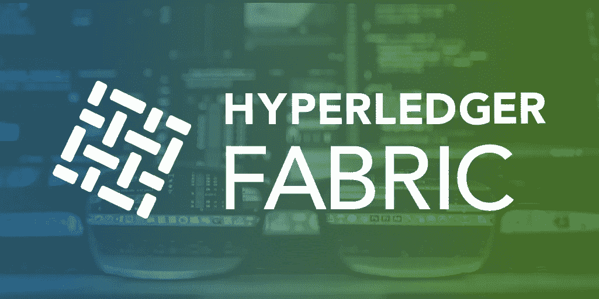

# 揭开 Hyperledger 结构的神秘面纱(1/3):结构架构

> 原文：<https://medium.com/coinmonks/demystifying-hyperledger-fabric-1-3-fabric-architecture-a2fdb587f6cb?source=collection_archive---------0----------------------->

[www.hyperledger.org/projects/fabric](https://www.hyperledger.org/projects/fabric)

*最初发表于*[*【www.serial-coder.com】*](https://www.serial-coder.com/post/demystifying-hyperledger-fabric-fabric-architecture/)*。*

当谈到私有区块链时， [Hyperledger Fabric](https://www.hyperledger.org/projects/fabric) 可能是最受欢迎和采用的区块链框架之一。Hyperledger Fabric 已经在[多个行业用例](https://www.hyperledger.org/resources/blockchain-showcase)中采用，如教育、医疗保健、物联网、物流、供应链等。最近，美国国家航空航天局公布了一项关于空中交通的提案