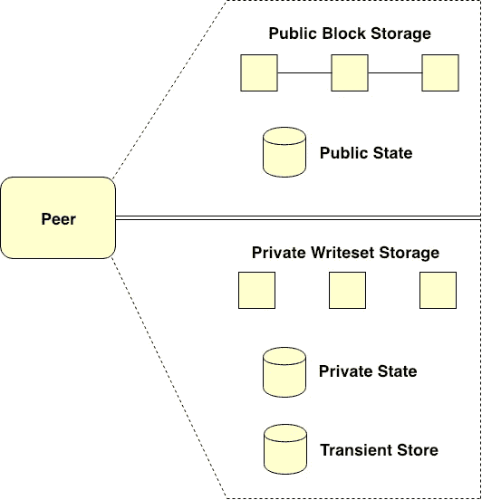
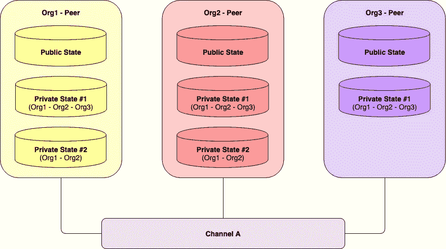
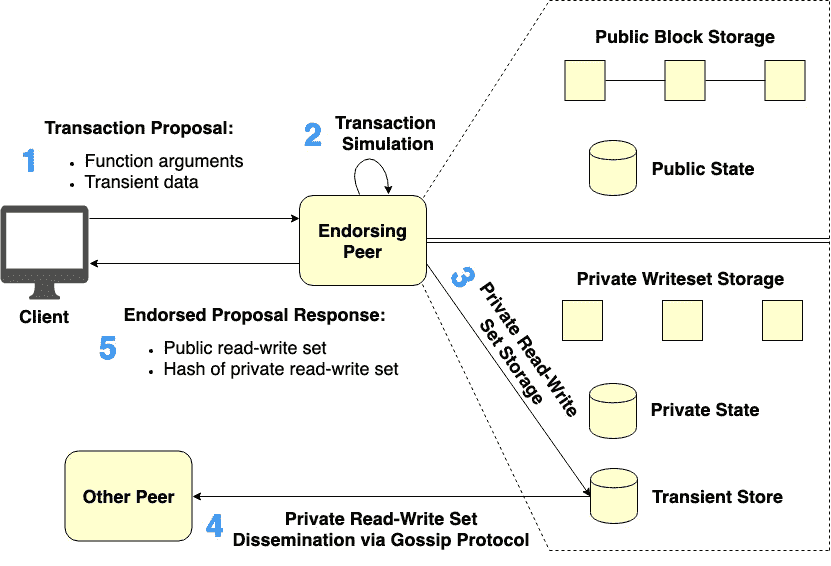
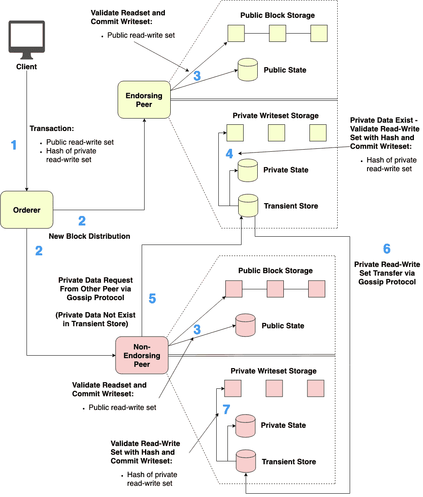
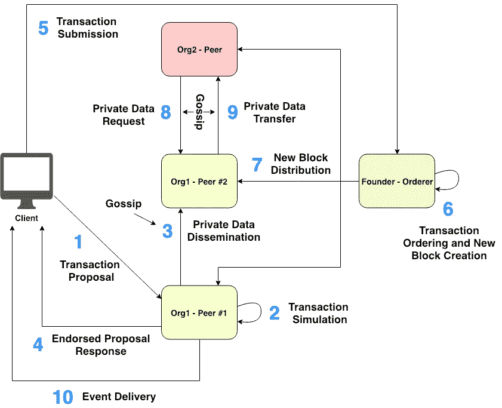

# 揭开 Hyperledger 结构的神秘面纱(2/3):私人数据收集

> 原文：<https://medium.com/coinmonks/demystifying-hyperledger-fabric-2-3-private-data-collection-164220ecafa5?source=collection_archive---------0----------------------->

[www.hyperledger.org/projects/fabric](https://www.hyperledger.org/projects/fabric)

*最初发表于*[*【www.serial-coder.com】*](https://www.serial-coder.com/post/demystifying-hyperledger-fabric-private-data-collection/)*。*

欢迎来到 ***揭秘 Hyperledger 面料系列*** 第二篇。本文假设读者已经了解 *Hyperledger Fabric 架构*。如果你看过这篇文章，我建议你先看看[上一篇文章](/p/a2fdb587f6cb)。

在上一篇文章中，您已经学习了 Hyperledger Fabric 的*基本架构。在本文中，您将了解到 Fabric 的另一个关键特性，称为 ***私有数据收集*** 。*

在 Fabric 版之前，当一组组织需要对加入同一通道的其他组织保密数据时，该组织子集必须创建一个新的单独通道。这导致了额外的管理开销，例如管理链码、背书策略、会员服务提供商配置等。此外，分离一个新的通道不能处理这样的情况，即一些组织可能需要保留一部分私有数据，但与其他组织共享其余的数据。

***私有数据收集*** 在 Hyperledger Fabric 版本中推出。通过此功能，被视为私有的数据可以配置为仅与授权组织共享，而公共数据可以在一个通道上与所有组织共享，而无需创建单独的通道。此外，该特征还使私人数据对订购服务保密，订购服务可能由未被授权查看数据的组织控制。

本文的其余部分组织如下:

*   [隐私数据收集概述](/p/164220ecafa5#7a9b)
*   [隐私数据收集的底层机制](/p/164220ecafa5#581b)
*   [带有私有数据的事务调用工作流](/p/164220ecafa5#67b3)
*   [私有数据清除](/p/164220ecafa5#4a4d)
*   [总结](/p/164220ecafa5#12ea)

**隐私数据收集概述**

**Figure 1\. Peer’s ledger enabled for Private Data Collection use**

***Fabric Peer*** 的*底层总账*启用*私有数据收集*使用如图 1 所示。通常情况下， ***同行*** 的*总账*与*私有数据收集*使能包括如下两个原语部分。

第一部分是*公共数据区*，它存储特定通道的所有公共数据和交易。*公共数据段*由两个实体组成，包括*公共块存储*和*公共状态数据库*，如图 1 上半部分所示。

具体来说， ***公共块存储*** 是一个区块链，它保存在通道上实例化的每个链代码的所有公共事务的历史。 ***公共状态数据库*** 是一个全局状态存储器，为特定链码维护公共变量的当前状态。对于任何特定的通道，即**公共数据段*仅包含单个 ***公共块存储实例*** 但是*段**可以包含多个 ***公共状态数据库实例*** 基于在一个通道上实例化的多个*链码*。**

**第二部分是*私有数据部分*，存储特定通道的所有私有数据和事务。*私有数据部分*由三个实体组成，包括*私有写集存储*、*私有状态数据库*和*临时存储数据库*，如图 1 的下半部分所示。**

*****私有写集存储*** 为特定的*私有数据收集*收集所有私有事务的历史。每个 ***对等*** 的*分类帐*可以包含多个 ***私有写集存储实例*** ，这取决于为该 ***特定对等*** 配置的多个*私有集合*。实际上，这种存储不是区块链，而是一种典型的日志持久数据库。**

*****私有状态数据库*** 是一个世界状态存储器，为一个特定的*私有集合*保存私有变量的当前状态。类似于*私有写集存储*的情况，多个 ***私有状态数据库实例*** 可以由 ***对等*** 的*分类帐*维护，依赖于为那个 ***特定对等*** 配置的多个*私有集合*。**

***私有数据段*中的最后一个实体是 ***暂存数据库*** *。*这种存储用作临时数据库，用于在事务调用过程中临时存储*私有数据*。稍后将解释关于 ***暂时存储数据库*** 的更多细节。**

****

****Figure 2\. Peers maintaining multiple Private Data Collections****

**任何*单个*链码都可以引用多个 ***私有数据集合*** 。图 2 示出了来自不同组织的三个对等体在同一信道上引用*两个私有数据集合*。可以看到， ***所有三个对等体*** 都为*私有集合 1 号*维护了*私有状态数据库实例*。同时，*私有集合 2 号*的*私有状态数据库实例*仅由 ***Org1*** 的*同级*和 *Org2* 的*同级*私有管理。**

**有趣的是， ***公共状态数据库*** 通常存储特定链码的公共变量的当前状态。无论如何，这个数据库也存储与特定链码相关的修改过的私有数据集的散列。换句话说，私有数据的*散列将与公共数据一样被签署、排序并提交到通道上每个对等体的分类帐中。在将私有数据更新到每个授权对等体的分类帐中之前，该散列用于状态验证。哈希还用作审计目的的交易证据。这方面的更多内容将在后面讨论。***

**尽管私有数据的*散列将被公开存储在通道上，但是没有未经授权的对等体可以将散列还原为原始内容。***

**Example of Private Data Collection definitions**

**图 2 中的 ***私有数据集合*** 可以转换成上面代码片段中的配置文件。然而，这篇文章不会涉及配置细节，只是给你一个如何配置*私有数据收集*的概念。如果你需要了解更多，请参考[这个链接](https://hyperledger-fabric.readthedocs.io/en/latest/private-data-arch.html)。**

**让我们重点关注名为 ***policy*** 的集合属性。此属性定义允许哪些组织的对等方保留收集数据。换句话说， ***任何私有数据集合*** 都将根据这个 ***策略*** 属性存储在授权对等体上。此外，为了使*私有集合*彼此保密，每个对等体将在 ***独立私有状态数据库实例*** 以及 ***独立私有写集存储实例*** 上存储 ***不同集合*** 。**

****隐私数据收集的底层机制****

**本节将详细讨论*私有数据收集*的底层机制。**

****

****Figure 3\. Endorsement phase of the transaction invocation with Private Data****

**带有私有数据的事务调用的认可阶段可以根据图 3 来描述。与正常的交易建议一样，*带有私有数据的交易建议*将在 ***客户端*** 生成(图 3 中*步骤 1* )。然而，事务提议的有效载荷将由两部分组成，包括*函数参数*和*瞬态数据*。**

*****函数参数*** 包含公共链码函数参数，就像普通的事务建议一样。鉴于 ***瞬态数据*** 包含私有数据参数，这些私有数据参数既不会被处理并存储到 ***公共块存储*** 中，也不会被存储到 ***公共状态数据库*** 中。换句话说，没有未经授权的对等方能够访问私有数据。**

**然后，生成的交易提议将被提交给选定的 ***签署对等方*** ，以便模拟并签署它(图 3 中的*步骤 2* )。交易模拟过程结束后，包含实际私有模拟数据的某部分模拟结果称为 ***私有读写集*** 将被临时存储到 ***暂存数据库*** 中的每个 ***背书对等*** 的*总账*(图 3 中的*步骤 3* )中。**

**每个 ***背书的同行*** 依次、 尝试将生成的 ***私有读写集*** 通过*八卦数据传播协议*传播给至少*n 个*授权组织*内的其他集合成员对等体(图 3 中的*步骤 4* 其中 ***n*** 是在背书时 ***私有数据*** 需要分发到的成员对等体的最小数量(值*由*私有数据收集定义*中指定的属性***required peercount***控制)。****

**上述步骤对于数据冗余非常重要。如果 ***认可对等体*** 在事务提交时间期间变得不可用，则作为集合成员但在认可时间尚未接收到 ***私有读写集*** 的其他对等体将能够从*对等体*中拉出此 ***私有数据*** 即 ***私有数据*****

*****认可对等体*** 将认可提议响应，当且仅当它能够成功地将 ***私有读写集*** 分发给至少 ***n 个*** 其他集合成员对等体。接下来，被认可的提议响应被发送回 ***客户端*** (图 3 中的*步骤 5* )。被认可的提议响应将包含两部分信息，即*公共读写集*和*私有读写集*的哈希。**

*****公共读写集*** 包含与被调用事务相关的公共变量的变化列表。私有读写集 的**Hash 是之前已经存储在 ***临时存储数据库*** 中的私有变量修改列表的 Hash 值(图 3 中*步骤 3* )。私有读写集** 的 ***hash 将用于状态验证，然后将私有数据更新到每个授权对等体的账本中。建议响应的这两个部分将被排序、验证并提交到 ***公共块存储*** 和 ***公共状态数据库*** 。*****

**

***Figure 4\. Ordering and validation-commitment phases of the transaction invocation with Private Data***

*带有私有数据的事务调用的排序和确认提交阶段可以根据图 4 进行描述。在交易提议已经被 ***认可对等方******客户端*** 生成与*组被认可的提议响应*捆绑的交易，然后将该交易发送给 ***订购方*** (图 4 中的*步骤 1* )。*

*接下来， ***排序器*** 对接收到的事务(包括其他事务)进行排序，生成一个新的有序事务块，并将生成的块分发给通道上的所有*【对等体】(图 4 中的*步骤 2* )。**

**然后，每个 ***对等*** 逐个处理接收到的块中的每个事务。也就是说，每个*对等体对照其本地 ***公共状态数据库*** 验证事务的*公共读集*，并将事务的*公共写集*提交到其本地 ***公共块存储*** 以及更新***

**接下来，每个 ***对等*** 检测到正在处理的事务包含私有读写集合 的 ***哈希。如果任何 ***对等体*** 发现它是被授权查看该确切私有数据集合的成员，那么 ***对等体*** 将使用 ***散列值*** 来验证存储在其 ***临时存储数据库*** 中的 ***确切私有读写集合*** 的存在。*****

*如果***中存在 ***精确私有读写集**，对等***将对照 ***私有状态数据库*** 验证*，并将 ***私有写集*** 提交到其 ***私有写中最后， ***对等*** 将 ***私有读写集*** 从 ***暂态存储数据库*** (图 4 中*步骤 4* )中移除。********

***如果有任何 ***对等体*** 是精确私有数据集合的*成员，但在背书时缺少 ***精确私有读写*** ***集合*** ，则 ***对等体*** 将发送对 ***缺少私有读写集合【的 pull 请求 ***请求的私有读写集合*** 将通过 gossip 协议被传送到 ***请求对等体*** 并临时存储到其 ***临时存储数据库*** (图 4 中的*步骤 6* )。*******

**稍后， ***中的对等*** 将验证 ***收到的私有读写设置*** 与 ***对应的哈希*** 。如果验证成功， ***对等体*** 对照其 ***私有状态数据库*** 验证 ***接收的私有读集*** ，并将 ***私有写集*** 提交到其 ***私有写集存储器*** 中。*对等体也更新*私有状态数据库，并最终从 ***临时存储数据库*** 中删除*(图 4 中*步骤 7* )。*****

******私有数据的事务调用工作流******

********

******Figure 5\. The invocation workflow of the transaction with Private Data******

****图 5 简要总结了使用私有数据进行 Fabric 事务调用的分步工作流:****

1.  *******客户端*** 做出包含*函数参数*和*瞬态数据*的交易提议，用 ***用户*** 的证书对该提议进行签名，并将该交易提议发送到一组预先确定的 ***背书对等体*** 上的特定通道。****
2.  ****每个 ***认可对等*** 从提案有效负载中验证 ***用户*** 的身份和授权。如果验证检查通过， ***签核方*** 模拟交易。 ***私有读写设置*** 从模拟结果被存储到 ***暂存数据库*** 内 ***对等*** 的*台账*。****
3.  ****每个 ***认可对等体*** 通过八卦协议将 ***私有读写集*** 传播给其他 ***授权对等体*** 用于数据冗余目的。****
4.  ****一旦*个私有数据传播成功*达到在*私有数据收集定义*、**、*认可对等体*、**中指定的最小所需计数，则生成包括私有读写集合、的**、*散列的提议响应。然后， ***认可对等体*** 使用其证书对生成的响应进行认可，并最终将生成的响应发送回 ***客户端*** 。*******
5.  ******客户端*** 累积并检查来自 ***签核同行*** 的签核提案响应。然后， ***客户*** 向 ***订购方*** 提交附有已背书的提案回复的交易。***
6.  ******排序器*** 对接收到的事务进行排序，生成新的有序事务块，并用其证书对生成的块进行签名。***
7.  ******订购方*** 在相关信道上向所有 ***对等方*** 广播生成的块。每个 ***对等*** 对照*调用的链码*的 e *拒绝策略*验证接收块中每个事务的认可，然后对照其 ***公共状态数据库*** 验证每个事务的 ***公共 readset*** 。如果验证检查成功，则将每个事务的 ***公共写集*** 更新到每个 ***对等******公共状态数据库*** 中。接收到的块也被追加到每个 ***对等*** 的 ***公共块存储器*** 中。随后，每个 ***授权对等*** 对照私有读写集合的*哈希，验证临时存储在其 ***临时存储数据库*** (如果存在)中的 ***私有读写集合*** 。 ***对等*** 也验证了 ***私有 readset*** 对其 ***私有状态数据库*** 。如果所有验证和确认过程成功，则将 ***私有写集*** 更新到 ***对等******私有状态数据库*** 。 ***私有写集*** 也被提交到 ***对等******私有写集存储*** 。最后， ***对等*** 从其 ***暂存数据库*** 中删除 ***私有读写集*** 。****
8.  ***如果在背书时间内有 ***授权的对等体*** 缺少 ***私有读写集*** ，那么 ***授权的对等体*** 将通过 gossip 协议向 ***其他授权的对等体*发送对 ***缺少私有读写集*** 的 pull 请求。*****
9.  ******缺失的私有读写集*** 将通过 gossip 协议从 ***请求对等体*** 转移到 ***请求对等体*** 。因此，接收到的 ***私有读写集*** 将在提交到****私有状态数据库*** 和 ***私有写集存储器*** 之前得到验证和确认(类似于*步骤 7* )。****
10.  *******客户端*** 从 ***EventHub 服务*** 接收任何订阅的事件。****

******私有数据清除******

****私有数据可以定期从对等体中清除。在 ***私有数据收集定义*** 、中，有一个收集属性叫做 ***blockToLive*** ，它表示私有数据应该在私有数据库中存在多长时间。假设我们将***block live***设为*50000。如果私有数据在 50，000 个数据块内未被修改，将自动从私有数据库中清除。如果 ***blockToLive*** 被设置为 0，私有数据将无限期保存在私有数据库中。也就是说，私有数据永远不会被清除。更多信息，请参考[私有数据架构参考](https://hyperledger-fabric.readthedocs.io/en/latest/private-data-arch.html)。*****

****尽管 ***私有数据*** 可能会从私有数据库中永久删除，但是*与被删除的私有数据*相对应的所有散列都不能被删除，因为它们被提交到 ***公共块存储*** ，这是一个区块链。因此， ***散列*** 可以用作审计目的的交易证据，即使*原始私有数据*已经消失。****

******总结******

****在这篇文章中，你已经学习了****Hyperledger Fabric***的关键特性之一。希望您了解 Hyperledger Fabric 如何更好地工作，如果您愿意，请随时留下您的宝贵意见或建议。感谢阅读:)*****

****在本系列的最后一篇文章[的下一篇文章](/p/f9a2046b4067)中，您将了解 Hyperledger Fabric 中的****服务发现****和 ***运营服务*** 。再次见到你。******

****本系列文章组织如下:****

*   ****[揭开 Hyperledger Fabric 的神秘面纱(1/3): Fabric 架构](/p/a2fdb587f6cb)****
*   ****[揭开总账结构的神秘面纱(2/3):私人数据收集](/p/164220ecafa5)****
*   ****[揭开 Hyperledger 结构(3/3)的神秘面纱:网络流量处理、服务发现和运营服务](/p/f9a2046b4067)****

*****最初发表于*[*www.serial-coder.com*](https://www.serial-coder.com/post/demystifying-hyperledger-fabric-private-data-collection/)*。*****

********