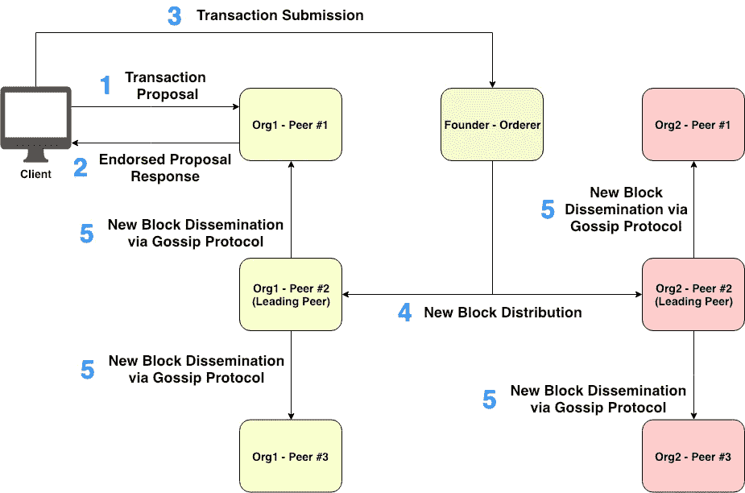
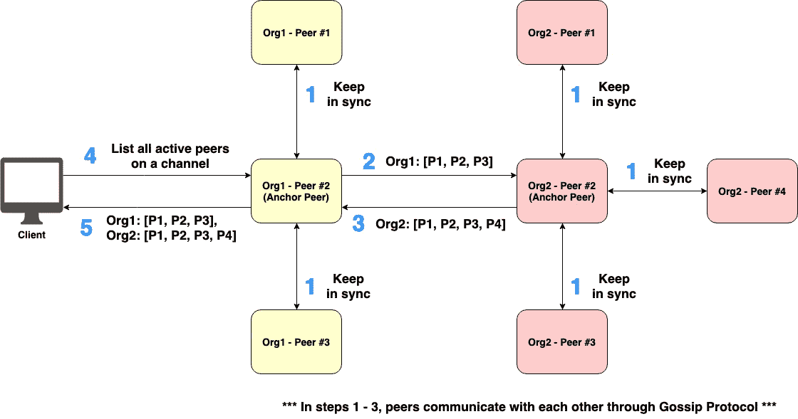
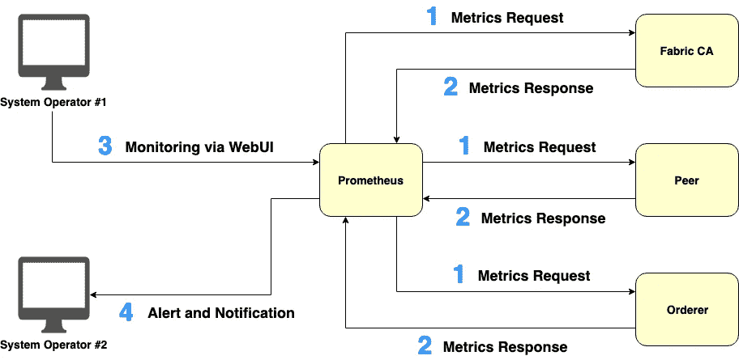
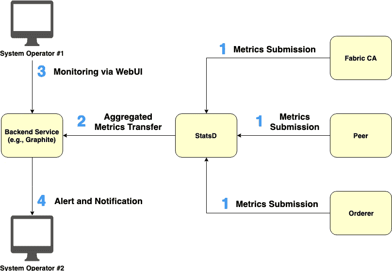

# 揭开 Hyperledger 结构的神秘面纱(3/3):网络流量处理、服务发现和运营服务

> 原文：<https://medium.com/coinmonks/demystifying-hyperledger-fabric-3-3-network-traffic-handling-service-discovery-and-operations-f9a2046b4067?source=collection_archive---------0----------------------->

[www.hyperledger.org/projects/fabric](https://www.hyperledger.org/projects/fabric)

*最初发表于*[*【www.serial-coder.com】*](https://www.serial-coder.com/post/demystifying-hyperledger-fabric-network-traffic-handling-service-discovery-and-operations-service/)*。*

欢迎来到第三篇文章，这是 ***揭开 Hyperledger 织物系列*** 的最后一篇文章。在[第一篇文章](/p/a2fdb587f6cb)中，已经解释了*Hyperledger Fabric*的底层架构。第二篇文章描述了名为*私有数据收集*的 Fabric 的一个重要特性。

我想用这篇文章来讨论 Hyperledger 结构中的一些辅助服务，包括以下主题:****服务发现******运营服务*** 。*

*本文的其余部分组织如下:*

*   *[网络流量处理](/p/f9a2046b4067#31bb)*
*   *[服务发现](/p/f9a2046b4067#1714)*
*   *[运营服务](/p/f9a2046b4067#a74f)*
*   *[运营指标:基于普罗米修斯的拉动式模型](/p/f9a2046b4067#05db)*
*   *[运营指标:基于 StatsD 的推送模型](/p/f9a2046b4067#ef55)*
*   *[关闭系列电源](/p/f9a2046b4067#1491)*

***网络流量处理***

*网络流量拥塞可能是结构信道上最潜在的问题之一，因为有多个参与组织加入该信道。此外，每个组织可以拥有多个对等体。让我们想象一下，如果参与组织和相关对等体的数量随着时间的推移而增加，那么 ***订购者*** 将会不堪重负地向每个通道上的每个对等体分发事务块。因此， ***订购方*** 很容易出现单点故障。*

*为了提供*崩溃容错(CFT)* 到 ***订购者*** ，Hyperledger Fabric 目前支持 *CFT 订购服务*的两个实现，即 ***Kafka*** 和 ***Raft*** 。此外，几种类型的*拜占庭容错(BFT)订购服务*也正在开发中*。*更多信息请参考[此链接](/p/a2fdb587f6cb#208b)。*

*除了减轻 ***排序者******的块分配开销外，还向所有参与组织介绍了*** 的领先同行。每个组织可以选择性地授权哪些对等体为 ***领导对等体*** 。如下图 1 所示， ***Org1*** 的*同行 2 号*和 ***Org2*** 的*同行 2 号*被指定为 ***领导同行*** 。*

**

***Figure 1\. Fabric block dissemination scheme using Leading Peers***

*使用 ***领先对等*** 的 Fabric block 分发方案的分步工作流程如图 1 所示:*

1.  ****客户端*** 向所选择的 ***背书对等体*** 发送交易提议。*
2.  *每个 ***背书对等体*** 生成交易响应，并将背书响应发送回 ***客户端*** 。*
3.  ****客户*** 向 ***订单方*** 提交附有背书回复的交易。*
4.  ****排序器*** 创建一个有序事务块，并依次将所创建的块分发给与组织相关联的每个*。**
5.  **每个 ***领导对等体*** 通过*八卦数据传播协议*将接收到的块传播给属于同一组织的 ***其他对等体*** 。**

**之前讨论的 *Fabric block 分发方案*可以显著降低 ***订购方*** 的开销。因此，该方案对于 Hyperledger Fabric 是必要的。每个组织可以静态地定义哪些对等体是 ***领导对等体*** 。然而，在没有静态指定的对等体的情况下，Fabric 系统还具有自动运行的动态主导对等体选择算法。**

****服务发现****

**为了调用一个事务来改变分类帐的状态，一个 ***客户应用*** 必须知道一组 ***签署对等体*** 需要签署一个事务提议。在 Fabric 1.2 版之前，此信息被静态编码到特定通道的 Fabric 系统链码中。**

**然而，这种静态配置不能适应网络变化。例如，当一个新的组织加入一个渠道或当一个链码认可政策发生变化。而且静态配置也不灵活，万一有 ***背书的同行*** 暂时下线。**

**在 Fabric 版本 1.2 中，引入了 ***发现服务*** ，以便于 ***客户端应用*** 发现成员资格和认可配置、所有活动对等体以及其他可用服务。请参考[此链接](https://hyperledger-fabric.readthedocs.io/en/latest/discovery-overview.html#capabilities-of-the-discovery-service)以了解 ***发现服务*** 的功能。 ***发现服务*** 以 ***Fabric SDK*** 的形式提供 API 接口，供客户端向属于同一组织的对等体查询所需的信息(例如，列出一个通道上所有活动的对等体)。反过来，被查询的对等体动态地计算所需的信息，并将可消费的信息返回给客户端。**

****

****Figure 2\. Peer discovery with the support of Anchor Peers****

**为了让 ***发现服务*** 高效工作，必须为每个组织配置一种特殊类型的结构对等点 ***锚对等点*** 。 ***主播对等点*** 的主要作用之一就是对等点发现。更具体地说，所有 ***对等体*** 都可以查询属于同一组织的 ***锚对等体*** 来动态发现一个频道上属于其他组织的所有 ***其他对等体*** 。为了防止单点故障，一个组织可以有多个 ***锚定对等*** 。如图 2 所示， ***Org1*** 的*同行 2 号*和 ***Org2*** 的*同行 2 号*配置为 ***锚同行*** 。**

**在 ***锚对等体*** 的支持下，对等体发现的逐步工作流程如图 2 所示:**

1.  *****普通对等体*** 通过*八卦协议*与属于同一组织的 ***锚对等体*** 保持周期性同步。**
2.  *****Org1******锚定对等体*** 使用*八卦协议*定期更新 org 1 的活动对等体到 ***Org2*** 的 ***锚定对等体*** 的*列表。***
3.  *****Org2*** 的 ***锚定对等体*** 还通过*八卦协议*定期更新 Org2 的活动对等体到 ***Org1*** 的 ***锚定对等体*** 的*列表。***
4.  **一旦 ***客户端*** 需要知道信道上所有活动对等体的*列表， ***客户端*** 使用***Fabric SDK***发出查询请求，并将该请求发送给属于同一组织的 ***对等体*** 中的一个。***
5.  ****被查询的对等体*** 响应 ***客户端*** 所有活动对等体的*列表*。*

***运营服务***

*在 1.4 版本的发布中，Hyperledger Fabric 主要致力于完善其稳定性和生产运营。 ***运营服务*** 是的重大更新之一。 ***操作服务*** 可以帮助系统操作员确定 ***订购方节点*** 、 ***对等方*** 和 ***Fabric CAs*** 的活性和健康状况。这种 ***服务*** 也有助于操作员更好地了解织物系统如何随着时间的推移而运行。*

*每个节点(包括 ***订购者节点*** 、 ***对等者*** 、 ***Fabric CAs*** )通过向系统操作者公开 *HTTP RESTful API* 来提供 ***操作服务*** 。为了限制对任何敏感信息的访问， *API* 与光纤区块链服务隔离，并且*该 API* 旨在仅由操作员用于操作和监控光纤系统组件的健康状况。*

*该 API 公开了以下功能:*

*   *[日志级别管理](https://hyperledger-fabric.readthedocs.io/en/release-1.4/operations_service.html#log-level-management)*
*   *[健康检查](https://hyperledger-fabric.readthedocs.io/en/release-1.4/operations_service.html#health-checks)*
*   *[运营指标](https://hyperledger-fabric.readthedocs.io/en/release-1.4/operations_service.html#metrics)*

*在这一部分，我将重点介绍*运营指标*。Hyperledger Fabric 提供了两种公开运营指标的模型，即基于 Prometheus 的 *pull 模型和基于 StatsD* 的 *push 模型。**

***运营指标:基于普罗米修斯的拉动式模型***

*我们可以设置 [***【普罗米修斯】***](https://prometheus.io/) ，通过连接到被检测的目标节点所公开的 ***/metrics*** API 端点，来周期性地从节点，包括***订购方节点*** 和 ***对等方节点*** 中获取可操作的度量。Prometheus 通常配备 WebUI，用于指标可视化以及警报和通知服务。*

*要使 Fabric 节点支持 ***Prometheus*** ，请查看[本文档](https://hyperledger-fabric.readthedocs.io/en/release-1.4/operations_service.html#prometheus)。这里是[当前导出供 ***普罗米修斯*** 使用的指标](https://hyperledger-fabric.readthedocs.io/en/release-1.4/metrics_reference.html#prometheus-metrics)列表。*

**

***Figure 3\. Utilizing Prometheus to pull operational metrics from nodes***

*图 3 描述了利用 ***Prometheus*** 从不同种类的节点提取操作指标的逐步工作流程:*

1.  ****普罗米修斯*** 周期性的向 ***Fabric 目标节点*** 发出抓取指标的拉取请求。*
2.  *每个 ***Fabric 目标节点*** 将其相关度量响应给 ***Prometheus*** 。*
3.  ****系统操作员*** 通过 ***普罗米修斯*** ' *WebUI 监控汇总指标。**
4.  ****Prometheus*** 根据 ***操作员***设定的条件，向 ***系统操作员*** 发送**警报和通知。***

***运营指标:基于 StatsD 的推送模型***

*除了利用 ***普罗米修斯*** 作为拉动运营指标的引擎，Hyperledger Fabric 还支持基于 [***StatsD***](https://github.com/statsd/statsd) 的推送模型。我们可以配置 Fabric 节点(包括 ***订购方节点******对等方******Fabric CAs***)定期向 ***StatsD 守护进程*** 提交运营指标。然后，由*StatsD 聚合的指标可以被推送到一个或多个可插入的后端服务，例如[*【Graphite】*](https://graphiteapp.org/)*，用于指标可视化和警报。***

***要配置结构节点向 ***StatsD*** 提交指标，请遵循本文档。这里是[目前发布的 ***StatsD*** 消费的指标](https://hyperledger-fabric.readthedocs.io/en/release-1.4/metrics_reference.html#statsd-metrics)列表。***

****

****Figure 4\. Pushing operational metrics from nodes to StatsD****

**将运营指标从不同类型的节点推送到 ***StatsD*** 的逐步工作流程如图 4 所示:**

1.  **每个 ***结构节点*** 定期向 ***StatsD*** 提交其相关度量。**
2.  *****StatsD*** 将汇总的指标提交给 ***后端服务*** ，如 *Graphite* 进行指标可视化和预警。**
3.  *****系统操作员*** 通过 ***后端服务*** 的 *WebUI* 监控汇总的指标。**
4.  *****后端服务*** 根据 ***操作员*** 设置的条件，向 ***系统操作员*** 发送警报和通知。**

****关闭系列电源****

**这是 ***揭秘总账面料系列*** 的最后一篇文章。你已经学习了*Hyperledger Fabric 中的几个辅助服务*，它们为区块链开发者、区块链架构师和系统操作员提供便利。**

**实际上，这一系列文章中还有几个有趣的话题需要讨论，包括:**

*   **超分类帐结构中的多版本并发控制**
*   **Hyperledger 结构中的身份、验证和授权**
*   **通道级访问控制和策略**
*   **高级链码开发**
*   **链码级基于属性的访问控制**
*   **链码级加密**
*   **织物订购服务在发挥作用**
*   **超分类帐结构中的零知识证明**
*   **高级结构性能优化和高可用性**

**希望有一天我会有机会写关于这些话题的文章。如果您有任何问题或建议，请不吝留下您的宝贵意见。直到下次:)**

**本系列文章组织如下:**

*   **[揭秘 Hyperledger Fabric (1/3): Fabric 架构](/p/a2fdb587f6cb)**
*   **[揭开 Hyperledger 结构的神秘面纱(2/3):私人数据收集](/p/164220ecafa5)**
*   **[揭开 Hyperledger 结构(3/3)的神秘面纱:网络流量处理、服务发现和运营服务](/p/f9a2046b4067)**

***原载于*[*www.serial-coder.com*](https://www.serial-coder.com/post/demystifying-hyperledger-fabric-network-traffic-handling-service-discovery-and-operations-service/)*。***

****