# 📣🖼揭开 NFTs 的神秘面纱——以下是你错过的机会！！

> 原文：<https://medium.com/coinmonks/demystifying-nfts-heres-what-you-are-missing-out-e1028031a0c2?source=collection_archive---------7----------------------->

## NFTs 将帮助我们虚拟化物理和数字资产，借助真实性、稀缺性、清晰的所有权、防篡改和智能合同等所有优势，推动资产的顺畅移动

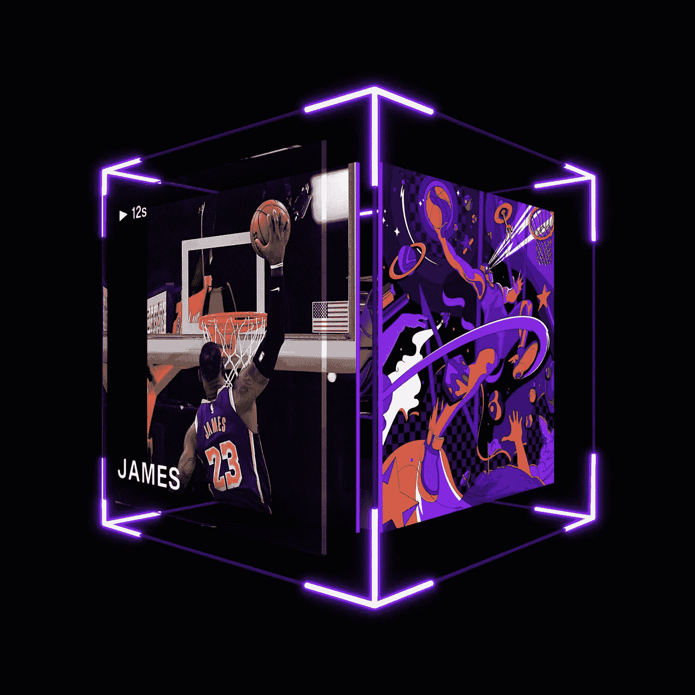

如果你喜欢这篇文章——帮我[FREE weekly communication](https://cryptoage.substack.com/)注册，**跟你的朋友们分享**，然后**给我反馈**。你可以在社交媒体 Twitter 上找到我——或者在中找到[link。](https://www.linkedin.com/in/sauravbhats/)

# 人们对 NFTs 趋之若鹜..
这难道只是加密货币狂热者的又一次追捧？

你们大多数人都听说过 NFTs。虽然你可能不了解它背后的技术，但我相信你听说过有人为了购买随机的图片或艺术品而投入数百万美元。在撰写本文时(2021 年 8 月)，CryptoPunks 的销售额接近 4 亿美元，达到了惊人的 9 亿美元 NFT 销售额

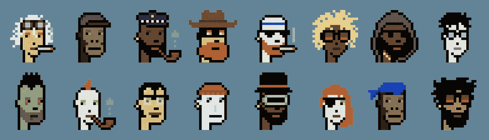

> ***是！！这些像素化图像的交易价格超过 4 亿美元。而不是整个形象。每个角色都是独立交易的。***

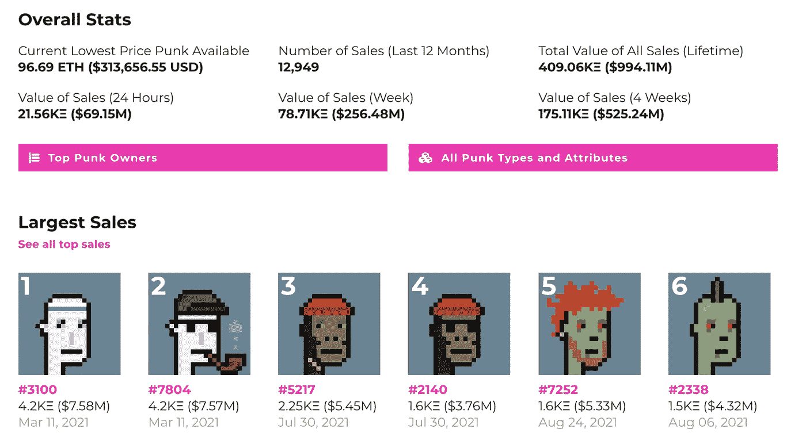

*截至 2021 年 8 月 27 日止自*[*www.larvalabs.com/cryptopunks*](https://www.larvalabs.com/cryptopunks)

**左侧第一张图片 760 万美元**

**如果你生活在一块石头下面，而且一直没有注意到它的动静，现在就让我们把你抓住。**

*   2021 年 3 月，《每日邮报》(Beeple，Everydays)在佳士得(Christie)激起了艺术界的波澜
*   [以下是 NFT 十大最贵艺术品，从毕尔价值 6900 万美元的作品到一个 18 岁女孩价值 50 万美元的《吸血鬼女王》](https://news.artnet.com/market/most-expensive-nfts-1952597)
*   [一名 12 岁的程序员在销售 NFTs](https://www.cnbc.com/2021/08/25/12-year-old-coder-made-6-figures-selling-weird-whales-nfts.html) 约两个月后，将获得超过 40 万美元的收入
*   [《灾难女孩》以 50 万美元的价格将自己的人气偶像 NFT 卖了出去](https://www.theverge.com/2021/4/29/22410070/disaster-girl-popular-meme-nft-500000-dollars)

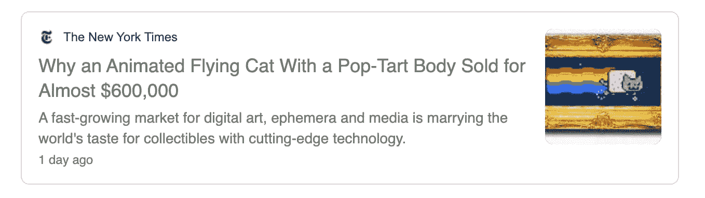

根据阅读这篇文章，你可以分为两个阵营

1.  这只是炒作，就像荷兰投资者陷入郁金香狂热一样，大量财富被摧毁或者
2.  **这比看上去要复杂得多。让我们更深入地理解这一点。**

如果你属于第二阵营，那你来对地方了。作为本文的一部分，我将探讨这些问题以及其他一些问题

*   为什么有人会花钱观看或购买这些数码照片——“我可以复制并保存它们”
*   买这个的都是些什么人？他们支付这么高的价格，是不是疯了？
*   这一切与元宇宙有什么联系(如果你不知道什么是元宇宙——[阅读马克·扎克伯格如何将元宇宙作为脸书的未来](https://www.theverge.com/22588022/mark-zuckerberg-facebook-ceo-metaverse-interview))

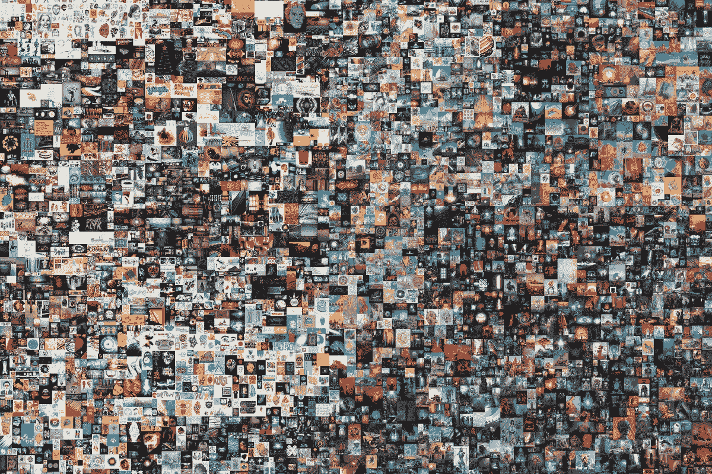

**这不全是像素化的艺术。有些 NFT 是非常复杂的数字艺术作品。**

**Beeple，第一个表情符号。每天 6930 万美元的一部分。**

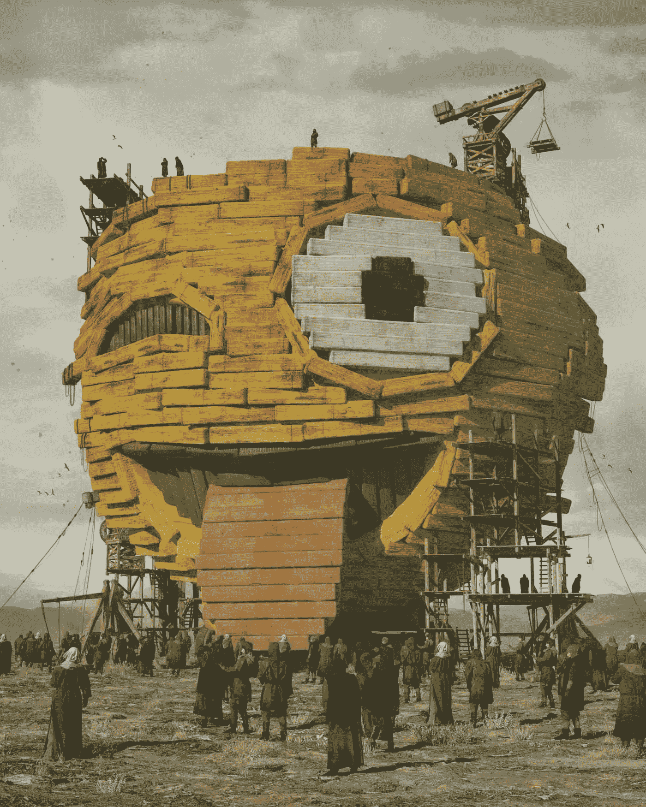

由于我不是艺术专家，我不知道如何给具体的艺术品估价，也不知道为什么一些 NFT 的收藏比其他的更有价值。我想做的是评估制造 NFT 的基础技术是什么，以及它能做什么。*在随后的文章中，我们可以深入探究是什么帮助某些艺术家/艺术类型创造了更多的需求*

# 什么是 NFT

**NFT =不可替换的令牌(位于区块链上的文件)**

## 用简单的英语来说是什么意思？

***可替代性*** *—在经济学中，可替代性是一种商品或商品的属性，其单个单元本质上是可互换的，并且其各个部分与另一部分无法区分。* [*1*](https://cryptoage.substack.com/p/-demystifying-nfts-heres-what-you#footnote-1)

*“不可替代”意味着它是独一无二的，不能被其他东西替代。例如，一个比特币是可替代的——用一个比特币换另一个比特币，你会得到完全一样的东西。然而，独一无二的交易卡或画是不可替代的。如果你把它换成另一张卡，你会得到完全不同的东西。*

*在区块链上注册的 NFT 已经真正成为一种“独一无二”的资产，无法伪造、篡改或欺骗。区块链允许公众访问和私人拥有任何数字媒体文件*

*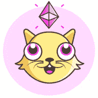*

## *NFT 互联网与当今互联网的比较(来自以太坊网站)*

*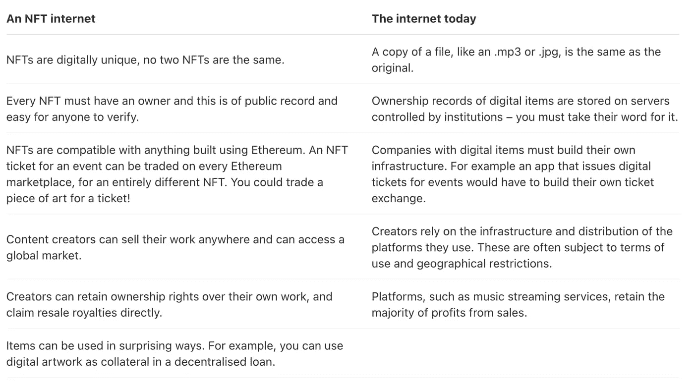*

# *NFTs 是如何工作的*

*NFT 是在区块链上铸造(创建)的。一开始以太坊是一个受欢迎的平台，但现在他们正在其他区块链上创建。NFTs 提供了分配或要求任何独特的数字数据的所有权的能力，可通过使用区块链作为公共分类账来跟踪。NFT 是从数字对象中铸造的，作为数字或非数字资产的表示。例如，NFT 可以代表:*

*数字艺术:*

*   *gif*
*   *收藏品*
*   *音乐*
*   *视频和体育集锦*
*   *虚拟化身和视频游戏皮肤*

*真实物品:*

*   *收藏品——艺术品、手表、葡萄酒*
*   *名牌运动鞋*
*   *汽车契约*
*   *真实世界活动的门票*
*   *令牌化发票*
*   *教育记录和法律文件*
*   *签名*

*更多有趣和有创意的选择。*

*如果你想变得超级技术化。启动一切的最常用的令牌标准。ERC721 令牌不可替换；每个代币都是唯一的，可以独立定价。其他区块链也有类似的令牌格式，如币安智能链的 BEP-721。*

# *NFT 真正在解决什么问题？*

*为了帮助区分短暂的时尚和基本面，这是一个很重要的问题。NFT 真正在解决什么问题？*

*在过去的 20-30 年里，随着互联网的发展，它摧毁了创作者的许多价值，因为制作他们原始作品(艺术、音乐、书籍)的多个副本变得很容易，而没有真正将价值传递给创作者，创作者不得不花费大量时间来创作和完善这件艺术品*

*随之而来的是 NFTs，利用去中心化的区块链基础设施来提供下面列出的属性，让我们到达应许之地*

*   ***真实性**——物品是真品还是复制品*
*   ***稀缺性**——流通中规定的单位或份数。例如具有特定票号或座位号的游戏赛事的门票*
*   ***所有权—** 物品属于谁*
*   ***细分**(可选)——零件所有权*
*   ***独特的** —不可与其他东西 1:1 互换*
*   ***防篡改** —没人能以任何方式操纵它*
*   ***智能合同功能** —将逻辑编程到 NFT 中的能力，例如，每次销售时向原创者支付版税，如果碳足迹超过阈值，则销毁绿色 NFT，等等。*

*所有这些都不需要依赖可信的中间人，他们有最终的权力来阻止他们喜欢的人或改变他们认为合适的记录。底层的区块链系统建立在分布式的、分散的、不可信的环境之上，该环境是可扩展的、全局的和健壮的。*

## *“我就不能截图文件吗？”*

*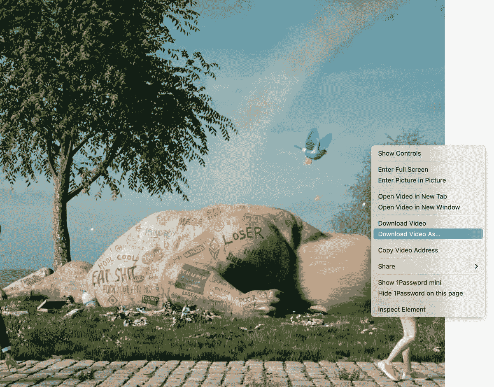*

*该死，我正忙着右击视频，下载某人花了几百万美元买的东西。这很恶心，但却是真的。那么价值在哪里呢？？*

*其价值在于拥有真实的文件——作者签名的书的复印件会与真正的作者签名的书具有相同的价值吗？您可以任意多次拷贝数字文件，包括 NFT 附带的插图。*

*但 NFT 的设计是为了给你一些无法复制的东西:作品的所有权(尽管艺术家仍然可以保留版权和复制权，就像物理艺术品一样)。从实物艺术收藏的角度来说:任何人都可以买到莫奈的画。但只有一个人能拥有原件。*

## *" NFT 只与数字艺术有关吗？"*

*不完全是。艺术只是第一组吸引社会目光的非功能性思维的用例。NFTs 可用于任何数量有限、不可互换、唯一可识别的事物。您将开始看到越来越多的 NFT 被创建来表示真实世界的物理资产，其所有权作为 NFT 进行管理。这些资产的所有权可以很容易地在公开的区块链上验证，用作交易的抵押品，并很容易进行交易或分割出售。(下面解释了更多使用案例)*

# *NFTs 的历史*

*NFT 已经走过了漫长的道路。最著名的是 CryptoPunks(仍然很强大)和 Crypto Kitties。*

*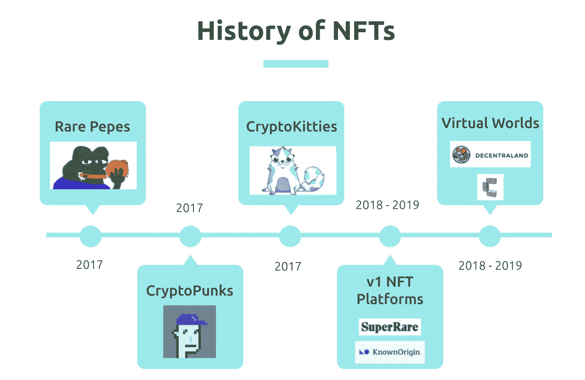**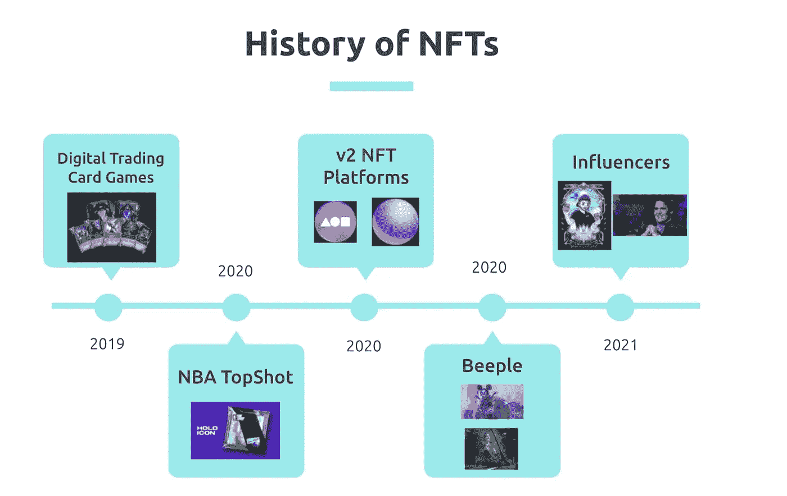*

*今天，NFT 铸造平台 [**铸造基地**](https://mintbase.io/) 和 [**铸造平台**](https://mintable.app/) 几乎可以让任何人用工具铸造他们的 NFT。*

*NFTs 的市集有[**【OpenSea】**](https://opensea.io/)(最突出) [**俏皮网关**](https://niftygateway.com/) (限量版作品) [**超稀有**](https://superrare.co/) (单版作品) [**货物市集**](https://app.cargo.build/marketplace?filter=%7B%7D)[**已知产地**](https://knownorigin.io/)[**maker place**](https://makersplace.com/)。*

> *“这次 NFT 世界可能是 100 多年来艺术家机会的最大释放。这不是现实世界艺术经济的次优或边缘版本，而是一个大大改善的版本。”—斯科特·贝尔斯基(Adobe 首席产品官、Behance 创始人、Benchmark 风险合伙人)*

# *主流企业和艺术家的参与*

***亮点***

*   *[人们已经花费超过 2.3 亿美元购买和交易 NBA 集锦的数字收藏品](https://www.cnbc.com/2021/02/28/230-million-dollars-spent-on-nba-top-shot.html)*
*   *[来自 CNN](https://vault.cnn.com/) 的拱顶——改变我们 40 多年的时刻，CNN 带你踏上非凡的旅程，讲述我们这个时代的故事。现在，CNN 的 Vault 为你提供了一种新的方式来拥有和体验那些改变了我们和世界的历史时刻。*

***音乐艺术家***

*流行音乐艺术家 [**【莱昂国王】**](https://www.rollingstone.com/pro/news/kings-of-leon-when-you-see-yourself-album-nft-crypto-1135192/)[**格兰姆斯**](https://news.artnet.com/art-world/grimes-sold-nft-art-1948177)[**水槽**](https://foundation.app/flumezawada/saccade-loud-sound-3162)[**史蒂夫·青木**](https://edm.com/gear-tech/steve-aoki-nft-sells-for-4-25-million) 都曾创造出非卖品并获得巨大成功。滚石 报道称，对于那些选择向“超级粉丝”提供歌曲、专辑、虚拟随身用品甚至虚拟会议优惠券的音乐人来说，NFTs 可能会改变游戏规则。*

*对于独立艺术家和音乐家来说，NFT 改变了游戏规则*

*创造者经济的潜力是巨大的，创造者代币很快就会出现。*

# *元宇宙和未来的画廊*

*如果你还不知道元宇宙，这是一个虚拟的世界，人们将在这里互动、工作、玩耍— [观看电影《玩家一号》](https://www.youtube.com/watch?v=cSp1dM2Vj48),更好地了解可能发生的事情。*

*许多数字艺术品、虚拟角色配件、建筑、商品都是已经购买的非功能性物品，可以在虚拟世界中使用或展示。*

*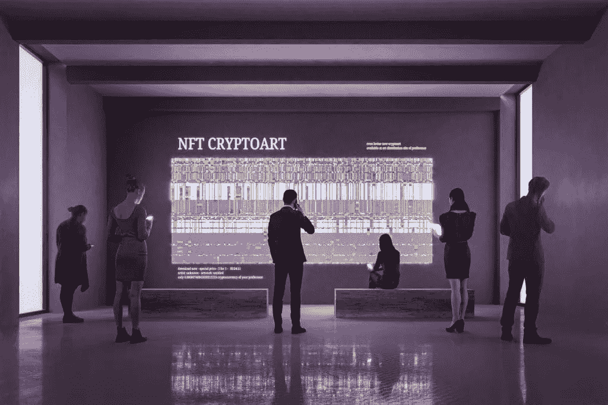*

*只有时间能告诉我们这些用例将如何随着时间的推移而成功。但是现在，我不会深入这个兔子洞，我会把它留到另一篇文章中。*

# *我为什么要在乎*

*NFT 可能会改变我们对所有权的看法，就像互联网改变了我们对通信和商业的看法一样。*

*互联网使我们能够跨越物理距离的鸿沟。从——图像、声音、文本开始减少过程中的摩擦*

*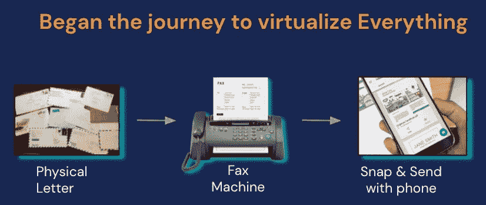*

> **NFTs 将帮助我们虚拟化物理&数字资产，利用真实性、稀缺性、所有权清晰、防篡改&智能合同*的所有优势推动资产的无摩擦移动*

# *内容创作者将收回控制权*

*如今，内容创作者的控制力有限。他们要么被所在行业的中间商所欺骗，要么被消费者所误解，因为他们的辛勤劳动被不加选择地抄袭，却没有为他们创造任何收入。许多内容创作者因不正确的版权侵权索赔而被社交媒体平台禁止其艺术、音乐和产品。所有这些都可以成为一部分，因为内容创作者可以包装他们的产品，并直接接触到消费者。当书籍、音乐、视频等被最终用户消费时，区块链可以帮助加强访问、支付服务、版税。他们的作品可以被打包成具有智能功能的 NFTs，可以强制执行每次书籍提前销售或为所阅读的书籍的每一页支付费用时如何分享版税。选择是无穷无尽的。*

# *NFT 的例子*

*NFT 世界相对较新。理论上，NFTs 的范围是任何需要可证明所有权的独特事物。下面是一些现存的非功能性测试的例子，可以帮助你理解这个概念:*

*   *[独特的数码艺术品](https://foundation.app/artworks)。*
*   *[限量版时尚系列](https://www.metagrail.co/auctions/91cf83fb-3477-4155-aae8-6dcb9b853397)中的独特运动鞋。*
*   *[一个游戏内物品](https://market.decentraland.org/)。*
*   *[一篇散文](https://zora.co/0x517bab7661C315C63C6465EEd1b4248e6f7FE183/145)。*
*   *[一个数码收藏品](https://www.larvalabs.com/cryptopunks/details/1)。*
*   *[一个域名](https://app.ens.domains/name/ethereum.eth)。*
*   *[让你参加活动的门票或优惠券](https://www.yellowheart.io/)。*

# *我如何得到我的第一件 NFT 艺术品？*

*疯狂现在仍然在 NFT 艺术领域。虽然它看起来像一个 4 步的过程，但对于新手来说，它仍然有相当多的障碍。这绝对是一个简化流程和改善 UX 的机会。*

*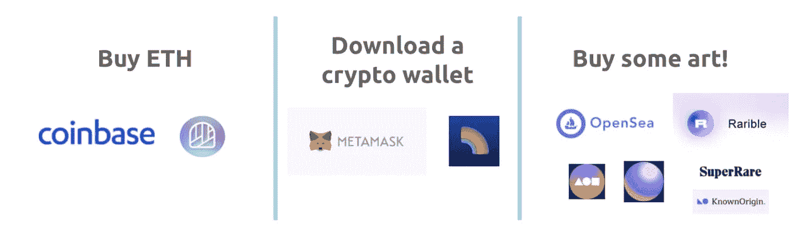*

1.  *你需要让你的钱进入加密宇宙(最有可能通过像硬币基地，币安，双子座等交易所*
2.  *买一些 ETH 或者 BNB(取决于你想在哪个平台上买 NFT)*
3.  *注册一个像 metamask 这样的去中心化钱包，把你的代币转移到里面。一些选项让你直接购买 ETH 到你的分散钱包里。*
4.  *去 NFT 的市场，像 OpenSea，Rarible 等，买你的第一个 NFT。*

*这并不是购买 NFT 的完整指南。我可以试着分开做。*

# *我以前的一些帖子，如果你还没有看过的话*

*   *[💸加密货币的 5 个要素。现在就开始！！](https://cryptoage.substack.com/p/5-essentials-for-cryptocurrencies)*
*   *[🥇接下来的 5 种加密货币和它们的丰厚回报！【十大系列】](https://cryptoage.substack.com/p/next-5-crypto-currencies-and-their)*
*   *[🏆区块链将扰乱奥运会的 10 种方式——2024 年巴黎奥运会和 2028 年洛杉矶奥运会](https://cryptoage.substack.com/p/-10-ways-blockchain-will-disrupt)*
*   *[🚀央行数字货币的新时代](https://cryptoage.substack.com/p/a-new-era-of-central-bank-digital)*
*   *[比特币价格——骗局还是真实？](https://cryptoage.substack.com/p/bitcoin-price-scam-or-real)*
*   *[我学到的 10 条投资经验](https://cryptoage.substack.com/p/10-investing-lessons-i-learned-part)*

*如果你喜欢这篇文章，请**注册**我的免费每周简讯，**与你的朋友分享**，并**给我反馈**。你可以在社交媒体 [Twitter 上找到我——在](https://twitter.com/sauravbhats)中链接的@sauravbhats 或[。](https://www.linkedin.com/in/sauravbhats/)*

***🚨大免责声明** : ***这不是投资建议。我不是投资顾问。此信息旨在用于教育目的。在你决定投资你的血汗钱之前，请做好你自己的研究。如果你不确定，寻求专业理财顾问的帮助，他能理解你的全部财务需求，给你建议你应该做什么。****

> *加入 [Coinmonks 电报频道](https://t.me/coincodecap)，了解加密交易和投资*

## *另外，阅读*

*   *[什么是保证金交易](https://blog.coincodecap.com/margin-trading) | [美元成本平均法](https://blog.coincodecap.com/dca)*
*   *[BigONE 交易所评论](/coinmonks/bigone-exchange-review-64705d85a1d4) | [电网交易机器人](https://blog.coincodecap.com/grid-trading)*
*   *[3 商业评论](/coinmonks/3commas-review-an-excellent-crypto-trading-bot-2020-1313a58bec92) | [Pionex 评论](/coinmonks/pionex-review-exchange-with-crypto-trading-bot-1e459d0191ea) | [Coinrule 评论](/coinmonks/coinrule-review-2021-a-beginner-friendly-crypto-trading-bot-daf0504848ba)*
*   *[莱杰 vs Ngrave](/coinmonks/ledger-vs-ngrave-zero-7e40f0c1d694) | [莱杰 nano s vs x](/coinmonks/ledger-nano-s-vs-x-battery-hardware-price-storage-59a6663fe3b0) | [币安评论](/coinmonks/binance-review-ee10d3bf3b6e)*
*   *[Bitget 回顾](https://blog.coincodecap.com/bitget-review)|[Gemini vs block fi](https://blog.coincodecap.com/gemini-vs-blockfi)|[OKEx 期货交易](https://blog.coincodecap.com/okex-futures-trading)*
*   *[霍比评论](https://blog.coincodecap.com/huobi-review) | [OKEx 保证金交易](https://blog.coincodecap.com/okex-margin-trading) | [期货交易](https://blog.coincodecap.com/futures-trading)*
*   *[加密套利](/coinmonks/crypto-arbitrage-guide-how-to-make-money-as-a-beginner-62bfe5c868f6)指南| [如何做空比特币](/coinmonks/how-to-short-bitcoin-568a2d0b4ae5)*
*   *[币安交易机器人](/coinmonks/binance-trading-bots-d0d57bb62c4c) | [OKEx 审查](/coinmonks/okex-review-6b369304110f) | [阿塔尼审查](https://blog.coincodecap.com/atani-review)*
*   *[最佳加密交易信号电报](/coinmonks/best-crypto-signals-telegram-5785cdbc4b2b) | [MoonXBT 评论](/coinmonks/moonxbt-review-6e4ab26d037)*
*   *[Godex.io 审核](/coinmonks/godex-io-review-7366086519fb) | [邀请审核](/coinmonks/invity-review-70f3030c0502) | [BitForex 审核](https://blog.coincodecap.com/bitforex-review)*
*   *[火币交易机器人](https://blog.coincodecap.com/huobi-trading-bot) | [如何购买 ADA](https://blog.coincodecap.com/buy-ada-cardano) | [Geco。一次审查](https://blog.coincodecap.com/geco-one-review)*
*   *[币安 vs 比特邮票](https://blog.coincodecap.com/binance-vs-bitstamp) | [比特熊猫 vs 比特币基地 vs Coinsbit](https://blog.coincodecap.com/bitpanda-coinbase-coinsbit)*
*   *[如何购买 Ripple (XRP)](https://blog.coincodecap.com/buy-ripple-india) | [非洲最好的加密交易所](https://blog.coincodecap.com/crypto-exchange-africa)*
*   *[非洲最佳加密交易所](https://blog.coincodecap.com/crypto-exchange-africa) | [晤交易所评论](https://blog.coincodecap.com/hoo-exchange-review)*
*   *[eToro vs robin hood](https://blog.coincodecap.com/etoro-robinhood)|[MoonXBT vs by bit vs Bityard](https://blog.coincodecap.com/bybit-bityard-moonxbt)*
*   *[有哪些交易信号？](https://blog.coincodecap.com/trading-signal) | [比特斯坦普 vs 比特币基地](https://blog.coincodecap.com/bitstamp-coinbase)*
*   *[ProfitFarmers 回顾](https://blog.coincodecap.com/profitfarmers-review) | [如何使用 Cornix Trading Bot](https://blog.coincodecap.com/cornix-trading-bot)*
*   *[如何在势不可挡的域名上购买域名？](https://blog.coincodecap.com/buy-domain-on-unstoppable-domains)*
*   *[印度的秘密税](https://blog.coincodecap.com/crypto-tax-india) | [altFINS 审查](https://blog.coincodecap.com/altfins-review) | [Prokey 审查](/coinmonks/prokey-review-26611173c13c)*
*   *[Blockfi vs 比特币基地](https://blog.coincodecap.com/blockfi-vs-coinbase) | [BitKan 点评](https://blog.coincodecap.com/bitkan-review) | [Bexplus 点评](https://blog.coincodecap.com/bexplus-review)*