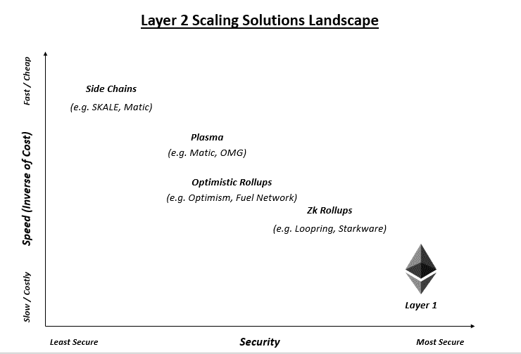
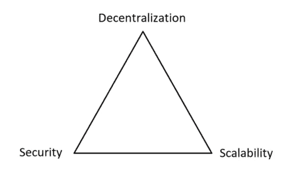
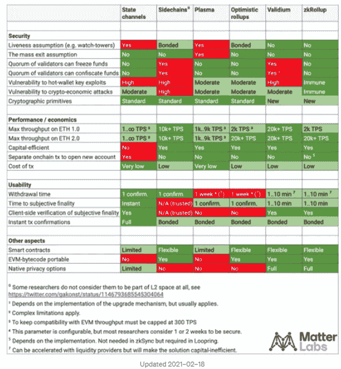

# 揭开围绕第 2 层扩展解决方案的安全争论的神秘面纱

> 原文：<https://medium.com/coinmonks/demystifying-the-security-debate-around-layer-2-scaling-solutions-c35fc68405e9?source=collection_archive---------3----------------------->

**简介**

最近围绕以太坊上的第 2 层扩展解决方案为应用程序和用户提供的安全级别有很多争论。这给侧链与上链以及不同的扩展解决方案如何与以太坊主链交互带来了一些困惑。在本报告中，我们将了解什么是扩展解决方案，为什么要创建它们，以及每种解决方案的预期安全级别。

**为什么需要扩展解决方案？**

对于社区中的大多数人来说，可伸缩性问题是显而易见的。然而，我们发现提出问题有助于更好地提出安全辩论。下面是可伸缩性/区块链三难困境的总结；那些非常熟悉这个主题的人可以选择跳过这一部分。

大多数公众一致认为区块链依赖于大量的节点来验证交易。这就是网络去中心化的原因。假设共识机制是健壮的，一旦这个网络有足够数量的验证者，我们也可以认为它是安全的。然而，交易必须由大量节点验证的事实导致了缓慢的阻塞时间，并且随着对网络需求的增加而导致更高的成本。例如，以太坊 1.0 目前每秒可处理约 15–18 笔交易，而 Visa 等传统的非分散式同类产品每秒可处理约 24k tps。

这个问题从一开始就一直存在于区块链领域，被称为区块链或可扩展性三难问题，即区块链只能拥有以下三个中的两个，因为这些因素之间的相互作用:安全性、可扩展性和去中心化。

可扩展性解决方案有助于大型、分散的第 1 层网络(如以太坊)的发展，而不会对分散性或安全性造成根本性的影响。

# **缩放解决方案是如何工作的？**

扩展解决方案通常创建第 1 层主链的单独实例，在其中可以处理事务。然后，可以将这些事务的最终状态带回第 1 层主链进行验证。关键问题是:这些独立的链或实例如何解决可伸缩性三难问题？这些链条放弃了三个因素中的哪一个？

这个解决方案实际上相当优雅。通过支持脱离主链的事务，第 2 层扩展解决方案允许开发人员在速度/成本和安全性之间进行权衡。

考虑以下货币储存的类比:

*   有 1 美元的人可以把它放在口袋里
*   拥有 1000 美元的人可以使用钱包
*   拥有 100 万美元的人可以使用一个安全的在线账户
*   拥有$1B 的人可以使用三重锁保险库

今天，有了以太坊，即使是 1 美元的持有者也不得不使用三重锁金库，这是低效的。第 2 层通过允许各种应用程序选择自己的速度和安全性组合来优化系统。例如，NFT 平台可以选择高速+相对较低的安全性，而产出聚合器可以使用较低的速度+较高的安全性。

另一个类比是，航空公司允许乘客在成本和舒适度之间进行选择(经济舱、商务舱和头等舱)，因此总是运行利润最大化的解决方案。

简单来说，Layer 2s 并不强迫开发者做出某种取舍，而是允许他们选择，这就优化了整个系统。

# **结垢溶液的类型**

当然，每个扩展解决方案本身并不为用户提供这种可选性。相反，每个解决方案都提供了速度/成本和安全性的各种组合(类似于航班提供经济舱、商务舱和头等舱)。然后，开发人员可以根据他们应用程序的目的选择他们喜欢的解决方案。目前有四种最广泛使用的解决方案:1)侧链，2)等离子体，3)乐观上卷，4) zk 上卷。他们是这样工作的

## **侧链**

*   边信道与以太坊主链平行运行，有它们自己的**共识机制**，并通过桥连接到以太坊主网
*   **因为侧链有自己的共识机制，它们**不会从以太坊主链**继承安全性**
*   **这些链通常比以太坊主链具有更少的节点，从而导致相对较低的安全级别，并且**非常适合低安全 Tx，例如 NFTs****
*   **使用侧链的项目包括 SKALE、Matic、POA 网络**

## ****血浆****

*   **等离子可以被认为是一种**类型的侧链，但是具有更高的安全级别****
*   **等离子体链通过半定期地在单个散列中捕获**数量的最近交易并将其导出到以太坊主链**来实现这一点**
*   **与每个 mainnet 提交一起提交的证明是从一个 **Merkle 树派生的 has 函数，它只是块**中每个 Tx 的散列的组合**
*   **使等离子更加安全的安全机制被称为防欺诈；一旦提交到主链，血浆区块中的 Tx 可被挑战长达 7 天**
*   **等离子的关键问题是，在遇到挑战的情况下，**数据不能被立即检查以验证**；必须将整个块展开回到侧链上进行检查**
*   **一些使用等离子体的项目有 OMG，Matic，Gluon**

## ****乐观累计****

*   **乐观汇总遵循与血浆相似的流程，其中**与数据可用性**有一个关键区别**
*   **具体来说，在一个 rollup 中，当一个批处理被提交到主链时，**事务数据被汇总；这使得对欺诈证据的审计更加容易和快速****
*   **它们之所以被称为乐观汇总，是因为与等离子体类似，**提供的唯一证据是 Merkle 根**的散列，这并不能说明太多**
*   **因此，乐观汇总还会牺牲适度的安全性来换取更快的处理时间**
*   **一些围绕乐观汇总构建的项目是乐观和燃料网络**

## ****ZK 卷****

*   **ZK(或零知识)汇总遵循与乐观汇总相似的概念，但是**更重视安全性****
*   **提交给主链**的每个捆绑事务都带有相应的 SNARK(或零知识)证明****
*   **与等离子体和乐观汇总不同，它们不会**提交到主链，直到生成 SNARK 证明****
*   ****这使得它更安全，但也更昂贵**，因为 SNARK 证明生成计算量很大，需要更多的 gas**
*   ****非常适合托管高价值交易的平台**(例如自动化资产管理)**
*   **这方面的一些项目包括 Loopring，Starkware，zkSync**

**Matter Labs 提供的这个表格让我们很好地了解了这些解决方案是如何组合起来的，以及开发人员在为他们的项目进行构建时有哪些选择。**

****

**Source: Matter Labs**

# **揭开安全辩论的神秘面纱**

**安全辩论的中心是对某些第 2 层扩展解决方案“不够安全”的批评回到我们的航空公司类比，这类似于说经济舱座位不可行，因为尽管便宜，但不够舒适。最终，各种权衡的混合优化了底层网络的效用。当然，我们是第一个承认区块链的安全比航空公司的舒适更迫切的人。然而，所有的解决方案都提供了基本的安全级别，允许它在相对轻微的安全故障级别下运行。**

**最终，声称一个解决方案是最好的或者批评一个解决方案不太安全是徒劳的。每个解决方案可能是最佳的，也可能不是，这取决于底层的使用情形。这就是为什么这些解决方案在作为可供开发人员选择的套件提供时最为强大。**

**另请参阅:**

*   **如何在 WazirX 上购买柴犬(SHIB)硬币？**
*   **[投资印度加密货币指南](https://blog.coincodecap.com/crypto-investing-guide)**
*   **[每位用户的 5 大免费 Cryptohopper 应用](https://blog.coincodecap.com/cryptohopper-apps)**