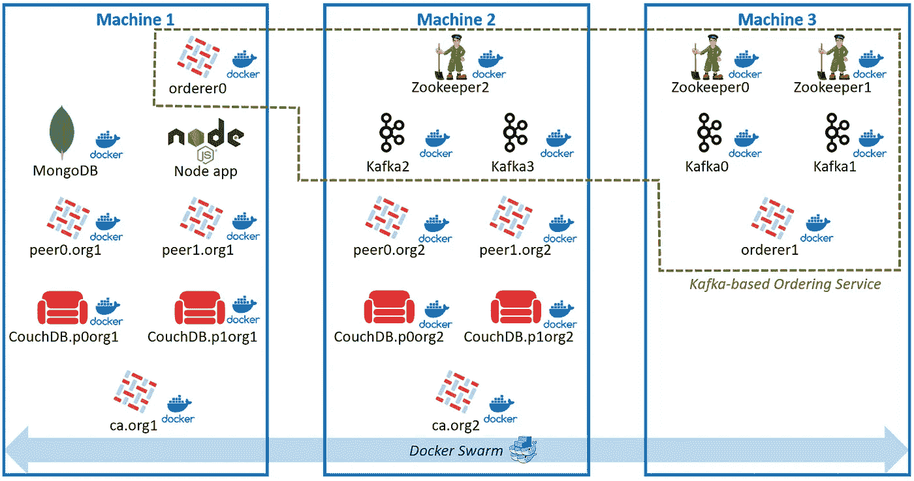
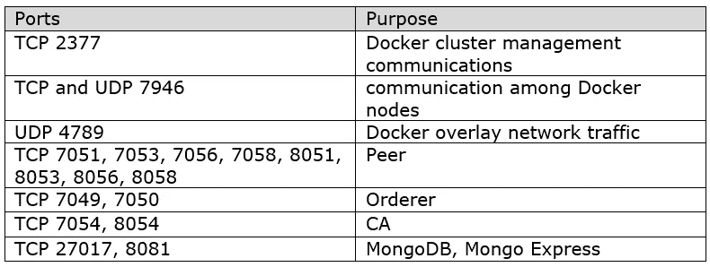

# 在多台主机上使用 Docker Swarm 部署基于 Kafka 的 Hyperledger 结构网络

> 原文：<https://medium.com/coinmonks/deploy-a-cross-machine-kafka-based-multi-orderer-hyperledger-fabric-network-with-docker-swarm-8ccdd76bae5?source=collection_archive---------1----------------------->

很少有关于在多台主机、服务器或机器上创建 Hyperledger 结构网络的结构化教程。您只能在官方 Hyperledger Fabric 文档中找到构建单机网络的指南，该文档根本不是分布式和分散式的。今天，让我们一起来做吧！

# 什么是 Docker Swarm？

Docker Swarm 是一个集群管理工具，支持不同容器在不同机器上的通信。我们还将利用覆盖网络，它是 Docker Swarm 之上的一个连接层。更多信息可以在[https://docs.docker.com/engine/swarm/](https://docs.docker.com/engine/swarm/)和[https://docs.docker.com/network/overlay/](https://docs.docker.com/network/overlay/)找到

# 在我们开始之前…

## 必须做的事

1.  你应该知道[区块链是什么](https://www.youtube.com/watch?v=SSo_EIwHSd4)吧？😉
2.  准备三个安装了 Linux Ubuntu 的云实例或计算机
3.  安装 Docker 引擎社区版最新版本
4.  安装 Docker Compose 最新版本
5.  安装节点 v8.4.0(最好使用 nvm)
6.  将这个 [github 库](https://github.com/whchengaa/hyperledger-fabric-technical-tutorial)克隆到三台机器上，并切换到分支`cross-machine-swarm`

## 宁可

1.  了解 Hyperledger 结构背后的[关键概念](https://hyperledger-fabric.readthedocs.io/en/release-1.1/key_concepts.html)
2.  完成官方文档中的[“构建您的第一个网络”](https://hyperledger-fabric.readthedocs.io/en/release-1.1/build_network.html)教程

## 注意

它基于 Hyperledger Fabric release-1.1，尽管最新版本应该也可以工作

# 网络体系结构



Network Architecture

上图显示了整体网络架构。组织 1 和组织 2 组件分别位于机器 1 和机器 2 中。基于 Kafka 的订购服务由部署在三台机器上的组件组成。除了节点应用程序之外的所有组件都使用 Docker 进行容器化。除了 MongoDB 之外的所有容器都通过 Docker Swarm overlay 网络相互通信。

每个组件的功能:

*   对等:区块链分类帐和链码引擎(智能合同)
*   CouchDB:具有丰富查询功能的状态数据库
*   CA:注册并登记新用户
*   MongoDB:存储用户凭证
*   Orderer:对事务进行排序，并将它们打包到一个块中
*   卡夫卡:共识协议
*   zookeeper:Kafka 的注册和配置服务
*   节点应用程序:与区块链交互的 API 服务器



Firewall Setting

上面列出端口需要公开，以便于跨机器联网。

***警告:*** MongoDB 和 Mongo Express 不应该在生产环境中暴露给所有外部 IP。

# 编辑网络配置文件

在`hyperledger-fabric-technical-tutorial/balance-transfer/artifacts/network-config.yaml`中，将 orderer1 和所有 Org 2 组件的默认 IP 地址更改为机器 2 的实际 IP 地址。

该文件为节点应用程序提供了 Org 1、Org 2 组件和两个订购者的网络信息，以便发出 API 请求。由于 node app 没有部署在 Docker Swarm 网络中，因此外部通信必须通过指定 IP 地址来完成。

由于 node 应用程序不直接与 Kafka 和 Zookeeper 集群通信，因此不包括它们的 IP 地址。

MongoDB 连接配置文件在`org1.yaml`和`org2.yaml`中编码。由于 MongoDB 和 node app 位于同一台机器上，使用 localhost 就足以进行它们的通信。

# 建立码头群和覆盖网络

在机器 1 中，运行`docker swarm init`作为管理器初始化 Swarm 网络。它返回类似于下面的结果。

```
docker swarm join --token SWMTKN-1–4bg8u1sjnk6sjegcdba5f03ij5yespoqn1g3qhji7hn213qyw0-ee8h9oinejen29d1t9r6pw4pf 172.0.0.71:2377
```

在机器 1 终端中复制命令，并在机器 2 和机器 3 中运行，以加入群网络。以下是成功回复。

```
This node joined a swarm as a worker.
```

在机器 1 中运行`docker node ls`来列出群网络节点。您应该会看到三个节点。

在机器 1 中，运行`docker network create --attachable --driver overlay fabric_net`创建名为 fabric_net 的覆盖网络。

在所有三台机器中运行`docker network ls`。只有机器 1 显示了 fabric_net，因为覆盖网络只能通过引入加入该覆盖网络的 docker 容器来扩展到其他节点。

在机器 2 和机器 3 中，运行`docker run -itd --name mybusybox --network fabric_net busybox`创建一个连接 fabric_net 的 busybox docker 容器。其实是不是 busybox 并不重要，调出任何一个加入 fabric_net 的容器都可以有同样的效果。

在 2 号机和 3 号机中再次运行`docker network ls`，查看 fabric_net 是否存在。

如果有任何错误，在所有三台机器上运行`sudo systemctl restart docker`重新启动 Docker 引擎或在所有三台机器上运行`docker swarm leave --force`离开 Swarm 网络并再次重复上述过程。

# 网络组件部署

运行`hyperledger-fabric-technical-tutorial/balance-transfer/`目录下的所有命令。

对于所有机器，

移除所有现有容器以避免 RAM 过载。(确保没有其他重要的容器在运行)

```
docker rm -f `docker ps -aq`
```

清除未使用的 Docker 卷

```
docker volume prune –f
```

移除缓存的 Docker 链码图像

```
docker rmi -f $(docker images | grep “dev\|none\|test-vp\|peer[0–9]-” | awk ‘{print $3}’)
```

对于机器 3，

```
docker-compose -f artifacts/docker-compose-kafka.yaml up -d zookeeper0 zookeeper1docker-compose -f artifacts/docker-compose-kafka.yaml up -d kafka0 kafka1docker-compose -f artifacts/docker-compose.yaml up -d orderer1.example.com
```

对于机器 2，

```
docker-compose -f artifacts/docker-compose-kafka.yaml up -d zookeeper2docker-compose -f artifacts/docker-compose-kafka.yaml up -d kafka2 kafka3docker-compose -f artifacts/docker-compose.yaml up -d peer0.org2.example.com peer1.org2.example.com ca.org2.example.com couchdb0.org2 couchdb1.org2
```

对于机器 1，

```
docker-compose -f artifacts/docker-compose.yaml up -d orderer0.example.comdocker-compose -f artifacts/docker-compose.yaml up -d peer0.org1.example.com peer1.org1.example.com ca.org1.example.com couchdb0.org1 couchdb1.org1docker-compose -f artifacts/docker-compose-mongo.yaml up –dnpm installnode app
```

如果您的机器中没有 docker 图像，docker 引擎将从互联网上获取所有图像。

对于执行序列，应该首先部署 zookeeper，然后是 kafka 和其他人。

# 测试

在机器 1 中打开一个新终端并运行`./testAPIs.sh -l node`。

# 如果没有错误，恭喜！

您成功部署了跨机器 Hyperledger Fabric 网络！

如果你想了解更多关于源代码的内容，你可以从 [github 库](https://github.com/whchengaa/hyperledger-fabric-technical-tutorial)的`release-1.1`分支下下载“中级开发者 Hyperledger Fabric 技术指南. docx”。如果你遇到任何问题，随时联系我！

最后但同样重要的是，如果你喜欢这个帖子，请为它鼓掌！:)

> [在您的收件箱中直接获得最佳软件交易](https://coincodecap.com/?utm_source=coinmonks)

[](https://coincodecap.com/?utm_source=coinmonks)