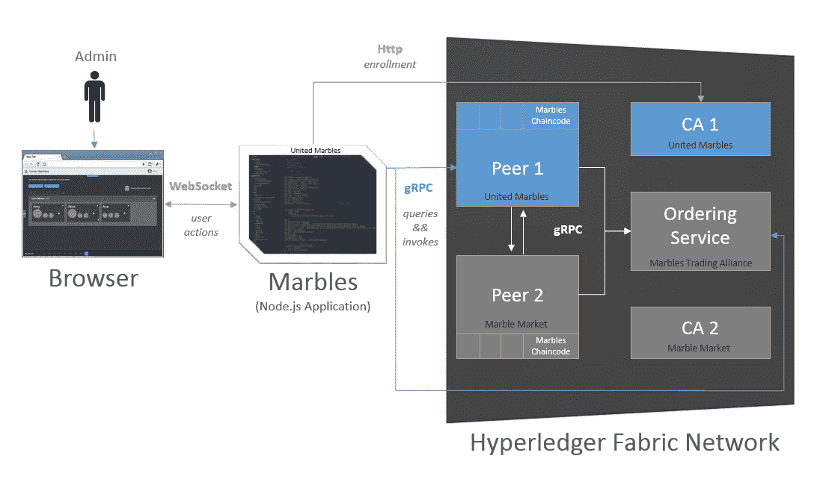
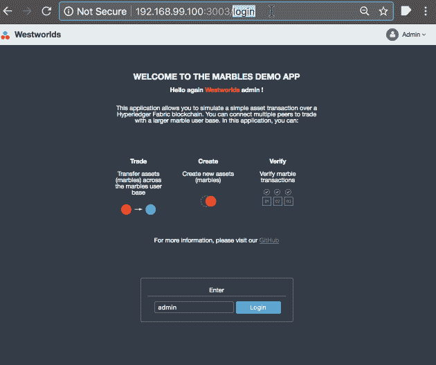

# 利用 AWS Hyperledger 结构模板部署 dapps 非官方指南(第 2 部分)

> 原文：<https://medium.com/coinmonks/deploy-dapps-leveraging-the-aws-hyperledger-fabric-template-an-unofficial-guide-part-2-d2b617039ec?source=collection_archive---------4----------------------->

欢迎回到 AWS 的 Hyperledger 结构模板的非官方指南。在本系列的第一部分中，我们重点介绍了通过官方 AWS 模板提供的 AWS 主机的设置。

作为快速复习，让我们回顾一下这个博客系列的目标。通过遵循这些逐步说明，您将能够完成以下任务:

1.  利用 AWS 的 Hyperledger Fabric 模板为 3 个组织提供基础架构，每个组织有 1 个对等方加入联盟网络。
2.  了解 AWS 托管的云主机以及 Fabric 命令行界面的基础知识。
3.  在一个联盟网络上运行多个 IBM Marbles 的实例。

在本文中，我们将学习如何在没有 Fabric 证书机构(AWS 模板中未提供)的情况下导航身份，部署链码(Fabric——智能合同的代名词),并准备网络运行 Marbles 的多个实例，以最终部署并展示分散式应用程序，如 IBM 的 [Marbles](https://github.com/IBM-Blockchain/marbles) ，如何在联盟网络中端到端地工作。



Architectural illustration of Marbles dapp from [https://github.com/IBM-Blockchain/marbles](https://github.com/IBM-Blockchain/marbles)

# 第 2 部分:将 Marbles dapps 部署到联盟网络中

在我们开始之前，请务必完成本博客系列第一部分的所有步骤。以下步骤是第 2 部分正常工作的先决条件。

## 步骤 1:设置工作空间

AWS Hyperledger Fabric 模板的一个注意事项是，它省略了证书颁发机构(ca)为各个组织的所有成员即时颁发证书的规定。相反，它使用与 Fabric 捆绑在一起的工具预先生成证书和密钥。请注意，虽然预生成的密钥是让结构网络快速运行的一个方便选项，但不建议在生产中使用。一个人或一个实体不可能拥有所有组织的私钥。

在我们从 AWS 云主机获取加密材料之前，让我们设置本地工作区。我们选择在本地 MacBook Pro 上运行 Marbles dapp 的多个实例，Boot2Docker 在 VirtualBox 虚拟机上运行，这就是为什么我们希望加密材料(证书+组织的密钥)在本地。为了使这更方便，我们创建了一个演示回购供每个人下载，这将简化设置过程。

您可以直接使用 git 克隆到 repo 中，或者从[daphero-marbles-demo 的发布页面](https://github.com/dapphero/dapphero-marbles-demo/releases)获取 zip 存档(请注意 git 子模块不会是 ZIP 包的一部分)。回购需要两个前提条件，1。)Docker + docker-compose and，2。)node.js/npm 的工作环境。我们使用的是 node v8.9.1，但任何更高的稳定版本也应该可以工作。我们已经在 macOS 和一些不同风格的 Linux 上成功运行了这个演示，包括 AWS、Ubuntu 和 Boot2Docker(在 macOS 上)。我们还没有在 Windows 上测试这个过程。如果您在 Windows 上遇到问题，请给我们留言。

```
~ $ git clone https://github.com/dapphero/dapphero-marbles-demo.git ./demo
~ $ cd ~/demo
~ $ git submodule init && git submodule update
~/demo $ npm install .
~/demo $ docker pull dapphero/dapphero-marbles-demo:latest
```

最后两步， *npm* 和 *docker* 将安装依赖项，可能需要一分钟才能完成。下载依赖项所花费的时间将会得到极大的回报，因为它将使我们能够轻松地启动 Marbles dapp 的多个实例。

## 步骤 2:从 AWS 云主机获取加密材料

让我们在 */etc/hosts* 中设置一个条目，以便在后续步骤中使用主机名而不是 IP 地址。使用 nano 在文件末尾添加一行，其中*123.123.123.123*代表 AWS 云主机的 IP 地址。使用 *CTRL+X* 确认文件位置和更改。

```
~/demo $ **sudo nano /etc/hosts**

123.123.123.123 host.example.com
```

就像我们上次成功地 *ssh* 进入 Fabric 主机一样，我们想要使用 *scp* 命令复制加密材料。同样，由于应用程序的分散性质，只要对结构主机的入站访问被列入 EC2 安全组的白名单，您是否将文件复制到本地工作站、堡垒主机或另一个与结构无关的云主机都无关紧要。

```
~/demo $ **scp -i yourkey.pem -r ec2-user@host.example.com:/etc/fabric/crypto-config ./**
>ca.example.com-cert.pem 100% 818 22.4KB/s 00:00
>28cb9daa1244b8223963dfdf55014a5c25c3ecca60887a129154233416fd64d9_sk 100% 241 6.4KB/s 00:00
>ca.example.com-cert.pem 100% 818 25.9KB/s 00:00
>[Admin@example.com](mailto:Admin@example.com)-cert.pem 100% 769 21.2KB/s 00:00
>d61c6c5b094c60ef58775c546121ed8bd8e374325fed5ace65dbd7359ad0e984_sk 100% 241 6.7KB/s 00:00
[...]
```

无论 Marbles dapp 将在哪里运行，都需要一个密码材料子集来使其工作。上面的 scp 命令将启动复制过程，该过程将单独跟踪文件，可能需要一些时间来完成。

本地目录*。/crypto-config* 非常广泛，应该类似于下面的目录树。现在跳过关于目录结构的相当复杂的细节是安全的。[官方文档](https://hyperledger-fabric.readthedocs.io/en/latest/msp.html)是满足对会员服务提供商(MSP)好奇心的绝佳资源。

```
~/demo $ **tree -d -L 3 crypto-config**
crypto-config
├── ordererOrganizations
│   └── example.com
│       ├── ca
│       ├── msp
│       ├── orderers
│       ├── tlsca
│       └── users
└── peerOrganizations
    ├── org1.example.com
    │   ├── ca
    │   ├── msp
    │   ├── peers
    │   ├── tlsca
    │   └── users
    ├── [...repeats for org2., org3.]
```

## 步骤 3:预填充结构客户端键/值存储

在生产级 Hyperledger 结构网络中，身份可能仅由各自组织单独控制的[结构证书颁发机构](http://hyperledger-fabric-ca.readthedocs.io/en/latest/) [(CAs](http://hyperledger-fabric-ca.readthedocs.io/en/latest/) )颁发。AWS Hyperledger 结构模板省略了 ca 的设置。不幸的是，Marbles dapp 需要注册、认证和生成用户身份的签名。我们将采用一种巧妙的变通方法，使用 node.js 的 Fabric Client SDK 来省去我们重新编写大部分 Marbles 代码库的麻烦，以便在没有 CAs 的情况下工作。虽然这将告诉我们 API 链接证书(加密材料)和 Fabric 的客户端 SDK 和协议栈的内部工作原理，但我们不建议将这种变通方法应用到生产环境中。

repo 中捆绑的便利程序 index.js 实质上将遍历结构网络中的所有可用组织，将相关证书和密钥加载到结构客户端的实例中，向组织的主机查询可用通道，并利用客户端的本地缓存将组织的管理员身份持久存储到预设目录中。稍后，我们将启动 Marbles 实例，其卷装载了各个组织的持久身份缓存，以供 Fabric 客户端从中引导。客户机的文件系统缓存充当穷人的 API，在不通过结构 ca 的情况下将容器与身份联系起来。这有点优雅，因为它不需要我们改变 Marbles 代码来直接从预先生成的加密材料中读取身份，并使其在 Marbles dapp 实例中保持隔离。

```
~/demo $ **./index.js dappinstances/marbles/config/blockchain_creds_tls.json crypto-config ./dappinstances/.hfc-key-store/**Prepopulating key/value store for [Admin@org1.example.com](mailto:Admin@org1.example.com) located at 'dappinstances/.hfc-key-store/org1'.
Prepopulating key/value store for [Admin@org2.example.com](mailto:Admin@org2.example.com) located at 'dappinstances/.hfc-key-store/org2'.
Prepopulating key/value store for [Admin@org3.example.com](mailto:Admin@org3.example.com) located at 'dappinstances/.hfc-key-store/org3'.
[ { username: '[Admin@org1.example.com](mailto:Admin@org1.example.com)',
    peers: '[{"clientCert":null,"_options":{"grpc.ssl_target_name_override":"peer0.org1.example.com","grpc.default_authority":"peer0.org1.example.com","request-timeout":300000,"grpc.max_receive_message_length":-1,"grpc.max_send_message_length":-1,"grpc.primary_user_agent":"grpc-node/1.10.1"},"_url":"grpcs://host.example.com:7051","_endpoint":{"creds":{},"addr":"host.example.com:7051"},"_request_timeout":300000,"_endorserClient":{"$channel":{}},"_roles":{},"_name":"peer0.org1.example.com"}]',
    channels: '{"channels":[{"channel_id":"mychannel"}]}' },
[...repeats for org2., org3.]
All set. Key value store populated.
```

当终端打印出“*所有设置时，我们将知道该过程成功完成。键值存储已填充。*。如果出现错误，请确保*。/crypto-config* 目录不为空，并且 git 子模块已为正确初始化。/*dappinstances/marbles/config/区块链 _creds_tls.json* 可用。您将看到下面的目录树，其中每个 orgX 目录都包含一个用户、公钥和私钥文件。

```
~/demo $ tree -d dappinstances/.hfc-key-store
dappinstances/.hfc-key-store
├── org1
├── org2
└── org33 directories
```

现在，我们将继续部署弹珠 dapp。然而，在这个多部分系列的第三篇博文中，我们将更仔细地看看这个变通办法是如何工作的。

## 步骤 4:为组织发射弹珠 dapp 容器

现在我们准备为 Marbles 应用程序发布一个容器。请注意，要成功做到这一点，需要一个工作的 docker 环境。如果你还没有设置的话，我们建议你看一下官方 Docker compose 文档。

```
~/demo $ cd dappinstances/
dappinstances $ **export AWS_HOST=54.191.108.209** # (IP of AWS host)
dappinstances $ **export IMAGE_NAME=dapphero/dapphero-marbles-demo:latest**
dappinstances $ **docker-compose up -d**
dappinstances $ **docker-compose ps**
            Name                 Command     State           Ports
---------------------------------------------------------------------------
dappinstances_marbles_org1_1   node app.js   Up      0.0.0.0:3001->3001/tcp
dappinstances_marbles_org2_1   node app.js   Up      0.0.0.0:3002->3001/tcp
dappinstances_marbles_org3_1   node app.js   Up      0.0.0.0:3003->3001/tcp
```

一旦 *docker-compose* 命令完成，你应该剩下三个运行的容器。请注意，它们还没有完全运行，因为我们仍然需要在所有组织的对等体中安装 Marbles 链码并实例化链码，即调用 Marbles dapp 使用的通道的构造函数。

## 步骤 5:在所有组织主机中安装链码

由于每个组织的容器都是用其各自的证书和 Fabric 客户端缓存中管理员身份的私钥启动的，因此我们可以利用该容器来执行结构级的操作任务，例如在所有组织的远程 Fabric 对等体中安装和实例化链码。

```
dappinstances $ **docker-compose exec marbles_org1 bash**
root@db8b68c7e8c1:/marbles# **ls -l /marbles/config/crypto/kvs**
total 12
-rw-r--r-- 1 node staff 1061 Jun  5 22:48 [Admin@org1.example.com](mailto:Admin@org1.example.com)
-rw-r--r-- 1 node staff  246 Jun  5 22:48 cfc92a1d9b49c1b1d7acd805fdf88a198f37d9aa3ea92cea9439812eb321a4ed-priv
-rw-r--r-- 1 node staff  182 Jun  5 22:48 cfc92a1d9b49c1b1d7acd805fdf88a198f37d9aa3ea92cea9439812eb321a4ed-pub
```

我们用 *CTRL+D* 退出容器外壳，并继续在所有对等体上安装链码。在*中运行以下命令。/demo/dappinstances* 目录。请期待该命令的输出会比下面的更加详细。

```
dappinstances $ **docker-compose exec marbles_org1 bash -c "cd scripts && node install_chaincode.js marbles_tls_org1.json"** [...]
info: Install done. Errors: nope
---------------------------------------
dappinstances $ **docker-compose exec marbles_org2 bash -c "cd scripts && node install_chaincode.js marbles_tls_org2.json"** [...]
info: Install done. Errors: nope
---------------------------------------
dappinstances $ **docker-compose exec marbles_org3 bash -c "cd scripts && node install_chaincode.js marbles_tls_org3.json"** [...]
info: Install done. Errors: nope
---------------------------------------
```

如果之前安装了链码，错误消息将指示它已经存在。多次运行该命令是安全的，因为每次连续尝试都会失败。

## 步骤 6:在通道中实例化链代码

现在，我们可以实例化 AWS Hyperledger Fabric 模板附带的预配置通道 *mychannel* 的链码。我们通过其中一个组织的容器来实现这一点，因为 AWS 模板配置了 *mychannel* 来授予任何树组织在这个通道中实例化链码的权利。在接下来的第三篇博文中，我们将深入了解安装和实例化对于链码的意义。

```
dappinstances $ **docker-compose exec marbles_org1 bash -c "cd scripts && node instantiate_chaincode.js marbles_tls_org1.json"** [...]
debug: [fcw] Successfully obtained transaction endorsement
debug: [fcw] Successfully ordered instantiate endorsement.
---------------------------------------
info: Instantiate done. Errors: nope
---------------------------------------
```

## 步骤 7: Marbles 分散式应用程序级设置

既然光纤网络基础设施(对等体)、通道(分类帐)和链码(智能合同)都已读取完毕，我们只需完成作为应用程序一部分的 Marbles dapp 设置即可。我们打开三个浏览器选项卡，每个选项卡都有一个 Marbles 实例，其中主机名" *localhost"* 指向运行 docker 容器的主机(这是我们 MacBook Pro 上的 VirtualBox IP*192 . 168 . 99 . 100*地址)。

```
[http://localhost:3001/](http://localhost:3001/)
[http://localhost:3002/](http://localhost:3002/)
[http://localhost:3003/](http://localhost:3003/)
```



Marbles dapp setup wizard and basic usage

请务必包括 *http://* 因为出于保护消费者的原因，很多浏览器都默认为 https://。每个选项卡提供的 Marbles 分散式 web 应用程序应该类似于上面的截屏。请确保在您的浏览器中按照向导的步骤顺序操作每个选项卡(即组织):

1.  使用“*管理员*”登录—身份静态绑定到组织的相应管理员(例如*Admin@org1.example.com*)；即使名字变了。
2.  在向导的“*Hi”*模态中点击“*开始*按钮。
3.  向导将进入步骤 3，在此步骤中，它没有正确连接到分类帐和渠道，因为我们在完成链代码设置之前启动了容器和应用程序。
4.  我们将点击*“重试”*按钮，将弹珠正确连接到通道和分类帐。这个过程不会超过几秒钟。
5.  成功完成后，我们将关闭向导，因为以下步骤是可选的，例如创建更多弹珠。
6.  快乐弹珠交易！我们可以从顶部面板拖放弹珠，在每个选项卡中代表经过验证的组织的身份。相反的尝试将被链码逻辑拒绝。

恭喜你。我们成功部署了 Marbles dapp 的多个实例，现在您不仅可以交易它们，还可以在分散式分类账中跟踪每个弹珠的来源。

# 总结和下一步

在这篇博文中，我们学习了如何使用 AWS Hyperledger Fabric 模板预先生成的加密材料(证书和私钥)来部署 Marbles。我们设法解决了这样一个事实，即模板省略了证书颁发机构的设置，这将允许 Marble 动态注册身份，而无需从 AWS 云主机复制文件。我们采用的解决方法实质上是复制 Fabric client SDK 的缓存，分别用于每个 Marbles 容器和 Fabric client 的证书和私钥。

虽然在这篇博文中，我们快速地完成了让多个 Marbles dapps 启动并运行的步骤，但在下一篇博文中，我们希望更深入地了解 Fabric 客户端的一些有趣细节，如安装/实例化链码等操作任务，以及 Marbles 如何具体配置和利用链码以及值得注意的注意事项。

一如既往，我们期待您在下面的评论中或通过[达费罗的联系方式](https://docs.google.com/forms/d/e/1FAIpQLSc3K55U7g6iOU8G6odqnF-1sJcySe6JcFC6MpE69qVijNUGsA/viewform?usp=pp_url&entry.2005620554&entry.482458136=I+want+to+get+involved&entry.1045781291&entry.1166974658&entry.839337160)提出反馈和问题。


About the author: [Sebastian Tiedtke](https://www.linkedin.com/in/sourishkrout) is the cofounder & CEO of Dapphero. Before dedicating his time to unlock Blockchain/DLT for developers and businesses, Sebastian spent five years helping bring test automation to countless agile software shops leading [Sauce Labs](https://saucelabs.com/)’ engineering teams.