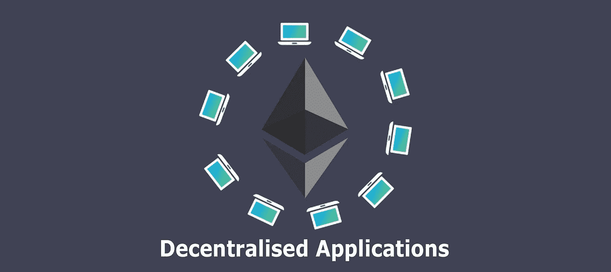
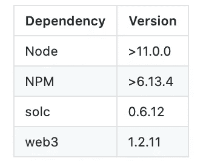

# 使用 NodeJs 部署带有构造函数参数的以太坊智能合约

> 原文：<https://medium.com/coinmonks/deploy-ethereum-smart-contract-with-constructor-parameters-using-nodejs-3771f2b1c539?source=collection_archive---------0----------------------->



今天，我们有足够的资源来开始区块链、以太坊、智能合约，开发基于区块链的应用程序。

我们有时需要在旅途中从我们的应用程序部署契约。例如，在创建具有独立属性的新报价的情况下。这篇文章是关于我在部署带有构造函数参数的契约时所面临的问题之一，以及我解决它的方法。

作为先决条件，最好先了解 Solidity、NodeJs 以及 Truffle 和 Web3 之类的工具。

让我们一起经历所有的步骤。

# 初始化 NPM 软件包并安装依赖项:

首先，我们需要初始化 npm 包(如果尚未完成)并安装所需的依赖项。

## 依赖关系:



要初始化 NPM 软件包，请运行:

```
npm init
```

要安装 npm 软件包依赖项，请运行:

```
npm install --save ethereum-js solc web3
```

这将安装`ethereum-js`、`solc`和`web3` npm 软件包。

## 生成合同字节码

对于本教程，我将采用这个简单的**文档**契约。假设你已经熟悉以太坊智能合约的可靠性编程。

在这个简单的文档注册契约中，我们有一个构造函数，它将在契约部署时执行。构造函数接受两个参数，文档的标题和 URL。

使用下面的代码片段，我们可以生成合同字节码。确保将`<CONTRACT_NAME>`替换为您的实际合同名称。

**注:**将`contractBytecode.js`文件放入，以便通过`fs`阅读时可以访问合同。

这里，我们利用`solc` npm 包来编译合同，并提取合同的原始字节码。您可以随意探索该包输出的其他参数。

通过执行上面的代码，我们得到了文档契约字节码。这没有考虑契约参数，因此当我们使用它部署契约时，我们将无法使用文档的标题和 URL 来初始化契约。

# 用构造函数参数生成字节码

使用下面的代码片段，我们可以在考虑契约参数的情况下生成契约字节码。确保用正确的值替换`<CONTRACT_NAME>`、`<DOCUMENT_TITLE>`、`<DOCUMENT_URL>`和`<WEB3_PROVIDER_URL>`。

这里我们进一步利用由`web3`提供的`encodeParameters`来编码两个构造函数参数。参数类型和值可以作为数组添加。为了获得完整的字节码，我们只需要将它添加到先前生成的原始契约字节码中。

常量变量`bytecodeWithEncodedParameters`将有完整的字节码，也考虑了构造函数参数。

# 部署合同:

使用下面的代码片段，我们现在可以考虑合约参数来部署合约。确保用正确的值替换`<CONTRACT_NAME>`、`<DOCUMENT_TITLE>`、`<DOCUMENT_URL>`、`<WEB3_PROVIDER_URL>`、`<ACCOUNT_ADDRESS>`和`<PRIVATE_KEY>`。

在上一节中，我们已经生成了完整的契约字节码。现在，我们可以利用来自`ethereum-js`的`sign`函数和`web3`提供的`sendSignedTransaction`函数来部署合同。

恭喜你。！！现在，我们已经成功地完成了部署带有构造函数参数的智能契约的所有步骤，这可以在我们需要随时部署此类契约的 DApps 中使用。

感谢阅读。希望这能对你构建基于以太坊的分散式应用有所帮助。这甚至可能对您有所帮助，如果

完整的代码可以在[这里](https://github.com/jayeshbairagi/contract-deployment-with-constructor)找到。

## 另外，阅读

*   [顶级 DeFi 项目](/coinmonks/defi-future-10-promising-projects-in-the-defi-world-ff2b697ab006)
*   [最佳加密交易机器人](/coinmonks/whats-the-best-crypto-trading-bot-in-2020-top-8-bitcoin-trading-bot-c16adeb13317)
*   最好的比特币[硬件钱包](/coinmonks/the-best-cryptocurrency-hardware-wallets-of-2020-e28b1c124069?source=friends_link&sk=324dd9ff8556ab578d71e7ad7658ad7c)
*   最好的[加密税务软件](/coinmonks/best-crypto-tax-tool-for-my-money-72d4b430816b)
*   [最佳加密交易平台](/coinmonks/the-best-crypto-trading-platforms-in-2020-the-definitive-guide-updated-c72f8b874555)
*   [unis WAP 最佳钱包](/coinmonks/best-wallets-to-use-uniswap-e91a6385d9e8)
*   最佳[加密贷款平台](/coinmonks/top-5-crypto-lending-platforms-in-2020-that-you-need-to-know-a1b675cec3fa)
*   [Bitsgap 评论](https://blog.coincodecap.com/bitsgap-review)——一个轻松赚钱的加密交易机器人
*   [Quadency Review](https://blog.coincodecap.com/quadency-review-a-crypto-trading-automation-platform) -专为专业人士打造的加密交易机器人
*   [3commas Review](https://blog.coincodecap.com/3commas-review-an-excellent-crypto-trading-bot) |一款优秀的密码交易机器人
*   [3Commas vs Cryptohopper](/coinmonks/cryptohopper-vs-3commas-vs-shrimpy-a2c16095b8fe)
*   Bitmex 的[保证金交易指南](/coinmonks/the-idiots-guide-to-margin-trading-on-bitmex-dbbd7742c6fc?source=friends_link&sk=7bfa99d2a181142510c8442c8ddb0786)
*   [加密摇摆交易权威指南](/coinmonks/the-definitive-guide-to-crypto-swing-trading-7e4af6496d4d?source=friends_link&sk=70448050bd9323b42f63bfc0bb1e60d1)
*   [Bitmex 高级保证金交易指南](/coinmonks/bitmex-advanced-margin-trading-guide-2270c195ce25?source=friends_link&sk=1d986cca731f5084b9a2db4a4bc4a7ad)
*   [开发人员的最佳加密 API](/coinmonks/best-crypto-apis-for-developers-5efe3a597a9f)
*   [加密套利](/coinmonks/crypto-arbitrage-guide-how-to-make-money-as-a-beginner-62bfe5c868f6)指南:新手如何赚钱
*   顶级[比特币节点](https://blog.coincodecap.com/bitcoin-node-solutions)提供商
*   最佳[加密制图工具](/coinmonks/what-are-the-best-charting-platforms-for-cryptocurrency-trading-85aade584d80)

> [直接在您的收件箱中获得最佳软件交易](https://coincodecap.com?utm_source=coinmonks)

[](https://coincodecap.com?utm_source=coinmonks)