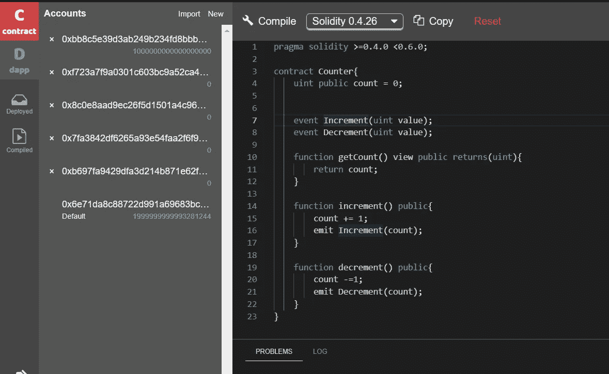

# 在 PraState testnet 上部署简单的 Dapp 契约

> 原文：<https://medium.com/coinmonks/deploy-simple-dapp-contract-on-prastate-testnet-abcca9b08cf2?source=collection_archive---------9----------------------->

学习如何在 parastate testnet 上开发和部署简单的 Dapp。为此，我尝试了一个简单的程序**递增递减。**当我们试图增加或减少时，输出程序将显示**计数**的数量。

以下是如下的步骤:

1.  从 http://buidl.secondstate.io/parastate使用在线构建 IDE

****

**2.买些汽油代币**

**在**帐户**选项卡中，您将看到 5 个自动生成的地址，您可以将其中任何一个设置为默认地址。默认地址用于签署交易。因此，你需要往那个账户里汇一点绿洲 ETH 来支付汽油费。**

****

**去水龙头网站，从 BUIDL 输入你的默认地址，给自己加点气。**

**[http://faucet.parastate.io/](http://faucet.parastate.io/)**

****

**3.现在，回到 BUILD 的 Accounts 选项卡，您应该在默认地址中看到 0.01 OETH。**

****

**4.编译和部署智能合同**

**点击**编译**按钮，编译合同。将会打开一个侧边栏，向您显示合同的已编译 ABI 和字节码。**

****

**5.接下来，您可以按下左侧面板上的 **Deploy to the chain** 按钮，将契约实例化并部署到 Oasis Network 以太坊运行时节点。您可以通过从 [BUIDL](http://buidl.secondstate.io/) 内部调用其公共方法来与已部署的契约进行交互——您可以**设置**的值并单击 **Transact** 按钮将该值保存到区块链上，然后单击 **Call** 按钮在 **LOG** 面板中查看该值。**

****

**6.对于增量，调用增量函数，然后点击计数以显示计数**

****

**output of increment**

**7.对于减量，调用函数并获取计数，在这种情况下，减量计数将再次设置为 0。**

****

**8.现在，单击 deployed 按钮，检查合同是否部署到了 parastate testnet**

****

**哇我们完成了！！！！我成功地开发了一个简单的智能合同。感谢团队通过各种教程帮助和教导我们**

**编码快乐！！！！！🤓**

** [## 最佳免费加密交易机器人——前 16 名比特币交易机器人[2021]

### 2021 年币安、比特币基地、库币和其他密码交易所的最佳密码交易机器人。四进制，位间隙…

medium.com](/coinmonks/crypto-trading-bot-c2ffce8acb2a)  [## 加密税务软件——五大最佳比特币税务计算器[2021]

### 不管你是刚接触加密还是已经在这个领域呆了一段时间，你都需要交税。

medium.com](/coinmonks/best-crypto-tax-tool-for-my-money-72d4b430816b)**