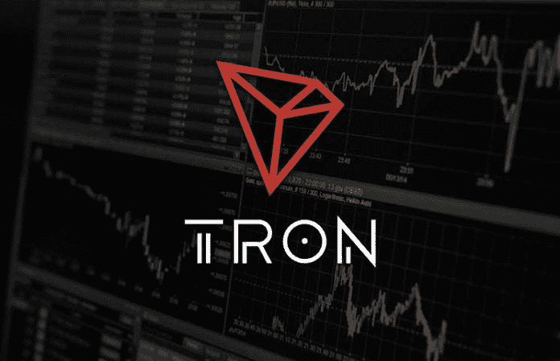
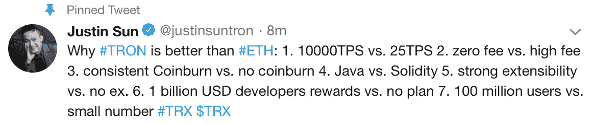
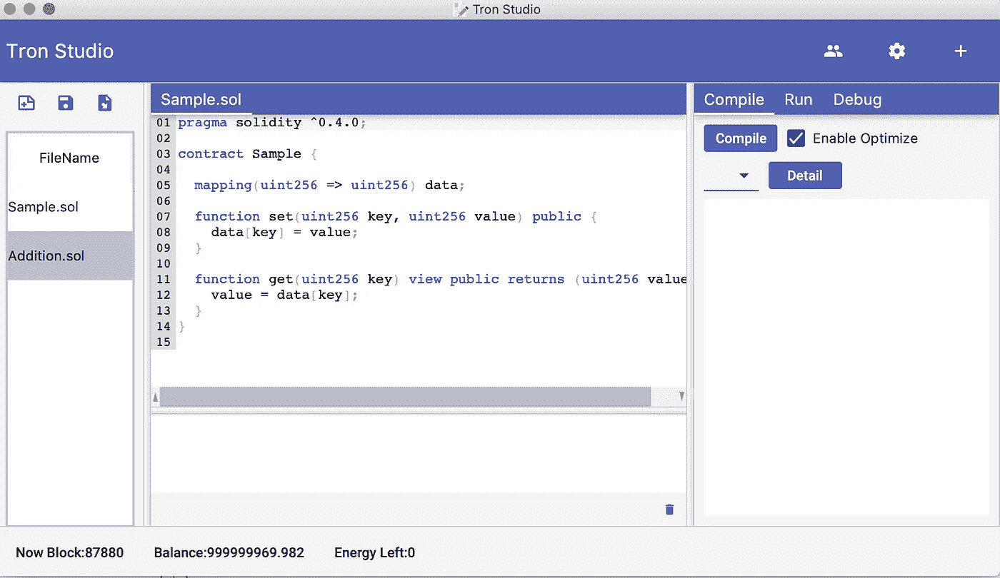
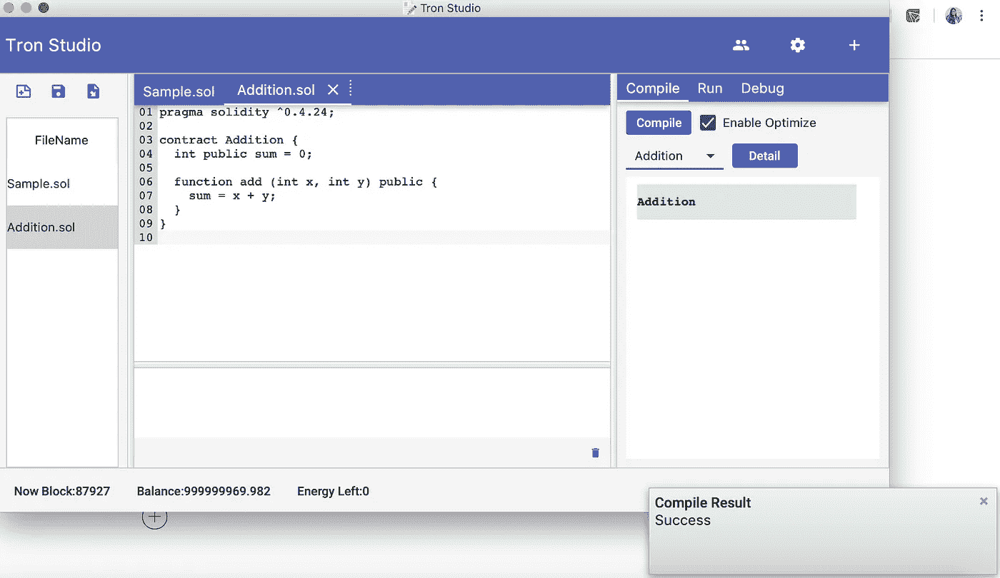
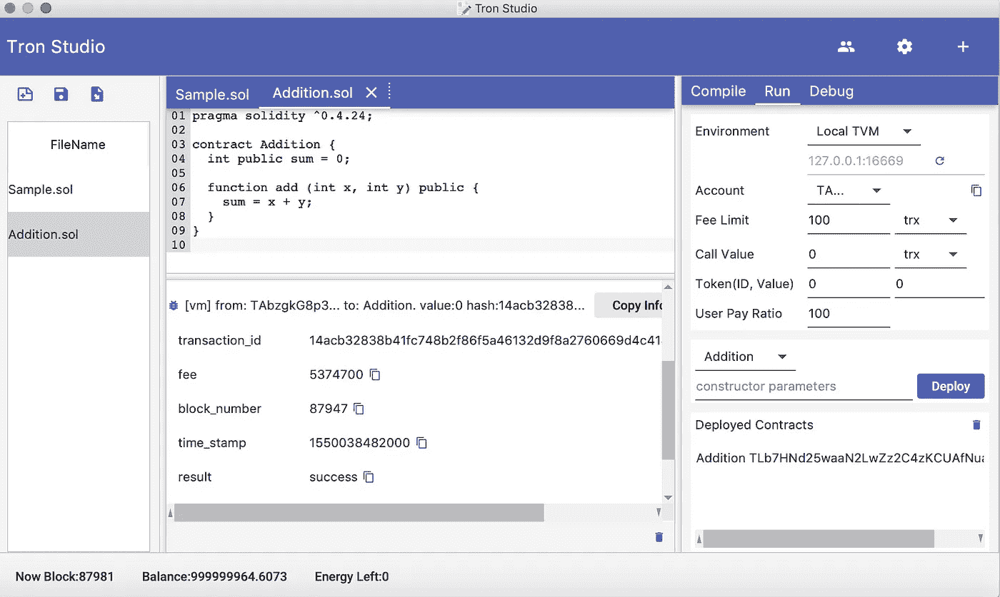
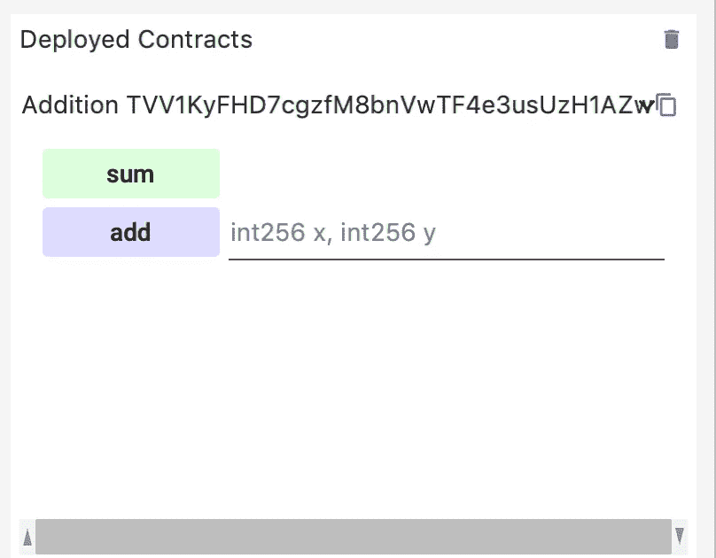
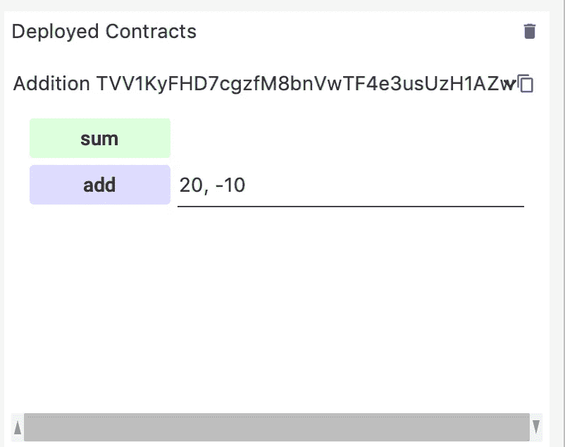
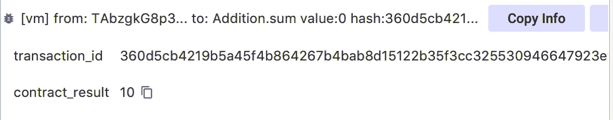

# 在 TRON 区块链上部署智能合约

> 原文：<https://medium.com/coinmonks/deploy-smart-contract-on-tron-blockchain-204f895917c6?source=collection_archive---------0----------------------->

在这篇文章中，我对创区块链做了一个温和的介绍。我们讨论了以下议程:

1.  创是什么，他们想做什么
2.  创的未来:地图集项目
3.  电子回旋加速器的内部运作
4.  TRX 的未来*(创区块链的加密货币)*

既然我们清楚上述议程，我认为现在是在 TRON 区块链上部署 dApp 的恰当时机。这篇文章是关于**如何**我们可以使用创区块链作为一个虚拟机。



Source: [https://theoofy.com/](https://theoofy.com/17970/tron-trx-future-forecast-trons-virtual-machine-activated-on-8th-october-ushering-a-new-smart-contract-era/)

# 先决条件

*   Oracle JDK 1.8
*   创工作室
*   知识的坚固性，*图灵完备语言*

# **一点背景…**

和以太坊虚拟机(EVM)一样，TRON 也是一台图灵完备机。TRON 旨在为区块链开发者提供高效、便捷、稳定、安全且可扩展的定制区块链系统。

 [## TRON 虚拟机- Tron 协议文档

### 简单来说，流程如下:+目前 TVM 主要兼容 Solidity。编译器翻译…

tron-wiki.readthedocs.io](https://tron-wiki.readthedocs.io/en/latest/TRON_Virtual_Machine.html) 

这给人的感觉是 TRON 很像以太坊。或者也许这样更好…？



Source: [https://ambcrypto.com/](https://ambcrypto.com/wp-content/uploads/2018/04/Screen-Shot-2018-04-06-at-2.44.21-PM.png)

# 创工作室

[TRON Studio](https://developers.tron.network/docs/tron-studio-intro) 是一个用于开发、部署和调试基于 TVM 的智能合约的 IDE。它使用 gRPC 来注册帐户、部署和触发智能合同。目前，还不支持 HTTP 网关。

## 步骤 0:下载 TRON Studio 源代码

作为一个开源平台，TRON studio 的源代码很容易获得。你可以从[这里](https://developers.tron.network/docs/download-the-code#section-tron-studio)开始 git 克隆它。

下载后，`cd`进入目录。

```
$ cd tron-studio
```

## 步骤 1:运行并启动 start tron Studio

```
$ ./gradlew build
```

这可能需要一段时间，取决于你的网络和机器的速度。

```
$ java -jar build/libs/TronStudio.jar
```


在发布时，类似这样的东西会打开:



## 步骤 2:编码和编译智能合约

关于在 TRON 上开发的最好的部分之一是 dev 栈非常类似于以太坊。执行合同不需要学习新的语言。我们亲爱的老 Solidity 工作得非常好！

我一直最喜欢的节目就是加两个数！让我们开始吧。

```
pragma solidity ^0.4.24;contract Addition {
  int public sum = 0;

  function add (int x, int y) public {
    sum = x + y;
  }
}
```

点击 IDE 中的**编译**。您应该会看到类似这样的内容:



## 步骤 3:运行智能合同

进入**运行**选项卡并点击**部署。你应该会看到这样的东西。**



## 第四步:让我们把数字加起来！

点击**已部署合同**下的已部署合同。你应该会看到这样的界面。



让我们传入参数并点击**添加**。



现在要得到总数，让我们点击**总数。**



你看合同结果是 10！

如果你看到这个，那么你已经成功地在 TRON blockhain 上部署了一个智能合约。

在教程的下一部分，我们还将制作一个前端。敬请关注。:)

> 加入 Coinmonks [电报频道](https://t.me/coincodecap)和 [Youtube 频道](https://www.youtube.com/c/coinmonks/videos)获取每日[加密新闻](http://coincodecap.com/)

## 另外，阅读

*   [复制交易](/coinmonks/top-10-crypto-copy-trading-platforms-for-beginners-d0c37c7d698c) | [加密税务软件](/coinmonks/crypto-tax-software-ed4b4810e338)
*   [网格交易](https://coincodecap.com/grid-trading) | [加密硬件钱包](/coinmonks/the-best-cryptocurrency-hardware-wallets-of-2020-e28b1c124069)
*   [密码电报信号](http://Top 4 Telegram Channels for Crypto Traders) | [密码交易机器人](/coinmonks/crypto-trading-bot-c2ffce8acb2a)
*   [最佳加密交易所](/coinmonks/crypto-exchange-dd2f9d6f3769) | [印度最佳加密交易所](/coinmonks/bitcoin-exchange-in-india-7f1fe79715c9)
*   [币安 vs 比特邮票](https://coincodecap.com/binance-vs-bitstamp) | [比特熊猫 vs 比特币基地 vs Coinsbit](https://coincodecap.com/bitpanda-coinbase-coinsbit)
*   [如何购买 Ripple (XRP)](https://coincodecap.com/buy-ripple-india) | [非洲最好的加密交易所](https://coincodecap.com/crypto-exchange-africa)
*   [非洲最佳加密交易所](https://coincodecap.com/crypto-exchange-africa) | [胡交易所评论](https://coincodecap.com/hoo-exchange-review)
*   [eToro vs robin hood](https://coincodecap.com/etoro-robinhood)|[MoonXBT vs Bybit vs Bityard](https://coincodecap.com/bybit-bityard-moonxbt)
*   [开发者最佳加密 API](/coinmonks/best-crypto-apis-for-developers-5efe3a597a9f)
*   最佳[密码借贷平台](/coinmonks/top-5-crypto-lending-platforms-in-2020-that-you-need-to-know-a1b675cec3fa)
*   [免费加密信号](/coinmonks/free-crypto-signals-48b25e61a8da) | [加密交易机器人](/coinmonks/crypto-trading-bot-c2ffce8acb2a)
*   杠杆代币的终极指南