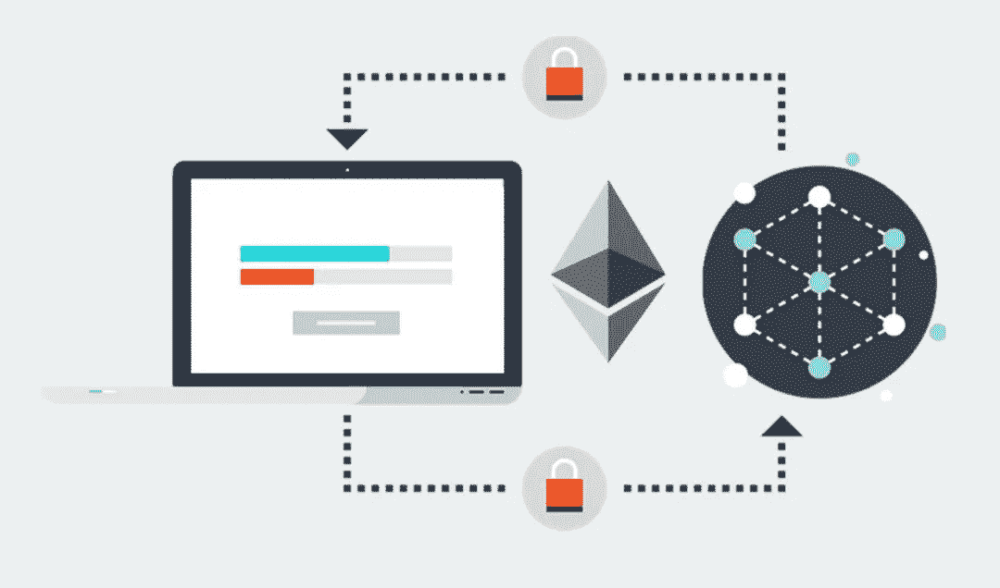

# 使用 Web3js 和帐户私钥部署智能合约，没有块菌—可靠性教程 2

> 原文：<https://medium.com/coinmonks/deploy-smart-contract-with-web3js-account-private-key-no-truffle-solidity-tutorial-2-5926fface340?source=collection_archive---------1----------------------->



在你读完我的 [Solidity 教程 1](/coinmonks/build-smart-contract-without-truffle-just-solcjs-solidity-tutorial-1-4434f98dbb18) 之后，你就可以编译。将源代码解析到 JSON 文件中。/build/contracts/ folder。今天这个主题将涉及如何使用 Web3js v0.20.7 (v1 有一些不向后兼容的更改)将编译好的智能合约部署到以太坊区块链。

> [发现并回顾最佳区块链软件](https://coincodecap.com)

以下是我在教程 2 中的要点源代码:

你需要包含一些包来部署一个智能合约到以太坊区块链。

```
*const* Web3 = require('web3');
*const* Tx = require('ethereumjs-tx');
```

**ethereumjs-tx** 用于生成交易净荷数据。

```
*let* accounts = [
{
  // Ganache Default Accounts, do not use it for your production
  // Develop 1
  address: '0x627306090abaB3A6e1400e9345bC60c78a8BEf57',
  key: 'c87509a1c067bbde78beb793e6fa76530b6382a4c0241e5e4a9ec0a0f44dc0d3'},...
];
```

这是我将用于将智能合同部署到区块链的客户列表。示例代码使用从 Ganache 生成的帐户作为我的私有测试网络。您可以将其替换为您的帐户钱包无地址和私钥，以部署智能合同。

```
*let* selectedHost = 'http://127.0.0.1:7545';
```

如果要像 Ropsten 一样部署到主网&测试网，请更改**所选主机**设置。我更喜欢使用 [**Infura**](https://infura.io) 进行部署，这样可以节省我设置自己的节点的时间。

```
*let* gasPrice = web3.eth.gasPrice;
*let* gasPriceHex = web3.toHex(gasPrice);
*let* gasLimitHex = web3.toHex(6000000);
*let* nonce =  web3.eth.getTransactionCount(accounts[selectedAccountIndex].address, "pending");
*let* nonceHex = web3.toHex(nonce);
```

**nonce** 是用于智能合约部署的帐户的交易计数，其值始终为 last nonce + 1。**汽油价格** & **汽油限制**是可选的。矿工将根据天然气价格确定将交易插入下一区块的优先级。

在 **deployContract()** 函数中，我们需要从编译后的 JSON 文件中检索 **abi** & **字节码**数据，以实例化部署用的契约对象，如下所示

```
// Retrieve the ABI
*let* abi = jsonOutput['contracts'][contract][path.parse(contract).name]['abi'];// Retrieve the byte code
*let* bytecode = jsonOutput['contracts'][contract][path.parse(contract).name]['evm']['bytecode']['object'];*let* tokenContract = web3.eth.contract(abi);
```

之后，我们将向契约对象提供字节代码数据，以生成有效负载数据，并作为事务提交。

```
contractData = tokenContract.new.getData({
  data: '0x' + bytecode
});
```

如果智能协定构造函数有输入参数，您可以像这样提供参数

```
contractData = tokenContract.new.getData( param1, param2, ..., {
  data: '0x' + bytecode
});
```

一旦有效载荷数据准备好了，就是我们用有效载荷数据、汽油价格、汽油限制& nonce 实例化事务对象的时候了。之后，我们需要用我们的私钥签名。

```
*let* rawTx = {
  nonce: nonceHex,
  gasPrice: gasPriceHex,
  gasLimit: gasLimitHex,
  data: contractData,
  from: accounts[selectedAccountIndex].address
};// Get the account private key, need to use it to sign the transaction later.*let* privateKey = new Buffer(accounts[selectedAccountIndex].key, 'hex')*let* tx = new Tx(rawTx);// Sign the transaction
tx.sign(privateKey);
*let* serializedTx = tx.serialize();
```

最后一步，我们需要将签署的交易数据提交给区块链，以便进行合同创建/部署。

```
web3.eth.sendRawTransaction('0x' + serializedTx.toString('hex'), (*err*, *hash*) *=>* {...});
```

如果 **sendRawTransaction()** 成功，将返回一个事务哈希。我们需要使用事务哈希来检查事务是否被确认并成功挖掘到块中。

一旦交易被确认， **getTransactionReceipt()** 将返回包含新合同地址的**收据**对象。

```
receipt = web3.eth.getTransactionReceipt(hash);...
*console*.log('Contract address: ' + receipt.contractAddress);
```

希望本教程可以帮助你了解不使用 Truffle 部署智能合约的替代方法。