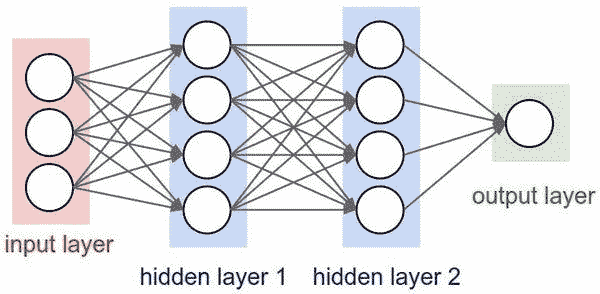
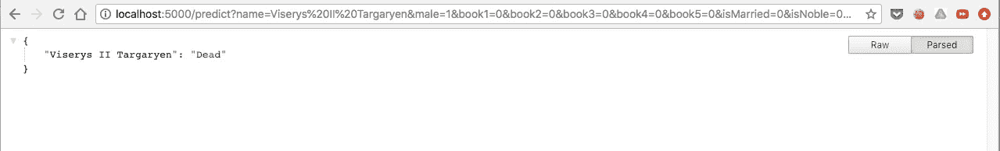

# 在 Python 中使用 Flask、Keras、TensorFlow 部署您的第一个深度学习神经网络模型

> 原文：<https://medium.com/coinmonks/deploy-your-first-deep-learning-neural-network-model-using-flask-keras-tensorflow-in-python-f4bb7309fc49?source=collection_archive---------0----------------------->



最近，我为我的公司建立了一个深度学习模型，预测用户是否购买汽车，如果是，那么哪辆汽车具有良好的准确性。向首席执行官和业务团队演示，每个人都对此感到兴奋。我们也做了测试，结果很有希望。

每个人都兴奋地要求我分享模型的 API，这样我们就可以把公司的注意力放在潜在的买家身上，也可以计划提供更好的消费者体验。

首先，我们使用 Tornado 框架来部署我们的深度学习模型。由于响应时间非常慢，它过去常常在每次获得 API 命中时加载模型。我们是新的 python，所以我们做了一些谷歌搜索，但没有找到任何解决方案。然后我看到 Flask framework 易于使用，我们可以声明一个全局变量，只需加载一次，就可以随时重用。

让我告诉你们怎么做的步骤&这是多么简单。

我假设你已经建立了你的深度学习模型，如果没有，请参考我的[以前的文章](/@ashok.tankala/build-your-first-deep-learning-neural-network-model-using-keras-tensorflow-in-python-a3e76a6b3ccb)来学习如何建立深度学习模型。

使用以下命令安装用于部署深度学习模型的 flask

```
pip3 install flask
```

**注意**:我在训练模型时没有对数据使用缩放技术，所以当我们在 API 上给出数据时，我们不需要转换任何东西。所以我跳过了我上一篇文章中[的**步骤 3** 。](/@ashok.tankala/build-your-first-deep-learning-neural-network-model-using-keras-tensorflow-in-python-a3e76a6b3ccb)

让我们进入美妙的部分——编码部分

```
import flask
import numpy as np
import tensorflow as tf
from keras.models import load_model
```

> **第一步**:常规进口。API 服务器的烧瓶。用于输入参数数组整形的 numpy。用于运行深度学习模型的 tensorflow。用于加载 keras 模型的 load_model from karas.models。

```
# initialize our Flask application and the Keras model
app = flask.Flask(__name__)
def init():
    global model,graph
    # load the pre-trained Keras model
    model = load_model('models/gotCharactersDeathPredictions.h5')
    graph = tf.get_default_graph()
```

> **步骤 2** :用于初始化我们的 Flask 应用程序并加载 Keras 模型。

```
# Getting Parametersdef getParameters():
    parameters = []
    parameters.append(flask.request.args.get('male'))
    parameters.append(flask.request.args.get('book1'))
    parameters.append(flask.request.args.get('book2'))
    parameters.append(flask.request.args.get('book3'))
    parameters.append(flask.request.args.get('book4'))
    parameters.append(flask.request.args.get('book5'))
    parameters.append(flask.request.args.get('isMarried'))
    parameters.append(flask.request.args.get('isNoble'))
    parameters.append(flask.request.args.get('numDeadRelations'))
    parameters.append(flask.request.args.get('boolDeadRelations'))
    parameters.append(flask.request.args.get('isPopular'))
    parameters.append(flask.request.args.get('popularity'))
    return parameters
```

> **第三步**:提取预测一个字符所需的参数(male，book1，book2，book3，book4，book5，isMarried，isNoble，numDeadRelations，boolDeadRelations，isPopular，popularity)并追加到数组中。

```
# Cross origin support
def sendResponse(responseObj):
    response = flask.jsonify(responseObj)
    response.headers.add('Access-Control-Allow-Origin', '*')
    response.headers.add('Access-Control-Allow-Methods', 'GET')
    response.headers.add('Access-Control-Allow-Headers', 'accept,content-type,Origin,X-Requested-With,Content-Type,access_token,Accept,Authorization,source')
    response.headers.add('Access-Control-Allow-Credentials', True)
    return response
```

> **第四步**:JSON 化响应对象。然后添加用于支持跨原点的报头参数。通常，我们不会在需要使用 API 的同一个域中部署 API，所以跨源支持必须在那个时候进行，这就是为什么需要这些头参数。

```
# API for prediction
@app.route("/predict", methods=["GET"])
def predict():
    nameOfTheCharacter = flask.request.args.get('name')
    parameters = getParameters()
    inputFeature = np.asarray(parameters).reshape(1, 12)
    with graph.as_default():
        raw_prediction = model.predict(inputFeature)[0][0]
    if raw_prediction > 0.5:
        prediction = 'Alive'
    else:
        prediction = 'Dead'
return sendResponse({nameOfTheCharacter: prediction})
```

> **步骤 5** :预测 API 的路径。
> 
> 首先，我们获取角色的名字，然后通过 getParameters 方法获取其余的参数。
> 
> 然后将它们整形为 ndarray，我们可以将它用作模型的输入。
> 
> 然后我们通过我们的模型找到预测。
> 
> 然后我们得出结论，这个角色是活着还是死了。
> 
> 然后我们使用 sendResponse 函数准备 response 对象并返回它。

```
# if this is the main thread of execution first load the model and then start the server
if __name__ == "__main__":
    print(("* Loading Keras model and Flask starting server..."
"please wait until server has fully started"))
    init()
    app.run(threaded=True)
```

> **Step6** :这段代码只是为了确认这是否是执行的主线程，首先加载模型，然后启动服务器

要运行这个应用程序，你只需要运行下面的命令就行了。

```
python3 gotCharactersDeathPredictionsAPI.py
```

一旦服务器启动，我在浏览器中点击下面的 URL。

```
[http://localhost:5000/predict?name=Viserys II Targaryen&male=1&book1=0&book2=0&book3=0&book4=0&book5=0&isMarried=0&isNoble=0&numDeadRelations=11&boolDeadRelations=1&isPopular=1&popularity=0.605351170568561](http://localhost:5000/predict?name=Viserys%20II%20Targaryen&male=1&book1=0&book2=0&book3=0&book4=0&book5=0&isMarried=0&isNoble=0&numDeadRelations=11&boolDeadRelations=1&isPopular=1&popularity=0.605351170568561)
```



恭喜你！！！部署了您的第一个深度学习模型。你可以在[我的 GitHub 库](https://github.com/tankala/ai-examples)找到这个例子和其他几个例子。

和平。快乐编码。
[在这里看我的原创文章。](https://blog.tanka.la/2018/07/15/deploy-your-first-deep-learning-neural-network-model-using-flask-keras-tensorflow-in-python/)

> 加入 Coinmonks [电报频道](https://t.me/coincodecap)和 [Youtube 频道](https://www.youtube.com/c/coinmonks/videos)获取每日[加密新闻](http://coincodecap.com/)

## 另外，阅读

*   [复制交易](/coinmonks/top-10-crypto-copy-trading-platforms-for-beginners-d0c37c7d698c) | [加密税务软件](/coinmonks/crypto-tax-software-ed4b4810e338)
*   [网格交易](https://coincodecap.com/grid-trading) | [加密硬件钱包](/coinmonks/the-best-cryptocurrency-hardware-wallets-of-2020-e28b1c124069)
*   [密码电报信号](http://Top 4 Telegram Channels for Crypto Traders) | [密码交易机器人](/coinmonks/crypto-trading-bot-c2ffce8acb2a)
*   [ko only 回顾](https://coincodecap.com/koinly-review) | [Binaryx 回顾](https://coincodecap.com/binaryx-review)|[Hodlnaut vs CakeDefi](https://coincodecap.com/hodlnaut-vs-cakedefi-vs-celsius)
*   [MoonXBT vs Bybit vs 币安](https://coincodecap.com/bybit-binance-moonxbt) | [硬件钱包](/coinmonks/hardware-wallets-dfa1211730c6)
*   [火币交易机器人](https://coincodecap.com/huobi-trading-bot) | [如何购买 ADA](https://coincodecap.com/buy-ada-cardano) | [Geco。一次复习](https://coincodecap.com/geco-one-review)
*   [币安 vs 比特邮票](https://coincodecap.com/binance-vs-bitstamp) | [比特熊猫 vs 比特币基地 vs Coinsbit](https://coincodecap.com/bitpanda-coinbase-coinsbit)
*   [如何购买 Ripple (XRP)](https://coincodecap.com/buy-ripple-india) | [非洲最好的加密交易所](https://coincodecap.com/crypto-exchange-africa)
*   [最佳加密交易所](/coinmonks/crypto-exchange-dd2f9d6f3769) | [印度最佳加密交易所](/coinmonks/bitcoin-exchange-in-india-7f1fe79715c9)
*   [开发人员的最佳加密 API](/coinmonks/best-crypto-apis-for-developers-5efe3a597a9f)
*   最佳[密码借贷平台](/coinmonks/top-5-crypto-lending-platforms-in-2020-that-you-need-to-know-a1b675cec3fa)
*   杠杆代币的终极指南