# 将 Hyperledger Composer 区块链业务网络部署到 Hyperledger 结构。

> 原文：<https://medium.com/coinmonks/deploying-a-hyperledger-composer-blockchain-business-network-to-hyperledger-fabric-c14a3b2bb746?source=collection_archive---------2----------------------->

我开发了一个简单的区块链应用程序，作为 2019 年 5 月在班加罗尔举行的印度黑客马拉松 Dapp 会议的一部分。这个想法是设计一个私人区块链来分散航空公司的航班信息数据库。

私人许可的区块链是一个新的时髦词，随着 Linux 基金会的 Hyperledger 项目的实施，今天的交易网络发生了彻底的变革，该项目创建了在网络上建立身份、执行交易和存储数据的标准方法。

所有代码都可以在我的 Github [**这里**](https://github.com/rietesh/Hyperledgerfabric-Airline-App) 找到

**Hyperledger Composer** 是一套用于构建区块链商业网络的协作工具，使企业主和开发人员能够简单快速地创建智能合同和区块链应用程序来解决商业问题。Composer 采用 JavaScript 构建，利用 node.js、npm、CLI 和流行编辑器等现代工具，提供以业务为中心的抽象以及带有易于测试的 devops 流程的示例应用，以创建强大的区块链解决方案，推动业务需求与技术开发保持一致。 [*来源*](https://www.hyperledger.org/projects/composer)

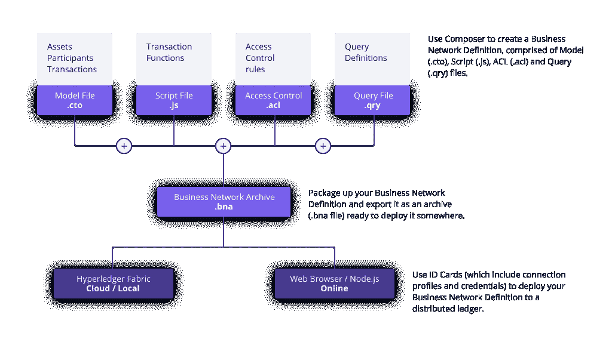

The Steps involved in making the App

**Hyperledger Fabric** 是私有的并且是许可的。Hyperledger 结构网络的成员通过可信成员服务提供商(MSP)注册，而不是允许未知身份加入网络的开放的无许可系统。

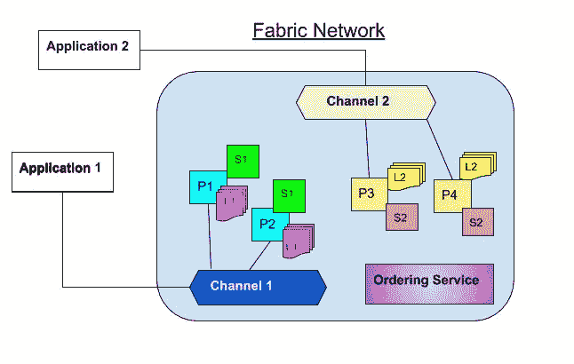

Simplified Hyperledger Fabric Architecture

设置开发环境==> [*点击*](https://hyperledger.github.io/composer/latest/installing/development-tools.html)

**定义模型**:

Asset== >航班详细信息，如航班号、位置、工作状态、航班类型、更新者的员工 Id、描述。

参与者== >负责更新信息的员工。

Transaction== >更新位置、更新者、工作状态和航班号。

要获得框架代码和正确的文件结构，请运行:

```
yo hyperledger-composer:businessnetwork
```

Model.cto

事务逻辑非常简单，我们只是将旧值改为新值，并更新 employeeId。

logic.js

Permissions.acl 是一个为参与者、对等者和管理员分配权利和义务的文件。为了简单起见，我给了管理员和系统的所有权利。

然后我们创建香蕉文件(。bna)使用:

```
composer archive create -t dir -n .
```

在与上述文件相同的目录中，我们将获得一个 airline-network@0.0.1.bna 文件，该文件用于在单个组织的 hyperledger fabric 的运行实例上部署模型。

# **展开**

在继续之前，请确保从您的钱包中取出所有以前的网卡运行:[S***source***](https://hyperledger.github.io/composer/latest/tutorials/deploy-to-fabric-single-org.html)

```
rm -fr ~/.composer
```

我们需要建立一个连接配置文件，创建一个 connection.json 文件来定义和指定定位和连接到 Hyperledger Fabric 网络所需的所有信息，例如所有 Hyperledger Fabric 网络组件的主机名和端口。

connection.json

我正在创建一个单个对等点(**peer0.org1.example.com**)请求端口是 7051，这里我们已经使用主机名 localhost 指定了我们的单个 CA(**ca.org1.example.com**)和 CA 端口 7054，这里，我们的单个订购者节点(**orderer.example.com**)使用主机名 localhost 和订购者端口 7050，我们还将其标记为 orderer.example.com。orderers 对象可以包含多个 order 节点。

我还指定了整个组织、对等方、CA、订购方和渠道以及客户端部分，以及提交前等待的超时长度。

现在我们寻找运行后生成的管理员的私有和公共密钥。/startfabric.sh 然后，我们将这些键复制到我们的项目目录中，现在我们准备为 Hyperledger Fabric 管理员创建我们的业务网络卡。

```
composer card create -p connection.json -u PeerAdmin -c Admin@org1.example.com-cert.pem -k 114aab0e76bf0c78308f89efc4b8c9423e31568da0c340ca187a9b17aa9a4457_sk -r PeerAdmin -r ChannelAdmin
```

*   -c 这是用户[Admin@org1.example.com](mailto:Admin@org1.example.com)的证书文件路径
*   -k 这是用户[Admin@org1.example.com](mailto:Admin@org1.example.com)的私钥文件的路径
*   -r 我们指定用户拥有哪些角色

接下来，我们通过运行

```
composer card import -f PeerAdmin@Airline-network.card
```

将 Hyperledger Composer 业务网络安装到 Hyperledger 结构对等节点上

```
composer network install -c PeerAdmin@Airline-network -a airline-network@0.0.1.bna
```

启动区块链

```
composer network start --networkName airline-network --networkVersion 0.0.1 -A admin -S adminpw -c PeerAdmin@Airline-network
```

部署区块链业务网络时，您必须创建至少一个参与者，该参与者将是区块链业务网络管理员。该参与者负责让其他参与者加入区块链业务网络。这里，我们指定要创建一个名为 admin 的区块链企业网络管理员。

-S 指定我们的区块链企业网络管理员 admin 将使用 adminpw 的注册密码向 CA(证书颁发机构)请求证书和私钥。当您指定此选项时，为企业网络管理员指定的名称必须是已向 CA 注册的用户的现有注册 ID。

为业务网络管理员导入业务网卡:

```
composer card import -f admin@airline-network.card
```

测试:

```
composer network ping -c admin@airline-network
```

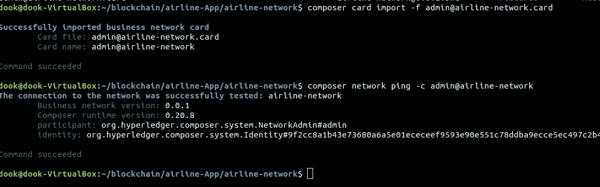

Results for Network Ping

现在，我们已经成功地将区块链业务网络部署到单个组织的 Hyperledger Fabric 实例中，包括生成必要的 Hyperledger Composer 配置。

让我们生成一个 REST 服务器:

```
composer-rest-server
```

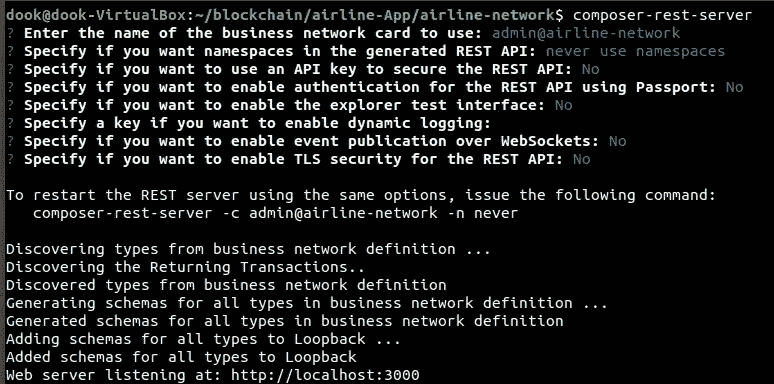

REST Server configuration

**注意:**指定是否要通过 websockets 启用事件发布=Yes

我们可以生成一个骨架角 4 应用程序:

```
yo hyperledger-composer:angular
```

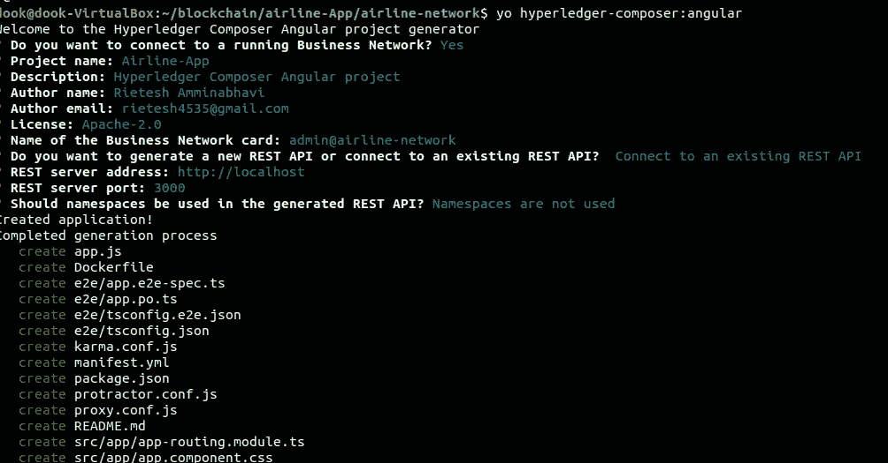

Angular 4 Application

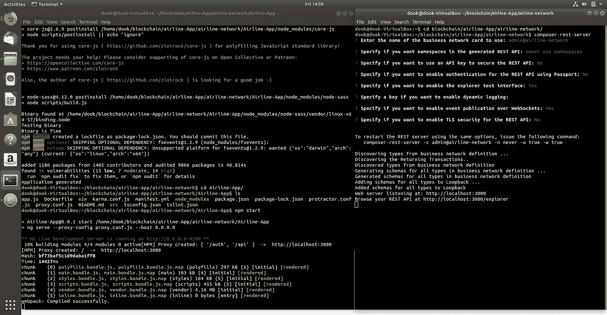

REST server and npm start

这将创建一个 REST 服务器的代理和一个在该文件夹上运行 npm start 的 app.js，并最终在 [http://0.0.0.0:4200/](http://0.0.0.0:4500/) 上服务 Angular 应用程序

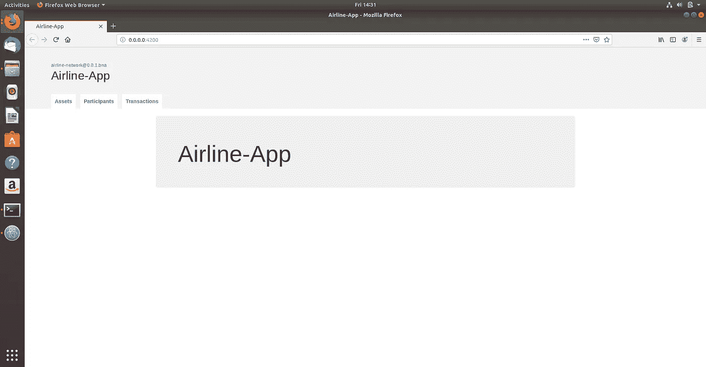

Angular 4 Application

我们可以从这个 Angular 4 应用程序中添加资产、参与者和调用事务，

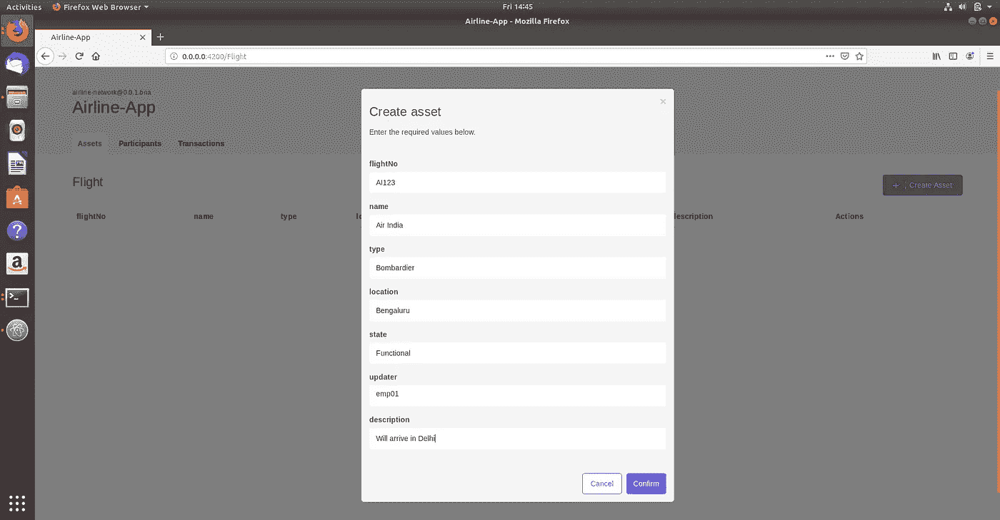

添加资产 **AI123** 从 **Bengaluru** 出发，预计到达**德里**。

由 **emp01** 更新

具有**功能的**工作状态

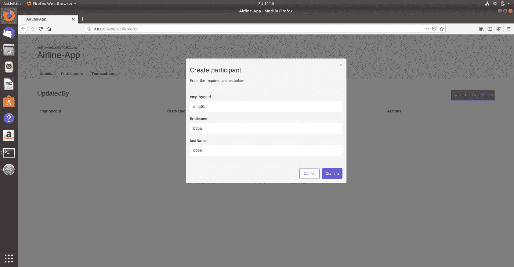

添加员工 ID 为 **emp01** 的员工

我还添加了另一名员工，其 EmployeeID 为 **emp02**

调用事务并将其提交到分类帐

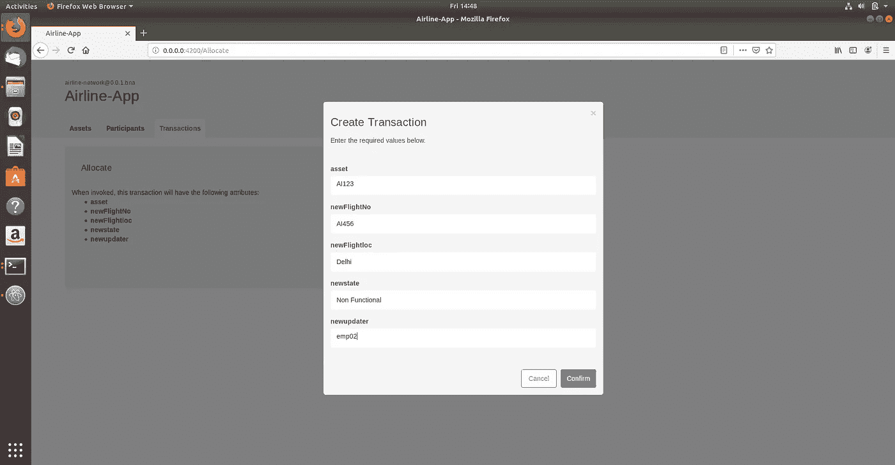

Invoking Transaction

提交后，我们有航班号: **AI456** ，位置:**德里**，工作状态:**非工作状态**，更新者: **emp02**

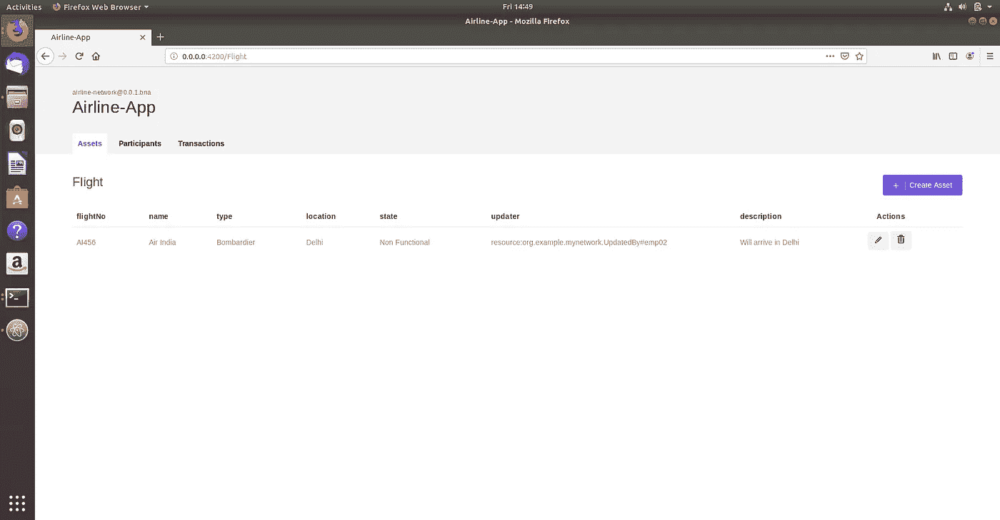

Committed Transaction

如果你喜欢这个博客，请留下你的任何疑问和疑问，拍拍拍拍！

[](https://coincodecap.com)

Coinmonks