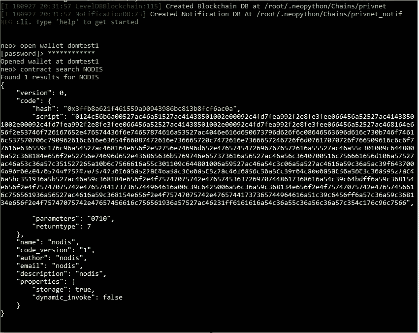
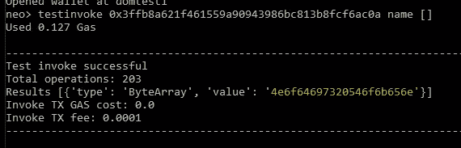

# 部署 NEP-5 智能合同(第 2 部分)

> 原文：<https://medium.com/coinmonks/deploying-a-nep-5-smart-contract-part-2-19aa8b598642?source=collection_archive---------9----------------------->

[上周](https://hackernoon.com/deploying-a-nep-5-smart-contract-part-1-fc81f312a096)，我们安装了 neo-boa，并修复了一个 NEP-5 智能合同，使其成为我们自己的！最后，让我们编译和部署！


“black gaming keyboard” by [Aidan Granberry](https://unsplash.com/@atgranberry?utm_source=medium&utm_medium=referral) on [Unsplash](https://unsplash.com?utm_source=medium&utm_medium=referral)

**第一步:**编译合同代码

打开一个命令提示符，输入`ubuntu`，然后输入`sudo -i`。继续~

```
cd neo-boa/
source venv/bin/activatecd ../smart-contract
python3.6 compile.py
```

** *完成后您将看到****ico _ template . AVM***

**步骤 2:** 导入合同——使用相同的 Ubuntu 提示符:

```
cd ../neo-python
source venv/bin/activatenp-prompt -p <server IP>
```

现在你在 NEO 提示符下，打开你的*管理员*钱包:`open wallet testWallet1`

```
import contract ../smart-contract/ico_template.avm "" 0710 05 True False# Fill out the contract details
 [Contract Name] > nodis
 [Contract Version] > 1
 [Contract Author] > nodis
 [Contract Email] > nodis
 [Contract Description] > nodis
```

你的合同现在被冻结了！

**第三步:**部署时间！

目前，代币都在合同中锁定。最终，我们需要调用`deploy()`(契约上的一个函数)将所有令牌转移到管理员钱包中！我们的首要任务是找到这份合同的底细。

```
contract search <NODIS>
```



在我们的例子中，脚本散列是`0x3ffb8a621f461559a90943986bc813b8fcf6ac0a`。现在键入:

```
testinvoke <contract hash> deploy []
```

当提示**调用网络上的**时，输入您的密码。

搞定了。键入`wallet`查看您的新财富！

**加成**命令:`testinvoke <contract hash> name []`！



厉害！这个值是十六进制的，我们可以使用在线工具来破译它。我们的上面写着“诺迪斯·托肯”。

**在线工具**:[https://codebeautify.org/hex-string-converter](https://codebeautify.org/hex-string-converter)

[Nodis.io](https://nodis.io) 是一个面向当地企业的营销平台，通过小型活动产生参与度，并向用户奖励加密货币，用户以后可以在商店消费。请在 [Instagram](https://www.instagram.com/nodis.io/) 、[脸书](https://www.facebook.com/NodisGetNoticed/)和 [Telegram](https://t.me/nodisgetnoticedgroup) 上查看我们并给我们反馈！

关注我 [Instagram](http://www.instagram.com/domfungus) 和[脸书](https://www.facebook.com/fung.dominic)！

**下周指南:**在 NEO 上模拟 ICO 众筹！

> [在您的收件箱中直接获得最佳软件交易](https://coincodecap.com/?utm_source=coinmonks)

[](https://coincodecap.com/?utm_source=coinmonks)