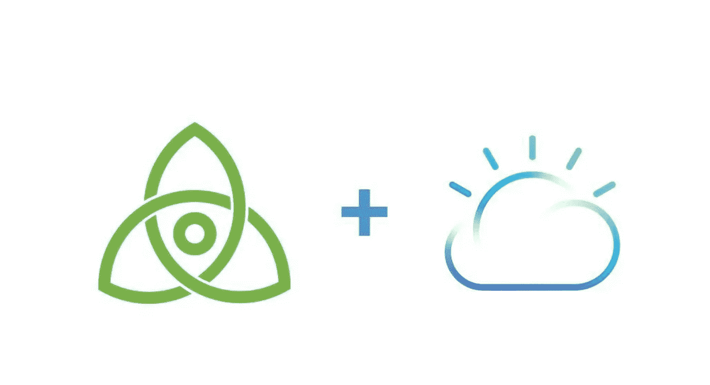

# 使用 Tendermint 在 IBM Cloud 上部署一个 Proof of Stake 区块链应用程序

> 原文：<https://medium.com/coinmonks/deploying-a-proof-of-stake-blockchain-app-on-ibm-cloud-using-tendermint-9b3a76bf8c5e?source=collection_archive---------3----------------------->

## 了解区块链的最好方法就是建造一个。

4 月 21 日， [Saif Rahman](https://medium.com/u/734d4f7a25d8?source=post_page-----9b3a76bf8c5e--------------------------------) 、 [Prerna Bhojwani](https://medium.com/u/c91abf5ee642?source=post_page-----9b3a76bf8c5e--------------------------------) 和我举办了一场网络研讨会，主题是使用 Tendermint 在 [IBM Cloud](http://ibm.biz/ioblockchain) 上构建和部署一个股权证明区块链应用程序。

Prerna 以什么是区块链、不同类型的区块链、区块链如何存储数据、什么是智能合同和共识算法开始了网上研讨会。然后她继续解释了 POW(工作证明)、POS(利害关系证明)和 BFT(拜占庭容错)共识算法。

然后她解释了这些算法如何控制区块链网络的工作。她还解释了区块链开发者面临的问题，即一般区块链设计的问题。

之后，赛义夫·拉赫曼接管了演示，并介绍了 Tendermind，这是解决 Prerna 提到的当前区块链建筑问题的关键因素。他解释了 Tendermint 软件的构建模块，即 Tendermint 核心(共识引擎)和 ABCI(应用程序区块链接口)，然后介绍了 loth JS，这是一个用于创建区块链应用程序的 javascript 框架。

他展示了他使用 Ionic framework 开发的聊天应用 running，该应用运行在使用 Tendermint 和 loop JS 构建的区块链网络上。他还做了一个现场代码实验室，向参与者展示了使用 lot JS 和 Tendermint 软件构建验证器节点的一步一步的过程。

在这之后，我接手并介绍了 IBM Cloud Container 和集群服务，并一步一步地向他们介绍了如何在 IBM Cloud 上的 kubernete 集群上部署单个 validate 节点。

最后，Saif 展示了如何将 Ionic 应用程序连接到区块链，从而结束了网上研讨会。

Slides

链接到关于使用 Tendermint 在 IBM Cloud 上部署 proof stake 区块链应用程序的博客:-[https://goo.gl/avXTE2](https://goo.gl/avXTE2)

链接到 github 库:-[https://github.com/SaifRehman/tendermint-chat-app](https://github.com/SaifRehman/tendermint-chat-app)

click to learn know more about blockchain