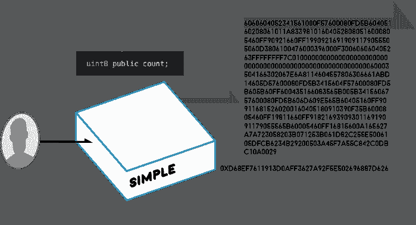

# 将智能合约部署到以太坊

> 原文：<https://medium.com/coinmonks/deploying-a-smart-contract-to-ethereum-86daed0ff69?source=collection_archive---------2----------------------->



历史上从未有过这样一种技术，任何地方的任何人都可以公开部署代码，这些代码将立即并无限期地在成千上万个节点上同时确定地运行。此外，由于密码学和密码经济学，这种技术是无主的、不可信的，并且有动机继续下去。一旦契约被部署，它就有效地自治、永恒，并且只受机器法则的控制。

让我们在区块链留下我们的印记。

这里有一个简单的合同，它持有一个公开的**计数:**

```
pragma solidity ^0.4.11; contract Simple {    

 uint8 public count;  

 function Simple(uint8 _amount) {       
  count = _amount;     
 }      function add(uint8 _amount) {         
  count += _amount;     
 } }
```

**计数**在构造函数 **Simple()中初始化。**

如果您正在使用我们的开源[并发脚本](https://concurrence.io/exploration/craftingscripts/)，您可以运行:

```
node compile Simple
```

这产生了一大块字节码:

```
6060604052341561000f57600080fd5b60405160208061011a833981016040528080516000805460ff90921660ff19909216919091179055505060d3806100476000396000f300606060405263ffffffff7c010000000000000000000000000000000000000000000000000000000060003504166302067e6a8114604557806306661abd14605d57600080fd5b3415604f57600080fd5b605b60ff600435166083565b005b3415606757600080fd5b606d609e565b60405160ff909116815260200160405180910390f35b6000805460ff19811660ff9182169390930116919091179055565b60005460ff16815600a165627a7a723058203b071253b061d82c255e5006105dfcb6234b29200503a45f7a55c842c0dbc10a0029
```

要了解关于这个字节码的更多信息，请查看 stackexchange 上的[这篇文章。如果你真的想搞怪，也可以一头扎进](https://ethereum.stackexchange.com/questions/119/what-opcodes-are-available-for-the-ethereum-evm)[以太坊黄皮书](http://yellowpaper.io/)(朝向底部)。

让我们将这个字节码部署到 testnet 中:

```
node deploy Simple
```

此外，您需要一个 **arguments.js** 文件将一个数字传递给构造函数:

```
module.exports = [253]
```

部署的输出如下所示:

```
paying a max of 2000000 gas @ the price of 22 gwei (22000000000) 
... 
==ETHER COST: 0.0029070139999999994 $1.0174548999999997
```

22gwei 的价格，看起来好像花了一美元部署。

现在，在 testnet 的剩余生命周期中，来自任何地方的任何人都可以通过[0x d 68 ef 7611913d 0 aff 3627 a 92 F5 e 502696887d 626](https://ropsten.etherscan.io/address/0xd68ef7611913d0aff3627a92f5e502696887d626)与该契约进行交互。太棒了！

让我们仔细看看这份合同，看看有什么问题。我们将想精心设计一些脚本，这样我们就不会在命令行上摸索了:

```
//
// usage: node contract getCount Simple
//
module.exports = (contract,params,args)=>{
  contract.methods.count().call().then((count)=>{
    console.log("COUNT:"+count)
  })
}node contract getCount SimpleCOUNT:253
```

很好，所以我们当前的**计数**是 *253* ，这就是我们部署合同时使用的。

这是一个只读操作，我们没有改变合同的状态，因此任何人都可以免费读取**计数**，只要他们连接到以太坊区块链。

让我们在契约上运行 **add()** 函数来实际更改状态。

```
//
// usage: node contract add Simple null #AMOUNT#
//
// ex: node contract add Simple null 1
//
module.exports = (contract,params,args)=>{
  console.log("**== adding "+args[5])
  return contract.methods.add(args[5]).send({
    from: params.accounts[0],
    gas: params.gas,
    gasPrice:params.gasPrice
  })
} node contract add Simple null 1 Success
{
  blockHash: '0x78ad780d0bf95737baec82f974e067d4ee67708829cbd4dad4fda15c3de39a51',
  blockNumber: 1856672,
  contractAddress: null,
  cumulativeGasUsed: 26840,
  from: '0x4ffd642a057ce33579a3ca638347b402b909f6d6',
  gasUsed: 26840,
  status: '0x1',
  to: '0xd68ef7611913d0aff3627a92f5e502696887d626',
  transactionHash: '0x78a472410ada67aa2345d37fb4d695e1e07702940aae51616efacb7e4b01621c',
  transactionIndex: 0
}
```

查看 [etherscan.io](https://ropsten.etherscan.io/tx/0x78a472410ada67aa2345d37fb4d695e1e07702940aae51616efacb7e4b01621c) 上的交易。

现在让我们再做一个 **getCount()** 来看看契约的状态是什么:

```
node contract getCount SimpleCOUNT:254
```

根据 Etherscan 的数据，将 1 加到那个单位大约需要 0.17 美元。这可能看起来有点贵，但实际上是怎么回事呢？

嗯，我们向网络广播我们想要进行交易，一些幸运的矿工能够通过强力 cpu 能力找到正确的随机数，挖掘包含我们的交易和其他交易的块，向网络的其余部分广播，然后世界上的每个*矿工根据他们的合同版本运行我们的交易，并得到相同的结果。然后我们可以问*他们中的任何一个*我们的**计数**是多少，结果会是一样的。即使银行、企业和政府起起落落，我们的**计数**仍然准确地停留在它被指示停留的地方。这真是太棒了。*

让我们再多考虑一下天然气成本，因为合同交互成本在[并发](https://concurrence.io)如何工作中起着巨大的作用。

让我们把愿意支付的价格降低 110:

```
echo "2" > gasprice.int
```

现在让我们再次运行相同的事务:

```
node contract add Simple null 1
```

现在检查计数，我们看到:

```
COUNT:255
```

查看 [etherscan.io](https://ropsten.etherscan.io/tx/0x2af7ef9e4c20b10e8fa0b5252bb9c2ab1df01b81058c3e99e87562bae47fa97d) 上的交易。

上次花了大约 25 秒。这一次花了 55 秒，但花费了大约 0.017 美元。这是因为矿商不仅受到大宗开采奖励的激励，还受到用于交易的天然气的激励。由他们来决定哪些交易值得挖掘。根据我们的需要，我们可以用成本换取速度。

(*ethers can . io 提供的另一个整洁的工具是*[*VM trace*](https://ropsten.etherscan.io/vmtrace?txhash=0x2af7ef9e4c20b10e8fa0b5252bb9c2ab1df01b81058c3e99e87562bae47fa97d)*。您可以看到事务的每个步骤，包括操作码和成本。看看与其他东西相比，SSTORE 有多贵。*)

我们还应该涉及安全性和 bug。这个契约是公开的，所以任何人都可以运行 add 函数，任何人都可以看到当前的计数。现在这很好，但是如果有 1 亿美元处于危险之中呢…呀！这使得合同开发者的工作变得极其困难，因为在接下来的时间里，你所做的一切都受到每个坏演员的摆布。每个契约交互都是确定的；我们*可以*确定给定一个状态和一个动作会发生什么，但是就像下棋一样，预测棋盘上每一个可能的结果也是相对困难的。

那么如果我们再运行一次 **add()** 会发生什么呢？假设没有其他人已经点击我们的合同，计数将像以前一样上升，我们应该看到 *256* 对不对？让我们来试试:

```
node contract add Simple null 1
```

查看 [etherscan.io](https://ropsten.etherscan.io/tx/0xee07a309049d3ee0d78ba66f186fd0a3727cd8b552ec4b4b331a626dc3570815) 上的交易。

现在检查计数，我们看到:

```
COUNT:0
```

哦沙特！我们的账户余额为 0！H4ckers！嗯，不完全是，更像是 uint8 [溢出](https://en.wikipedia.org/wiki/Integer_overflow)，但是你明白了。理解你的合同可能遇到的每一种可能性的每一个方面是非常重要的，因为这关系到大量的真金白银。

> [直接在您的收件箱中获得最佳软件交易](https://coincodecap.com/?utm_source=coinmonks)

[](https://coincodecap.com/?utm_source=coinmonks)

*这是摘自* [*部署合同*](https://concurrence.io/exploration/deployingacontract/) *章节关于*[*concurrence . io*](https://concurrence.io)*。*