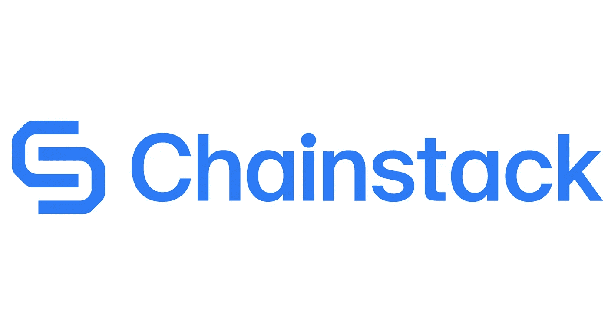
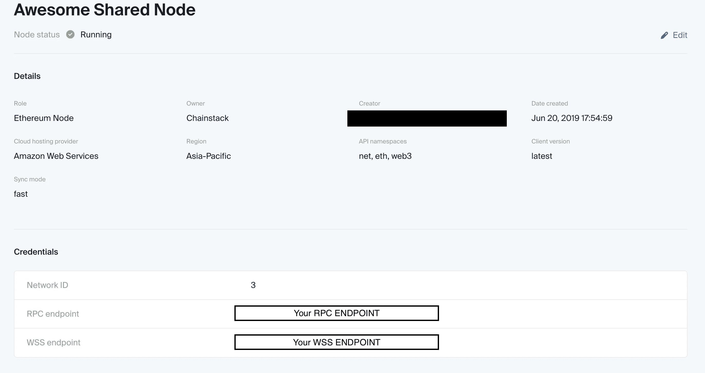
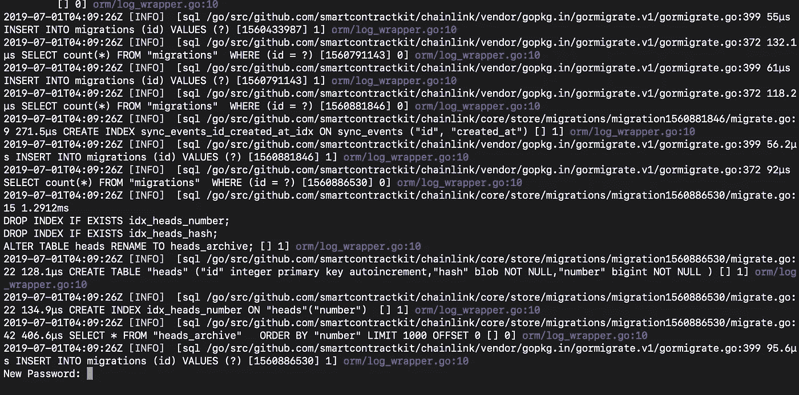
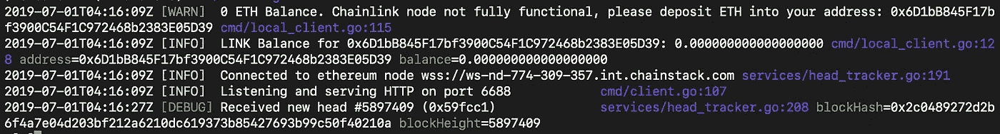

# 使用 Chainstack 在几分钟内部署一个工作链节点

> 原文：<https://medium.com/coinmonks/deploying-a-working-chainlink-node-using-chainstack-in-minutes-b2c7e7192eac?source=collection_archive---------0----------------------->



Chainlink 节点是 oracles，允许驻留在以太坊区块链上的智能合约与外部 API 进行交互。在创建 Chainlink 节点之前，Smart Contract 无法访问这些 API，因此限制了它们的功能。

Chainlink 节点的重要性不可低估——智能合约现在可以更加灵活和灵活，允许它通过访问区块链以外的数据集来实现真正的智能。

在本教程中，我们将部署我们自己的 Chainlink 节点，然后无缝地让它连接到通过 Chainstack 创建的以太坊节点(我在那里工作)。这将在 Ropsten 网络上完成。

由 Chainstack 创建的节点只需要几分钟就可以完全同步，这意味着您的 Chainlink 节点也可以快速部署。

# 要求

1.  安装 Docker-CE
2.  链栈节点( [14 天试用](https://console.chainstack.com)

# 终点

让我们从获取以太坊节点的 **websocket** 端点开始。这可以很容易地从您的 Chainstack 控制台获得。如果你不确定如何在 Chainstack 上创建以太坊节点，请访问我的[以前的教程](https://hackernoon.com/start-and-deploy-your-own-fully-synced-ethereum-node-in-under-10-minutes-bf2e6b512cce)。

请注意 WSS (websocket)端点:



Endpoints page in the Chainstack console

# 运行链节节点

首先，让我们创建你的链接节点所在的目录。

```
mkdir ~/.chainlink-ropsten
```

接下来，创建。docker 图像的环境文件

```
echo "ROOT=/chainlink
LOG_LEVEL=debug
ETH_CHAIN_ID=3
MIN_OUTGOING_CONFIRMATIONS=2
LINK_CONTRACT_ADDRESS=0x20fe562d797a42dcb3399062ae9546cd06f63280
CHAINLINK_TLS_PORT=0
SECURE_COOKIES=false
ALLOW_ORIGINS=*" > ~/.chainlink-ropsten/.env
```

“**LINK _ CONTRACT _ ADDRESS”**变量设置为“0x 20 Fe 562d 797 a 42 dcb 3399062 AE 9546 CD 06 f 63280”，这是 **Ropsten** testnet 上测试链令牌的契约地址。因此，当使用其他测试网或 mainnet 时，相应地改变这一点。

因为我们在 Chainstack 上运行 Ethereum 客户端，而不是在本地机器上，所以用 wss 端点复制并编辑下面的代码。

```
echo "ETH_URL=WSS_ENDPOINT" >> ~/.chainlink-ropsten/.env
```

其中**“WSS _ 端点”**是从链板控制台获得的值。

# 启动节点

在您的终端中运行以下代码:

```
cd ~/.chainlink-ropsten && docker run -p 6688:6688 -v ~/.chainlink-ropsten:/chainlink -it --env-file=.env smartcontract/chainlink local n
```

恭喜，您的节点应该正在运行！您的终端窗口应该如下所示:



Creation of a Chainlink node

Chainlink 节点会管理和使用自己的以太坊密钥，不会使用以太坊客户端管理的以太坊密钥。将提示您输入密码，该密码代表您的 Chainlink 节点使用的以太坊密钥库文件。

一旦设置了节点密码，就可以为 chainlink 节点创建第一个 API 用户。作为 API 用户，您将能够为智能合约创建新的作业以进行 API 调用。

一旦创建了 API 用户，Chainlink 节点应该从 Chainstack Ethereum 节点接收块头:



Chainlink listening to Chainstack

就是这样！您也可以登录 Chainlink 控制台 [http://localhost:6688](http://localhost:6688/) 添加作业。

# 结论

您可以随意使用和部署自己的作业，并与节点进行交互。你可以去看看关于如何[满足请求](https://docs.chain.link/docs/fulfilling-requests)的 Chainlink 文档。

免费试用[链栈](https://console.chainstack.com)
链栈[文档](https://docs.chainstack.com)

> [直接在您的收件箱中获得最佳软件交易](https://coincodecap.com/?utm_source=coinmonks)

[](https://coincodecap.com/?utm_source=coinmonks)