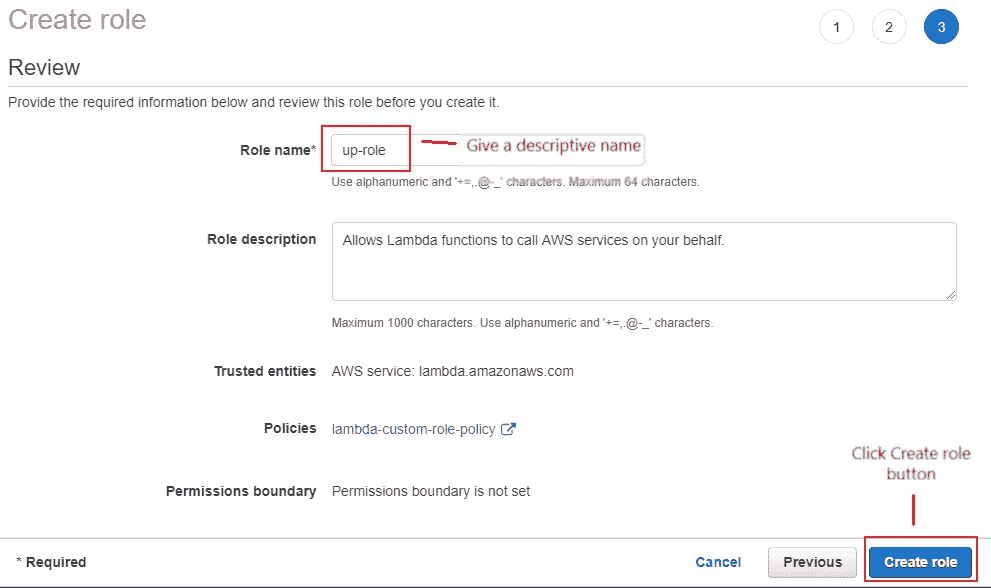
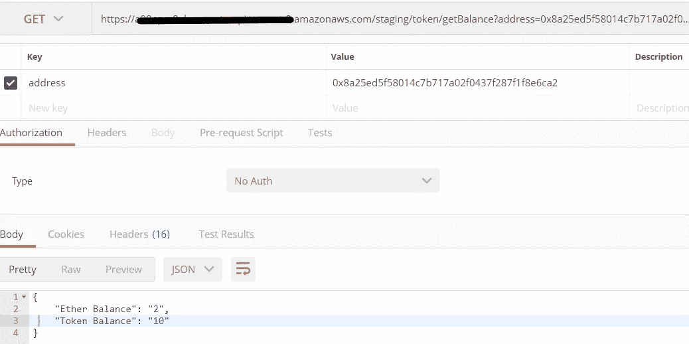

# 使用节点的 AWS Lambda 上的以太坊 DAPP (REST API)。JS、Web3 Beta 和 Infura

> 原文：<https://medium.com/coinmonks/deploying-ethereum-dapp-rest-api-on-aws-lambda-using-node-js-web3-beta-and-infura-513cc92a9de5?source=collection_archive---------1----------------------->

代币是一种新的在线支付方式，将成为金融科技公司的未来。

在这篇文章中，我将展示如何构建简单的 DAPP 来发送令牌到不同的钱包。

# 先决条件

A.Visual Studio 代码—[https://code.visualstudio.com/](https://code.visualstudio.com/)

B.节点。JS(v 8.10)——[https://nodejs.org/en/](https://nodejs.org/en/)

C.Metamask —请点击此链接了解如何安装([https://medium . com/@ follow coin/how-to-install-meta mask-88 CBD abc1 d 28](/@followcoin/how-to-install-metamask-88cbdabc1d28))

D.AWS 帐户—创建 AWS 帐户[(https://aws.amazon.com/](https://aws.amazon.com/))。我们需要 IAM(创建 API 密钥，确保使用基于 up 文档的自定义策略)

E.APEX Up——按照本文件([https://up.docs.apex.sh/](https://up.docs.apex.sh/))安装 Up 命令。要了解更多关于使用 Up 命令的信息，请点击此链接。([https://medium.freecodecamp.org/up-b3db1ca930ee](https://medium.freecodecamp.org/up-b3db1ca930ee))。

# 启动项目工作环境

打开 Visual Studio 代码，然后打开要创建 DAPP 的文件夹。然后，创建类似下图的文件夹:


按`Ctrl + ``(反勾)显示终端窗口。然后，运行下面的命令来创建`package.json`。

```
npm init
```

然后，按照向导初始化您的 package.json，应该会看到类似下面的内容:


确保`entry point`是`app.js`。之后，您应该会看到类似的下图:

```
{
  "name": "web3betainfuralambda",
  "version": "1.0.0",
  "description": "Sample DAPP to be deployed in Lambda.",
  "main": "app.js",
  "directories": {
    "lib": "lib"
  },
  "scripts": {
    "test": "node ./node_modules/cucumber/bin/cucumber-js",
    "start": "node app"
  },
  "repository": {
    "type": "git",
    "url": "git+[https://github.com/abcamitan/web3BetaInfuraLambda.git](https://github.com/abcamitan/web3BetaInfuraLambda.git)"
  },
  "keywords": [
    "Node.JS",
    "Web3",
    "Lambda",
    "Infura",
    "Ethereum"
  ],
  "author": "Aries Camitan",
  "license": "MIT",
  "bugs": {
    "url": "[https://github.com/abcamitan/web3BetaInfuraLambda/issues](https://github.com/abcamitan/web3BetaInfuraLambda/issues)"
  },
  "homepage": "[https://github.com/abcamitan/web3BetaInfuraLambda#readme](https://github.com/abcamitan/web3BetaInfuraLambda#readme)"
}
```

# 创建智能合同

首先，我们需要创建合同并部署到 Rinkeby network。

下面是一个关于如何创建智能合同以及如何部署到以太网的很好的教程，从那篇文章中我复制了智能合同代码。

[](https://medium.freecodecamp.org/how-to-write-and-deploy-your-first-smart-contract-341d5e2ffb35) [## 如何编写和部署您的第一份智能合同

### 自从以太坊在 2015 年年中的出现为加密领域增光添彩以来，这项革命性的发明由…

medium.freecodecamp.org](https://medium.freecodecamp.org/how-to-write-and-deploy-your-first-smart-contract-341d5e2ffb35) 

转到`[https://remix.ethereum.org](https://remix.ethereum.org)` [，](https://remix.ethereum.org)然后复制并编译下面的智能合同代码。

```
pragma solidity ^0.4.21; //tells that the source code is written for Solidity version 0.4.21 or anything newer that does not break functionalitycontract aexToken {
 // The keyword “public” makes those variables readable from outside.

 address public minter;

 // Events allow light clients to react on changes efficiently.
 mapping (address => uint) public balances;

 // This is the constructor whose code is run only when the contract is created
 event Sent(address from, address to, uint amount);

 constructor() public {

 minter = msg.sender;

 }

 function mint(address receiver, uint amount) public {

 if(msg.sender != minter) return;
 balances[receiver]+=amount;

 }

 function send(address receiver, uint amount) public {
 if(balances[msg.sender] < amount) return;
 balances[msg.sender]-=amount;
 balances[receiver]+=amount;
 emit Sent(msg.sender, receiver, amount);

 }
}
```


然后，我们需要获得编译后的契约的输出，这是 json 格式的 ABI。要获取，点击*详情*按钮。


然后，寻找 ABI，然后点击*复制*按钮。


之后，将其粘贴到`abi.json` 文件中，然后保存。


# 将合同部署到 Rinkeby 测试网络

我假设你已经安装了超能面具，而且你的钱包里有乙醚。

要部署已编译的智能合同，请转到*运行*选项卡，然后单击*部署*按钮。


将弹出元掩码确认窗口。然后，点击*确认*按钮，按照向导进行操作，直到部署完成。


在元掩码中确认事务后，单击该事务。


您将在 etherscan 交易详情中看到您的合同已成功创建。现在，我们需要复制合同地址并保存在某个地方以备后用。


# 从 Infura 获取 API 密钥

如果您没有 Infura 帐户，请立即前往`[https://infura.io/](https://infura.io/)`注册。之后，登录你的邮箱，验证你的 Infura 账号。然后，点击*了解 INFURA 如何工作*按钮并进入向导过程或选择*跳过*。


按下 *OK，我们走*按钮。


然后，点击*创建新项目*。


接下来，给你的项目命名，然后点击*创建项目*按钮。


然后，在端点下选择 RINKEBY。然后，给出您之前在智能合约部署中保留的合约地址。最后，点击*添加*按钮。


然后，复制端点并保存在某个地方，我们将在稍后创建 DAPP 时使用它。


# 创建 DAPP 应用程序

在我们开始编码之前，请注意我不会在这篇文章中涉及任何安全问题。我让您决定如何保护您的代码和服务器。

首先，我们需要运行下面的命令来安装所有需要的节点模块。

```
npm install -save express body-parser cjson web3
```

通过创建 *app.js* 文件来创建应用程序的主入口点。在下面输入代码并保存。

```
const express = require('express')
const bodyParser = require('body-parser')
const fs = require('fs')
const path = require('path')var app = express()// Defining the port number. 
// It is important to set to process.env.PORT 
// since Lambda will define the PORT explicitly
const PORT = process.env.PORT || 8080// Supporting every type of body content type
app.use(bodyParser.json())
app.use(bodyParser.urlencoded({ extended: true }))//Use below codes to automatically add your routing files (endpoints)
var routes = fs.readdirSync(path.join(__dirname, '/route'))
routes.forEach(routesFile => {
    if (routesFile.match(/\.js$/)) {
        var route = require(path.join(__dirname, '/route/', routesFile))
        route(app)
    }
})// show the running port on console
app.listen(PORT, function() {
    console.log('server started on port ', PORT)
})
```

接下来，我们需要创建我们的路由或端点。如果还没有创建`route` 文件夹，请现在创建。然后，在该文件夹中创建`token-route.js`文件，输入下面的代码并保存。

```
const token = require('../lib/token')
function init(app) {
 const path = '/token'

 // endpoint to create token to given address
 app.post(path+'/mintToken', token.mint)

 // endpoint to transfer token from Contract
 // there's must be existing token inside the contract to send token
 // otherwise, 0 token to send to give address
 app.post(path+'/sendToken', token.send)

 // check the balance of ether and token from given address
 app.get(path+'/getBalance', token.balance)
}
module.exports = init;
```

现在，我们将创建调用智能合约方法的功能。首先，检查`lib` 文件夹是否已经存在，如果没有创建文件夹。然后，在`lib` 文件夹中创建一个名为`token.js`的新文件，并复制下面的代码:

```
const Web3 = require('web3')
const path = require('path')
const cjson = require('cjson')
const TX = require('ethereumjs-tx')// contract details
const provider = ['https://rinkeby.infura.io/v3/49489982b438407ea553d0ac3dc0671b'](https://rinkeby.infura.io/v3/49489982b438407ea553d0ac3dc0671b')
const contractAddress = '0xff8298ae7364d0e79a502dec7d53bc19dfd6ba5f'
const privateKey = new Buffer('01b83f2972df3f5f7894c3425300cd66f4617b0da748dbb25159ccd0d4568455', 'hex')
const defaultAccount = '0x5fe168a1256d574cef13bc5f4e00c021183f4dbe'
const etherscanLink = ['https://rinkeby.etherscan.io/tx/'](https://rinkeby.etherscan.io/tx/')// initiate the web3
const web3 = new Web3(provider)// initiate the contract with null value
var contract = null;// convert Wei to Eth
function convertWeiToEth( stringValue ) {
 if ( typeof stringValue != 'string' ) {
 stringValue = String( stringValue );
 }
 return web3.utils.fromWei( stringValue, 'ether' );
}// Initiate the Contract
function getContract() { 
 if (contract === null) {
 var abi = cjson.load(path.resolve(__dirname, '../ABI/abi.json'));
 var c = new web3.eth.Contract(abi,contractAddress)
 contract = c.clone();
 }
 console.log('Contract Initiated successfully!')
 return contract;
}// send token to Address
async function sendToken(req, res) {
 var address = req.body.address
 var tokens = Number(req.body.tokens)if (address && tokens) {
 const rawTrans = getContract().methods.send(address, tokens) // contract method 
 return res.send(await sendSignTransaction(rawTrans))
 } else {
 res.send({
 'message':'Wallet address or no. of tokens is missing.'
 })
 }}// Mint/Create token to given address
async function mintToken(req, res) {
 var address = req.body.address
 var tokens = Number(req.body.tokens)if (address && tokens) {
 const rawTrans = getContract().methods.mint(address, tokens) // contract method 
 return res.send(await sendSignTransaction(rawTrans))
 } else {
 res.send({
 'message':'Wallet address or no. of tokens is missing.'
 })
 }
}// get the balance of given address
async function getBalance(req, res) {
 var address = req.query.address
 if (address) {
 // get the Ether balance of the given address
 var ethBalance = convertWeiToEth( await web3.eth.getBalance(address)) || '0'// get the token balance of the given address
 var tokenBalance = await getContract().methods.balances(address).call() || '0'// response data back to requestor
 return res.send({
 'Ether Balance': ethBalance,
 'Token Balance': tokenBalance
 })
 } 
}// Send Signed Transaction
async function sendSignTransaction(rawTrans) {
 // Initiate values required by the dataTrans
 if (rawTrans) {
 var txCount = await web3.eth.getTransactionCount(defaultAccount) // needed for nonce
 var abiTrans = rawTrans.encodeABI() // encoded contract method 

 var gas = await rawTrans.estimateGas()
 var gasPrice = await web3.eth.getGasPrice()
 gasPrice = Number(gasPrice)
 gasPrice = gasPrice * 2
 var gasLimit = gas * 4// Initiate the transaction data
 var dataTrans = {
 nonce: web3.utils.toHex(txCount),
 gasLimit: web3.utils.toHex(gasLimit),
 gasPrice: web3.utils.toHex(gasPrice), 
 to: contractAddress,
 data: abiTrans 
 }

 // sign transaction
 var tx = new TX(dataTrans)
 tx.sign(privateKey)// after signing send the transaction
 return await sendSigned(tx)
 } else {
 throw new console.error('Encoded raw transaction was not given.');
 }

}function sendSigned(tx) {
 return new Promise(function(resolve,reject){
 // send the signed transaction
 web3.eth.sendSignedTransaction('0x' + tx.serialize().toString('hex'))
 .once(‘transactionHash’, function(hash){
 var result = {
 'status':'sent',
 'url': etherscanLink + hash,
 'message':'click the given url to verify status of transaction'
 }// respond with the result
 resolve(result)
 })
 .then(out => {console.log(out)})
 .catch(err => {
 // respond with error
 reject(err)
 })
 })
}module.exports = {
 send: sendToken,
 mint: mintToken,
 balance: getBalance
}
```

好了，这就是我们的 DAPP (Rest API)应用程序所需要的。从这里开始，我推荐使用`node app`命令运行应用程序来测试您的应用程序。然后，使用 API 测试工具如 Postman 来测试你的 API。

注意:如果您想使用 Infura 订阅智能合约事件。必须使用 websockets 而不是普通的 httpprovider。

# 部署前要求

在我们继续之前，请确保您完全理解来自您机器的 [AWS 凭证](https://up.docs.apex.sh/#aws_credentials)和 [up](https://up.docs.apex.sh) 命令的设置。我假设您已经设置了所需的[凭证](https://up.docs.apex.sh/#aws_credentials)、[自定义策略](https://up.docs.apex.sh/#aws_credentials.iam_policy_for_up_cli)和 [up](https://up.docs.apex.sh/#installation) 命令已经安装。

首先，您需要从 IAM 下的 AWS 设置[角色](https://console.aws.amazon.com/iam/home?region=us-east-2#/roles)。点击*创建角色*按钮，创建一个新角色。


在下一个屏幕上，您需要创建一个新策略。点击*创建策略*按钮。


单击 JSON 选项卡。


使用下面的 JSON 替换现有值。然后，点击*审核策略*按钮。

```
{
    "Version": "2012-10-17",
    "Statement": [
        {
            "Action": [
                "logs:CreateLogGroup",
                "logs:CreateLogStream",
                "logs:PutLogEvents",
                "ssm:GetParametersByPath",
                "ec2:CreateNetworkInterface",
                "ec2:DescribeNetworkInterfaces",
                "ec2:DeleteNetworkInterface"
            ],
            "Effect": "Allow",
            "Resource": "*"
        },
        {
            "Action": [
                "logs:CreateLogGroup",
                "logs:CreateLogStream",
                "logs:PutLogEvents",
                "ssm:GetParametersByPath",
                "ec2:CreateNetworkInterface",
                "ec2:DescribeNetworkInterfaces",
                "ec2:DeleteNetworkInterface"
            ],
            "Effect": "Allow",
            "Resource": "*"
        }
    ]
}
```

在下一个屏幕上，输入一个描述性名称，然后单击*创建策略*按钮。


回到角色创建，搜索新创建的自定义策略，然后单击勾选框。然后，点击*下一步:查看*按钮。


在下一个屏幕上，给出一个描述性名称并点击*创建角色*按钮。



之后，打开新创建的角色。然后，单击信任关系选项卡。


然后，使用以下文本修改现有策略，并点击*更新信任策略*按钮。

```
{
  "Version": "2012-10-17",
  "Statement": [
    {
      "Effect": "Allow",
      "Principal": {
        "Service": "apigateway.amazonaws.com"
      },
      "Action": "sts:AssumeRole"
    },
    {
      "Effect": "Allow",
      "Principal": {
        "Service": "lambda.amazonaws.com"
      },
      "Action": "sts:AssumeRole"
    }
  ]
}
```


然后，复制 ARN 链接并保存在某个地方，用于`up.json` 配置文件。


接下来是创建 VPC、子网(至少两个子网)，然后连接到互联网网关。请按照此[链接](/@devopslearning/aws-vpc-virtual-private-cloud-d8f8481695b6)创建([https://medium . com/@ devopsleeping/AWS-VPC-virtual-private-cloud-d8f 8481695 b 6](/@devopslearning/aws-vpc-virtual-private-cloud-d8f8481695b6))。

然后，从根文件夹创建`up.json`文件。这是与 up 命令一起使用所需的配置文件。使用以下格式:

```
{
  "name":"web3betainfuralambda",
  "profile":"lambda_test",
  "regions":["us-east-2"],
  "lambda": {
    "memory": 512,
    "timeout": 0,
    "role": "<ARN link copied previously>",
    "runtime": "nodejs8.10"
  },
  "vpc": {
    "subnets": ["subnet-1c27a366", "subnet-9c25a1e6"],
    "security_groups": ["sg-d1c4a4bb"]
  }
}
```

我不会解释这些属性是什么。但是，我们需要的重要属性是*名称*、*概要*、*角色*、*运行时*和 *vpc* 。

名称—是显示在 lambda 仪表板中的应用程序的名称。

配置文件—您创建的 [AWS IAM 帐户](https://docs.aws.amazon.com/cli/latest/userguide/cli-config-files.html)是否定义了[自定义策略](https://up.docs.apex.sh/#aws_credentials.iam_policy_for_up_cli)。

角色-我们之前复制的角色 ARN 链接。

运行时—是 node.js 版本

vpc —在这种情况下，我们需要定义子网 id 和安全组

要了解更多关于 up 的配置，请点击此[链接](https://up.docs.apex.sh/#configuration)([https://up.docs.apex.sh/#configuration](https://up.docs.apex.sh/#configuration))

# 使用 up 命令部署到 Lambda

打开你的命令终端，然后进入你的 DAPP 目录。然后，在您的终端上运行以下命令。

```
up
```

您应该会看到下面类似消息，


然后，运行下面的命令来获取 DAPP 应用程序的 url。

```
up url
```

然后，用 Postman 或其他 API 测试工具使用给定的 URL 测试您的端点。您可以运行`up logs -f`来查看来自 lambda 的实时控制台消息。



如果你从 Lambda 控制台收到如下所示的关于 scrypt 的错误信息。


您需要创建一个[新的 EC2 实例，并使用类似于 Lambda 实例的 Linux AMI 映像](https://docs.aws.amazon.com/AWSEC2/latest/UserGuide/EC2_GetStarted.html)。出现此错误的原因是，在 npm 安装期间创建的 scrypt 二进制文件与 Lambda 使用的 AWS Linux AMI 中的二进制文件不同。

创建 EC2 实例后，在 AWS Linux 上运行 npm install 之前，需要执行以下步骤:

1.  安装更新(`sudo yum update -y`)
2.  安装 nvm ( `curl -o- [https://raw.githubusercontent.com/creationix/nvm/v0.33.0/install.sh](https://raw.githubusercontent.com/creationix/nvm/v0.33.0/install.sh) | bash`)
3.  安装节点(`nvm install 8.10`
4.  安装 python 2.7，请点击此链接([https://myopswork . com/install-python-2-7-10-on-centos-rhel-75f 90 c 5239 a5](https://myopswork.com/install-python-2-7-10-on-centos-rhel-75f90c5239a5))
5.  全球安装 node-gyp(`npm install -g node-gyp`
6.  安装开发工具(`sudo yum groupinstall "Development Tools"`)。这是 scrypt 正确编译所需要的。
7.  安装命令。首先需要给/user/local/bin ( `sudo chown -R $(whoami) /usr/local/bin/`)权限。然后，使用脚本(`sudo curl -sf [https://up.apex.sh/install](https://up.apex.sh/install) | sh`)进行安装。然后，使用您之前创建的相同的 [AWS IAM](https://docs.aws.amazon.com/cli/latest/userguide/cli-config-files.html) ，然后设置您的 [AWS 凭证](https://up.docs.apex.sh/#aws_credentials)。
8.  上传我们在上面创建的所有源文件。*注意:我建议通过 Git 提交并推送您的源文件，然后下载到您新创建的 EC2 实例。*
9.  (可选)安装 git ( `sudo yum install git`)。如果您通过 Git (Github、Bitbucket 等)保存您的库，并且您想要克隆或下载您的源代码，这是必需的。

然后，从新创建的 EC2 实例运行`npm install`，并再次运行`up`命令。

之后，使用 Postman 或其他 API 端点测试工具进行测试。

这个帖子可以参考我的 Github 回购。

[https://github.com/abcamitan/web3BetaInfuraLambda](https://github.com/abcamitan/web3BetaInfuraLambda)

这就是所有的人。您成功地创建了 DAPP 应用程序，并部署在 Lambda 中。