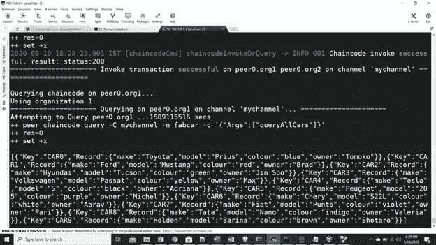

# 在 Hyperledger Fabric 版中部署多个组织，并通过 Cadvisor 监控容器

> 原文：<https://medium.com/coinmonks/deploying-multiple-organizations-in-hyperledger-fabric-version-2-0-d5ea3ed17399?source=collection_archive---------0----------------------->

到目前为止，我们已经看到了 **Hyperledger 架构**，我们将在后续的博客中深入研究。这篇博客帮助你开始使用**Hyperledger Fabric 2.0 版本以及通过 Google CAD visor**进行的容器监控，我还将讨论与 1.0 版本相比在流程方面的差异。我们开始吧！！

我参考了标准的 Hyperledger Fabric 文档，并遵循了相关的优化步骤。

执行这个的先决条件将是安装: **docker，curl，wget，npm，Go 和 Python** ，我会给你命令 **Ubuntu 系统安装先决条件。**

**安装 Docker 和 Docker-Compose 的命令**

~$ **sudo apt 更新**

~$ **sudo 安装 docker-compose**

**安装 curl、python 和 wget 的命令**

~$ **sudo 安装 curl python wget**

**安装 go 和 npm 的命令**

要安装 GO 语言:

~ $ wget[https://dl.google.com/go/go1.14.2.linux-amd64.tar.gz](https://dl.google.com/go/go1.14.2.linux-amd64.tar.gz)

**设置环境变量。主目录下的 bashrc 文件**

```
export GOPATH=$HOME/go
export PATH=$PATH:$GOPATH/bin
```


一个完成:你只需要源文件: **source。bashrc**

六美元。bashrc # # #进行必要的更改和编辑
$ source。bashrc


**通过以下命令安装 npm 和 nvm**

```
1)curl -sL https://deb.nodesource.com/setup_12.x | sudo -E bash -
2)sudo apt-get install nodejs
3)wget -qO- https://raw.githubusercontent.com/creationix/nvm/v0.35.2/install.sh | bash
4)npm install npm@5**.**6.0 **-**g
```

**安装 Hyperledger Fabric 版本 2.0**

我们将在 Hyperledger 中发布一个稳定的版本，包含(证书颁发机构)版本中提到的组件

curl-sSL[https://bit.ly/2ysbOFE](https://bit.ly/2ysbOFE)| bash-s—<fabric _ version><fabric-ca _ version><third party _ version>

```
curl **-**sSL https:**//**bit**.**ly**/**2ysbOFE **|** bash **-**s **--** 2.0**.**1 1.4**.**6 0.4**.**18 
```


Installing Hyperledger Fabric


Downloading the docker images

**下载结束后，您可以进行“docker ps”**


To see the containers running

[您可以导航到网络目录并创建网络](https://in.linkedin.com/in/anubhav-chaturvedi-a7465a72)


Once inside the test network directory

**通过以下方式关闭网络(如果正在运行):"。/network.sh down"**


**如果运行，您将看到所有对等体、订购者和节点都停止运行。**

与 Fabric 1.0 最新版本相比，他们只为证书生成和部署创建了一个文件，即“network.sh”，而不是之前版本中的多个文件，如“cryptogen 和 byfn”，从而降低了复杂性。

**再补一遍:“。/network.sh up"**


YAML files bringing up container


Containers and Network Coming up


docker ps results

**现在让我们创建一个通道并运行链码**

```
**./**network**.**sh createChannel -c mychannel
```


Mychannel deployed

**让我们运行 Fabcar 智能合约。/network.sh deployCC"**


Lets run the Fabcar Chain code


Chaincode deployed in Peers



Finally running the “QueryAllCars”

让**通过 **Goolgle 的容器监控工具** l **Cadvisor** 来监控**被部署的**节点** e。使用以下方式安装:

anubhav @ anubhav-VirtualBox:~/fabric-samples/test-network $ VERSION = v 0 . 35 . 0 #使用最新发布版本，可从

anubhav @ anubhav-VirtualBox:~/fabric-samples/test-network $ sudo docker run—volume =/:/rootfs:ro—volume =/var/run:/var/run:ro—volume =/sys:/sys:ro—volume =/var/lib/docker/:/var/lib/docker:ro—volume =/dev/disk/:/dev/disk:ro—publish = 8080:8080—detach = true—name = CAD visor gcr.io/google-containers/cadvisor:$VERSION


一段时间后，您会看到 Cadvisor 出现在端口 8080 (ss -tln)上


ss -tln port

您可以打开 **localhost:8080** ，查看所有列出的容器并监控其指标和使用情况:


在下一篇文章中，我们将看到如何增加网络流量并测试 **Hyperledger Fabric** 的限制，同时监控网络流量

对于任何进一步的疑问或任何与区块链或 Devops 相关的问题，您可以在 Linkedin 上给我发 DM。

[](https://in.linkedin.com/in/anubhav-chaturvedi-a7465a72) [## Anubhav Chaturvedi - Devops 项目导师- CodeAsylums | LinkedIn

### 作为区块链开发(Hyperledger)和 Devops 工程师等角色的独立承包商工作，包括…

in.linkedin.com](https://in.linkedin.com/in/anubhav-chaturvedi-a7465a72) 

> [直接在您的收件箱中获得最佳软件交易](https://coincodecap.com?utm_source=coinmonks)

[](https://coincodecap.com?utm_source=coinmonks)