# 使用 Tendermint 在 IBM Cloud 上部署利益相关区块链应用程序的证据

> 原文：<https://medium.com/coinmonks/deploying-proof-of-stake-blockchain-applications-on-ibm-cloud-using-tendermint-8544a0185d84?source=collection_archive---------0----------------------->


## 介绍

区块链是自互联网以来最伟大的技术创新之一。互联网让信息自由流动，而区块链让价值无摩擦流动。各个学科的公司现在都在将区块链用于现实世界的业务用例。应用密码学的研究数量是前所未有的。我们现在正在经历有史以来最大规模的公钥加密的民用部署，那就是比特币。

虽然区块链是一项非常有趣的技术，但它也处于萌芽状态。制作一个区块链应用程序的快速原型并在云上运行是一个挑战。Tendermint 允许您快速创建区块链应用，因为它处理底层区块链层，如网络和共识，并允许开发人员通过 ABCI(应用区块链接口)只关注应用层

在这篇博文中，我将向您展示如何使用 Tendermint、Lotionjs 和 Ionic 轻松创建一个区块链聊天应用程序并将其部署到云中。

## 什么是嫩薄荷？

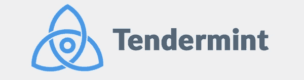

“Tendermint 是一种软件，可以在许多机器上安全、一致地复制应用程序。”

> 简单来说 [Tendermint](https://tendermint.com/) 是一个可以用来在任何分布式计算平台上实现拜占庭容错(BFT)的软件。从管理基础设施到设计分布式数据库，我们都可以使用 Tendermint。Tendermint 基于两个重要的技术组件。

**共识引擎:**也被称为 Tendermint 核心，它通过股权共识的证明，确保每笔交易都以相同的顺序记录在每台机器上。

**ABCI(应用区块链接口):**支持以任何编程语言处理交易。

> [直接在您的收件箱中获得最佳软件交易](https://coincodecap.com/?utm_source=coinmonks)

[](https://coincodecap.com/?utm_source=coinmonks)

## 嫩薄荷的特性

1.  **拜占庭容错:** Tendermint 可以容忍多达三分之一的机器任意出现故障。这包括明显的恶意行为。
2.  **状态机复制** : Tendermint 可以复制用任何编程语言编写的确定性状态机。
3.  **安全 P2P** : Gossip 协议和对等点发现通过 Tendermint 的认证加密系统得到保护。
4.  **快如闪电** : Tendermint 支持每秒数千笔交易，延迟 1000 毫秒。


## 什么是 Lotionjs

乳液是一种用 JavaScript 创建区块链应用的新方法，旨在让编写新区块链变得快速有趣。它构建在使用[](https://github.com/tendermint/abci)**协议的* [*嫩肉*](https://tendermint.com/) *之上。**

# *使用部署在 IBM Cloud 上的 2 个 Tendermint 验证器节点创建一个区块链聊天应用程序*

*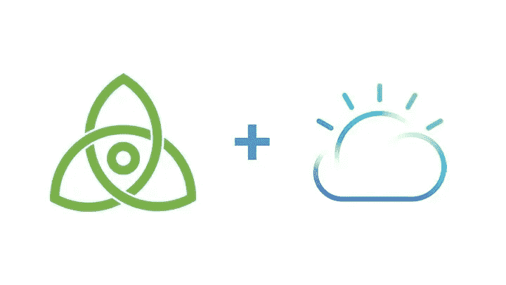*

## *先决条件*

1.  *免费注册 [IBM Cloud](http://ibm.biz/ioblockchain)*
2.  *安装 [Cloud Foundry CLI](https://docs.cloudfoundry.org/cf-cli/install-go-cli.html)*
3.  *安装 [IBM Cloud CLI](https://console.bluemix.net/docs/cli/reference/bluemix_cli/get_started.html)*
4.  *安装[码头工人](https://docs.docker.com/install/)*
5.  *安装 [Kubernetes](https://kubernetes.io/docs/tasks/tools/install-kubectl/)*
6.  *克隆回购*

```
*$ git clone [https://github.com/SaifRehman/tendermint-chat-app](https://github.com/SaifRehman/tendermint-chat-app)*
```

*7.⭐回购:)*

*8.创建源文件并用 2 个验证器填充它*

*   *导航至*创建基因文件*目录*

```
*$ cd creatingGenesisFile*
```

*   *安装依赖项*

```
*$ npm i*
```

*   *您将找到 genesis.json 目录，它看起来像下面这样，没有任何验证器*

*   *生成 2 个验证器*

```
*$ ./node_modules/lotion/bin/tendermint gen_validator > privkey0.json$ ./node_modules/lotion/bin/tendermint gen_validator > privkey1.json*
```

*How Private Key looks like*

*   *清理你的私人密钥:删除不必要的信息，如(*最后高度，最后回合，最后一步，最后签名*)*

*This is how your cleaned privkey0.json*

*This is how your cleaned privkey0.json*

*   ***注意:** **每次你都会得到不同的组合***
*   *用生成的以下密钥填充 genesis.json，只添加您的公钥，不添加私钥:)*

*This is how your genesis file will look like in the end with two validators*

> *酷现在我们知道如何设置我们的起源文件:)*

*10.在 IBM Cloud 上创建集群*

*   *转到您的 [IBM Cloud Dashboard](https://console.bluemix.net/dashboard/apps/) 并登录*
*   *转到 [IBM 容器服务](https://console.bluemix.net/containers-kubernetes/clusters)*

*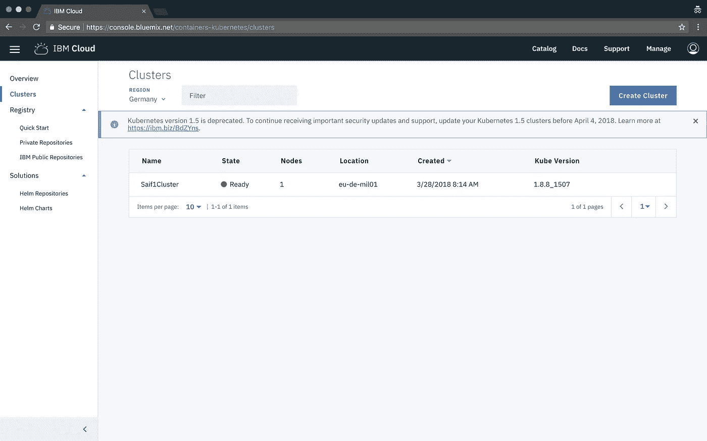*

*   *点击*创建集群**
*   *为您的集群命名并部署*
*   *等待集群准备就绪*
*   *准备就绪后，单击您的群集，然后单击工作节点以检查其公共 ip 并记下*

*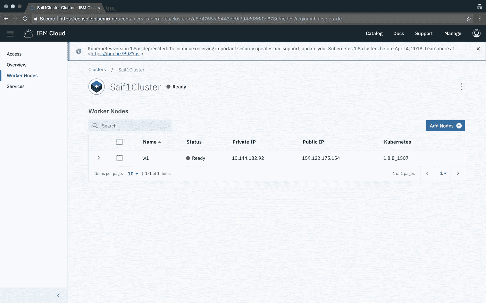*

*   *点击访问选项卡*
*   *现在，要访问 IBM Cloud 上托管的集群，请执行以下步骤*
*   *安装容器服务插件。*

```
*$ bx plugin install container-service -r Bluemix*
```

*   *登录您的 IBM Cloud 帐户。*

```
*$ bx login -a [https://api.eu-de.bluemix.net](https://api.eu-de.bluemix.net) <depends which region you deployed your cluster>
$ bx cs region-set eu-central <depends which region you deployed your cluster>*
```

*   *获取设置环境变量的命令并下载 Kubernetes 配置文件。*

```
*$ bx cs cluster-config nameOfYourCluster*
```

*   *设置 KUBECONFIG 环境变量。复制前面命令的输出，并将其粘贴到您的终端中。命令输出应该如下所示。*

```
*$ export KUBECONFIG=/Users/ibm/.bluemix/plugins/container-service/clusters/Saif1Cluster/kube-config-mil01-nameOfYourCluster.yml*
```

*   *通过列出您的工作节点，验证您是否可以连接到您的群集。*

```
*$ kubectl get nodes*
```

*11.建立验证者的 docker 形象 1*

*validator1*

*   *相应地更新 node0 对等 ip，您的对等 ip 将是另一个集群上的另一个对等 IP*
*   *导航到节点 1 目录*

```
*$ cd node1*
```

*   *建立你的码头工人形象*

*Dockerfile of node1 (validator1)*

```
*$ docker build -t node1 .*
```

*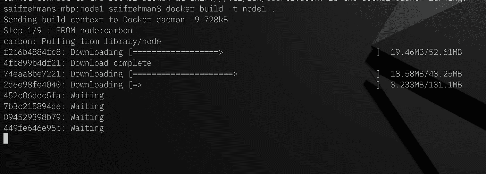*

*Image being built :)*

*   *转到您的 [IBM 云注册表](https://console.bluemix.net/containers-kubernetes/registry/private)*
*   *为您的第一个名称空间选择一个名称，并创建该名称空间。*

```
*$ bx cr namespace-add <my_namespace>*
```

*   *将您的本地 Docker 守护进程登录到 IBM Cloud Container 注册表中。*

```
*$ bx cr login*
```

*   *选择可以用来识别图像的存储库和标签。在快速入门的其余部分使用相同的存储库和标记。*

```
*$ docker tag node1 registry.<region-short-term>.bluemix.net/<my_namespace>/node1:latest*
```

*   *推送图像。*

```
*$ docker push registry.<region-short-term>.bluemix.net/<my_namespace>/node1:latest*
```

*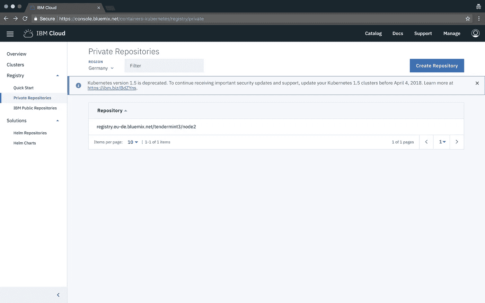*

*once you push you will have it uploaded in ibm’s private registry :)*

*   *验证您的图像是否在您的私有注册表中。*

```
*$ bx cr image-list*
```

*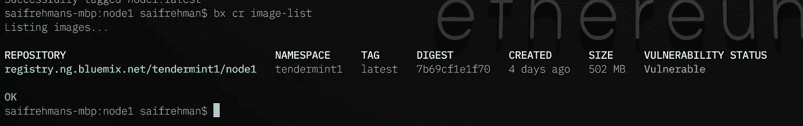*

*   *现在，一旦成功部署，就必须使用 kubernetes 部署到 IBM 容器，并使 tendermint 端口和 p2p 端口可以公开访问*
*   *根据您的私有注册中心设置创建 service-deployment.yml*

*Deployment file*

*   *创建和部署服务:)*

```
*$ kubectl create -f service-deployment.yml*
```

*   *删除所有部署*

```
*$ kubectl delete deployments --all*
```

*   *删除所有服务*

```
*$ kubectl delete services --all*
```

*   *对节点 2 执行相同的过程并进行部署*
*   *访问 pod 和日志*

```
*$ kubectl get pods
$ kubectl logs podname*
```

*   *如果两个验证器节点都成功部署，并且您记录了其中一个节点，您将看到块将开始提交，因为它们彼此同步*

*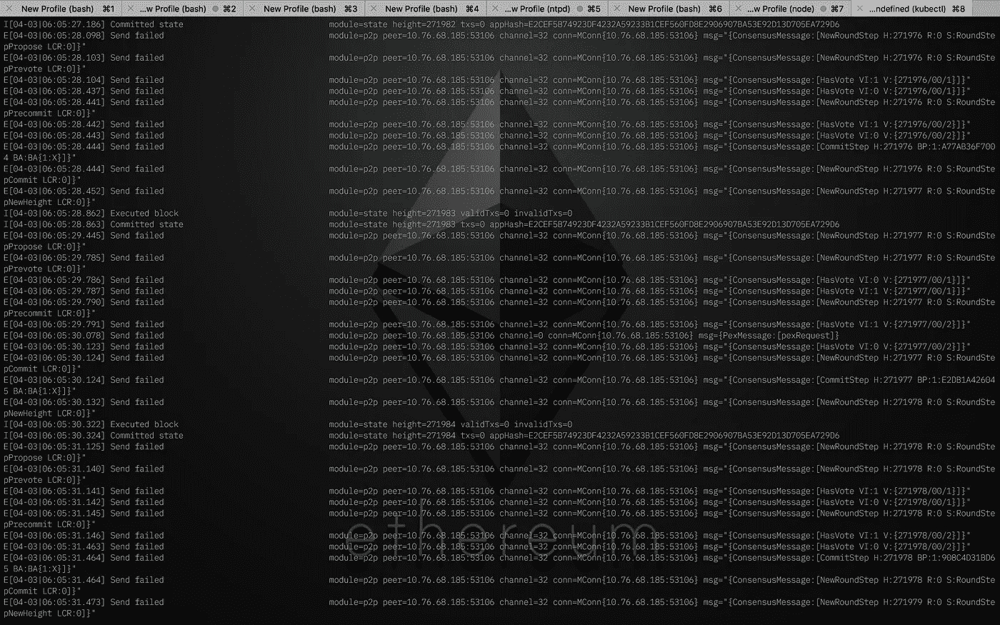*

*Means both validators are in synch :)*

*12.用 ionic 制作一个性感的用户界面，与这两个验证器交互并发送文本信息*

*   *安装离子*

```
*$ npm i -g ionic cordova*
```

*   *打开`manifest.yml`并从`cf/manifest.yml`中为应用程序命名*
*   *打开`frontend/src/pages/congif/config.ts`，给出你在 manifest.yml 中提到的应用名称*

*   *导航到`frontend`目录并构建应用程序*

```
*$ ionic cordova platform rm browser
$ ionic cordova platform add browser
$ ionic cordova build browser*
```

*   *导航到`cf`文件夹，并推送应用程序，这将有一个全功能的区块链，用 ionic 构建一个性感的前端💖*
*   *使用 cf cli 登录 IBM cloud*

*如果您使用**美国南部地区**:*

*使用这些命令:*

```
*$ cf api https://api.ng.bluemix.net
$ cf login -u bluemix_id* 
```

*如果您使用的是**英国地区**:*

*使用这些命令:*

```
*$ cf api https://api.eu-gb.bluemix.net
$ cf login -u bluemix_id* 
```

***针对悉尼地区***

```
*$ cf api https://api.au-syd.bluemix.net
$ cf login -u bluemix_id* 
```

***针对德国地区***

```
*$ cf api https://api.eu-de.bluemix.net
$ cf login -u bluemix_id* 
```

*登录后推送您的应用:)*

```
*$ cd cf
$ cf push*
```

*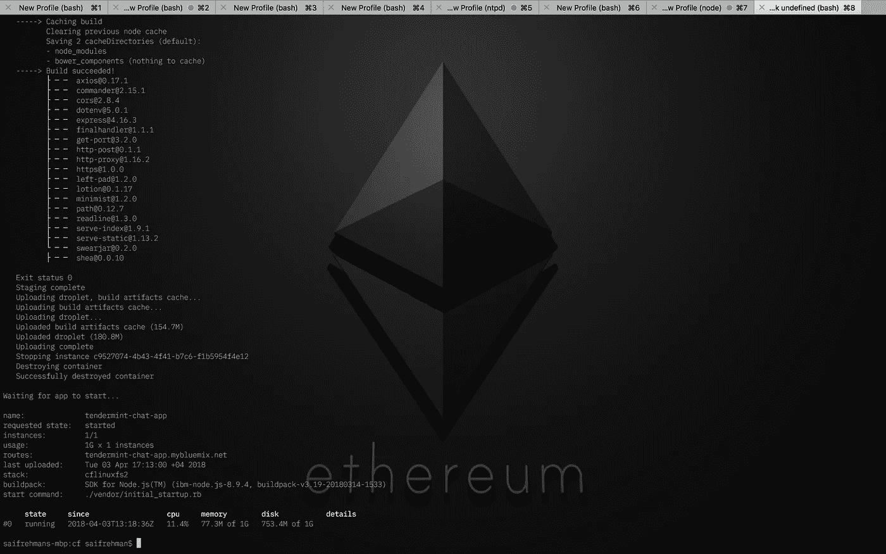*

*If all works well your frontend app will be up and running*

*请注意，您的前端应用程序不是一个验证器节点，它只是一个连接到云上的 2 个验证器节点的节点*

*You connect it with peer port, running on 30092 as mentioned :)*

*   *您可以从这里访问 tendermint rpc api*

```
*http://workernodeip:30090*
```

*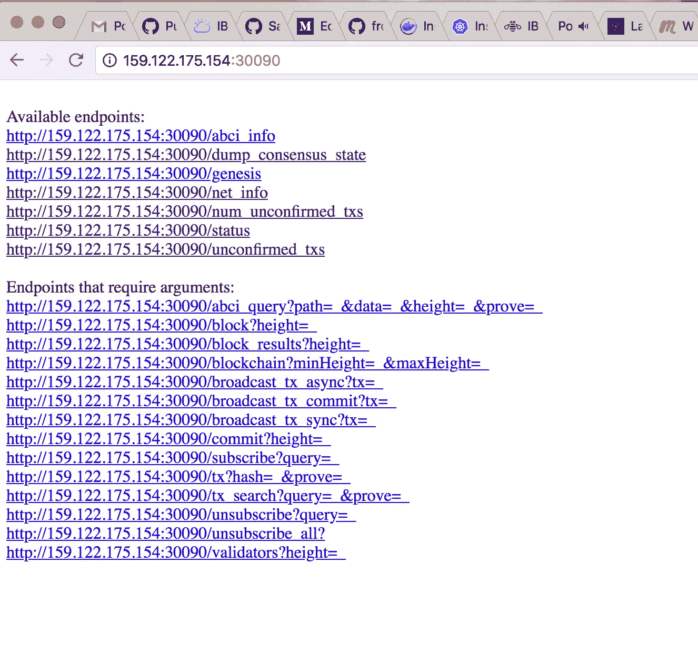**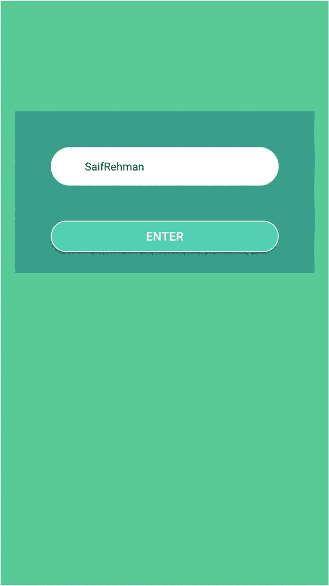**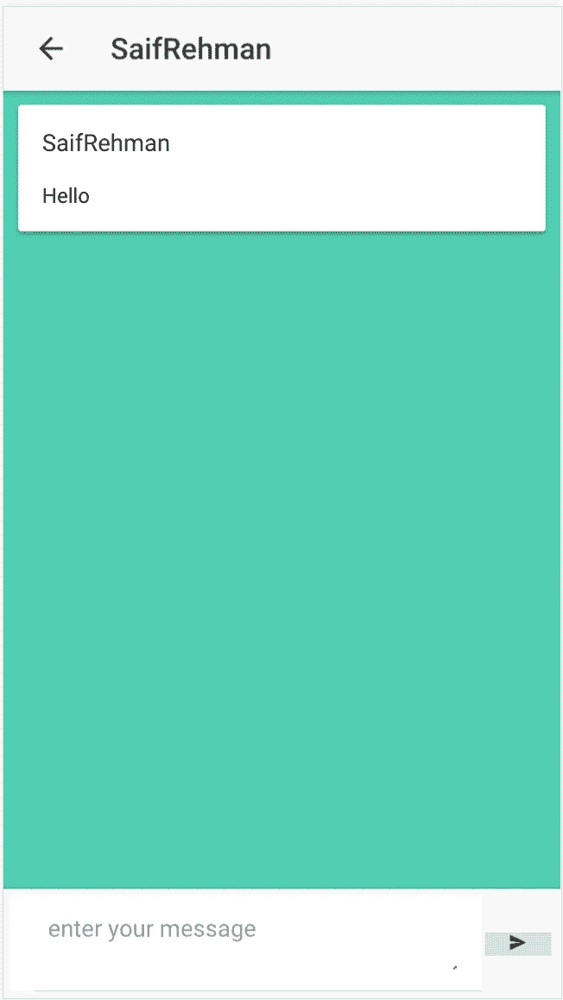**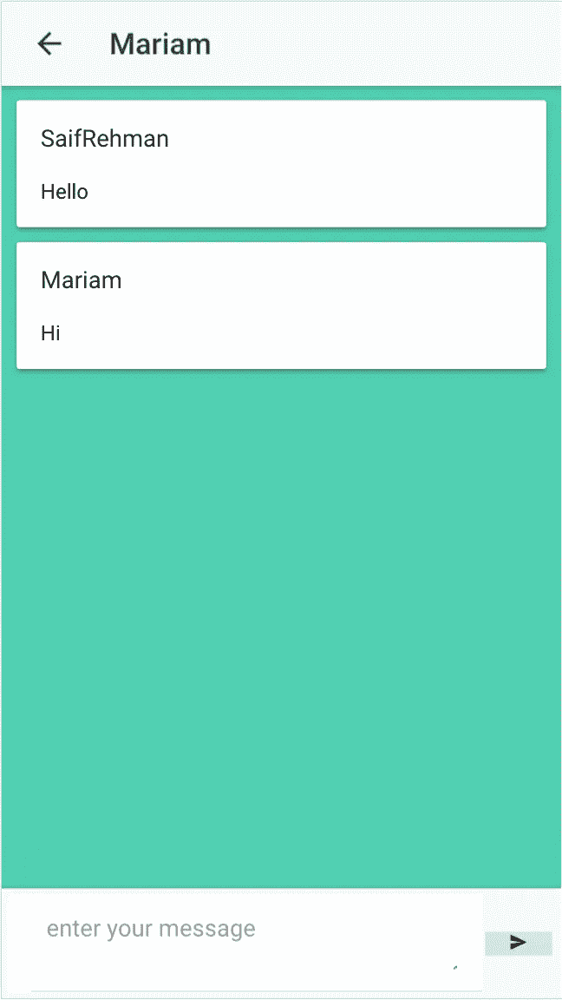**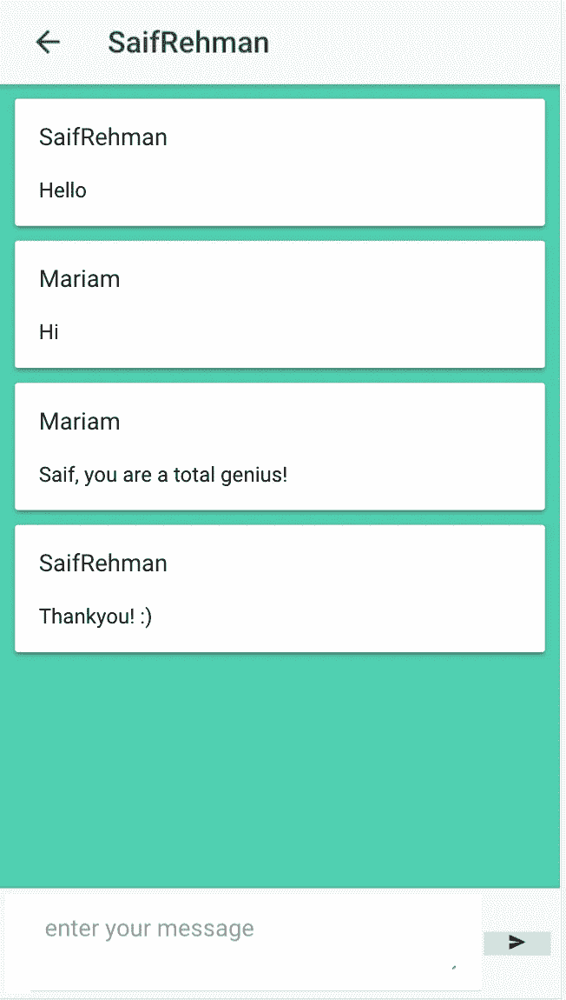*

*13.通过 Cloud Foundry Tendermint apis 与您的区块链交互的端点*

*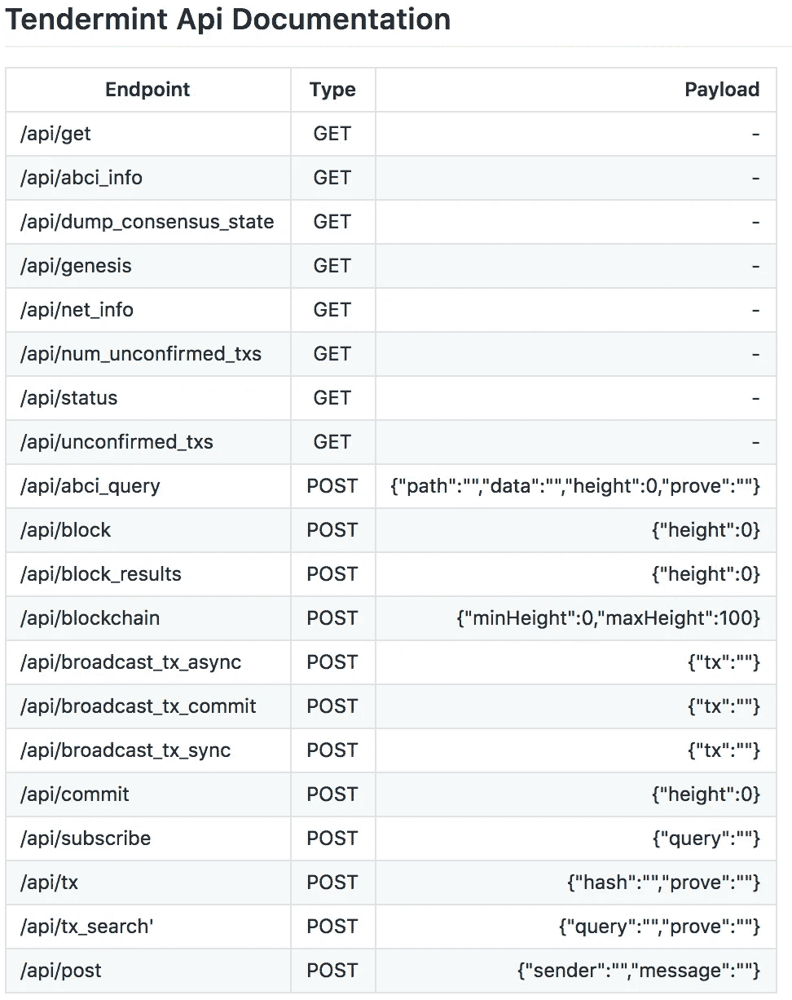*

*Endpoints :)*

*如果你喜欢，请开始回购:)*

# *资源*

## *Tendermint 聊天应用程序回购*

*[](https://github.com/SaifRehman/tendermint-chat-app) [## SaifRehman/tendermint-chat-app

### tendermint-chat-app -这是基于 tendermint 区块链使用 Lotionjs 的最小聊天应用

github.com](https://github.com/SaifRehman/tendermint-chat-app) 

## Lotionjs 回购

[](https://github.com/keppel/lotion) [## 吉宝露/乳液

### 乳液- ✨顺利，容易✨区块链应用程序

github.com](https://github.com/keppel/lotion) 

## 招标回购

[](https://github.com/tendermint/tendermint/) [## 嫩薄荷/嫩薄荷

### tender mint-go 中的⟁ Tendermint 核心(BFT 共识)

github.com](https://github.com/tendermint/tendermint/) 

## 招标文件

> [https://tendermint.com/docs](https://tendermint.com/docs)

# 阅读更多信息:

1.  关注我更多:[https://www.engineerability.com](https://www.engineerability.com)

# 结论

Tendermint 使业务开发人员编写区块链应用程序变得容易，IBM Cloud 使部署和操作这样的应用程序变得容易。我期待看到你的区块链申请！

[](http://bit.ly/2G71Sp7)*